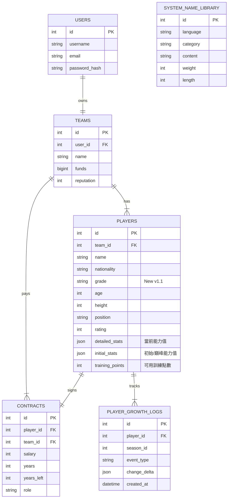

# ASBL 資料庫架構規格書 (Database Schema Specification)

**版本**: 1.3
**最後更新**: 2026-02-16
**說明**: 本文件定義 ASBL 籃球經理遊戲的核心資料庫結構，對應 SQLAlchemy Models 與實際 DDL。
**變更記錄**:
*   v1.1: 初始版本。
*   v1.2: 新增 `TeamTactics` 表，用於儲存球隊的戰術配置與登錄名單，實現資料解耦。
*   v1.3: 新增 `TeamTactics` 表，用於儲存球隊的戰術配置與登錄名單，實現資料解耦。

---

## 1. 實體關聯圖 (ER Diagram)

---

## 2. 資料表詳情 (Table Details)

### 2.1 Users (使用者)
| 欄位名稱 | 類型 | 屬性 | 說明 |
| :--- | :--- | :--- | :--- |
| `id` | Integer | PK, Auto Inc | 使用者 ID |
| `username` | String(64) | Unique, Not Null | 帳號名稱 |
| `email` | String(120) | Unique, Not Null | 電子信箱 |
| `password_hash` | String(256) | Nullable | 加密密碼 (DDL 允許為空，邏輯上應必填) |
| `created_at` | DateTime | Nullable | 註冊時間 (由 App 寫入) |
| `last_login` | DateTime | Nullable | 最後登入時間 (由 App 寫入) |

### 2.2 Teams (球隊)
| 欄位名稱 | 類型 | 屬性 | 說明 |
| :--- | :--- | :--- | :--- |
| `id` | Integer | PK, Auto Inc | 球隊 ID |
| `user_id` | Integer | FK(users.id), Unique | 擁有者 ID |
| `name` | String(64) | Not Null | 球隊名稱 |
| `arena_name` | String(64) | Not Null | 場館名稱 |
| `fanpage_name` | String(64) | Not Null | 粉絲團名稱 |
| `funds` | BigInteger | Nullable | 球隊資金 (App 預設 300000) |
| `reputation` | Integer | Nullable | 球隊聲望 (App 預設 0) |
| `scout_chances` | Integer | Nullable | 剩餘球探次數 (App 預設 100) |
| `season_wins` | Integer | Nullable | 球隊勝場 (由 App 寫入) |
| `season_losses` | Integer | Nullable | 球隊敗場 (由 App 寫入) |
| `daily_scout_level` | Integer | Nullable | 每日球探投入等級(0-10) (App 預設 0) |

### 2.3 Players (球員)
*設計重點：針對老化機制，保留 `initial_stats` 作為對照組。*

| 欄位名稱 | 類型 | 屬性 | 說明 |
| :--- | :--- | :--- | :--- |
| `id` | Integer | PK, Auto Inc | 球員 ID |
| `team_id` | Integer | FK(teams.id), Nullable | 所屬球隊 (自由球員為 Null) |
| `name` | String(64) | Not Null | 姓名 |
| `nationality` | String(16) | Not Null | 國籍/語系 (App 預設 'zh') |
| `age` | Integer | Nullable | 年齡 (App 預設 18) |
| `height` | Integer | Not Null | 身高 (cm) |
| `position` | String(10) | Not Null | 註冊位置 (C, PF, SF, SG, PG) |
| `training_points`| Integer | Not Null | **訓練點數** (用於升級或維持能力) |
| `grade` | String(5) | Not Null | **[v1.1 新增]** 球員等級 (SSR, SS, S...) |
| `rating` | Integer | Nullable | 綜合評價分數 |
| `detailed_stats` | **JSON** | Not Null | **當前能力值** (比賽引擎讀取此欄位) |
| `initial_stats` | **JSON** | Nullable | **初始/巔峰能力值** (用於計算老化衰退幅度) |
| `created_at` | DateTime | Default Now | 生成時間 |
| `updated_at` | DateTime | Default Now | 更新時間 |

> **老化機制設計說明**:
> 當球員進入老化期，系統會比較 `detailed_stats` 與 `initial_stats`。
> 若 `detailed_stats` 中的運動能力下降，玩家可消耗 `training_points` 將其補回，上限不超過 `initial_stats` (除非是技術成長)。

### 2.4 Contracts (合約)
| 欄位名稱 | 類型 | 屬性 | 說明 |
| :--- | :--- | :--- | :--- |
| `id` | Integer | PK, Auto Inc | 合約 ID |
| `player_id` | Integer | FK(players.id), Unique | 球員 ID |
| `team_id` | Integer | FK(teams.id) | 球隊 ID (冗餘儲存以利查詢) |
| `salary` | Integer | Not Null | 賽季薪資 |
| `years` | Integer | Nullable | 總合約年限 (App 預設 1) |
| `years_left` | Integer | Nullable | 剩餘年限 (App 預設 1) |
| `role` | String(20) | Not Null | 角色定位 (Star, Starter...) |
| `option_type` | String(10)| Nullable | 球員/球隊選項 (PO/TO) |
| `created_at` | DateTime | Default Now | 生成時間 |
| `updated_at` | DateTime | Default Now | 更新時間 |

### 2.5 Player Growth Logs (球員成長/老化紀錄)
*用途：記錄球員每一季或每次訓練的數值變動，方便追溯歷史。*

| 欄位名稱 | 類型 | 屬性 | 說明 |
| :--- | :--- | :--- | :--- |
| `id` | Integer | PK, Auto Inc | 紀錄 ID |
| `player_id` | Integer | FK(players.id) | 球員 ID |
| `season_id` | Integer | Not Null | 發生賽季 |
| `event_type` | String(20) | Not Null | 類型: 'AGE_DECLINE'(老化), 'TRAINING'(訓練) |
| `change_delta` | JSON | Not Null | 變動數值 (例如: `{"speed": -2, "strength": -1}`) |
| `created_at` | DateTime | Default Now | 紀錄時間 |

### 2.6 System Name Library (系統姓名庫)
*對應資料表: `system_name_library`*

| 欄位名稱 | 類型 | 屬性 | 說明 |
| :--- | :--- | :--- | :--- |
| `id` | Integer | PK, Auto Inc, Unsigned | 唯一識別碼 |
| `language` | String(16) | Not Null | 語系代碼 (en, zh, jp...) |
| `category` | String(16) | Not Null | 類別 (surname, given_name) |
| `content` | String(64) | Not Null | 名字內容 |
| `length` | Integer | Nullable | **[v1.1 修正]** 內容字數 (由 App 計算寫入) |
| `weight` | Integer | Default 10, Unsigned | 出現權重 |

## 2.7 Team Tactics (球隊戰術配置)
*用途：儲存球隊的戰術設定，包含 15 人登錄名單。*

| 欄位名稱 | 類型 | 屬性 | 說明 |
| :--- | :--- | :--- | :--- |
| `id` | Integer | PK, Auto Inc | 戰術配置 ID |
| `team_id` | Integer | FK(teams.id), Unique | 所屬球隊 (一對一) |
| `roster_list` | **JSON** | Not Null | **登錄名單 ID 列表** (例如: `[101, 102, 105...]`) |
| `strategy_settings` | JSON | Nullable | (預留) 未來可儲存進攻/防守戰術參數 |
| `created_at` | DateTime | Default Now | 建立時間 |
| `updated_at` | DateTime | Default Now | 更新時間 |

## 2.8 Scouting Records (球探待簽名單紀錄)
*用途：儲存球隊的球探待簽名單紀錄。*

| 欄位名稱 | 類型 | 屬性 | 說明 |
| :--- | :--- | :--- | :--- |
| `id` | Integer | PK, Auto Inc | 戰術配置 ID |
| `team_id` | Integer | FK(teams.id), Unique | 所屬球隊 (一對一) |
| `player_id` | Integer | FK(players.id) | 球員 ID |
| `created_at` | DateTime | Default Now | 建立時間 |
| `expire_at` | DateTime | NOT NULL | 過期時間 |