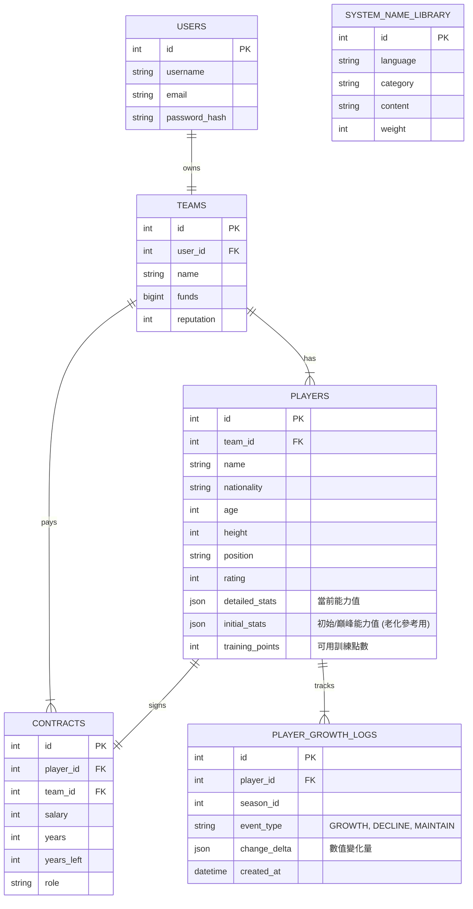

# ASBL 資料庫架構規格書 (Database Schema Specification)

**版本**: 1.0
**最後更新**: 2026-02-06
**說明**: 本文件定義 ASBL 籃球經理遊戲的核心資料庫結構，對應 SQLAlchemy Models。

---

## 1. 實體關聯圖 (ER Diagram)

---

## 2. 資料表詳情 (Table Details)

### 2.1 Users (使用者)
| 欄位名稱 | 類型 | 屬性 | 說明 |
| :--- | :--- | :--- | :--- |
| `id` | Integer | PK, Auto Inc | 使用者 ID |
| `username` | String(64) | Unique, Not Null | 帳號名稱 |
| `email` | String(120) | Unique, Not Null | 電子信箱 |
| `password_hash` | String(256) | Not Null | 加密密碼 |
| `created_at` | DateTime | Default Now | 註冊時間 |

### 2.2 Teams (球隊)
| 欄位名稱 | 類型 | 屬性 | 說明 |
| :--- | :--- | :--- | :--- |
| `id` | Integer | PK, Auto Inc | 球隊 ID |
| `user_id` | Integer | FK(users.id), Unique | 擁有者 ID |
| `name` | String(64) | Not Null | 球隊名稱 |
| `funds` | BigInteger | Default 10000000 | 球隊資金 |
| `reputation` | Integer | Default 100 | 球隊聲望 |

### 2.3 Players (球員)
*設計重點：針對老化機制，保留 `initial_stats` 作為對照組。*

| 欄位名稱 | 類型 | 屬性 | 說明 |
| :--- | :--- | :--- | :--- |
| `id` | Integer | PK, Auto Inc | 球員 ID |
| `team_id` | Integer | FK(teams.id), Nullable | 所屬球隊 (自由球員為 Null) |
| `name` | String(64) | Not Null | 姓名 |
| `nationality` | String(16) | Default 'zh' | 國籍/語系 |
| `age` | Integer | Default 18 | 年齡 |
| `height` | Integer | Not Null | 身高 (cm) |
| `position` | String(10) | Not Null | 註冊位置 (C, PF, SF, SG, PG) |
| `rating` | Integer | Nullable | 綜合評價分數 |
| `detailed_stats` | **JSON** | Not Null | **當前能力值** (比賽引擎讀取此欄位) |
| `initial_stats` | **JSON** | Nullable | **初始/巔峰能力值** (用於計算老化衰退幅度) |
| `training_points`| Integer | Default 0 | **訓練點數** (用於升級或維持能力) |
| `created_at` | DateTime | Default Now | 生成時間 |

> **老化機制設計說明**:
> 當球員進入老化期，系統會比較 `detailed_stats` 與 `initial_stats`。
> 若 `detailed_stats` 中的運動能力下降，玩家可消耗 `training_points` 將其補回，上限不超過 `initial_stats` (除非是技術成長)。

### 2.4 Contracts (合約)
| 欄位名稱 | 類型 | 屬性 | 說明 |
| :--- | :--- | :--- | :--- |
| `id` | Integer | PK, Auto Inc | 合約 ID |
| `player_id` | Integer | FK(players.id), Unique | 球員 ID |
| `team_id` | Integer | FK(teams.id) | 球隊 ID (冗餘儲存以利查詢) |
| `salary` | Integer | Not Null | 賽季薪資 |
| `years` | Integer | Default 1 | 總合約年限 |
| `years_left` | Integer | Default 1 | 剩餘年限 |
| `role` | String(20) | Default 'Bench' | 角色定位 (Star, Starter...) |
| `option_type` | String(10)| Nullable | 球員/球隊選項 (PO/TO) |

### 2.5 Player Growth Logs (球員成長/老化紀錄) [新增建議]
*用途：記錄球員每一季或每次訓練的數值變動，方便追溯歷史。*

| 欄位名稱 | 類型 | 屬性 | 說明 |
| :--- | :--- | :--- | :--- |
| `id` | Integer | PK, Auto Inc | 紀錄 ID |
| `player_id` | Integer | FK(players.id) | 球員 ID |
| `season_id` | Integer | Not Null | 發生賽季 |
| `event_type` | String(20) | Not Null | 類型: 'AGE_DECLINE'(老化), 'TRAINING'(訓練) |
| `change_delta` | JSON | Not Null | 變動數值 (例如: `{"speed": -2, "strength": -1}`) |
| `created_at` | DateTime | Default Now | 紀錄時間 |

### 2.6 System Name Library (系統姓名庫) [既有保留]
*對應資料表: `system_name_library`*

| 欄位名稱 | 類型 | 屬性 | 說明 |
| :--- | :--- | :--- | :--- |
| `id` | Integer | PK, Auto Inc, Unsigned | 唯一識別碼 |
| `language` | String(16) | Not Null | 語系代碼 (en, zh, jp...) |
| `category` | String(16) | Not Null | 類別 (surname, given_name) |
| `content` | String(64) | Not Null | 名字內容 |
| `length` | Integer | **Generated (Stored)** | **內容字數 (由資料庫自動計算)** |
| `weight` | Integer | Default 10, Unsigned | 出現權重 |

> **備註**: `length` 欄位為虛擬生成欄位 (`GENERATED ALWAYS AS char_length(content)`), 程式碼中需使用 `Computed` 或標記為 `server_default` 以避免寫入錯誤。
