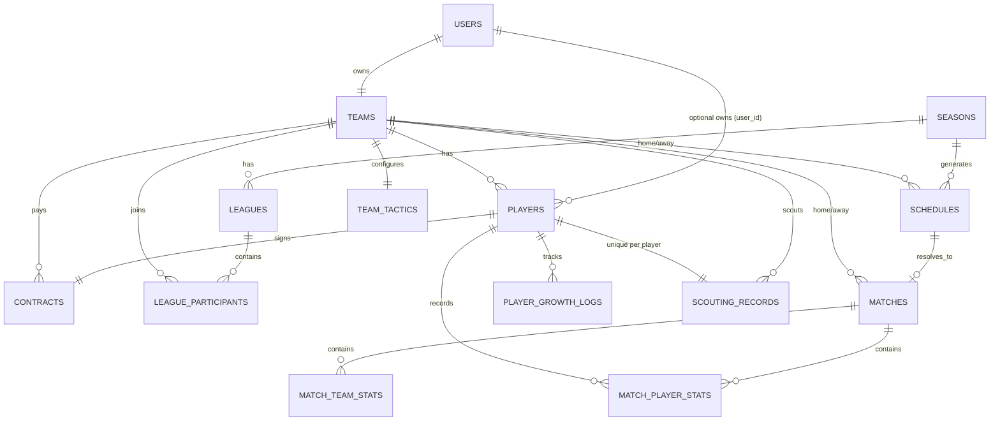

# ASBL 資料庫架構規格書 (Database Schema Specification)

**版本**: 1.6  
**最後更新**: 2026-02-21  
**說明**: 本文件定義 ASBL 籃球經理遊戲的核心資料庫結構，對應「實際 MySQL DDL」為準（含欄位型別、NULL/NOT NULL、預設值、索引與外鍵約束）。

## 變更記錄
- v1.1: 初始版本。
- v1.2: 新增 `team_tactics` 表，用於儲存球隊的戰術配置與登錄名單。
- v1.3: 新增 `scouting_records` 表，用於球探系統。
- v1.4: 新增 `matches`, `match_team_stats`, `match_player_stats` 表；新增 `users.is_bot` 欄位。
- v1.5: `teams` 表完善狀態欄位與主客場次數統計 (`home_games_played`, `away_games_played`)。
- **v1.6**: 依現行 DDL 同步與補齊 **聯賽/賽季/賽程** 結構：新增/補充 `seasons`, `leagues`, `league_participants`, `schedules`；同步各表預設值、NULL 設計、ON DELETE 行為與索引。

---

## 1. 實體關聯圖 (ER Diagram)

---

## 2. 資料表詳情 (Table Details)

> 欄位屬性說明：
> - **PK**: Primary Key；**FK**: Foreign Key；**NN**: NOT NULL；**NULL**: 可為 NULL；**UQ**: UNIQUE；**IDX**: Index  
> - 預設值以 DDL 為準（例如 `DEFAULT CURRENT_TIMESTAMP`、`DEFAULT (now())`、數字/字串預設）。

---

# 2.1 `users` (使用者帳號資料表)
**表註解**: 使用者帳號資料表  
**引擎/字元集**: InnoDB / utf8mb4 (utf8mb4_unicode_ci)

| 欄位名稱 | 型別 | 屬性 | 預設值 | 說明 |
|---|---|---|---|---|
| id | int | PK, Auto Inc, NN |  | 使用者 ID |
| username | varchar(64) | NN, UQ |  | 使用者名稱 |
| email | varchar(120) | NN, UQ |  | 電子信箱 |
| password_hash | varchar(256) | NULL | NULL | 密碼雜湊值 |
| created_at | datetime | NULL | NULL | 帳號建立時間 |
| last_login | datetime | NULL | NULL | 最後登入時間 |
| is_bot | tinyint(1) | NN | 0 | 是否為電腦 (0:否, 1:是) |

**索引**
- UQ: `ix_users_email (email)`
- UQ: `ix_users_username (username)`
- IDX: `idx_users_is_bot (is_bot)`

---

# 2.2 `teams` (球隊資料表)
**表註解**: 球隊資料表  
**引擎/字元集**: InnoDB / utf8mb4 (utf8mb4_unicode_ci)

| 欄位名稱 | 型別 | 屬性 | 預設值 | 說明 |
|---|---|---|---|---|
| id | int | PK, Auto Inc, NN |  | 球隊 ID (主鍵) |
| user_id | int | NN, FK(users.id), UQ |  | 所屬使用者 ID（每個 user 對應一隊） |
| name | varchar(64) | NN |  | 球隊名稱 |
| arena_name | varchar(64) | NULL | NULL | 場館名稱 |
| fanpage_name | varchar(64) | NULL | NULL | 粉絲團名稱 |
| funds | bigint | NULL | NULL | 球隊資金 |
| reputation | int | NULL | NULL | 球隊聲望 |
| scout_chances | int | NN | 100 | 剩餘球探次數 |
| season_wins | int | NULL | 0 | 本季勝場 |
| season_losses | int | NULL | 0 | 本季敗場 |
| daily_scout_level | int | NN | 0 | 每日球探投入等級(0-10) |
| status | varchar(20) | NULL | 'BOT' | BOT, PLAYER, PROVISIONAL |
| is_official | tinyint(1) | NULL | 1 | 1: 正式聯賽, 0: 擴充聯賽 |
| home_games_played | int | NULL | 0 | 已進行主場數 |
| away_games_played | int | NULL | 0 | 已進行客場數 |

**索引 / 約束**
- UQ: `user_id (user_id)`
- IDX: `idx_teams_status_official (status, is_official)`
- IDX: `idx_teams_reputation (reputation)`
- FK: `teams_ibfk_1 user_id -> users.id`

---

# 2.3 `players` (球員核心資料表)
**表註解**: 球員核心資料表  
**引擎/字元集**: InnoDB / utf8mb4 (utf8mb4_unicode_ci)

| 欄位名稱 | 型別 | 屬性 | 預設值 | 說明 |
|---|---|---|---|---|
| id | int | PK, Auto Inc, NN |  | 球員 ID |
| name | varchar(64) | NN |  | 姓名 |
| nationality | varchar(16) | NN |  | 球員國籍/語系 |
| age | int | NULL | NULL | 年齡 |
| height | int | NN |  | 身高(cm) |
| position | varchar(10) | NN |  | 註冊位置 |
| training_points | int | NN |  | 可用訓練點數 |
| grade | varchar(5) | NN |  | 球員等級 (SSR/SS/S...) |
| rating | int | NULL | NULL | 綜合評價分數 |
| detailed_stats | json | NN |  | 當前能力值 |
| initial_stats | json | NULL | NULL | 初始/巔峰能力值(老化參考) |
| user_id | int | NULL, FK(users.id) | NULL | 所屬使用者（可為空） |
| team_id | int | NULL, FK(teams.id) | NULL | 所屬球隊（自由球員為 NULL） |
| created_at | datetime | NULL | (now()) | 建立時間 |
| updated_at | datetime | NULL | (now()) | 更新時間 |

**索引 / 約束**
- IDX: `user_id (user_id)`
- IDX: `team_id (team_id)`
- FK: `players_ibfk_1 user_id -> users.id`
- FK: `players_ibfk_2 team_id -> teams.id`

---

# 2.4 `contracts` (球員合約資料表)
**表註解**: 球員合約資料表  
**引擎/字元集**: InnoDB / utf8mb4 (utf8mb4_unicode_ci)

| 欄位名稱 | 型別 | 屬性 | 預設值 | 說明 |
|---|---|---|---|---|
| id | int | PK, Auto Inc, NN |  | 合約 ID |
| player_id | int | NN, FK(players.id), UQ |  | 球員ID |
| team_id | int | NN, FK(teams.id) |  | 球隊ID(冗餘) |
| salary | int | NN |  | 賽季薪資 |
| years | int | NULL | NULL | 總合約年限 |
| years_left | int | NULL | NULL | 剩餘年限 |
| role | varchar(20) | NN |  | 角色定位 |
| option_type | varchar(10) | NULL | NULL | 選項類型(PO/TO) |
| created_at | datetime | NULL | (now()) | 建立時間 |
| updated_at | datetime | NULL | (now()) | 更新時間 |

**索引 / 約束**
- UQ: `player_id (player_id)`
- IDX: `team_id (team_id)`
- FK: `contracts_ibfk_1 player_id -> players.id`
- FK: `contracts_ibfk_2 team_id -> teams.id`

---

# 2.5 `player_growth_logs` (球員成長與老化歷程)
**表註解**: 球員成長與老化歷程  
**引擎/字元集**: InnoDB / utf8mb4 (utf8mb4_unicode_ci)

| 欄位名稱 | 型別 | 屬性 | 預設值 | 說明 |
|---|---|---|---|---|
| id | int | PK, Auto Inc, NN |  | 紀錄 ID |
| player_id | int | NN, FK(players.id) |  | 球員 ID |
| season_id | int | NN |  | 發生賽季 |
| event_type | varchar(20) | NN |  | 類型: AGE_DECLINE, TRAINING |
| change_delta | json | NN |  | 數值變化量 |
| created_at | datetime | NULL | (now()) | 建立時間 |

**索引 / 約束**
- IDX: `player_id (player_id)`
- FK: `player_growth_logs_ibfk_1 player_id -> players.id`

---

# 2.6 `system_name_library` ([系統] 多國語系姓名詞庫)
**表註解**: [系統] 多國語系姓名詞庫  
**引擎/字元集**: InnoDB / utf8mb4 (utf8mb4_0900_as_cs)

| 欄位名稱 | 型別 | 屬性 | 預設值 | 說明 |
|---|---|---|---|---|
| id | int unsigned | PK, Auto Inc, NN |  | 唯一識別碼 |
| language | varchar(16) | NN |  | 語系代碼 |
| category | varchar(16) | NN |  | 類別 |
| content | varchar(64) | NN |  | 內容 |
| length | int unsigned | NULL | NULL | 內容字數 |
| weight | int unsigned | NN | 10 | 出現權重 |

**索引 / 約束**
- UQ: `uq_lang_content (language, content)`
- IDX: `idx_lang_cat_weight (language, category, weight)`

---

# 2.7 `team_tactics` (球隊戰術與登錄名單配置表)
**表註解**: 球隊戰術與登錄名單配置表  
**引擎/字元集**: InnoDB / utf8mb4 (utf8mb4_0900_ai_ci)

| 欄位名稱 | 型別 | 屬性 | 預設值 | 說明 |
|---|---|---|---|---|
| id | int | PK, Auto Inc, NN |  | 戰術配置ID (主鍵) |
| team_id | int | NN, FK(teams.id), UQ |  | 所屬球隊ID (一對一關聯) |
| roster_list | json | NN |  | 登錄名單ID列表 (JSON Array) |
| strategy_settings | json | NULL | NULL | 戰術參數設定 (預留欄位) |
| created_at | timestamp | NULL | CURRENT_TIMESTAMP | 建立時間 |
| updated_at | timestamp | NULL | CURRENT_TIMESTAMP (ON UPDATE) | 最後更新時間 |

**索引 / 約束**
- UQ: `uk_team_tactics_team_id (team_id)`
- FK: `fk_team_tactics_team_id team_id -> teams.id (ON DELETE CASCADE)`

---

# 2.8 `scouting_records` (球探待簽名單紀錄)
**表註解**: 球探待簽名單紀錄  
**引擎/字元集**: InnoDB / utf8mb4 (utf8mb4_unicode_ci)

| 欄位名稱 | 型別 | 屬性 | 預設值 | 說明 |
|---|---|---|---|---|
| id | int | PK, Auto Inc, NN |  | 紀錄 ID |
| team_id | int | NN, FK(teams.id) |  | 球隊ID |
| player_id | int | NN, FK(players.id), UQ |  | 球員ID（同一球員僅能存在一筆待簽紀錄） |
| created_at | datetime | NULL | NULL | 發現時間 |
| expire_at | datetime | NN |  | 過期時間 |

**索引 / 約束**
- UQ: `player_id (player_id)`
- IDX: `team_id (team_id)`
- FK: `scouting_records_ibfk_1 team_id -> teams.id`
- FK: `scouting_records_ibfk_2 player_id -> players.id`

---

# 2.9 `seasons` (賽季狀態表)
**表註解**: 賽季狀態表  
**引擎/字元集**: InnoDB / utf8mb4 (utf8mb4_0900_ai_ci)

| 欄位名稱 | 型別 | 屬性 | 預設值 | 說明 |
|---|---|---|---|---|
| id | int | PK, Auto Inc, NN |  | 賽季 ID |
| season_number | int | NULL | 1 | 第幾賽季 |
| current_day | int | NULL | 0 | 當前賽季天數 (0-91) |
| phase | varchar(20) | NULL | 'PRE_SEASON' | PRE_SEASON, REGULAR, PLAYOFFS, OFF_SEASON |
| is_active | tinyint(1) | NULL | 1 | 是否為當前活躍賽季 |
| created_at | datetime | NULL | CURRENT_TIMESTAMP | 建立時間 |

---

# 2.10 `leagues` (賽季聯賽分組)
**表註解**: 賽季聯賽分組  
**引擎/字元集**: InnoDB / utf8mb4 (utf8mb4_unicode_ci)

| 欄位名稱 | 型別 | 屬性 | 預設值 | 說明 |
|---|---|---|---|---|
| id | int | PK, Auto Inc, NN |  | 聯賽 ID |
| season_id | int | NN, FK(seasons.id) |  | 關聯賽季ID |
| tier | int | NN |  | 聯賽層級 (0: T0, 1: T1, 2: T2...) |
| name | varchar(64) | NULL | NULL | 聯賽名稱 |
| created_at | datetime | NULL | CURRENT_TIMESTAMP | 建立時間 |

**索引 / 約束**
- IDX: `fk_leagues_season (season_id)`
- FK: `fk_leagues_season season_id -> seasons.id (ON DELETE CASCADE)`

---

# 2.11 `league_participants` (聯賽參賽名單)
**表註解**: 聯賽參賽名單  
**引擎/字元集**: InnoDB / utf8mb4 (utf8mb4_unicode_ci)

| 欄位名稱 | 型別 | 屬性 | 預設值 | 說明 |
|---|---|---|---|---|
| id | int | PK, Auto Inc, NN |  | 參賽紀錄 ID |
| league_id | int | NN, FK(leagues.id) |  | 關聯聯賽ID |
| team_id | int | NN, FK(teams.id) |  | 參賽球隊ID |
| start_reputation | int | NULL | NULL | 季初分組時的聲望快照 |
| final_rank | int | NULL | NULL | 季末結算排名 |

**索引 / 約束**
- IDX: `fk_participants_league (league_id)`
- IDX: `fk_participants_team (team_id)`
- FK: `fk_participants_league league_id -> leagues.id (ON DELETE CASCADE)`
- FK: `fk_participants_team team_id -> teams.id (ON DELETE CASCADE)`

---

# 2.12 `schedules` (賽程表)
**表註解**: 賽程表  
**引擎/字元集**: InnoDB / utf8mb4 (utf8mb4_0900_ai_ci)

| 欄位名稱 | 型別 | 屬性 | 預設值 | 說明 |
|---|---|---|---|---|
| id | int | PK, Auto Inc, NN |  | 賽程 ID |
| season_id | int | NN, FK(seasons.id) |  | 關聯賽季ID |
| day | int | NN |  | 賽季第幾天 |
| game_type | int | NULL | 1 | 1: 正式聯賽, 2: 擴充聯賽, 3: 季後賽 |
| home_team_id | int | NN, FK(teams.id) |  | 主隊ID |
| away_team_id | int | NN, FK(teams.id) |  | 客隊ID |
| status | varchar(20) | NULL | 'PENDING' | PENDING, PUBLISHED, FINISHED |
| match_id | int | NULL, FK(matches.id) | NULL | 完賽後填入 matches 表的 ID |
| created_at | datetime | NULL | CURRENT_TIMESTAMP | 建立時間 |
| series_id | varchar(32) | NULL | NULL | 系列賽代碼 (e.g. T0_R1_1) |
| game_number | int | NULL | NULL | 系列賽第幾戰 |

**索引 / 約束**
- IDX: `idx_season_day_status (season_id, day, status)`
- IDX: `idx_teams (home_team_id, away_team_id)`
- IDX: `idx_schedules_series (season_id, series_id)`
- IDX: `fk_schedules_away (away_team_id)`
- IDX: `fk_schedules_match (match_id)`
- FK: `fk_schedules_home home_team_id -> teams.id (ON DELETE CASCADE)`
- FK: `fk_schedules_away away_team_id -> teams.id (ON DELETE CASCADE)`
- FK: `fk_schedules_season season_id -> seasons.id (ON DELETE CASCADE)`
- FK: `fk_schedules_match match_id -> matches.id (ON DELETE SET NULL)`

---

# 2.13 `matches` (比賽主表)
**表註解**: 比賽主表  
**引擎/字元集**: InnoDB / utf8mb4 (utf8mb4_unicode_ci)

| 欄位名稱 | 型別 | 屬性 | 預設值 | 說明 |
|---|---|---|---|---|
| id | int | PK, Auto Inc, NN |  | 比賽ID (自動遞增) |
| season_id | int | NULL | 1 | 賽季編號 |
| date | datetime | NULL | CURRENT_TIMESTAMP | 比賽日期 |
| home_team_id | int | NN, FK(teams.id) |  | 主隊ID |
| away_team_id | int | NN, FK(teams.id) |  | 客隊ID |
| home_score | int | NN | 0 | 主隊得分 |
| away_score | int | NN | 0 | 客隊得分 |
| is_ot | tinyint(1) | NULL | 0 | 是否延長賽 (0:否, 1:是) |
| total_quarters | int | NULL | 4 | 總節數 |
| pace | float | NULL | 0 | 比賽節奏 (Pace) |
| pbp_logs | json | NULL | NULL | 文字轉播紀錄 (JSON Array) |
| created_at | datetime | NULL | CURRENT_TIMESTAMP | 建立時間 |

**索引 / 約束**
- IDX: `idx_matches_date (date)`
- IDX: `fk_matches_home_team (home_team_id)`
- IDX: `fk_matches_away_team (away_team_id)`
- FK: `fk_matches_home_team home_team_id -> teams.id`
- FK: `fk_matches_away_team away_team_id -> teams.id`

---

# 2.14 `match_team_stats` (球隊單場比賽數據)
**表註解**: 球隊單場比賽數據  
**引擎/字元集**: InnoDB / utf8mb4 (utf8mb4_unicode_ci)

| 欄位名稱 | 型別 | 屬性 | 預設值 | 說明 |
|---|---|---|---|---|
| id | int | PK, Auto Inc, NN |  | 數據ID |
| match_id | int | NN, FK(matches.id) |  | 關聯比賽ID |
| team_id | int | NN, FK(teams.id) |  | 關聯球隊ID |
| is_home | tinyint(1) | NN |  | 是否為主隊 (0:客, 1:主) |
| possessions | int | NULL | 0 | 總回合數 |
| avg_seconds_per_poss | float | NULL | 0 | 平均每回合秒數 |
| fb_made | int | NULL | 0 | 快攻進球 |
| fb_attempt | int | NULL | 0 | 快攻嘗試 |
| violation_8s | int | NULL | 0 | 8秒違例次數 |
| violation_24s | int | NULL | 0 | 24秒違例次數 |
| possession_history | json | NULL | NULL | 每回合時間歷程 (JSON Array) |

**索引 / 約束**
- IDX: `idx_mts_match_id (match_id)`
- IDX: `fk_mts_team (team_id)`
- FK: `fk_mts_match match_id -> matches.id (ON DELETE CASCADE)`
- FK: `fk_mts_team team_id -> teams.id`

---

# 2.15 `match_player_stats` (球員單場比賽數據 / Box Score)
**表註解**: 球員單場比賽數據 (Box Score)  
**引擎/字元集**: InnoDB / utf8mb4 (utf8mb4_unicode_ci)

| 欄位名稱 | 型別 | 屬性 | 預設值 | 說明 |
|---|---|---|---|---|
| id | int | PK, Auto Inc, NN |  | 數據ID |
| match_id | int | NN, FK(matches.id) |  | 關聯比賽ID |
| team_id | int | NN, FK(teams.id) |  | 關聯球隊ID |
| player_id | int | NN, FK(players.id) |  | 關聯球員ID |
| grade | varchar(5) | NULL | NULL | 當時等級 |
| position | varchar(10) | NULL | NULL | 當時位置 |
| role | varchar(20) | NULL | NULL | 當時角色 |
| is_played | tinyint(1) | NULL | 0 | 是否出賽 |
| seconds_played | float | NULL | 0 | 上場秒數 |
| is_starter | tinyint(1) | NULL | 0 | 是否先發 |
| pts | int | NULL | 0 | 得分 |
| reb | int | NULL | 0 | 籃板 |
| ast | int | NULL | 0 | 助攻 |
| stl | int | NULL | 0 | 抄截 |
| blk | int | NULL | 0 | 阻攻 |
| tov | int | NULL | 0 | 失誤 |
| fouls | int | NULL | 0 | 犯規 |
| plus_minus | int | NULL | 0 | 正負值 (+/-) |
| fgm | int | NULL | 0 | 投籃命中 |
| fga | int | NULL | 0 | 投籃出手 |
| m3pm | int | NULL | 0 | 三分命中 |
| m3pa | int | NULL | 0 | 三分出手 |
| ftm | int | NULL | 0 | 罰球命中 |
| fta | int | NULL | 0 | 罰球出手 |
| orb | int | NULL | 0 | 進攻籃板 |
| drb | int | NULL | 0 | 防守籃板 |
| fb_made | int | NULL | 0 | 快攻進球 |
| fb_attempt | int | NULL | 0 | 快攻嘗試 |
| remaining_stamina | float | NULL | 0 | 賽後剩餘體力 |
| is_fouled_out | tinyint(1) | NULL | 0 | 是否犯滿離場 |

**索引 / 約束**
- IDX: `idx_match_player (match_id, player_id)`
- IDX: `fk_mps_team (team_id)`
- IDX: `fk_mps_player (player_id)`
- FK: `fk_mps_match match_id -> matches.id (ON DELETE CASCADE)`
- FK: `fk_mps_team team_id -> teams.id`
- FK: `fk_mps_player player_id -> players.id`

---

## 3. 補充規範與注意事項

### 3.1 JSON 欄位約定
- `players.detailed_stats` / `players.initial_stats`: 球員能力值結構（由遊戲引擎與訓練/老化系統使用）
- `matches.pbp_logs`: 文字轉播紀錄（JSON Array）
- `match_team_stats.possession_history`: 每回合時間歷程（JSON Array）
- `team_tactics.roster_list`: 登錄名單 player_id 列表（JSON Array）

### 3.2 重要唯一性約束（避免資料重複）
- `teams.user_id` 唯一：每位使用者對應一支球隊
- `contracts.player_id` 唯一：每位球員同時間僅能有一份合約
- `scouting_records.player_id` 唯一：同一球員僅能在待簽名單中出現一次

### 3.3 ON DELETE 行為摘要（依 DDL）
- `leagues.season_id` → `seasons.id`：**CASCADE**
- `league_participants.league_id` → `leagues.id`：**CASCADE**
- `league_participants.team_id` → `teams.id`：**CASCADE**
- `schedules.season_id` → `seasons.id`：**CASCADE**
- `schedules.home_team_id / away_team_id` → `teams.id`：**CASCADE**
- `schedules.match_id` → `matches.id`：**SET NULL**
- `match_team_stats.match_id`、`match_player_stats.match_id` → `matches.id`：**CASCADE**
- `team_tactics.team_id` → `teams.id`：**CASCADE**

---

## 4. 規格與 DDL 差異檢核（本次已同步）
- `teams.arena_name`、`teams.fanpage_name`：DDL 為 **NULLable**（規格已同步）。
- `teams.scout_chances`、`teams.daily_scout_level`：DDL 為 **NOT NULL 且有預設值**（規格已同步）。
- `schedules`、`seasons`、`leagues`、`league_participants`：已新增至規格書並補齊索引與 ON DELETE 行為。
- `matches.season_id`：DDL 為 `DEFAULT 1` 且允許 NULL（規格已同步）。

---