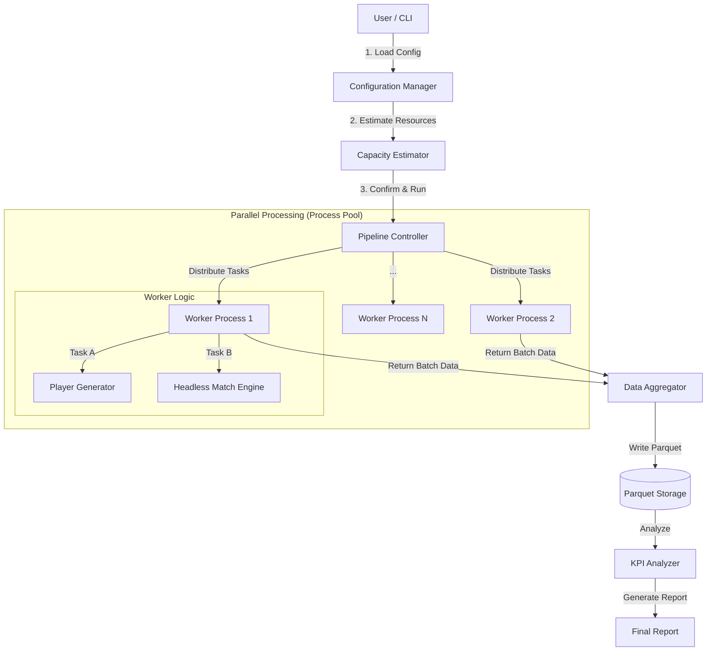

# 專案開發日誌：ASBL 模擬引擎大數據測試架構設計
**Project Journal: ASBL Simulation Engine - Big Data Testing Architecture Design**

**日期**: 2025-12-07 19:45
**參與者**: Product Owner (User), Lead Architect (Monica)
**主題**: 針對 ASBL v1.4 比賽引擎設計千萬級別的壓力測試與平衡驗證方案

## 1. 需求發起 (Initiation)

### 背景
ASBL 專案已完成比賽引擎 v1.4 (包含數據歸屬與體力修正) 與球隊生成模組。Product Owner (PO) 希望透過大規模模擬數據，驗證數值平衡性與常態分佈情形。

### 原始需求
*   **規模目標**: 執行大量模擬 (目標 1,000 萬次以上)。
*   **數據蒐集**: 蒐集球員生成分佈與比賽數據分佈。
*   **異常檢測**: 檢視是否存在非 BUG 的離群值 (Outliers)。
*   **硬體環境**: Intel i9-14900K (24核), 128GB RAM, 2TB RAID5 SSD。

## 2. 技術方案演進 (Technical Evolution)

### 2.1 初始方案評估
*   **原始想法**: 使用現有的 `simulate_match.py` 跑迴圈。
*   **架構師評估**: 現有程式包含大量 I/O (Print/Log) 與字串處理，在千萬級別模擬下效率極低。且單執行緒無法發揮 i9-14900K 效能。
*   **決策**: 必須重構為 **ETL 資料管線** 架構，並採用 **Headless (無頭模式)** 運行。

### 2.2 架構定案：In-Memory ETL Pipeline
針對 PO 提供的頂級硬體規格，我們制定了「商業級」的解決方案：

1.  **並行運算 (Parallel Computing)**
    *   利用 Python `multiprocessing` 開啟 20+ 個 Worker，榨乾 CPU 算力。
2.  **資料儲存 (Storage)**
    *   捨棄 CSV，改用 **Apache Parquet** (Columnar Storage)。
    *   **理由**: 讀寫速度快 10-50 倍，壓縮率高，且支援強型別 (Schema Enforcement)，適合後續的大數據分析。
3.  **連動測試 (Integration Testing)**
    *   將「球員生成」與「比賽模擬」串聯。
    *   建立 `Input (球隊特徵)` -> `Output (比賽結果)` 的關聯數據模型。

## 3. 測試規劃與 KPI 設定 (Testing Strategy)

### 3.1 預估系統 (Capacity Planning)
為避免盲目執行導致資源浪費，決定在測試腳本中實作 **「試跑模式 (Dry Run)」**：
*   先執行小樣本 (Benchmark)。
*   計算 **TPS (Transactions Per Second)**。
*   提供「目標次數」與「時間預算」兩種估算模式。

### 3.2 驗收標準 (Acceptance Criteria)
雙方針對 v1.4 引擎特性，定義了具體的數值指標 (KPIs)：

#### A. 宏觀平衡 (Macro Balance)
*   **主隊勝率**: 48% ~ 52%
*   **平均總分**: 160 ~ 220 分
*   **OT 率**: 3% ~ 8%

#### B. 數據歸屬 (Data Attribution - v1.4 重點)
*   **Star 球員出手數**: > Starter * 1.3
*   **助攻王歸屬**: PG 助攻數為全位置最高
*   **籃板王歸屬**: C/PF 籃板數佔比 > 60%

#### C. 體力系統 (Stamina System)
*   **力竭率 (<10體力)**: < 0.1% (驗證換人邏輯有效性)

## 4. 下一步行動 (Next Steps)
*   **Phase 1**: 撰寫正式的《測試計畫規格書》(已完成草案)。
*   **Phase 2**: 重構 `MatchEngine` 為 Headless Mode。
*   **Phase 3**: 開發 `benchmark/pipeline.py` 並行測試腳本。

---
## 5. 規格修訂紀錄 (Revision Log) - 2025-12-07 20:00

**參與者**: Product Owner, Lead Architect
**變更摘要**: 針對 KPI 進行現實化校正，並引入外部數據參考。

### 5.1 驗收標準修正 (Refined Acceptance Criteria)

經過與 PO 的深入討論，我們對原始 KPI 進行了以下修正，以確保測試目標更具備統計意義與真實性：

#### A. 宏觀平衡 (Macro Balance) - *Updated*
| 指標 | 原始設定 | **修正後設定** | 修正理由 |
| :--- | :--- | :--- | :--- |
| **主隊勝率** | 48% - 52% | **45% - 55%** | 放寬容許區間，目標主客場勝率差控制在 5% 內。 |
| **平均總分** | 160 - 220 | **120 - 200** | 考量初始球隊能力值較低，下修得分下限。 |
| **OT 率** | 3% - 8% | **5% - 7%** | 參考 NBA 歷史數據 (約 6%)，縮小目標區間以求精確。 |
| **總回合數 (Pace)** | (新增) | **140 - 200** | 新增指標。參考 NBA 現況 (單隊~99)，設定兩隊總和目標。 |

#### B. 數據歸屬邏輯 (Data Attribution Logic) - *Pivot*
*   **原始邏輯**: 基於「位置 (Position)」驗證 (e.g., PG 助攻最多)。
*   **新邏輯**: 基於 **「素質 (Attributes)」** 驗證。
    *   *理由*: 現代籃球位置模糊化。我們應驗證「高傳球素質」是否穩定產出「高助攻數據」，而非強制 PG 必須助攻王。
*   **戰術地位驗證**:
    *   **Star 球員出手數** 必須大於 **Starter** (差距 > 10%)。
    *   **Starter 出手數** 必須大於 **Bench** (差距 > 10%)。

#### C. 體力與換人 (Stamina & Substitution) - *Enhanced*
除了原有的「力竭率」外，新增以下監測指標：
1.  **換人頻率 (Substitution Frequency)**: 統計球員單場上下場次數，排除「頻繁進出 (Yo-Yo Substitution)」的異常邏輯。
2.  **體力切片 (Stamina Slicing)**: 監測比賽末段 (4Q/OT) 的剩餘體力，驗證高上場時間球員的體力消耗是否符合線性預期。

### 5.2 參考數據來源 (References)
*   **NBA Pace**: 2024-25 賽季平均 Pace 約為 99.2 (兩隊總和 ~198)。
*   **NBA OT Rate**: 長期歷史平均約為 5.9%，近年數據穩定在 6% 上下。

---

## 2025-12-07 20:25 - 測試指標與生成驗證規格確立 (KPI Refinement & Generation Validation)

**參與者**: Product Owner, Lead Architect
**變更摘要**: 微調比賽數據 KPI，並新增詳細的「球員生成分佈」驗證指標，確保 v1.4 引擎與 v2.4 球員生成規則一致。

### 1. 比賽數據 KPI 再修正 (Match Engine KPIs)

針對前次討論的指標進行了最終確認與微調：

#### A. 宏觀平衡 (Macro Balance)
1.  **OT 率 (Overtime Rate)**: **3% ~ 8%**
    *   *決策*: 維持較寬的容許區間。雖然 NBA 數據約 6%，但在模擬環境中保留彈性以涵蓋極端情況是合理的。
2.  **總回合數 (Pace)**: **160 ~ 230** (兩隊總和) / **85 ~ 110** (單隊)
    *   *決策*: 設定單隊目標區間，並推導出單場總和範圍。這能涵蓋從慢節奏陣地戰到快節奏跑轟戰的各種戰況。
3.  **主隊勝率**: **45% ~ 55%** (維持不變)。
4.  **平均總分**: **120 ~ 200** (維持不變)。

#### B. 數據歸屬與戰術地位 (Attribution & Tactics)
1.  **戰術地位 (Usage Rate)**:
    *   驗證層級：**Star > Starter > Others** (含 Bench 與 Reserve)。
    *   差距要求：相鄰層級間的出手佔比差距需 **> 10%**。
2.  **數據與素質綁定**:
    *   助攻王：驗證 `Pass` 屬性與助攻數的正相關性 (R > 0.7)。
    *   籃板王：驗證 `Rebound` 屬性與籃板數的正相關性 (R > 0.7)。

### 2. 球員生成驗證指標 (Player Generation Validation)

新增針對球員生成模組 (Generator v2.4) 的統計驗證，確保數百萬名生成的球員符合機率分佈設計。

#### A. 基礎分佈 (Basic Distribution)
1.  **位置分佈 (Position)**:
    *   目標：PG, SG, SF, PF, C 各位置佔比需落在 **18% ~ 22%** 之間。
    *   *註*: 身高雖呈常態分佈，但位置判定邏輯應能自然導向均衡結果。
2.  **等級機率 (Grade Drop Rates)**:
    *   驗證實際生成比例是否收斂於設定值 (誤差容許 < 0.1%)：
        *   **G**: 28%, **C**: 26%, **B**: 22%, **A**: 14%
        *   **S**: 7%, **SS**: 2.5%, **SSR**: 0.5%

#### B. 能力值驗證 (Stats Validation)
1.  **不可訓練能力 (Untrainable Stats - Talent)**:
    *   驗證各等級球員的 **10項天賦總和** 是否嚴格落在設定區間內。
    *   重點檢查：**SSR 級總分是否 > 951**；**G 級總分是否 < 400**。
    *   統計分佈：繪製各等級的總分直方圖 (Histogram)，每 100 分為一個區間。
2.  **可訓練能力 (Trainable Stats - Tech)**:
    *   驗證 **反向總上限 (Reverse Cap)** 機制：等級越高，初始技術總和應越低。
    *   驗證 **重骰機制 (Reroll)**：確保沒有球員的技術總和超過該等級上限 (e.g., G 級 <= 800, SSR <= 550)。
    *   離群值檢查：確認是否存在單項極高 (e.g., 99) 但總分合規的「偏科型」球員。

#### C. 年齡分佈 (Age Distribution)
1.  **規則驗證**:
    *   **SSR**: 必須 100% 為 **18歲**。
    *   **SS**: 18-19歲, **S**: 18-20歲 ... **G**: 18-24歲。
2.  **均勻性驗證**:
    *   對於非固定年齡的等級 (如 G 級 18-24 歲，共 7 個可能值)，各年齡層佔比應均勻分佈。
    *   目標：`100% / 可能年齡數 ± 3%`。

---
## 2025-12-07 20:30 - 生成邏輯代碼確認與驗證策略修正 (Code Review & Strategy Pivot)

**參與者**: Product Owner, Lead Architect
**變更摘要**: 檢視 `PlayerGenerator` 原始碼，確認 v2.4 規格已實作。修正驗證策略，區分「原始生成機率」與「開隊篩選結果」。

### 1. 程式碼邏輯確認 (Code Logic Verification)
經檢視 `app/services/player_generator.py`，確認以下關鍵邏輯已實作：
*   **等級權重**: `OVERALL_GRADE_WEIGHTS` 準確對應 G (28%) ~ SSR (0.5%)。
*   **年齡生成**: `_generate_age` 依據等級正確應用了 `AGE_OFFSETS` (SSR 固定 18 歲)。
*   **能力值限制**:
    *   **不可訓練 (Talent)**: `_generate_stats_by_grade` 正確使用了 `UNTRAINABLE_RULES` 的總分與單項限制。
    *   **可訓練 (Tech)**: 實作了 **Reroll 機制** (`while True` 迴圈)，確保 `sum(trainable_stats) <= cap`，符合反向總上限設計。
*   **位置判定**: `_pick_position` 依據身高機率表進行判定。

### 2. 驗證策略修正 (Validation Strategy Update)
鑑於開隊流程包含「強制篩選 (Forced Selection)」機制（如：必須湊齊特定陣容），直接統計資料庫中的等級分佈將產生偏差（Bias）。因此，我們將驗證分為兩個層次：

#### A. 生成器單元測試 (Generator Unit Test)
*   **目標**: 驗證 `PlayerGenerator` 的純粹機率輸出。
*   **方法**: 繞過開隊邏輯，直接呼叫 `PlayerGenerator.generate_and_persist` 生成 100 萬名「自由球員」。
*   **驗收標準**:
    *   等級分佈需嚴格符合 `OVERALL_GRADE_WEIGHTS` (誤差 < 0.1%)。
    *   SSR 年齡需 100% 為 18 歲。
    *   所有球員的能力值總和需符合 `UNTRAINABLE_RULES` 與 `TRAINABLE_CAPS`。

#### B. 開隊邏輯驗證 (Team Creation Verification)
*   **目標**: 驗證使用者獲得的初始球隊結構。
*   **方法**: 模擬 10,000 次開隊流程。
*   **驗收標準**:
    *   每隊必須包含：1 Star, 2 Starter, 2 Rotation, 1 Role, 1 Bench (或其他定義好的結構)。
    *   檢查是否有「卡死」或「無限迴圈」的情況（即生成極端不順利導致開隊超時）。

---
## 2025-12-07 20:45 - 最終 KPI 定案 (Final KPI Definition)

**參與者**: Product Owner, Lead Architect
**變更摘要**: 針對「可訓練能力極端值」、「上場時間分配範圍」與「體力殘留統計」進行了最終數值校正。

### 1. 最終測試 KPI 總表 (Final Master KPI List)

#### A. 球員生成驗證 (Player Generation)
*   **1.1 基礎分佈**:
    *   **等級機率**: 誤差 < 0.1% (G:28% ... SSR:0.5%)。
    *   **位置分佈**: 各位置佔比 **18% ~ 22%**。
    *   **年齡規則**: SSR 固定 18 歲；其他等級分佈均勻 (±3%)。
*   **1.2 數值合規性**:
    *   **不可訓練能力**: 總分與單項符合 `UNTRAINABLE_RULES`。
    *   **可訓練能力 (反向總上限)**: 總和 <= 等級上限 (SSR<=550 ... G<=800)。
    *   **極端值檢查 (Reroll 驗證)**: 必須存在單項數值 **> 90** 或 **< 10** 的偏科球員，證明重骰機制允許極端分佈。
*   **1.3 開隊陣容**:
    *   結構嚴格符合：1 SSR, 1 SS, 1 S, 2 A, 2 B, 3 C, 5 G。
    *   位置嚴格符合：C>=2, PG>=2, G>=4, F>=4。

#### B. 比賽宏觀數據 (Match Engine - Macro)
*   **勝率與比分**: 主隊勝率 **45%~55%**；平均總分 **120~200**。
*   **OT 率**: **3% ~ 8%**。
*   **節奏 (Pace)**: 單隊 **85~110** (總和 160~230)。

#### C. 邏輯與歸屬 (Logic & Attribution)
*   **戰術地位**: Star 出手佔比 > Starter > Bench (級距 > 10%)。
*   **素質綁定**: 助攻(Pass)、籃板(Rebound)、三分(Range+Acc) 與對應數據的相關係數 **R > 0.7**。

#### D. 上場時間分配 (Minutes Distribution - Spec v2.5)
依據角色定位驗證平均上場時間與波動範圍：
*   **Star**: **29 ~ 35 min** (容許誤差 ±0.9 min)。
    *   *定義*: 絕對核心，波動極小。
*   **Starter**: **18 ~ 27 min** (基準 20 + 浮動 -2~7)。
*   **Rotation**: **15 ~ 25 min** (基準 10 + 浮動 5~15)。
*   **Role**: **5 ~ 12 min** (基準 0 + 浮動 5~12)。
*   **Bench**: **0 ~ 10 min** (基準 0 + 浮動 0~10，允許 DNP)。
*   **異常監測**: Star 長期 < 20 min 視為異常。

#### E. 體力與調度系統 (Stamina & Rotation)
*   **疲勞度監測**:
    *   比賽結束時，體力 **< 30** 的球員數量理論上應 **> 2 人** (顯示比賽強度足夠)。
*   **終場體力分佈**:
    *   統計終場時 **場上 5 人** 的體力數據。
    *   計算：平均值、最大值、最小值。
    *   *預期*: 應有部分球員處於疲勞狀態，而非全員滿體力。

---
## 2025-12-07 21:10 - 測試架構詳細設計 (Detailed Architecture Design v2.0)

**參與者**: Product Owner, Lead Architect
**變更摘要**: 根據最終 KPI 重新設計 ETL 架構，整合參數化配置 (Parametrization) 與預估系統 (Capacity Planning)。

### 1. 系統架構圖 (System Architecture)

### 2. 核心模組設計 (Core Modules)

#### 2.1 配置管理器 (Configuration Manager)
負責集中管理所有測試參數，支援 CLI 參數覆蓋。
*   **參數項目**:
    *   `mode`: `generation` (僅生成), `simulation` (生成+比賽), `dry_run` (試跑)。
    *   `total_simulations`: 總模擬場次 (e.g., 10,000,000)。
    *   `batch_size`: 單次批次大小 (e.g., 5,000)。
    *   `num_workers`: 並行進程數 (Default: CPU Count - 4)。
    *   `output_dir`: 數據輸出路徑。
    *   `kpi_thresholds`: KPI 驗收標準 (從 Config 讀取，而非寫死在程式碼)。

#### 2.2 容量預估器 (Capacity Estimator)
在正式執行前，先進行小規模試跑 (Dry Run) 以評估資源。
*   **功能**:
    *   執行 1,000 場模擬。
    *   計算 **TPS (Transactions Per Second)**。
    *   **預估報告**:
        *   預計總耗時 (Total Time Estimation)。
        *   預計磁碟佔用 (Disk Usage Estimation)。
        *   記憶體峰值預估 (Peak Memory Estimation)。
*   **決策點**: 使用者可根據預估結果決定是否繼續執行 (Go/No-Go)。

#### 2.3 工作流控制器 (Pipeline Controller)
負責調度 `multiprocessing.Pool` 並管理數據流。
*   **任務分派**: 根據 `mode` 決定 Worker 執行的邏輯。
    *   **Mode: Generation**: 僅呼叫 `PlayerGenerator`，回傳球員屬性數據 (用於 KPI 1.1, 1.2)。
    *   **Mode: Simulation**: 呼叫 `PlayerGenerator` (開隊) -> `HeadlessMatchEngine` (比賽) -> 回傳比賽數據 (用於 KPI 2, 3, 4)。

#### 2.4 無頭引擎 (Headless Engine)
重構後的輕量化引擎，移除所有非必要邏輯。
*   **特徵**:
    *   **Pure Python**: 移除 SQLAlchemy 依賴，改用 Dict/DataClass 傳遞數據。
    *   **No I/O**: 移除所有 `print` 與 `log`，僅在錯誤時拋出 Exception。
    *   **In-Memory**: 比賽過程全在記憶體中完成，僅回傳最終統計數據。

#### 2.5 數據聚合器 (Data Aggregator)
負責接收 Worker 回傳的數據並寫入儲存。
*   **Schema Design**:
    *   `players.parquet`: 儲存球員生成數據 (ID, Grade, Stats...)。
    *   `matches.parquet`: 儲存比賽結果 (Score, Pace, OT...)。
    *   `player_stats.parquet`: 儲存球員單場數據 (PTS, AST, Minutes, Stamina...)。
*   **寫入策略**: 每收集 N 個 Batch 寫入一次檔案，避免頻繁 IO。

### 3. 數據流與 KPI 對應 (Data Flow Mapping)

| 階段 | 數據表 (Table) | 欄位 (Columns) | 對應 KPI |
| :--- | :--- | :--- | :--- |
| **生成** | `players` | `grade`, `pos`, `age`, `talent_sum`, `tech_sum`, `stats_vector` | 1.1 基礎分佈, 1.2 數值合規 |
| **開隊** | `teams` | `roster_composition` (Grade/Pos counts) | 1.3 開隊陣容 |
| **比賽** | `matches` | `home_score`, `away_score`, `is_ot`, `pace`, `winner` | 2.1 結果, 2.2 節奏 |
| **統計** | `player_stats` | `min`, `pts`, `ast`, `reb`, `fga`, `usage_rate`, `end_stamina` | 3.1 戰術, 3.2 素質, 4.1 時間, 4.2 體力 |

---
## 2025-12-07 21:15 - 資料儲存策略與執行藍圖 (Data Strategy & Roadmap)

**參與者**: Product Owner, Lead Architect
**變更摘要**: 定義 Apache Parquet 儲存格式、詳細 Data Schema 以及三階段執行計畫。

### 1. 資料儲存策略 (Data Storage Strategy)

鑑於 1,000 萬場比賽將產生數億個資料點，傳統 CSV 格式已不適用。本計畫採用 **Apache Parquet** 格式。

*   **欄式儲存 (Columnar Storage)**: 適合分析特定欄位（如：只讀取所有比賽的「得分」欄位），讀取速度比 CSV 快 10-50 倍。
*   **壓縮率 (Compression)**: 內建 Snappy 壓縮，檔案體積約為 CSV 的 10%~20%。
*   **型別保留 (Schema Enforcement)**: 保留 int, float, bool 強型別，無需二次轉換，這對精確的數值驗證（如小數點後的權重）至關重要。
*   **分區策略 (Partitioning)**:
    *   命名規則: `data_{type}_part_{timestamp}_{batch_id}.parquet`
    *   單檔目標大小: 控制在 100MB ~ 500MB 以優化 I/O。

### 2. 數據規格定義 (Data Schema)

我們將蒐集三個維度的數據表 (DataFrame)，以對應不同的 KPI 驗收。

#### 2.1 Generated Players Dataset (生成驗證)
*用途: 驗證 KPI 1.1 (等級分佈), 1.2 (數值合規), 1.3 (開隊陣容)*

| 欄位名稱 | 型別 | 說明 |
| :--- | :--- | :--- |
| `player_id` | string | UUID |
| `grade` | category | G/C/B/A/S/SS/SSR |
| `position` | category | PG/SG/SF/PF/C |
| `age` | int8 | 驗證年齡規則 |
| `talent_sum` | int16 | 不可訓練總分 (驗證 SSR > 951) |
| `tech_sum` | int16 | 可訓練總分 (驗證反向上限) |
| `max_stat` | int8 | 單項最高值 (驗證 > 90 極端值) |
| `min_stat` | int8 | 單項最低值 (驗證 < 10 極端值) |

#### 2.2 Match Dataset (比賽宏觀)
*用途: 驗證 KPI 2.1 (勝率/比分), 2.2 (節奏/OT)*
*預估資料量: 10,000,000 筆*

| 欄位名稱 | 型別 | 說明 |
| :--- | :--- | :--- |
| `match_id` | string | 唯一識別碼 |
| `home_score` | int16 | 主隊得分 |
| `away_score` | int16 | 客隊得分 |
| `pace` | int16 | 總回合數 (驗證 160-230) |
| `is_ot` | bool | 是否延長 (驗證 3-8%) |
| `home_final_stamina_avg` | float | 主隊終場平均體力 |
| `stamina_under_30_count` | int8 | **驗證疲勞度 KPI (>2人)** |

#### 2.3 Player Stats Dataset (微觀歸屬)
*用途: 驗證 KPI 3 (數據歸屬), 4 (時間/體力)*
*策略: Dry Run 採全量錄製；Full Run 採 10% 抽樣或僅錄製先發+關鍵替補。*

| 欄位名稱 | 型別 | 說明 |
| :--- | :--- | :--- |
| `match_id` | string | FK |
| `position` | category | 位置 |
| `role` | category | Star/Starter/Bench (驗證時間分配) |
| `minutes` | float | 上場時間 (驗證 Star ~30min) |
| `pts`, `reb`, `ast` | int8 | 基礎數據 (驗證 R > 0.7) |
| `fga`, `fgm` | int8 | 出手數據 (驗證戰術地位) |
| `end_stamina` | float | 結束時體力 |

### 3. 執行步驟 (Execution Roadmap)

#### Phase 1: 基礎建設 (Infrastructure)
1.  **Headless Refactoring**: 重構 `MatchEngine`，移除所有 `print` 與 `log`，建立純運算的 `run_headless()` 方法。
2.  **Schema Implementation**: 建立 Python Data Class 定義上述 Schema。

#### Phase 2: 壓力測試與校正 (Stress Test & Calibration)
1.  **Estimator / Dry Run**:
    *   執行 10 萬場 (Batch Size 調整)。
    *   **全量錄製** Player Stats，以精確驗證「體力 < 30」與「Star 上場時間」的極端分佈。
    *   產出資源消耗報告。
2.  **Full Run**:
    *   執行 1,000 萬場。
    *   開啟抽樣模式 (如需)，產出最終大數據集。

#### Phase 3: 數據分析 (Analysis)
1.  **Jupyter Notebook**: 載入 Parquet。
2.  **KPI 檢核**: 針對每一項 KPI 撰寫自動化 Assert 腳本 (e.g., `assert 0.03 <= ot_rate <= 0.08`)。
3.  **視覺化報告**: 產出直方圖、熱力圖與相關係數矩陣。

### 4. 預期產出 (Deliverables)
1.  **Python ETL Scripts**: 包含多進程處理 (`multiprocessing`) 與 Parquet 寫入邏輯。
2.  **Cleaned Datasets**: 清洗後的 Parquet 檔案 (預計 2-5 GB)。
3.  **Analysis Report**: 包含 KPI 通過率、異常值分析與視覺化圖表的 Jupyter Notebook。

---
# 2025-12-11 05:30 專案開發日誌：ASBL 球員生成系統大數據驗證架構 (v2.6)
**Project Journal: ASBL Player Generation System - Big Data Verification Architecture (v2.6)**

**日期**: 2025-12-11 05:30
**參與者**: Product Owner (User), Lead Architect (Monica)
**主題**: 定義球員生成器 (v2.6) 的重構動機、測試目標與詳細 KPI 驗收標準

## 1. 前言：重構動機與測試一致性 (Preface)

為了確保程式設計與測試驗證的一致性與效率，我們在進入大數據測試前，對 `PlayerGenerator` 進行了核心重構 (Refactoring to v2.6)。

**主要動機**：
1.  **消除歧義**：舊版代碼在屬性映射 (Mapping) 上存在模糊地帶（如 `shot_release` 與 `shot_accuracy` 欄位衝突），這會導致測試數據失真。
2.  **規格對齊**：確保程式碼邏輯（如反向總上限、重骰機制）嚴格遵循規格書 v2.6 定義。
3.  **測試有效性**：唯有在「輸入端」邏輯絕對正確的前提下，後續的千萬次比賽模擬才具備統計意義。
4.  **真實環境驗證**：本次測試拒絕使用 Mock Data，必須直接呼叫應用程式核心 (`app.services.player_generator`)，載入真實的 `game_config.yaml` 與 Flask Context，以確保測試結果與正式營運完全一致。

本次測試的核心目標，即是驗證重構後的生成器，其**機率分佈 (Probability Distribution)** 與 **隨機性 (Randomness)** 是否完全符合數學模型設定。

## 2. 測試環境與流程 (Environment & Workflow)

### 2.1 硬體規格
*   **CPU**: Intel i9-14900K (24 Cores / 32 Threads)
*   **RAM**: 128GB DDR5
*   **Storage**: 2TB RAID5 NVMe SSD
*   **OS**: Linux / Windows (Python 3.10+)

### 2.2 執行流程
1.  **試跑 (Dry Run)**: 執行 10,000 次生成，輸出實體 Parquet 檔案。
2.  **基準測試 (Benchmark)**: 顯示執行時間與檔案大小。
3.  **容量預估 (Estimation)**: 使用者輸入目標次數 (如 1,000,000)，系統計算預估耗時與硬碟佔用。
4.  **正式測試 (Full Run)**: 確認後啟動多進程 (Multiprocessing) 執行生成。

## 3. 測試 KPI 詳細設定 (Detailed KPI Definitions)

我們將生成 **100,000,000 (一億)** 筆球員資料，並針對以下維度進行統計驗收。

### 3.1 身高與位置分佈 (Height & Position)

#### A. 身高分佈 (Height Distribution)
*   **驗證模型**：Box-Muller Transform (Mean=195, SD=10, Range=160-230)。
*   **切片分析 (Slicing)**：以 **10cm** 為一個區間，驗證實際落點佔比是否符合常態分佈曲線。
*   **驗收標準**：各區間實際佔比與理論值誤差需 < 0.5%。

#### B. 位置判定 (Position Assignment)
*   **驗證邏輯**：檢查在特定身高區間下，各位置的出現機率。
*   **容許誤差**：**± 1%**。

| 身高區間 | PG (目標/誤差) | SG (目標/誤差) | SF (目標/誤差) | PF (目標/誤差) | C (目標/誤差) |
| :--- | :--- | :--- | :--- | :--- | :--- |
| **< 190** | 60% (±1%) | 40% (±1%) | 0% | 0% | 0% |
| **190-199** | 35% (±1%) | 45% (±1%) | 20% (±1%) | 0% | 0% |
| **200-209** | 5% (±1%) | 10% (±1%) | 20% (±1%) | 50% (±1%) | 15% (±1%) |
| **>= 210** | 5% (±1%) | 10% (±1%) | 10% (±1%) | 30% (±1%) | 45% (±1%) |

### 3.2 等級機率 (Grade Drop Rates)
| 等級 | 目標機率 | **容許誤差 (Tolerance)** |
| :--- | :--- | :--- |
| **G** | 28.0% | **± 1.0%** |
| **C** | 26.0% | **± 1.0%** |
| **B** | 22.0% | **± 1.0%** |
| **A** | 14.0% | **± 1.0%** |
| **S** | 7.0% | **± 0.5%** |
| **SS** | 2.5% | **± 0.5%** |
| **SSR**| 0.5% | **± 0.1%** |

### 3.3 天賦生成驗證 (Untrainable Stats)
*   **G**: Sum 10-400, Stat 1-99
*   **C**: Sum 399-600, Stat 1-99
*   **B**: Sum 599-700, Stat 1-99
*   **A**: Sum 699-800, Stat 10-99
*   **S**: Sum 799-900, Stat 20-99
*   **SS**: Sum 900-950, Stat 30-99
*   **SSR**: Sum 951-990, Stat 91-99 (驗證數值分佈均勻性)
*   **極值監測**: 驗證單項屬性落在 Max-10 與 Min+10 區間的機率，確保非鐘型分佈。

### 3.4 技術生成驗證 (Trainable Stats)
*   **反向總上限 (Reverse Cap)**:
    *   G: 800, C: 700, B: 650, A: 600, S/SS/SSR: 550
*   **切片分析**: 每 100 分為一切片，觀察分佈。
*   **極值監測**: 統計 Total < 100 (廢材) 與 Total > Cap-50 (頂標) 的出現機率，驗證重骰機制有效性。

#### 3.5. 年齡分佈 (Age Distribution)
1.  **規則驗證**:
    *   **SSR**: 必須 100% 為 **18歲**。
    *   **SS**: 18-19歲, **S**: 18-20歲 ... **G**: 18-24歲。
2.  **均勻性驗證**:
    *   對於非固定年齡的等級 (如 G 級 18-24 歲，共 7 個可能值)，各年齡層佔比應均勻分佈。
    *   目標：`100% / 可能年齡數 ± 3%`。