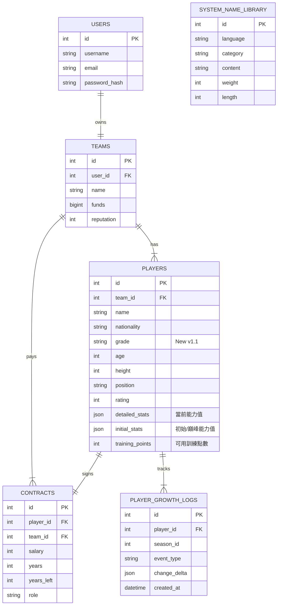

# 

# ASBL Basketball Manager - 專案全景快照

- **生成時間**: 2026-02-16 13:28:22
- **專案路徑**: `D:\ASBL-Basketball-Manager`
- **包含格式**: `.css, .env, .html, .js, .json, .jsx, .md, .py, .scss, .sql, .ts, .tsx, .yaml, .yml`
- **強制包含**: `Dockerfile, Procfile, requirements.txt`
- **檔案總數**: 66

## 1. 專案結構樹 (Project Tree)

```text
ASBL-Basketball-Manager/
├─ app/
│  ├─ models/
│  │  ├─ __init__.py
│  │  ├─ contract.py
│  │  ├─ match.py
│  │  ├─ player.py
│  │  ├─ system.py
│  │  ├─ team.py
│  │  └─ user.py
│  ├─ routes/
│  │  ├─ __init__.py
│  │  ├─ auth.py
│  │  ├─ game.py
│  │  └─ team.py
│  ├─ services/
│  │  ├─ match_engine/
│  │  │  ├─ systems/
│  │  │  │  ├─ __init__.py
│  │  │  │  ├─ attribution.py
│  │  │  │  ├─ play_logic.py
│  │  │  │  ├─ stamina.py
│  │  │  │  └─ substitution.py
│  │  │  ├─ utils/
│  │  │  │  ├─ __init__.py
│  │  │  │  ├─ calculator.py
│  │  │  │  └─ rng.py
│  │  │  ├─ __init__.py
│  │  │  ├─ core.py
│  │  │  ├─ service.py
│  │  │  └─ structures.py
│  │  ├─ __init__.py
│  │  ├─ player_generator.py
│  │  └─ team_creator.py
│  ├─ templates/
│  ├─ utils/
│  │  └─ game_config_loader.py
│  └─ __init__.py
├─ config/
│  └─ game_config.yaml
├─ frontend/
│  ├─ src/
│  │  ├─ assets/
│  │  ├─ App.css
│  │  ├─ App.tsx
│  │  ├─ index.css
│  │  └─ main.tsx
│  ├─ eslint.config.js
│  ├─ index.html
│  ├─ package.json
│  ├─ postcss.config.js
│  ├─ README.md
│  ├─ tailwind.config.js
│  ├─ tsconfig.app.json
│  ├─ tsconfig.json
│  ├─ tsconfig.node.json
│  └─ vite.config.ts
├─ scripts/
│  ├─ utils/
│  │  ├─ project_exporter.py
│  │  └─ tree.py
│  ├─ __init__.py
│  ├─ init_db.py
│  └─ terminal.py
├─ tests/
│  ├─ match_bigdata_test/
│  │  ├─ team/
│  │  └─ run_core_bigdata_test.py
│  ├─ player_generator_big_data/
│  │  ├─ analyzer.py
│  │  ├─ check_data_integrity.py
│  │  ├─ run_test.py
│  │  └─ test_config.yaml
│  ├─ team_bigdata_test/
│  │  ├─ manual_merge.py
│  │  └─ run_simulation.py
│  └─ __init__.py
├─ tools/
│  └─ code_merger.py
├─ ASBL_Database_Schema.md
├─ ASBL_League_Simulation_Design.md
├─ ASBL_Match_Engine_Specification.md
├─ ASBL_Player_System_Specification.md
├─ config.py
├─ DEV_LOG.md
├─ README.md
├─ requirements.txt
└─ run.py
```

---

## 2. 檔案內容詳情 (File Contents)

### 📄 File: `app\models\__init__.py`

```python
# app/models/__init__.py
from app.models.user import User
from app.models.team import Team
from app.models.player import Player, PlayerGrowthLog
from app.models.contract import Contract
from app.models.system import NameLibrary

# 這裡不需匯出 match，因為目前 match.py 是空的，且我們使用 Parquet 存比賽紀錄
```

---

### 📄 File: `app\models\contract.py`

```python
# app/models/contract.py
from app import db

class Contract(db.Model):
    __tablename__ = 'contracts'
    __table_args__ = {'comment': '球員合約資料表'}

    id = db.Column(db.Integer, primary_key=True)
    
    player_id = db.Column(db.Integer, db.ForeignKey('players.id'), nullable=False, unique=True, comment='球員ID')
    team_id = db.Column(db.Integer, db.ForeignKey('teams.id'), nullable=False, comment='球隊ID(冗餘)')
    
    salary = db.Column(db.Integer, nullable=False, comment='賽季薪資')
    years = db.Column(db.Integer, default=1, comment='總合約年限')
    years_left = db.Column(db.Integer, default=1, comment='剩餘年限')
    
    # 角色定位 (Star, Starter, Rotation, Role, Bench)
    role = db.Column(db.String(20), nullable=False, default='Bench', comment='角色定位')

    # 球隊/球員選項 (Team/Player Option)
    option_type = db.Column(db.String(10), nullable=True, comment='選項類型(PO/TO)') 

    created_at = db.Column(db.DateTime, server_default=db.func.now())
    updated_at = db.Column(db.DateTime, server_default=db.func.now(), onupdate=db.func.now())

    def __repr__(self):
        return f'<Contract Player:{self.player_id} ${self.salary} ({self.role})>'
```

---

### 📄 File: `app\models\match.py`

```python
# app/models/match.py
```

---

### 📄 File: `app\models\player.py`

```python
# app/models/player.py
from app import db
from sqlalchemy import JSON

class Player(db.Model):
    __tablename__ = 'players'
    __table_args__ = {'comment': '球員核心資料表'}

    id = db.Column(db.Integer, primary_key=True)
    name = db.Column(db.String(64), nullable=False)
    
    # 國籍/語系
    nationality = db.Column(db.String(16), nullable=False, default='zh', comment='球員國籍/語系')

    age = db.Column(db.Integer, default=18)
    height = db.Column(db.Integer, nullable=False, comment='身高(cm)')
    position = db.Column(db.String(10), nullable=False, comment='註冊位置')
    
    # 訓練點數
    training_points = db.Column(db.Integer, default=0, nullable=False, comment='可用訓練點數')

    # [新增] 在這裡加入 grade 欄位
    grade = db.Column(db.String(5), nullable=False, default='G', comment='球員等級 (SSR/SS/S...)')
    
    # 綜合評價 (Rating)
    rating = db.Column(db.Integer, comment='綜合評價分數')

    # [Schema 2.3] 數據欄位
    detailed_stats = db.Column(JSON, nullable=False, comment='當前能力值') 
    initial_stats = db.Column(JSON, nullable=True, comment='初始/巔峰能力值(老化參考)')

    # 關聯
    user_id = db.Column(db.Integer, db.ForeignKey('users.id'), nullable=True)
    team_id = db.Column(db.Integer, db.ForeignKey('teams.id'), nullable=True)

    created_at = db.Column(db.DateTime, server_default=db.func.now())
    updated_at = db.Column(db.DateTime, server_default=db.func.now(), onupdate=db.func.now())
    
    # 關聯設定
    contract = db.relationship('Contract', backref='player', uselist=False, cascade="all, delete-orphan")
    growth_logs = db.relationship('PlayerGrowthLog', backref='player', lazy='dynamic', cascade="all, delete-orphan")

    def __repr__(self):
        return f'<Player {self.name} ({self.nationality})>'

class PlayerGrowthLog(db.Model):
    """
    [Schema 2.5] 球員成長/老化紀錄
    記錄每一季或每次訓練的數值變動。
    """
    __tablename__ = 'player_growth_logs'
    __table_args__ = {'comment': '球員成長與老化歷程'}

    id = db.Column(db.Integer, primary_key=True)
    player_id = db.Column(db.Integer, db.ForeignKey('players.id'), nullable=False)
    
    season_id = db.Column(db.Integer, nullable=False, comment='發生賽季')
    event_type = db.Column(db.String(20), nullable=False, comment='類型: AGE_DECLINE, TRAINING')
    
    # 記錄變動量，例如 {"speed": -2, "strength": -1}
    change_delta = db.Column(JSON, nullable=False, comment='數值變化量')
    
    created_at = db.Column(db.DateTime, server_default=db.func.now())

    def __repr__(self):
        return f'<GrowthLog P:{self.player_id} {self.event_type}>'
```

---

### 📄 File: `app\models\system.py`

```python
# app/models/system.py
from app import db
from sqlalchemy import Computed

class NameLibrary(db.Model):
    __tablename__ = 'system_name_library'
    __table_args__ = (
        db.UniqueConstraint('language', 'content', name='uq_lang_content'),
        db.Index('idx_lang_cat_weight', 'language', 'category', 'weight'),
        {'comment': '[系統] 多國語系姓名詞庫'}
    )

    id = db.Column(db.Integer, primary_key=True, comment='唯一識別碼')
    
    # 語系代碼 (en, zh, ja, tw_aboriginal...)
    language = db.Column(db.String(16), nullable=False, comment='語系代碼')
    
    # 類別 (surname, given_name, template) - 雖然策略A不分，但資料庫結構仍需保留
    category = db.Column(db.String(16), nullable=False, comment='類別')
    
    # 內容 (中文音譯或原文)
    content = db.Column(db.String(64), nullable=False, comment='內容')
    
    # 內容字數 (對應 SQL 的 GENERATED ALWAYS AS)
    # SQLAlchemy 可用 Computed 映射，或單純視為由 DB 管理的欄位
    length = db.Column(db.Integer, Computed('char_length(content)'), comment='內容字數')
    
    # 權重
    weight = db.Column(db.Integer, nullable=False, default=10, comment='出現權重')

    def __repr__(self):
        return f'<NameLib {self.language}.{self.category}: {self.content}>'
```

---

### 📄 File: `app\models\team.py`

```python
# app/models/team.py
from app import db

class Team(db.Model):
    __tablename__ = 'teams'
    __table_args__ = {'comment': '球隊資料表'}

    id = db.Column(db.Integer, primary_key=True, comment='球隊 ID (主鍵)')
    user_id = db.Column(db.Integer, db.ForeignKey('users.id'), unique=True, nullable=False, comment='所屬使用者 ID')
    name = db.Column(db.String(64), nullable=False, comment='球隊名稱')
    
    # 經營資訊
    funds = db.Column(db.BigInteger, default=300000, comment='球隊資金')
    reputation = db.Column(db.Integer, default=0, comment='球隊聲望')
    
    # [新增] 場館與粉絲團
    arena_name = db.Column(db.String(64), nullable=True, comment='場館名稱')
    fanpage_name = db.Column(db.String(64), nullable=True, comment='粉絲團名稱')
    
    # [新增] 球探
    scout_chances = db.Column(db.Integer, default=100, nullable=False, comment='剩餘球探次數')
    
    # [新增] 戰績快取 (用於 Dashboard 快速顯示)
    season_wins = db.Column(db.Integer, default=0, comment='本季勝場')
    season_losses = db.Column(db.Integer, default=0, comment='本季敗場')
    
    # 關聯
    players = db.relationship('Player', backref='team', lazy='dynamic')
    contracts = db.relationship('Contract', backref='team', lazy='dynamic')

    def __repr__(self):
        return f'<Team {self.name}>'
```

---

### 📄 File: `app\models\user.py`

```python
# app/models/user.py
from app import db
from datetime import datetime
from werkzeug.security import generate_password_hash, check_password_hash

class User(db.Model):
    __tablename__ = 'users'
    __table_args__ = {'comment': '使用者帳號資料表'}

    id = db.Column(db.Integer, primary_key=True, comment='使用者 ID (主鍵)')
    username = db.Column(db.String(64), index=True, unique=True, nullable=False, comment='使用者名稱')
    email = db.Column(db.String(120), index=True, unique=True, nullable=False, comment='電子信箱')
    password_hash = db.Column(db.String(256), comment='密碼雜湊值')
    created_at = db.Column(db.DateTime, default=datetime.utcnow, comment='帳號建立時間')
    
    # [新增] 記錄最後登入時間，用於計算活躍人數
    last_login = db.Column(db.DateTime, default=datetime.utcnow, comment='最後登入時間')
    
    # 關聯：使用字串 'Team' 避免循環引用
    team = db.relationship('Team', backref='owner', uselist=False)

    def set_password(self, password):
        """將明文密碼加密後存入"""
        self.password_hash = generate_password_hash(password)

    def check_password(self, password):
        """驗證密碼是否正確"""
        return check_password_hash(self.password_hash, password)

    def __repr__(self):
        return f'<User {self.username}>'
```

---

### 📄 File: `app\routes\__init__.py`

```python
# app/routes/__init__.py
from flask import Blueprint, jsonify
from datetime import datetime, timedelta
from app.models.user import User
from app.utils.game_config_loader import GameConfigLoader # [新增]

# 定義 'main' Blueprint
main = Blueprint('main', __name__)

@main.route('/')
def index():
    """API 健康檢查端點"""
    return jsonify({
        "status": "online",
        "message": "ASBL Basketball Manager API is running",
        "version": "v1.0"
    })

@main.route('/api/system/stats', methods=['GET'])
def system_stats():
    """
    [新增] 取得系統統計數據
    回傳:
        total_users: 總註冊人數
        active_users: 過去 N 天內有登入的使用者 (N 由 config 定義)
    """
    try:
        # 從 Config 讀取活躍判定天數，預設 7 天
        active_days = GameConfigLoader.get('system.active_user_threshold_days', 7)
        
        # 計算 N 天前的時間點
        threshold_date = datetime.utcnow() - timedelta(days=active_days)
        
        # 查詢總人數
        total_count = User.query.count()
        
        # 查詢活躍人數 (last_login >= N天前)
        active_count = User.query.filter(User.last_login >= threshold_date).count()
        
        return jsonify({
            "total_users": total_count,
            "active_users": active_count,
            "active_threshold_days": active_days # 可選：回傳判定標準供前端參考
        })
    except Exception as e:
        return jsonify({
            "error": str(e),
            "total_users": 0,
            "active_users": 0
        }), 500
```

---

### 📄 File: `app\routes\auth.py`

```python
# app/routes/auth.py
from flask import Blueprint, request, jsonify
from datetime import datetime
from app import db
from app.models.user import User
from app.models.team import Team
from app.services.team_creator import TeamCreator
from app.services.player_generator import PlayerGenerator
from app.utils.game_config_loader import GameConfigLoader # [新增]

auth_bp = Blueprint('auth', __name__, url_prefix='/api/auth')

@auth_bp.route('/register', methods=['POST'])
def register():
    data = request.get_json()
    
    # 1. 檢查必要欄位
    if not data or not data.get('username') or not data.get('email') or not data.get('password'):
        return jsonify({'error': '請提供使用者名稱、Email 和密碼'}), 400

    if User.query.filter_by(username=data['username']).first():
        return jsonify({'error': '使用者名稱已被使用'}), 400
    if User.query.filter_by(email=data['email']).first():
        return jsonify({'error': 'Email 已被註冊'}), 400

    try:
        # 2. 建立使用者
        user = User(username=data['username'], email=data['email'])
        user.set_password(data['password'])
        user.last_login = datetime.utcnow()
        
        db.session.add(user)
        db.session.flush() # 取得 user.id
        
        # 3. 讀取初始化設定
        init_settings = GameConfigLoader.get('system.initial_team_settings', {})
        init_funds = init_settings.get('funds', 300000)
        init_rep = init_settings.get('reputation', 0)
        init_scout = init_settings.get('scout_chances', 100)
        
        # 4. 設定球隊名稱 (預設為 Team_{ID})
        # 規則: 初始化的內容，球隊名稱=場館名稱=粉絲團
        default_name = f"Team_{user.id}"
        team_name = data.get('team_name') or default_name
        
        team = Team(
            name=team_name, 
            owner=user,
            funds=init_funds,
            reputation=init_rep,
            arena_name=team_name,    # 同步設定
            fanpage_name=team_name,  # 同步設定
            scout_chances=init_scout
        )
        db.session.add(team)
        db.session.flush() # 取得 team.id

        # 5. 生成初始 15 人名單
        PlayerGenerator.initialize_class()
        
        # [修改] max_attempts 採預設值 (100萬次)，若失敗會拋出 Exception
        roster_payloads = TeamCreator.create_valid_roster()
        
        for p_data in roster_payloads:
            PlayerGenerator.save_to_db(p_data, user_id=user.id, team_id=team.id)

        db.session.commit()
        
        return jsonify({
            'message': '註冊成功！球隊與初始球員已建立。',
            'user_id': user.id,
            'team_id': team.id,
            'team_name': team.name,
            'roster_count': len(roster_payloads)
        }), 201
        
    except Exception as e:
        db.session.rollback()
        return jsonify({'error': f'註冊失敗: {str(e)}'}), 500

@auth_bp.route('/login', methods=['POST'])
def login():
    data = request.get_json()
    
    if not data or not data.get('username') or not data.get('password'):
        return jsonify({'error': '請提供帳號密碼'}), 400

    user = User.query.filter_by(username=data['username']).first()

    if user and user.check_password(data['password']):
        user.last_login = datetime.utcnow()
        db.session.commit()

        return jsonify({
            'message': '登入成功',
            'user_id': user.id,
            'username': user.username,
            'team_id': user.team.id if user.team else None
        }), 200
    else:
        return jsonify({'error': '帳號或密碼錯誤'}), 401
```

---

### 📄 File: `app\routes\game.py`

```python
# app/routes/game.py
from flask import Blueprint, jsonify, request
# [修正] Team 定義在 app.models.team
from app.models.team import Team 
from app.services.match_engine.core import MatchEngine
from app.services.match_engine.service import DBToEngineAdapter
from app.utils.game_config_loader import GameConfigLoader
import dataclasses

game_bp = Blueprint('game', __name__, url_prefix='/api/game')

@game_bp.route('/simulate', methods=['POST'])
def simulate_match():
    """
    執行單場比賽模擬
    Payload: { "home_team_id": 1, "away_team_id": 2 }
    """
    data = request.get_json()
    home_id = data.get('home_team_id')
    away_id = data.get('away_team_id')

    if not home_id or not away_id:
        return jsonify({'error': '需要提供主客隊 ID'}), 400

    # 1. 撈取資料
    home_db = Team.query.get_or_404(home_id)
    away_db = Team.query.get_or_404(away_id)

    # 2. 轉換模型
    home_engine = DBToEngineAdapter.convert_team(home_db)
    away_engine = DBToEngineAdapter.convert_team(away_db)

    # 3. 載入設定
    config = GameConfigLoader.load()

    # 4. 執行模擬
    import time
    game_id = f"SIM_{int(time.time())}"
    
    engine = MatchEngine(home_engine, away_engine, config, game_id=game_id)
    result = engine.simulate()

    # 5. 回傳結果
    response = {
        "game_id": result.game_id,
        "home_team": home_db.name,
        "away_team": away_db.name,
        "home_score": result.home_score,
        "away_score": result.away_score,
        "is_ot": result.is_ot,
        "pace": result.pace,
        "logs": result.pbp_log,
        "box_score": []
    }
    
    for p in home_engine.roster + away_engine.roster:
        if p.seconds_played > 0:
            response['box_score'].append({
                "id": p.id,
                "name": p.name,
                "team_id": home_id if p in home_engine.roster else away_id,
                "pts": p.stat_pts,
                "reb": p.stat_reb,
                "ast": p.stat_ast,
                "stl": p.stat_stl,
                "blk": p.stat_blk,
                "min": round(p.seconds_played / 60, 1)
            })

    return jsonify(response)
```

---

### 📄 File: `app\routes\team.py`

```python
# app/routes/team.py
from flask import Blueprint, jsonify, request
from sqlalchemy import func
from app import db
from app.models.team import Team
from app.models.user import User
from app.models.player import Player
from app.services.match_engine.service import DBToEngineAdapter
from app.utils.game_config_loader import GameConfigLoader

team_bp = Blueprint('team', __name__, url_prefix='/api/team')

@team_bp.route('/<int:team_id>/dashboard', methods=['GET'])
def get_team_dashboard(team_id):
    """
    [新增] 取得 Dashboard 所需的完整資訊
    包含: 基本資訊、球員人數、戰績排名
    """
    team = Team.query.get_or_404(team_id)
    
    # 1. 讀取 Config
    roster_limit = GameConfigLoader.get('system.initial_team_settings.roster_limit', 40)
    
    # 2. 計算球員人數
    player_count = team.players.count()
    
    # 3. 計算排名 (簡易版：依勝場數 > 聲望 排序)
    # 實際專案應有 League Table，此處使用即時查詢模擬
    # 查詢有多少隊伍的 (wins, reputation) 比我高
    better_teams = Team.query.filter(
        (Team.season_wins > team.season_wins) | 
        ((Team.season_wins == team.season_wins) & (Team.reputation > team.reputation))
    ).count()
    rank = better_teams + 1
    total_teams = Team.query.count()
    
    return jsonify({
        'id': team.id,
        'name': team.name,
        'funds': team.funds,
        'reputation': team.reputation,
        'arena_name': team.arena_name,
        'fanpage_name': team.fanpage_name,
        'scout_chances': team.scout_chances,
        'player_count': player_count,
        'roster_limit': roster_limit,
        'season_wins': team.season_wins,
        'season_losses': team.season_losses,
        'rank': rank,
        'total_teams': total_teams,
        'owner': team.owner.username
    })

@team_bp.route('/<int:team_id>/roster', methods=['GET'])
def get_team_roster(team_id):
    """取得球隊的完整球員名單 (包含詳細屬性)"""
    team = Team.query.get_or_404(team_id)
    
    engine_team = DBToEngineAdapter.convert_team(team)
    
    roster_data = []
    for p in engine_team.roster:
        player_dict = {
            'id': p.id,
            'name': p.name,
            'nationality': p.nationality,
            'position': p.position,
            'role': p.role,
            'grade': p.grade,
            'height': p.height,
            'age': p.age,
            'rating': p.attr_sum,
            'stats': {
                'physical': {
                    'stamina': p.ath_stamina,
                    'strength': p.ath_strength,
                    'speed': p.ath_speed,
                    'jump': p.ath_jump,
                    'health': p.talent_health
                },
                'offense': {
                    'touch': p.shot_touch,
                    'release': p.shot_release,
                    'accuracy': p.shot_accuracy,
                    'range': p.shot_range,
                    'pass': p.off_pass,
                    'dribble': p.off_dribble,
                    'handle': p.off_handle,
                    'move': p.off_move
                },
                'defense': {
                    'rebound': p.def_rebound,
                    'boxout': p.def_boxout,
                    'contest': p.def_contest,
                    'disrupt': p.def_disrupt
                },
                'mental': {
                    'off_iq': p.talent_offiq,
                    'def_iq': p.talent_defiq,
                    'luck': p.talent_luck
                }
            }
        }
        roster_data.append(player_dict)

    return jsonify(roster_data)

@team_bp.route('/my', methods=['POST'])
def get_my_team():
    data = request.get_json()
    user_id = data.get('user_id')
    
    if not user_id:
        return jsonify({'error': 'Missing user_id'}), 400
        
    user = User.query.get(user_id)
    if not user or not user.team:
        return jsonify({'error': 'Team not found'}), 404
        
    return jsonify({
        'team_id': user.team.id,
        'team_name': user.team.name
    })
```

---

### 📄 File: `app\services\match_engine\systems\__init__.py`

```python
```

---

### 📄 File: `app\services\match_engine\systems\attribution.py`

```python
# app/services/match_engine/systems/attribution.py

from typing import List, Optional, Tuple, Dict
from ..structures import EnginePlayer, EngineTeam
from ..utils.rng import rng

class AttributionSystem:
    """
    數據歸屬系統 (Level 3) - Config Driven
    對應 Spec v1.8 Section 6
    
    [Phase 2 Updates]
    - Added record_possession for Pace calculation.
    - Added record_fastbreak_event for Fastbreak Efficiency analysis.
    """

    @staticmethod
    def _get_val(player: EnginePlayer, attr_name: str) -> float:
        """取得經體力修正後的屬性值"""
        val = getattr(player, attr_name, 0.0)
        if attr_name == 'height': return val
        return val * player.stamina_coeff

    @staticmethod
    def _get_attrs_from_config(config: Dict, key: str) -> List[str]:
        """
        Helper: 解析 Config 中的屬性列表引用
        """
        me_config = config.get('match_engine', {})
        attr_pools = me_config.get('attr_pools', {})
        
        # 嘗試從 attribution.formulas 讀取 key
        formulas = me_config.get('attribution', {}).get('formulas', {})
        val = formulas.get(key)
        
        if isinstance(val, list):
            return val
        elif isinstance(val, str):
            # 若是字串，代表引用 attr_pools
            return attr_pools.get(val, [])
        return []

    @staticmethod
    def determine_shooter(team: EngineTeam, is_3pt_attempt: bool, config: Dict) -> EnginePlayer:
        """
        [Spec 6.1] 決定投籃出手者
        """
        candidates = team.on_court
        weights = []
        total_weight = 0.0
        
        me_config = config.get('match_engine', {})
        attr_params = me_config.get('attribution', {}).get('params', {})

        # 1. 讀取屬性列表
        base_attrs = AttributionSystem._get_attrs_from_config(config, 'shot_weight_base')
        bonus_3pt_attrs = AttributionSystem._get_attrs_from_config(config, 'shot_3pt_bonus')
        
        # 2. 讀取加成係數
        star_bonus = attr_params.get('shot_star_bonus', 1.5)
        starter_bonus = attr_params.get('shot_starter_bonus', 1.2)

        for p in candidates:
            # 基礎權重
            w = sum(AttributionSystem._get_val(p, a) for a in base_attrs)

            # 3分球特殊加成
            if is_3pt_attempt:
                w += sum(AttributionSystem._get_val(p, a) for a in bonus_3pt_attrs)

            # 戰術加成
            role = getattr(p, 'role', 'Bench')
            if role == 'Star': w *= star_bonus
            elif role == 'Starter': w *= starter_bonus
            
            weights.append((p, w))
            total_weight += w

        # 分配邏輯: 權重佔比最小者優先 (Spec 6.1)
        # 註：此處維持原邏輯，若需優化可改為累積機率
        weights.sort(key=lambda x: x[1])
        r = rng.get_float(0.0, 1.0)
        current_prob = 0.0
        
        if total_weight == 0: return candidates[0]

        for p, w in weights:
            prob = w / total_weight
            current_prob += prob
            if r <= current_prob: return p
        return weights[-1][0]

    @staticmethod
    def determine_rebounder(off_team: EngineTeam, def_team: EngineTeam, is_defensive: bool, config: Dict) -> EnginePlayer:
        """
        [Spec 6.3] 決定籃板球歸屬
        """
        candidates = def_team.on_court if is_defensive else off_team.on_court
        weights = []
        total_weight = 0.0
        
        me_config = config.get('match_engine', {})
        attr_params = me_config.get('attribution', {}).get('params', {})
        
        # 讀取參數
        base_attrs = AttributionSystem._get_attrs_from_config(config, 'rebound_base')
        bonus_attrs = AttributionSystem._get_attrs_from_config(config, 'rebound_bonus')
        iq_off_attrs = AttributionSystem._get_attrs_from_config(config, 'rebound_iq_off')
        iq_def_attrs = AttributionSystem._get_attrs_from_config(config, 'rebound_iq_def')
        
        height_weight = attr_params.get('rebound_height_weight', 1.5)

        for p in candidates:
            # 通用屬性
            w = sum(AttributionSystem._get_val(p, a) for a in base_attrs)
            
            # 加權屬性 (包含身高)
            w += sum(AttributionSystem._get_val(p, a) for a in bonus_attrs) * height_weight
            w += AttributionSystem._get_val(p, 'height') * height_weight

            # 智商屬性
            if is_defensive:
                w += sum(AttributionSystem._get_val(p, a) for a in iq_def_attrs)
            else:
                w += sum(AttributionSystem._get_val(p, a) for a in iq_off_attrs)
            
            weights.append((p, w))
            total_weight += w

        weights.sort(key=lambda x: x[1])
        r = rng.get_float(0.0, 1.0)
        current_prob = 0.0
        
        if total_weight == 0: return candidates[0]

        for p, w in weights:
            prob = w / total_weight
            current_prob += prob
            if r <= current_prob: return p
        return weights[-1][0]

    @staticmethod
    def determine_assist_provider(off_team: EngineTeam, shooter: EnginePlayer, config: Dict) -> Optional[EnginePlayer]:
        """
        [Spec 6.4] 決定助攻者
        """
        candidates = [p for p in off_team.on_court if p.id != shooter.id]
        if not candidates: return None

        weights = []
        total_weight = 0.0
        
        # 讀取權重屬性
        assist_attrs = AttributionSystem._get_attrs_from_config(config, 'assist_weight')

        for p in candidates:
            w = sum(AttributionSystem._get_val(p, a) for a in assist_attrs)
            weights.append((p, w))
            total_weight += w
        
        # 判定順序: C -> PF -> SF -> SG -> PG
        pos_order_list = config.get('match_engine', {}).get('general', {}).get('substitution', {}).get('redistribution', {}).get('positions', ["C", "PF", "SF", "SG", "PG"])
        pos_order_map = {pos: idx for idx, pos in enumerate(pos_order_list)}
        
        weights.sort(key=lambda x: pos_order_map.get(x[0].position, -1))

        r = rng.get_float(0.0, 1.0)
        current_prob = 0.0
        
        if total_weight == 0: return candidates[-1]

        for p, w in weights:
            prob = w / total_weight
            current_prob += prob
            if r <= current_prob: return p
        return weights[-1][0]

    @staticmethod
    def determine_stealer(def_team: EngineTeam, config: Dict) -> EnginePlayer:
        """
        [Spec 6.5] 決定抄截者
        """
        candidates = def_team.on_court
        weights = []
        total_weight = 0.0
        
        steal_attrs = AttributionSystem._get_attrs_from_config(config, 'steal_weight')

        for p in candidates:
            w = sum(AttributionSystem._get_val(p, a) for a in steal_attrs)
            weights.append((p, w))
            total_weight += w
        
        r = rng.get_float(0.0, 1.0) * total_weight
        upto = 0.0
        for p, w in weights:
            if upto + w >= r: return p
            upto += w
      
        return candidates[-1]

    # =========================================================================
    # Recording Methods (Aligned with MatchEngine Core)
    # =========================================================================

    @staticmethod
    def get_position_matchup(target_player: EnginePlayer, opponent_team: EngineTeam) -> EnginePlayer:
        """Helper: 尋找對位球員"""
        target_pos = target_player.position
        for p in opponent_team.on_court:
            if p.position == target_pos: return p
        return opponent_team.on_court[0]

    @staticmethod
    def update_plus_minus(scoring_team: EngineTeam, defending_team: EngineTeam, points: int):
        """
        [New] 更新場上球員正負值 (+/-)
        """
        if points == 0: return
        
        for p in scoring_team.on_court:
            p.stat_plus_minus += points
        
        for p in defending_team.on_court:
            p.stat_plus_minus -= points

    @staticmethod
    def record_possession_time(team: EngineTeam, seconds: float):
        """
        [Modified] 記錄回合消耗時間
        1. 累加總時間 (stat_possession_seconds)
        2. 記錄單次時間 (stat_possession_history)
        """
        team.stat_possession_seconds += seconds      # 累加總時間
        team.stat_possession_history.append(seconds) # 記錄詳細歷史

    @staticmethod
    def record_attempt(player: EnginePlayer, is_3pt: bool):
        """記錄出手"""
        player.stat_fga += 1
        if is_3pt: player.stat_3pa += 1

    @staticmethod
    def record_score(team: EngineTeam, scorer: EnginePlayer, points: int, is_3pt: bool, assister: Optional[EnginePlayer] = None):
        """
        記錄得分 (進球)
        """
        # 1. 團隊得分
        team.score += points
        
        # 2. 個人得分
        scorer.stat_pts += points
        
        # 3. 命中數
        scorer.stat_fgm += 1
        if is_3pt: 
            scorer.stat_3pm += 1
        
        # 4. 出手數 (進球也算一次出手)
        scorer.stat_fga += 1
        if is_3pt:
            scorer.stat_3pa += 1

        # 5. 助攻
        if assister: 
            assister.stat_ast += 1

    @staticmethod
    def record_assist(passer: EnginePlayer):
        """記錄助攻 (Core 獨立呼叫)"""
        passer.stat_ast += 1

    @staticmethod
    def record_rebound(player: EnginePlayer, is_offensive: bool):
        """記錄籃板"""
        player.stat_reb += 1
        if is_offensive: player.stat_orb += 1
        else: player.stat_drb += 1

    @staticmethod
    def record_steal(stealer: EnginePlayer, victim_team: EngineTeam):
        """記錄抄截"""
        stealer.stat_stl += 1
        # 尋找受害者記錄失誤
        victim = AttributionSystem.get_position_matchup(stealer, victim_team)
        victim.stat_tov += 1

    @staticmethod
    def record_block(blocker: EnginePlayer, shooter: EnginePlayer):
        """記錄封阻"""
        blocker.stat_blk += 1
        # 籃球規則: 被蓋火鍋算一次出手 (FGA)
        shooter.stat_fga += 1

    @staticmethod
    def record_team_turnover(team: EngineTeam):
        """記錄團隊失誤"""
        if hasattr(team, 'stat_tov'): team.stat_tov += 1

    @staticmethod
    def record_8sec_violation(team: EngineTeam):
        """[New v2.4] 記錄8秒違例"""
        team.stat_violation_8s += 1
        team.stat_tov += 1

    @staticmethod
    def record_24sec_violation(team: EngineTeam):
        """[New v2.4] 記錄24秒違例"""
        team.stat_violation_24s += 1
        team.stat_tov += 1

    @staticmethod
    def record_foul(player: EnginePlayer):
        """記錄犯規"""
        player.fouls += 1

    @staticmethod
    def record_free_throw(team: EngineTeam, player: EnginePlayer, made: bool):
        """記錄罰球"""
        player.stat_fta += 1
        if made:
            player.stat_ftm += 1
            player.stat_pts += 1
            team.score += 1 

    # =========================================================================
    # Phase 2 New Recording Methods
    # =========================================================================

    @staticmethod
    def record_possession(team: EngineTeam):
        """
        [Phase 2] 記錄回合數
        用於計算 Pace (Possessions per 48 min)。
        應在每次球權轉換 (得分、失誤、防守籃板) 時呼叫。
        """
        team.stat_possessions += 1

    @staticmethod
    def record_fastbreak_event(team: EngineTeam, player: EnginePlayer, made: bool):
        """
        [Phase 2] 記錄快攻事件
        用於驗證速度屬性與快攻效率的相關性。
        不論進球與否，都應記錄嘗試次數。
        """
        # 記錄嘗試
        team.stat_fb_attempt += 1
        player.stat_fb_attempt += 1
        
        # 記錄進球
        if made:
            team.stat_fb_made += 1
            player.stat_fb_made += 1
```

---

### 📄 File: `app\services\match_engine\systems\play_logic.py`

```python
# app/services/match_engine/systems/play_logic.py
```

---

### 📄 File: `app\services\match_engine\systems\stamina.py`

```python
# app/services/match_engine/systems/stamina.py

from typing import Dict, List
from ..structures import EnginePlayer

class StaminaSystem:
    """
    體力系統 (Level 3) - Config Driven
    完全依賴傳入的 config 字典進行計算，不寫死任何係數。
    對應 Spec v1.5 Section 2 & v2.1 (Rest Updates)
    """

    @staticmethod
    def update_stamina(player: EnginePlayer, seconds: float, is_on_court: bool, config: Dict):
        """
        更新球員體力 (消耗或恢復)。
        """
        # 1. 讀取設定參數
        me_config = config.get('match_engine', {})
        gen_config = me_config.get('general', {})
        sys_config = me_config.get('stamina_system', {})
        age_threshold = sys_config.get('age_threshold', 20)
        age_decay_rate = sys_config.get('age_decay_rate', 0.01)

        # 計算年齡因子
        age_factor = 1.0
        if player.age > age_threshold:
            # (Age - 20) * 1%
            age_factor = 1.0 + (player.age - age_threshold) * age_decay_rate
        
        # 取得屬性名稱
        drain_attrs = sys_config.get('drain_attrs', ['ath_stamina', 'talent_health'])
        
        # 取得係數
        drain_coeff = gen_config.get('stamina_drain_coeff', 3.0)
        
        # 2. 取得球員屬性並轉為百分比 (0.01 ~ 0.99)
        stamina_val = getattr(player, drain_attrs[0], 50)
        health_val = getattr(player, drain_attrs[1], 50)
        
        stamina_pct = max(0.01, min(0.99, stamina_val / 100.0))
        health_pct = max(0.01, min(0.99, health_val / 100.0))

        change_per_minute = 0.0

        if is_on_court:
            # [Spec 2.3] 消耗公式
            # 消耗量/分 = Coeff * [1 + (1 - 體能%)] + (1 - 健康%)
            drain_per_min = drain_coeff * ((1.0 + (1.0 - stamina_pct)) + (1.0 - health_pct))
            drain_per_min *= age_factor # <--- 乘上年齡因子
            change_per_minute = -drain_per_min
        else:
            # [Spec 2.4] 恢復公式
            # 恢復量/分 = 1.0 + (體能%) - (1 - 健康%)
            recover_factor = 1.0 
            if player.age > age_threshold:
                recover_factor = 1.0 - (player.age - age_threshold) * age_decay_rate
            
            base_recover = 1.0 
            recover_per_min = (base_recover + stamina_pct - (1.0 - health_pct)) * recover_factor # <--- 乘上恢復衰退
            change_per_minute = recover_per_min

        # 3. 應用變更
        change = (change_per_minute / 60.0) * seconds
        new_val = player.current_stamina + change
        
        # 限制範圍
        if new_val > 100.0: new_val = 100.0
        elif new_val < 1.0: new_val = 1.0
        
        player.current_stamina = new_val

        # 4. 更新修正係數
        StaminaSystem._update_coefficient(player, gen_config)

    @staticmethod
    def _update_coefficient(player: EnginePlayer, gen_config: Dict):
        """
        [Spec 2.2] 能力值動態修正
        """
        threshold = gen_config.get('stamina_nerf_threshold', 80.0)
        min_multiplier = gen_config.get('stamina_min_multiplier', 0.21)
        
        current = player.current_stamina

        if current >= threshold:
            player.stamina_coeff = 1.0
        elif current > 1.0:
            # 線性衰退
            penalty = (threshold - current) * 0.01
            player.stamina_coeff = 1.0 - penalty
        else:
            # 極限狀態
            player.stamina_coeff = min_multiplier

    @staticmethod
    def apply_rest(team_players: List[EnginePlayer], minutes: float, config: Dict):
        """
        [Spec 2.4 New] 應用休息時間 (中場或節間)
        邏輯：將休息時間視為「在板凳上休息」，調用 update_stamina 進行恢復。
        """
        seconds = minutes * 60.0
        for player in team_players:
            # 強制視為下場休息 (is_on_court=False)
            StaminaSystem.update_stamina(player, seconds, False, config)
```

---

### 📄 File: `app\services\match_engine\systems\substitution.py`

```python
# app/services/match_engine/systems/substitution.py

from typing import List, Optional, Dict, Set
from ..structures import EngineTeam, EnginePlayer

class SubstitutionSystem:
    """
    換人系統 (Level 3) - Config Driven
    對應 Spec v1.5 Section 2.5 & 2.6
    修正: 統一使用秒 (seconds) 進行時間比較。
    """

    @staticmethod
    def check_auto_substitution(team: EngineTeam, quarter: int, time_remaining: float, config: Dict) -> List[str]:
        """
        [Spec 2.5] 常規換人檢查
        """
        logs = []
        
        # 讀取 Config
        sub_config = config.get('match_engine', {}).get('general', {}).get('substitution', {})
        fatigue_threshold = sub_config.get('stamina_threshold', 80.0)
        
        to_sub_out = []
        
        for player in team.on_court:
            reason = None
            # 條件 1: 體力過低
            if player.current_stamina < fatigue_threshold:
                reason = "體力低"
            
            # 條件 2: 時間已到 (容許 1 分鐘緩衝)
            elif (player.seconds_played > player.target_seconds + 60.0):
                reason = "時間到"

            if reason:
                to_sub_out.append((player, reason))
        
        for p_out, reason in to_sub_out:
            p_in = SubstitutionSystem._pick_bench_player(team, p_out.position, p_out.current_stamina)
            
            if p_in:
                SubstitutionSystem.execute_sub(team, p_out, p_in)
                logs.append(f"{team.name} 換人: {p_in.name} 替換 {p_out.name} ({reason})")
        
        return logs

    @staticmethod
    def handle_fouled_out(team: EngineTeam, fouled_player: EnginePlayer, config: Dict) -> str:
        """
        [Spec 2.6] 處理犯滿離場與時間重分配
        """
        fouled_player.is_fouled_out = True
        
        # 計算剩餘時間 [Fix] 使用 seconds
        remaining_seconds = max(0.0, fouled_player.target_seconds - fouled_player.seconds_played)
        fouled_player.target_seconds = fouled_player.seconds_played 
        
        # 時間重分配
        if remaining_seconds > 0:
            # 讀取重分配設定
            redis_config = config.get('match_engine', {}).get('general', {}).get('substitution', {}).get('redistribution', {})
            SubstitutionSystem._redistribute_minutes(team, remaining_seconds, redis_config)

        # 強制換人
        p_in = SubstitutionSystem._pick_best_available(team, fouled_player.position)
        
        if p_in:
            SubstitutionSystem.execute_sub(team, fouled_player, p_in)
            return f"{fouled_player.name} 犯滿離場(剩餘{remaining_seconds:.1f}分已分配)，由 {p_in.name} 接替"
        else:
            return f"{fouled_player.name} 犯滿離場，板凳無可用之兵！"

    @staticmethod
    def _redistribute_minutes(team: EngineTeam, minutes: float, redis_config: Dict):
        """
        [Spec 2.6] 分配邏輯
        """
        # 從 Config 讀取順序與數量
        positions_order = redis_config.get('positions', ["C", "PF", "SF", "SG", "PG"])
        top_k = redis_config.get('top_k', 3)
        
        all_players = team.on_court + team.bench
        targets = []
        
        for pos in positions_order:
            valid_players = [p for p in all_players if not p.is_fouled_out]
            # 排序依據該位置分數
            valid_players.sort(key=lambda p: p.pos_scores.get(pos, 0), reverse=True)
            targets.extend(valid_players[:top_k])
        
        # 分配時間 (總份數 = 位置數 * Top_K)
        total_slots = len(positions_order) * top_k
        if total_slots > 0:
            unit_time = minutes / float(total_slots)
            for p in targets:
                p.target_seconds += unit_time

    @staticmethod
    def execute_sub(team: EngineTeam, p_out: EnginePlayer, p_in: EnginePlayer):
        """執行換人"""
        if p_out in team.on_court:
            team.on_court.remove(p_out)
            team.bench.append(p_out)
        
        if p_in in team.bench:
            team.bench.remove(p_in)
            team.on_court.append(p_in)
        elif p_in not in team.on_court:
            # 防呆: 如果 p_in 既不在 bench 也不在 on_court (理論上不應發生)
            team.on_court.append(p_in)

    @staticmethod
    def _pick_bench_player(team: EngineTeam, target_position: str, current_stamina_threshold: float) -> Optional[EnginePlayer]:
        """常規替補選擇"""
        candidates = [
            p for p in team.bench 
            if not p.is_fouled_out 
            and p.current_stamina > current_stamina_threshold
            and p.seconds_played < p.target_seconds
        ]
        if not candidates: return None
        candidates.sort(key=lambda p: p.pos_scores.get(target_position, 0), reverse=True)
        return candidates[0]

    @staticmethod
    def _pick_best_available(team: EngineTeam, target_position: str) -> Optional[EnginePlayer]:
        """緊急替補選擇"""
        candidates = [p for p in team.bench if not p.is_fouled_out]
        if not candidates: return None
        candidates.sort(key=lambda p: p.pos_scores.get(target_position, 0), reverse=True)
        return candidates[0]
    
    @staticmethod
    def enforce_best_lineup(team: EngineTeam, config: Dict) -> List[str]:
        """
        [Spec 2.5 Revised] 關鍵時刻強制調度 (Clutch Override)
        邏輯：
        1. 以賽前決定的 Best 5 為基礎。
        2. 若 Best 5 有人犯滿，則依據該位置評分順序，選出下一位可用球員遞補。
        3. 確保遞補者不是「其他位置的 Best 5 成員」(避免挖東牆補西牆)。
        4. 強制換人。
        """
        logs = []
        
        # 1. 取得基礎 Best 5 (對應索引 0:C, 1:PF, 2:SF, 3:SG, 4:PG)
        # 注意: 這裡必須複製一份 list，避免修改到原始的 team.best_five
        if not team.best_five: return logs
        
        target_lineup = list(team.best_five) 
        positions_order = ["C", "PF", "SF", "SG", "PG"]
        
        # 2. 建立「已鎖定名單」集合
        # 先將 Best 5 中「未犯滿」的球員鎖定，確保他們不會被當作替補去補別的位置
        locked_ids: Set[str] = {p.id for p in target_lineup if not p.is_fouled_out}
        
        # 3. 檢查並修復陣容 (填補犯滿缺口)
        for i, player in enumerate(target_lineup):
            if player.is_fouled_out:
                target_pos = positions_order[i]
                
                # 尋找替補：
                # 條件 A: 未犯滿
                # 條件 B: 不在 locked_ids 中 (不是其他位置的主力)
                candidates = [
                    p for p in team.roster 
                    if not p.is_fouled_out and p.id not in locked_ids
                ]
                
                # 排序：依據該位置 (target_pos) 的評分由高至低
                candidates.sort(key=lambda p: p.pos_scores.get(target_pos, 0), reverse=True)
                
                if candidates:
                    replacement = candidates[0]
                    target_lineup[i] = replacement
                    locked_ids.add(replacement.id) # 鎖定這位替補，避免他被重複選用
                    # logs.append(f"Debug: {team.name} {target_pos} 由 {replacement.name} 遞補 (原: {player.name} 犯滿)")
                else:
                    # 極端情況：全隊都犯滿或無人可用，保持原樣 (避免程式崩潰)
                    pass

        # 4. 執行換人 (Diff & Swap)
        # 比較 target_lineup 與 team.on_court
        
        # 找出「該上場但不在場上」的球員 (In)
        current_court_ids = {p.id for p in team.on_court}
        players_in = [p for p in target_lineup if p.id not in current_court_ids]
        
        # 找出「在場上但不該上場」的球員 (Out)
        target_ids = {p.id for p in target_lineup}
        players_out = [p for p in team.on_court if p.id not in target_ids]
        
        # 執行替換 (一進一出)
        # 由於人數一定相等 (都是5人)，直接配對替換
        for p_in, p_out in zip(players_in, players_out):
            SubstitutionSystem.execute_sub(team, p_out, p_in)
            
            # 設定上場球員的位置 (依照他在 target_lineup 中的索引決定)
            # 找出 p_in 在 target_lineup 的 index 以決定位置
            idx = target_lineup.index(p_in)
            p_in.position = positions_order[idx]
            
            logs.append(f"{team.name} 關鍵時刻調度: {p_in.name} ({p_in.position}) 替換 {p_out.name}")
        
        return logs
```

---

### 📄 File: `app\services\match_engine\utils\__init__.py`

```python
```

---

### 📄 File: `app\services\match_engine\utils\calculator.py`

```python
# app/services/match_engine/utils/calculator.py

from typing import List, Dict, Optional, Union
from ..structures import EnginePlayer

class Calculator:
    """
    通用公式計算器 (Level 2)。
    修正: 
    1. 移除 Python 內寫死的 ALL_ATTRIBUTE_NAMES。
    2. 支援遞迴解析 attr_pools，實現真正的 Config Driven。
    3. 投籃公式正確讀取 spacing_weight。
    4. 同步 Spec v2.2 技巧加成 (Skill Bonus) 邏輯。
    5. calculate_shooting_rate 支援 3分球特殊邏輯 (Multiplier & Base Rate)。
    """

    @staticmethod
    def _resolve_formula_keys(formula: Union[str, List[str]], attr_pools: Dict) -> List[str]:
        """Helper: 解析 Config 中的屬性列表引用"""
        if isinstance(formula, str):
            return attr_pools.get(formula, [])
        return formula

    @staticmethod
    def get_player_attr_sum(player: EnginePlayer, attrs: List[str], attr_pools: Optional[Dict[str, List[str]]] = None) -> float:
        """
        計算球員指定屬性列表的總和。
        
        Args:
            player: 球員物件
            attrs: 屬性名稱列表 (可包含 pool key)
            attr_pools: 屬性池字典 (用於遞迴展開 pool key)
        """
        total = 0.0
        coeff = player.stamina_coeff

        for attr in attrs:
            is_negative = False
            clean_attr = attr
            
            # 處理負號語法 (如 '-height')
            if attr.startswith('-'):
                is_negative = True
                clean_attr = attr[1:]

            # 1. 嘗試直接從球員取得屬性
            if hasattr(player, clean_attr):
                val = getattr(player, clean_attr)
                
                # 體力修正: 只有數值型屬性才乘係數 (height 不乘)
                if clean_attr != 'height':
                    val *= coeff
                
                if is_negative:
                    total -= val
                else:
                    total += val
            
            # 2. 若球員無此屬性，檢查是否為 Pool Key (遞迴展開)
            elif attr_pools and clean_attr in attr_pools:
                # 遞迴呼叫: 傳入 pool 定義的列表
                sub_total = Calculator.get_player_attr_sum(player, attr_pools[clean_attr], attr_pools)
                
                if is_negative:
                    total -= sub_total
                else:
                    total += sub_total
        
        return total

    @staticmethod
    def get_team_attr_sum(players: List[EnginePlayer], attrs: List[str], attr_pools: Optional[Dict[str, List[str]]] = None) -> float:
        """計算一組球員的屬性總和"""
        return sum(Calculator.get_player_attr_sum(p, attrs, attr_pools) for p in players)

    @staticmethod
    def calculate_shooting_rate(
        off_players: List[EnginePlayer], # [Fix] 改為傳入進攻全隊
        def_players: List[EnginePlayer],
        shooter: EnginePlayer,           # [Fix] 新增參數：出手者 (用於技巧加成)
        config: Dict,
        spacing_factor: float = 0.0,
        quality_bonus: float = 0.0,
        is_3pt: bool = False
    ) -> float:
        """
        [Spec 5.1 & 5.2] 投籃命中率計算 (修正版)
        邏輯:
          - 對抗 (Off_Total vs Def_Total): 使用 Team Sum vs Team Sum
          - 技巧 (Skill Bonus): 使用 Shooter Individual Stats
        """
        # 1. 導航 Config
        me_config = config.get('match_engine', {})
        shooting_config = me_config.get('shooting', {})
        formulas = shooting_config.get('formulas', {})
        params = shooting_config.get('params', {})
        attr_pools = me_config.get('attr_pools', {})

        # 2. 決定基礎命中率 (Base Rate)
        base_rate = params.get('base_rate_3pt', 0.20) if is_3pt else params.get('base_rate_2pt', 0.40)

        # 3. 計算進攻總值 (Offensive Rating) - [Fix] 使用 get_team_attr_sum
        base_off_keys = Calculator._resolve_formula_keys(formulas.get('off_total', 'off_13'), attr_pools)
        off_sum = Calculator.get_team_attr_sum(off_players, base_off_keys, attr_pools)

        if is_3pt:
            # [Spec 5.2.A] 3分球特殊加成 (也是看團隊)
            bonus_keys = Calculator._resolve_formula_keys(formulas.get('bonus_3pt_attrs', []), attr_pools)
            bonus_sum = Calculator.get_team_attr_sum(off_players, bonus_keys, attr_pools)
            mult = params.get('multiplier_3pt', 2.0)
            off_sum += bonus_sum * (mult - 1.0)

        # 4. 計算防守總值 (Defensive Rating)
        def_keys = Calculator._resolve_formula_keys(formulas.get('def_total', 'def_12'), attr_pools)
        def_sum = Calculator.get_team_attr_sum(def_players, def_keys, attr_pools)
        if def_sum == 0: def_sum = 1

        # 5. 計算技巧加成 (Skill Bonus) - [Fix] 針對 shooter 個人計算
        skill_keys = Calculator._resolve_formula_keys(formulas.get('skill_bonus_attrs', ['shot_accuracy', 'shot_range', 'off_move']), attr_pools)
        skill_sum = Calculator.get_player_attr_sum(shooter, skill_keys, attr_pools)
        skill_divisor = params.get('skill_bonus_divisor', 800.0)
        skill_multiplier = 1.0 + (skill_sum / skill_divisor)

        # 6. 最終公式計算
        stat_diff = (off_sum - def_sum) / def_sum
        spacing_weight = params.get('spacing_weight', 0.1)
        
        final_rate = (base_rate + stat_diff) * skill_multiplier * (1.0 + spacing_factor * spacing_weight) * (1.0 + quality_bonus)
        
        return max(0.01, min(0.99, final_rate))
```

---

### 📄 File: `app\services\match_engine\utils\rng.py`

```python
# app/services/match_engine/utils/rng.py
import random
from typing import List, Any, Optional

# [Optimization] 將方法綁定移至模組層級 (Module Level)
# 這避免了在 Python 3.13+ 中，將綁定方法(Bound Method)指派給類別屬性時可能發生的參數傳遞錯誤。
# 同時保留了減少屬性查找(Attribute Lookup)的效能優勢。
_sys_random = random.random
_sys_uniform = random.uniform
_sys_choice = random.choice

class RNG:
    """
    極致效能優化版的隨機數生成器。
    針對「單次、高頻率」呼叫場景優化 (Event-Driven Simulation)。
    """
    __slots__ = () # 節省記憶體
    
    # 如果未來需要固定 Seed，可以在這裡實作初始化
    @classmethod
    def seed(cls, seed_val: Any):
        random.seed(seed_val)

    @staticmethod
    def get_float(min_val: float = 0.0, max_val: float = 1.0) -> float:
        """
        回傳 [min_val, max_val] 之間的浮點數。
        """
        # 直接呼叫模組層級的別名，避免類別屬性查找的開銷與綁定問題
        return _sys_uniform(min_val, max_val)

    @staticmethod
    def decision(probability: float) -> bool:
        """
        判定事件是否發生。
        probability: 0.0 ~ 1.0
        """
        # 優化：減少邊界檢查，假設呼叫端會傳入合法數值
        return _sys_random() < probability

    @staticmethod
    def choice(items: List[Any]) -> Any:
        """
        從列表中選擇一個項目。
        """
        return _sys_choice(items)

    @staticmethod
    def weighted_index(weights: List[float]) -> int:
        """
        根據權重回傳索引值。
        這是效能瓶頸點，Python 原生迴圈較慢。
        如果 weights 長度固定且很短 (如 5個位置)，這段 Python code 夠快。
        """
        r = _sys_random() * sum(weights)
        upto = 0.0
        for i, w in enumerate(weights):
            if w + upto >= r:
                return i
            upto += w
        return len(weights) - 1

# 為了方便其他模組呼叫，直接暴露實例或類別
rng = RNG
```

---

### 📄 File: `app\services\match_engine\__init__.py`

```python
```

---

### 📄 File: `app\services\match_engine\core.py`

```python
# app/services/match_engine/core.py

from typing import Dict, List, Optional, Tuple, Union
import math

from .structures import EngineTeam, EnginePlayer, MatchState, MatchResult
from .utils.calculator import Calculator
from .utils.rng import rng
from .systems.stamina import StaminaSystem
from .systems.substitution import SubstitutionSystem
from .systems.attribution import AttributionSystem

class MatchEngine:
    """
    ASBL 比賽引擎核心 (Level 4 - Phase 2 Final)
    對應規格書: Match Engine Specification v1.8
    
    [Phase 2 Updates]
    - 整合 Pace 計算 (Record Possession)。
    - 整合快攻效率統計 (Record Fastbreak)。
    - 輸出包含進階數據的 MatchResult。
    
    [Update 2026-01-16]
    - 新增: 正負值 (+/-) 統計
    - 新增: 回合時間 (Possession Time) 記錄
    """

    def __init__(self, home_team: EngineTeam, away_team: EngineTeam, config: Dict, game_id: str = "SIM_GAME"):
        self.home_team = home_team
        self.away_team = away_team
        self.config = config
        self.game_id = game_id
        
        # 1. 初始化比賽狀態
        general_config = config.get('match_engine', {}).get('general', {})
        self.quarter_length = general_config.get('quarter_length', 720)
        self.ot_length = general_config.get('ot_length', 300)
        
        # [修正] 讀取換人相關參數 (犯規上限 & 關鍵時刻閾值)
        sub_config = general_config.get('substitution', {})
        self.foul_limit = sub_config.get('foul_limit', 6)
        self.clutch_threshold = sub_config.get('clutch_time_threshold', 120.0)
        
        self.state = MatchState(time_remaining=float(self.quarter_length))
        
        # 2. 執行賽前準備
        self._initialize_match()
        
        # 3. 初始化 PBP Logs
        self.pbp_logs = []

    def _initialize_match(self):
        """賽前準備流程"""
        # [新增] Spec v2.1 Section 1.5 賽前身高修正 (必須在體力與評分計算前執行)
        self._apply_height_correction(self.home_team)
        self._apply_height_correction(self.away_team)

        for team in [self.home_team, self.away_team]:
            self._calculate_all_positional_scores(team)
            self._determine_best_five(team)
            self._distribute_team_minutes(team)
            self._set_initial_lineup(team)

    # [新增整個方法]
    def _apply_height_correction(self, team: EngineTeam):
        """
        [Spec v2.1 Section 1.5] 身高屬性修正 (Initial Height Correction)
        針對特定屬性進行基於身高的物理修正，此為永久性修正。
        """
        hc_config = self.config.get('match_engine', {}).get('height_correction', {})
        bonus_h = hc_config.get('bonus_threshold', 190)
        nerf_h = hc_config.get('nerf_threshold', 210)
        affected_attrs = hc_config.get('affected_attrs', {})

        for player in team.roster:
            h = getattr(player, 'height', 195)
            
            # 計算修正倍率因子
            # 公式: max(BONUS_H - h, min(NERF_H - h, 0))
            factor = max(bonus_h - h, min(nerf_h - h, 0))
            
            if factor == 0:
                continue

            # 應用修正
            for _, rule in affected_attrs.items():
                keys = rule.get('keys', [])
                coeff = rule.get('coeff', 0.0)
                multiplier = 1.0 + (factor * coeff)
                
                for key in keys:
                    original_val = getattr(player, key, 0)
                    if original_val > 0:
                        new_val = original_val * multiplier
                        # 確保數值邊界
                        new_val = max(1, min(999, new_val)) 
                        setattr(player, key, new_val)

    def _calculate_all_positional_scores(self, team: EngineTeam):
        """[Spec 1.1] 計算位置評分"""
        scoring_rules = self.config.get('match_engine', {}).get('positional_scoring', {})
        attr_pools = self.config.get('match_engine', {}).get('attr_pools', {})
        positions = ["C", "PF", "SF", "SG", "PG"]

        for player in team.roster:
            player.pos_scores = {}
            for pos in positions:
                rule_attrs = scoring_rules.get(pos, [])
                score = Calculator.get_player_attr_sum(player, rule_attrs, attr_pools)
                player.pos_scores[pos] = score

    def _determine_best_five(self, team: EngineTeam):
        """[Spec 1.1] 標記最強陣容"""
        positions = ["C", "PF", "SF", "SG", "PG"]
        best_five = [None] * 5
        taken_ids = set()
        candidates = []
        
        for p in team.roster:
            for i, pos in enumerate(positions):
                candidates.append((p.pos_scores[pos], i, p))
        
        candidates.sort(key=lambda x: x[0], reverse=True)

        for score, pos_idx, player in candidates:
            if best_five[pos_idx] is None and player.id not in taken_ids:
                best_five[pos_idx] = player
                taken_ids.add(player.id)
            if all(best_five): break
        
        if not all(best_five):
            remaining = [p for p in team.roster if p.id not in taken_ids]
            for i in range(5):
                if best_five[i] is None and remaining:
                    p = remaining.pop(0)
                    best_five[i] = p
                    taken_ids.add(p.id)
        team.best_five = best_five

    def _distribute_team_minutes(self, team: EngineTeam):
        """[Spec 1.4 & 2.6] 上場時間分配"""
        min_config = self.config.get('minutes_distribution', {})
        total_minutes = min_config.get('total_minutes', 240)
        role_config = min_config.get('roles', {})

        total_base = 0.0
        active_players = []
        for player in team.roster:
            role_data = role_config.get(player.role, role_config.get('Bench'))
            total_base += role_data.get('base', 0)
            active_players.append(player)

        remaining_time = max(0, total_minutes - total_base)
        
        total_weight = 0.0
        player_weights = {}
        for player in active_players:
            role_data = role_config.get(player.role, role_config.get('Bench'))
            min_w = role_data.get('min_w', 0)
            max_w = role_data.get('max_w', 10)
            w = rng.get_float(float(min_w), float(max_w))
            player_weights[player.id] = w
            total_weight += w

        unit_value = remaining_time / total_weight if total_weight > 0 else 0
        allocated_sum = 0.0

        for i, player in enumerate(active_players):
            role_data = role_config.get(player.role, role_config.get('Bench'))
            base = role_data.get('base', 0)
            raw = base + (player_weights[player.id] * unit_value)
            final = math.floor(raw * 10) / 10.0
            
            if i == len(active_players) - 1:
                diff = total_minutes - allocated_sum
                if diff > 0: final = diff
            
            allocated_sum += final
            player.target_seconds = final * 60.0
            player.seconds_played = 0.0

    def _set_initial_lineup(self, team: EngineTeam):
        """[Spec 1.2] 決定先發陣容"""
        positions = ["PG", "SG", "SF", "PF", "C"]
        starters = [None] * 5
        taken_ids = set()

        def try_fill(player):
            my_scores = []
            for i, pos in enumerate(positions):
                if starters[i] is None:
                    my_scores.append((player.pos_scores[pos], i))
            my_scores.sort(key=lambda x: x[0], reverse=True)
            if my_scores:
                _, idx = my_scores[0]
                starters[idx] = player
                taken_ids.add(player.id)
                player.position = positions[idx]
                return True
            return False

        for role in ['Star', 'Starter']:
            for p in [x for x in team.roster if x.role == role]:
                try_fill(p)
        
        remaining = [p for p in team.roster if p.id not in taken_ids]
        for i, pos in enumerate(positions):
            if starters[i] is None:
                best_p = max(remaining, key=lambda p: p.pos_scores[pos], default=None)
                if best_p:
                    starters[i] = best_p
                    best_p.position = pos
                    taken_ids.add(best_p.id)
                    remaining.remove(best_p)

        team.on_court = [p for p in starters if p]
        team.bench = [p for p in team.roster if p.id not in taken_ids]

    def _resolve_formula(self, formula: Union[str, List[str]], attr_pools: Dict) -> List[str]:
        if isinstance(formula, str):
            return attr_pools.get(formula, [])
        return formula

    # =========================================================================
    # Simulation Loop
    # =========================================================================

    def simulate(self) -> MatchResult:
        """
        [Spec v1.8] 執行整場模擬
        """
        # 1. 跳球
        jb_winner = self._jump_ball()
        jb_loser = self.home_team.id if jb_winner == self.away_team.id else self.away_team.id
        
        # 2. 節次球權
        q_possessions = {1: jb_winner, 2: jb_loser, 3: jb_loser, 4: jb_winner}

        # 3. 正規賽
        for q in range(1, 5):
            self.state.quarter = q
            self.state.time_remaining = float(self.quarter_length)
            self.state.possession = q_possessions[q]
            self.pbp_logs.append(f"=== Q{q} Start (Possession: {self.state.possession}) ===")
            self._simulate_quarter()

        # 4. 延長賽
        while self.home_team.score == self.away_team.score:
            self.state.quarter += 1
            self.state.time_remaining = float(self.ot_length)
            ot_winner = self._jump_ball()
            self.state.possession = ot_winner
            self.pbp_logs.append(f"=== OT{self.state.quarter-4} Start ===")
            self._simulate_quarter()

        self.state.is_over = True

        # --- 新增回填邏輯 ---
        for team in [self.home_team, self.away_team]:
            for p in team.roster:
                p.stat_remaining_stamina = p.current_stamina
        # ------------------
        
        # 5. 計算 Pace (Possessions per 48 min)
        total_possessions = self.home_team.stat_possessions + self.away_team.stat_possessions
        total_minutes = self.state.game_time_elapsed / 60.0
        pace = 0.0
        if total_minutes > 0:
            # Pace = 48 * (Total Poss / 2) / Minutes ? 
            # Standard Pace = (Team Poss + Opp Poss) / 2 * (48 / Minutes)
            pace = (total_possessions / 2.0) * (48.0 / total_minutes)

        # 6. 回傳結果
        return MatchResult(
            game_id=self.game_id,
            home_team_id=self.home_team.id,
            away_team_id=self.away_team.id,
            home_score=self.home_team.score,
            away_score=self.away_team.score,
            is_ot=(self.state.quarter > 4),
            total_quarters=self.state.quarter,
            pbp_log=self.pbp_logs,
            # Phase 2 Data
            pace=pace,
            home_possessions=self.home_team.stat_possessions,
            away_possessions=self.away_team.stat_possessions,
            home_fb_made=self.home_team.stat_fb_made,
            home_fb_attempt=self.home_team.stat_fb_attempt,
            away_fb_made=self.away_team.stat_fb_made,
            away_fb_attempt=self.away_team.stat_fb_attempt,
            # [New] 回合時間統計與平均值計算
            home_possession_history=self.home_team.stat_possession_history,
            away_possession_history=self.away_team.stat_possession_history,
            home_avg_seconds_per_poss=(self.home_team.stat_possession_seconds / self.home_team.stat_possessions) if self.home_team.stat_possessions > 0 else 0.0,
            away_avg_seconds_per_poss=(self.away_team.stat_possession_seconds / self.away_team.stat_possessions) if self.away_team.stat_possessions > 0 else 0.0,
            
            # =========== [FIX START] 補上違例數據 ===========
            home_violation_8s=self.home_team.stat_violation_8s,
            home_violation_24s=self.home_team.stat_violation_24s,
            away_violation_8s=self.away_team.stat_violation_8s,
            away_violation_24s=self.away_team.stat_violation_24s
            # =========== [FIX END] ========================
        )

    def _jump_ball(self) -> str:
        """(Spec 1.5) 跳球"""
        jb_config = self.config.get('match_engine', {}).get('jump_ball', {})
        attrs = jb_config.get('participant_formula', ['height', 'ath_jump', 'talent_offiq'])
        
        def get_jumper(team):
            c = [p for p in team.on_court if p.position == 'C']
            return c[0] if c else max(team.on_court, key=lambda p: p.pos_scores.get('C', 0))

        h_jumper = get_jumper(self.home_team)
        a_jumper = get_jumper(self.away_team)
        
        h_score = Calculator.get_player_attr_sum(h_jumper, attrs)
        a_score = Calculator.get_player_attr_sum(a_jumper, attrs)
        total = h_score + a_score or 1
        
        if rng.decision(h_score / total):
            self.pbp_logs.append(f"Jump Ball: {self.home_team.name} wins")
            return self.home_team.id
        else:
            self.pbp_logs.append(f"Jump Ball: {self.away_team.name} wins")
            return self.away_team.id

    def _simulate_quarter(self):
        """
        模擬單節比賽流程
        [Phase 2] 加入 Possession 記錄邏輯
        """
        is_opening = (self.state.quarter == 1)
        
        # 標記是否為新的一波球權 (節次開始或攻守交換後)
        is_new_possession = True 
        is_oreb = False 
        keep = False

        while self.state.time_remaining > 0:
            self._check_substitutions()
            
            # 1. 確定當前進攻方
            if self.state.possession == self.home_team.id:
                off_team, def_team = self.home_team, self.away_team
            else:
                off_team, def_team = self.away_team, self.home_team
            
            # 2. 若是新球權，記錄之 (Pace Calculation)
            if is_new_possession:
                AttributionSystem.record_possession(off_team)
                is_new_possession = False

            # 3. 執行回合
            is_oreb = keep if 'keep' in locals() else False 
            elapsed, desc, keep = self._simulate_possession(is_opening, is_oreb)
            
            # [New] 記錄回合消耗時間
            # 將該次進攻所花費的時間，歸屬給進攻方
            AttributionSystem.record_possession_time(off_team, elapsed)
            
            self.state.time_remaining -= elapsed
            self.state.game_time_elapsed += elapsed
            
            # Update Stamina & Time
            for team in [self.home_team, self.away_team]:
                for p in team.on_court:
                    p.seconds_played += elapsed
                    StaminaSystem.update_stamina(p, elapsed, True, self.config)
                for p in team.bench:
                    StaminaSystem.update_stamina(p, elapsed, False, self.config)
            
            self.pbp_logs.append(f"[{self.state.quarter}Q {self.state.time_remaining:.1f}] {desc}")
            
            # 4. 攻守交換判定
            if not keep:
                # 交換球權
                self.state.possession = self.away_team.id if self.state.possession == self.home_team.id else self.home_team.id
                is_new_possession = True # 下一回合為新球權
            else:
                # 進攻籃板，維持球權 (不計為新 Possession)
                is_new_possession = False
            
            is_opening = False
        
        # 讀取時間設定
        gen_config = self.config.get('match_engine', {}).get('general', {})
        halftime_min = gen_config.get('stamina_recovery_halftime', 20.0)
        quarter_break_min = gen_config.get('stamina_recovery_quarter', 2.0)
        
        if self.state.quarter == 2:
            # 中場休息 (Q2 結束)
            self.pbp_logs.append(f"=== Halftime Break ({halftime_min} mins) ===")
            StaminaSystem.apply_rest(self.home_team.roster, halftime_min, self.config)
            StaminaSystem.apply_rest(self.away_team.roster, halftime_min, self.config)
            
        elif self.state.quarter in [1, 3]:
            # 節間休息 (Q1, Q3 結束)
            self.pbp_logs.append(f"=== Quarter Break ({quarter_break_min} mins) ===")
            StaminaSystem.apply_rest(self.home_team.roster, quarter_break_min, self.config)
            StaminaSystem.apply_rest(self.away_team.roster, quarter_break_min, self.config)

        # 3. 延長賽前休息 (Q4 結束平手, 或 OT 結束平手)
        # 邏輯: 若現在是 Q4 或 OT (Q>=4)，且分數平手，代表即將進入下一節，需要休息
        elif self.state.quarter >= 4 and self.home_team.score == self.away_team.score:
            self.pbp_logs.append(f"=== Overtime Break ({quarter_break_min} mins) ===")
            StaminaSystem.apply_rest(self.home_team.roster, quarter_break_min, self.config)
            StaminaSystem.apply_rest(self.away_team.roster, quarter_break_min, self.config)

    def _check_substitutions(self):
        """換人檢查"""
        # 判斷是否為關鍵時刻 (Q4 或 OT 的最後 2 分鐘)
        is_clutch = (self.state.quarter >= 4 and self.state.time_remaining <= self.clutch_threshold)
        
        if is_clutch:
            #  關鍵時刻：強制執行 Best 5 調度
            for team in [self.home_team, self.away_team]:
                logs = SubstitutionSystem.enforce_best_lineup(team, self.config)
                self.pbp_logs.extend(logs)
            return # 執行完強制調度後，依然不進行常規體力檢查
        
        # 非關鍵時刻：執行常規換人檢查 (體力/時間)
        for team in [self.home_team, self.away_team]:
            logs = SubstitutionSystem.check_auto_substitution(
                team, self.state.quarter, self.state.time_remaining, self.config
            )
            self.pbp_logs.extend(logs)

    def _simulate_possession(self, is_opening: bool, is_oreb: bool = False) -> Tuple[float, str, bool]:
        """
        單一回合模擬
        更新 v2.4: 支援後場抄截後的「即時攻守交換」(Instant Transition)
        """
        # 1. 確定初始攻守方
        if self.state.possession == self.home_team.id:
            off_team, def_team = self.home_team, self.away_team
        else:
            off_team, def_team = self.away_team, self.home_team

        # ============================================================
        # Phase 1: Backcourt (後場)
        # ============================================================
        elapsed_bc, res, desc = self._run_backcourt(off_team, def_team, is_opening)
        
        # [Case A] 正常推進 -> 進入前場
        if res == 'frontcourt':
            pass # 繼續執行 Phase 2

        # [Case B] 普通失誤 (8秒/出界) -> 結束回合
        elif res == 'turnover':
            return elapsed_bc, desc, False

        # [Case C] 抄截後的轉換 (Steal Transition) [New v2.4]
        elif res in ['steal_fastbreak', 'steal_frontcourt']:
            # 這裡發生了「回合內攻守交換」
            # 原防守方 (def_team) 變成了 進攻方
            # 原進攻方 (off_team) 變成了 防守方
            # 1. 記錄防守方(現在的進攻方)的球權 (因為他們發動了快攻/反擊)
            AttributionSystem.record_possession(def_team)
            
            # 2. 處理快攻分支
            if res == 'steal_fastbreak':
                # 執行快攻 (注意參數順序互換)
                # [Update] 傳入 def_team 以計算 +/- (因為 def_team 現在是進攻方)
                elapsed_fb, fb_res, fb_desc = self._run_fastbreak(def_team, off_team, elapsed_bc)
                
                # 處理回傳的 keep 邏輯 (反轉)
                # 若快攻進球(keep=False)，我們希望下一回合球權給原進攻方(A)，而當前possession是A
                # 外層迴圈邏輯: if not keep: switch.
                # 若我們回傳 False -> switch -> 變 B 球權 (錯)
                # 若我們回傳 True -> no switch -> 變 A 球權 (對)
                # 結論: 抄截反擊的結果需要 invert keep
                
                # 特殊情況: 快攻失敗(被蓋/籃板)，回傳的是 turnover 嗎?
                # _run_fastbreak 回傳: ('score', desc) 或 ('turnover', desc)
                # 這裡的 turnover 代表防守成功(原攻方拿回球權/籃板)，相當於 keep=False (B沒拿到球)
                # 所以邏輯一致，直接回傳 True 即可讓 A 拿回球權?
                # 等等，_run_fastbreak 沒有回傳 keep，它回傳 (elapsed, type, desc)
                
                # 讓我們看 _run_fastbreak 的實作:
                # 進球 -> record_score -> return 'score'
                # 失敗 -> record_rebound(chaser) -> return 'turnover'
                
                if fb_res == 'score':
                    # 因為回傳 keep=True，主迴圈會誤以為是進攻籃板而不計數
                    # 所以這裡預先幫 off_team 記錄下一次的球權
                    AttributionSystem.record_possession(off_team)
                    return elapsed_fb, fb_desc, True # A 拿回球權
                else:
                    # 同上，off_team 獲得防守籃板，視為新回合開始
                    AttributionSystem.record_possession(off_team)
                    # 快攻失敗 (被 A 守住/抓板) -> A 拿回球權
                    return elapsed_fb, fb_desc, True

            # 3. 處理直接前場分支 (Skip Backcourt)
            elif res == 'steal_frontcourt':
                # 直接進入前場階段 (注意參數順序互換)
                # 時間繼承: 已經過了 elapsed_bc 秒
                elapsed_fc, fc_res, fc_desc, ctx = self._run_frontcourt(def_team, off_team, elapsed_bc)
                
                if fc_res == 'shooting':
                    shoot_desc, shoot_keep = self._run_shooting(def_team, off_team, ctx)
                    # 這裡 shoot_keep 是針對 def_team (現在的進攻方) 而言
                    # 如果 B 搶到進攻籃板 (True) -> 下一回合 B 繼續攻 -> possession 需切換為 B -> return False
                    # 如果 B 進球/被抓板 (False) -> 下一回合 A 攻 -> possession 維持 A -> return True
                    return elapsed_bc + elapsed_fc, shoot_desc, not shoot_keep
                else:
                    # 前場失誤 (def_team 失誤) -> off_team 拿回球權
                    # 手動補 off_team 球權
                    AttributionSystem.record_possession(off_team) # <--- 新增這行
                    # 前場失誤 (B 失誤) -> A 拿回球權
                    return elapsed_bc + elapsed_fc, fc_desc, True

        # ============================================================
        # Phase 2: Frontcourt (前場)
        # ============================================================
        elapsed_fc, res, desc, ctx = self._run_frontcourt(off_team, def_team, elapsed_bc, is_oreb)
        total_elapsed = elapsed_bc + elapsed_fc
        
        if res != 'shooting': 
            return total_elapsed, desc, False

        # ============================================================
        # Phase 3: Shooting (投籃)
        # ============================================================
        desc_shoot, keep = self._run_shooting(off_team, def_team, ctx)
        return total_elapsed, desc_shoot, keep

    def _run_backcourt(self, off_team: EngineTeam, def_team: EngineTeam, is_opening: bool):
        """
        (Spec 3) 後場階段
        更新 v2.3: 實作速度總和判定的攻守轉換
        """
        bc_config = self.config.get('match_engine', {}).get('backcourt', {})
        params = bc_config.get('params', {})
        formulas = bc_config.get('formulas', {})
        attr_pools = self.config.get('match_engine', {}).get('attr_pools', {})

        # Calc Time
        off_sum = Calculator.get_team_attr_sum(off_team.on_court[:3], self._resolve_formula(formulas.get('off_sum', []), attr_pools), attr_pools)
        def_sum = Calculator.get_team_attr_sum(def_team.on_court[:3], self._resolve_formula(formulas.get('def_sum', []), attr_pools), attr_pools)
        
        if is_opening:
            final_time = params.get('opening_seconds', 2.0)
        else:
            base = rng.get_float(params.get('time_base_min', 1.0), params.get('time_base_max', 8.0))
            diff_mod = (def_sum - off_sum) * params.get('time_coeff', 0.008)
            
            # [New v2.4] 速度折扣
            spd_formula = formulas.get('backcourt_speed', ['ath_speed'])
            spd_sum_off = Calculator.get_team_attr_sum(off_team.on_court[:3], spd_formula, attr_pools)
            avg_spd_off = spd_sum_off / 3.0 if spd_sum_off > 0 else 50.0
            spd_sum_def = Calculator.get_team_attr_sum(def_team.on_court[:3], spd_formula, attr_pools)
            avg_spd_def = spd_sum_def / 3.0 if spd_sum_def > 0 else 50.0
            
            discount_coeff = params.get('speed_discount_coeff', 0.1)
            discount_coeff_def = params.get('speed_discount_coeff_def', 0.5)
            discount_off = rng.get_float(0.0, avg_spd_off * discount_coeff)
            discount_def = rng.get_float(0.0, avg_spd_def * discount_coeff) * discount_coeff_def
            
            final_time = base + diff_mod - discount_off + discount_def
            
            # 物理下限
            min_limit = params.get('min_time_limit', 0.5)
            final_time = max(min_limit, final_time)

        # 2. 8秒違例判定 (修改記錄方法)
        if final_time > params.get('violation_threshold', 8.0):
            # [Modified] 改用專屬的 8秒違例記錄方法
            AttributionSystem.record_8sec_violation(off_team)
            final_time = 8.0
            return final_time, 'turnover', f"{off_team.name} 8-sec Violation"
        
        # [Modified] 抄截判定
        if final_time > params.get('steal_threshold', 3.0):
            prob = params.get('steal_base_prob', 0.01) + (def_sum - off_sum) * params.get('steal_bonus_coeff', 0.001)
            
            if rng.decision(prob):
                stealer = AttributionSystem.determine_stealer(def_team, self.config)
                AttributionSystem.record_steal(stealer, off_team)
                
                # [New v2.4] 攻守轉換判定 (Transition Decision)
                # 1. 計算雙方全隊速度總和
                spd_formula = formulas.get('team_speed_sum', ['ath_speed'])
                off_spd_sum = Calculator.get_team_attr_sum(off_team.on_court, spd_formula, attr_pools)
                def_spd_sum = Calculator.get_team_attr_sum(def_team.on_court, spd_formula, attr_pools)
                
                # 2. 計算轉換機率
                # 公式: 50% + (守方總和 - 攻方總和) / 攻方總和
                base_prob = params.get('transition_base_prob', 0.50)
                ratio = 0.0
                if off_spd_sum > 0:
                    ratio = (def_spd_sum - off_spd_sum) / off_spd_sum
                
                transition_prob = base_prob + ratio
                
                # 3. 判定分支
                if rng.decision(transition_prob):
                    # 觸發快攻
                    return final_time, 'steal_fastbreak', f"{def_team.name} Steal & Fastbreak"
                else:
                    # 觸發陣地戰 (直接進前場)
                    return final_time, 'steal_frontcourt', f"{def_team.name} Steal & Transition"

        # 快攻判定：需同時滿足「時間門檻」與「機率檢定」
        # 1. 檢查時間是否夠快
        if final_time < params.get('fastbreak_threshold', 1.0):
            # 2. 取得觸發機率 (預設 0.5)
            fb_prob = params.get('fastbreak_trigger_prob', 0.5)
            
            # 3. 進行機率骰子 (rng.random() 會回傳 0.0 ~ 1.0 之間的浮點數)
            if rng.decision(fb_prob):
                return self._run_fastbreak(off_team, def_team, final_time)
        
        return final_time, 'frontcourt', "Advance"

    def _run_frontcourt(self, off_team: EngineTeam, def_team: EngineTeam, elapsed_bc: float, is_oreb: bool = False):
        """(Spec 4) 前場階段 [Update v2.4 速度折扣 & 24秒違例]"""
        # 1. 讀取設定檔參數
        fc_config = self.config.get('match_engine', {}).get('frontcourt', {})
        params = fc_config.get('params', {})
        formulas = fc_config.get('formulas', {})
        attr_pools = self.config.get('match_engine', {}).get('attr_pools', {})
        
        ctx = {'quality': 0.0, 'spacing': 0.0}
        
        # 2. 時間計算 (Time Calculation)
        # 計算基於智商與傳導的時間縮減量
        red_attr = Calculator.get_team_attr_sum(off_team.on_court, self._resolve_formula(formulas.get('time_reduction', []), attr_pools), attr_pools)
        reduction = (red_attr / 1000.0) * 0.5
        min_time = max(4.0, 4.0 - reduction)
        
        # 計算本回合剩餘可用的進攻時間上限 (24秒 - 後場已用時間)
        # 確保上限至少比下限大 1.0 秒，避免隨機錯誤
        # 修改時間上限邏輯
        if is_oreb:
            # 進攻籃板：上限固定 14 秒 (且不受後場時間影響，因為沒回後場)
            max_time = 14.0
            # 下限也要確保合理
            min_time = min(min_time, 13.0) 
        else:
            # 一般進攻：24 - 後場時間
            max_time = max(min_time + 1.0, 24.0 - elapsed_bc)
        
        # 初步隨機產生花費時間
        elapsed = rng.get_float(min_time, max_time)
        
        # [New v2.4] 速度折扣 (Speed Discount)
        # 計算進攻方場上 5 人的速度總和
        spd_formula = formulas.get('frontcourt_speed', ['ath_speed'])
        spd_sum_off = Calculator.get_team_attr_sum(off_team.on_court, spd_formula, attr_pools)
        avg_spd_off = spd_sum_off / 5.0 if spd_sum_off > 0 else 50.0
        spd_sum_def = Calculator.get_team_attr_sum(def_team.on_court, spd_formula, attr_pools)
        avg_spd_def = spd_sum_def / 5.0 if spd_sum_def > 0 else 50.0
        
        # 計算折扣秒數 (速度越快，花費時間越少)
        discount_coeff = params.get('speed_discount_coeff', 0.1)
        discount_off = rng.get_float(0.0, avg_spd_off * discount_coeff)
        discount_def = rng.get_float(0.0, avg_spd_def * discount_coeff)
        
        # 應用折扣
        elapsed -= discount_off
        elapsed += discount_def
        
        # 確保物理時間下限 (不能低於 1.0 秒)
        abs_min = params.get('absolute_min_time', 1.0)
        elapsed = max(abs_min, elapsed)
        
        # 3. 24秒違例判定 (24-Sec Violation)
        # 若 (後場時間 + 前場時間) 超過 24 秒，則判定違例
        violation_limit = params.get('violation_threshold', 24.0)
        if (elapsed_bc + elapsed) > violation_limit:
            AttributionSystem.record_24sec_violation(off_team)
            elapsed = 24.0
            return elapsed, 'turnover', f"{off_team.name} 24秒進攻違例", ctx

        # 4. 計算出手品質 (Quality)
        # 時間花費越少，品質越高 (代表跑出空檔或流暢配合)
        if elapsed < 7.0: 
            ctx['quality'] = (7.0 - elapsed) * 0.01
        
        # 5. 空間與跑位判定 (Spacing)
        off_sp = Calculator.get_team_attr_sum(off_team.on_court, self._resolve_formula(formulas.get('spacing_off', []), attr_pools), attr_pools)
        def_sp = Calculator.get_team_attr_sum(def_team.on_court, self._resolve_formula(formulas.get('spacing_def', []), attr_pools), attr_pools) or 1
        
        # 計算空間加成 (-1.0 ~ 1.0)
        sp_bonus = max(-1.0, min(1.0, (off_sp - def_sp)/def_sp + rng.get_float(-0.1, 0.1)))
        ctx['spacing'] = sp_bonus

        # 6. 封阻判定 (Block - Spec 4.3)
        # 若空間擁擠 (sp_bonus <= 0.5)，封阻機率提升
        if sp_bonus <= 0.5:
            # --- Config Loading ---
            blk_config = fc_config.get('block', {})
            blk_params = blk_config.get('params', {})
            blk_formulas = blk_config.get('formulas', {})

            # --- 階段一：觸發判定 (Attempt Check) ---
            trigger_off_keys = self._resolve_formula(blk_formulas.get('trigger_off', ['off_move']), attr_pools)
            trigger_def_keys = self._resolve_formula(blk_formulas.get('trigger_def', ['def_contest', 'talent_defiq']), attr_pools)
            
            # 計算團隊觸發值 (Team Sum)
            trig_off_val = Calculator.get_team_attr_sum(off_team.on_court, trigger_off_keys, attr_pools)
            trig_def_val = Calculator.get_team_attr_sum(def_team.on_court, trigger_def_keys, attr_pools)
            
            # 計算機率
            # 基礎機率 1%
            base_prob = blk_params.get('base_prob', 0.01)
            # 屬性修正: (防守 - 進攻) * 0.0001 (每100點差值+1%)
            attr_mod = (trig_def_val - trig_off_val) * 0.0001
            # 空間懲罰: 空間擁擠時大幅提升封蓋率
            spacing_penalty = blk_params.get('spacing_penalty_prob', 0.05) if sp_bonus < 0 else 0.0
            
            attempt_prob = max(0.0, base_prob + attr_mod + spacing_penalty)
            
            if rng.decision(attempt_prob):
                # --- 階段二：對抗判定 (Success Check) ---
                
                # 1. 決定角色
                # 預測出手者 (Shooter)
                shooter = AttributionSystem.determine_shooter(off_team, False, self.config)
                # 決定對位防守者 (Blocker) - 依據 Spec 6.6 封蓋歸屬規則
                blocker = AttributionSystem.get_position_matchup(shooter, def_team)
                
                # 2. 計算對抗能力 (Power)
                power_off_keys = self._resolve_formula(blk_formulas.get('power_off', ['ath_strength', 'ath_jump', 'talent_offiq', 'height']), attr_pools)
                power_def_keys = self._resolve_formula(blk_formulas.get('power_def', ['ath_strength', 'ath_jump', 'def_contest', 'talent_defiq', 'height']), attr_pools)
                
                p_off = Calculator.get_player_attr_sum(shooter, power_off_keys, attr_pools)
                p_def = Calculator.get_player_attr_sum(blocker, power_def_keys, attr_pools)
                
                # 3. 計算成功率
                # Spec: Ratio = Off / Def. 數值越低防守優勢越大.
                # 轉換為機率: Def / (Off + Def)
                # 若 Off=500, Def=500 -> 50% 機率蓋掉
                success_prob = p_def / (p_off + p_def) if (p_off + p_def) > 0 else 0.5
                
                if rng.decision(success_prob):
                    # 封蓋成功 -> 失誤
                    AttributionSystem.record_block(blocker, shooter)
                    return elapsed, 'turnover', f"{def_team.name} {blocker.name} 封阻成功 (Block {shooter.name})", ctx
                else:
                    # 封蓋失敗 -> 進攻方強行出手 (繼續流程)
                    # 可以在 ctx 中標記 'contested'，影響後續命中率或犯規率 (Optional)
                    ctx['is_contested'] = True

        # 7. 抄截判定 (Steal - Spec 4.4 Full Implementation)
        # 讀取設定
        stl_config = fc_config.get('steal', {})
        stl_params = stl_config.get('params', {})
        stl_formulas = stl_config.get('formulas', {})

        # 1. 解析屬性公式 (Spec: Off_Ball vs Def_Steal)
        # 預設值對應 YAML: off_dribble+off_handle+off_pass+off_iq-height
        off_keys = self._resolve_formula(stl_formulas.get('off_attr', []), attr_pools)
        # 預設值對應 YAML: speed+def_disrupt+def_iq-height
        def_keys = self._resolve_formula(stl_formulas.get('def_attr', []), attr_pools)

        # 2. 計算團隊屬性總和
        # 這裡使用團隊總和來代表當下防守壓迫力與進攻穩定度
        off_val = Calculator.get_team_attr_sum(off_team.on_court, off_keys, attr_pools)
        def_val = Calculator.get_team_attr_sum(def_team.on_court, def_keys, attr_pools)

        # 3. 計算最終機率
        base_prob = stl_params.get('base_prob', 0.01)       # 基礎 1%
        coeff = stl_params.get('stat_diff_coeff', 0.001)    # 係數 0.1%
        
        # 公式: 1% + (Def_Steal - Off_Ball) * 係數
        final_prob = max(0.001, base_prob + (def_val - off_val) * coeff)

        if rng.decision(final_prob):
            # 決定抄截者 (Spec 6.5)
            stealer = AttributionSystem.determine_stealer(def_team, self.config)
            # 記錄抄截與失誤 (Spec 6.7)
            AttributionSystem.record_steal(stealer, off_team)
            return elapsed, 'turnover', f"{def_team.name} {stealer.name} 前場抄截", ctx

        # 8. 進入投籃階段
        return elapsed, 'shooting', "投籃出手", ctx

    def _run_fastbreak(self, off_team: EngineTeam, def_team: EngineTeam, elapsed: float) -> Tuple[float, str, str]:
        """
        (Spec 3.5) 快攻判定 (Fastbreak)
        依據規格書 v2.4 完整實作：參與者篩選 -> 成功率計算 -> 犯規判定 -> 四種結果結算
        """
        fb_config = self.config.get('match_engine', {}).get('backcourt', {}).get('fastbreak', {})
        params = fb_config.get('params', {})
        formulas = fb_config.get('formulas', {})
        attr_pools = self.config.get('match_engine', {}).get('attr_pools', {})
        
        # 1. 參與者篩選 (Participants)
        # 進攻者 (Runner): 取場上 (速度 + 運球) 最高者
        runner_keys = self._resolve_formula(formulas.get('runner_selection', ['ath_speed', 'off_dribble']), attr_pools)
        runner = max(off_team.on_court, key=lambda p: Calculator.get_player_attr_sum(p, runner_keys, attr_pools))
        
        # 防守者 (Chaser): 取場上 (速度 + 防守智商) 最高者
        chaser_keys = self._resolve_formula(formulas.get('chaser_selection', ['ath_speed', 'talent_defiq']), attr_pools)
        chaser = max(def_team.on_court, key=lambda p: Calculator.get_player_attr_sum(p, chaser_keys, attr_pools))
        
        # 2. 進球成功率 (Success Rate)
        # 基礎成功率: 隨機 0.3 ~ 1.0
        base_rate = rng.get_float(params.get('base_success_min', 0.3), params.get('base_success_max', 1.0))
        
        # 屬性修正: (Off_Stat - Def_Stat) * 0.5%
        off_power = Calculator.get_player_attr_sum(runner, self._resolve_formula(formulas.get('off_power', []), attr_pools), attr_pools)
        def_power = Calculator.get_player_attr_sum(chaser, self._resolve_formula(formulas.get('def_power', []), attr_pools), attr_pools)
        diff_mod = (off_power - def_power) * params.get('stat_diff_coeff', 0.005)
        
        final_success_rate = min(1.0, base_rate + diff_mod)
        is_success = rng.decision(final_success_rate)
        
        # [Phase 2] 記錄快攻事件 (無論結果如何都記錄嘗試)
        AttributionSystem.record_fastbreak_event(off_team, runner, is_success)

        # 3. 犯規判定 (Foul Check)
        # 核心屬性: 進攻智商 vs 防守智商
        off_iq = Calculator.get_player_attr_sum(runner, self._resolve_formula(formulas.get('foul_off_iq', ['talent_offiq']), attr_pools), attr_pools)
        def_iq = Calculator.get_player_attr_sum(chaser, self._resolve_formula(formulas.get('foul_def_iq', ['talent_defiq']), attr_pools), attr_pools)
        
        # 犯規機率: 1% + (Off_IQ - Def_IQ) * 1%
        foul_base = params.get('foul_base_prob', 0.01)
        foul_coeff = params.get('foul_iq_coeff', 0.01)
        foul_prob = max(0.001, foul_base + (off_iq - def_iq) * foul_coeff)
        
        is_foul = rng.decision(foul_prob)

        # 4. 最終結果結算 (Outcome)
        log_desc = ""
        res_type = ""

        if is_success:
            # --- 情況 A & B: 快攻進球 ---
            AttributionSystem.record_score(off_team, runner, 2, False)
            AttributionSystem.update_plus_minus(off_team, def_team, 2)
            
            if is_foul:
                # [情況 B] 進算加罰 (And-1)
                AttributionSystem.record_foul(chaser)
                self._check_and_handle_foul_out(def_team, chaser)
                made = self._run_free_throw(off_team, def_team, runner, 1)
                log_desc = f"{off_team.name} {runner.name} 快攻進算加罰 (And-1, FT {made}/1)"
                res_type = 'score'
            else:
                # [情況 A] 快攻得分
                log_desc = f"{off_team.name} {runner.name} 快攻得分"
                res_type = 'score'
        else:
            # --- 情況 C & D: 快攻失敗 ---
            if is_foul:
                # [情況 C] 阻擋/打手犯規 (罰球 2 次)
                AttributionSystem.record_foul(chaser)
                self._check_and_handle_foul_out(def_team, chaser)
                made = self._run_free_throw(off_team, def_team, runner, 2)
                log_desc = f"{off_team.name} {runner.name} 快攻遭犯規 (FT {made}/2)"
                # 雖然沒進球，但有罰球產出，視同得分流程結束，回傳 score 類型以觸發攻守交換
                res_type = 'score' 
            else:
                # [情況 D] 防守成功 (視為失誤/被擋下)
                # 歸屬防守籃板給追防者 (或可視為火鍋，此處依 Spec 簡化為防守成功)
                AttributionSystem.record_rebound(chaser, False)
                log_desc = f"{off_team.name} {runner.name} 快攻失敗 (被 {chaser.name} 擋下)"
                res_type = 'turnover'

        return elapsed, res_type, log_desc

    def _run_shooting(self, off_team: EngineTeam, def_team: EngineTeam, ctx: Dict) -> Tuple[str, bool]:
        """
        [Spec 5] 投籃結算
        """
        sht_config = self.config.get('match_engine', {}).get('shooting', {})
        params = sht_config.get('params', {})
        formulas = sht_config.get('formulas', {})
        attr_pools = self.config.get('match_engine', {}).get('attr_pools', {})

        # 1. Type (決定是 2分 或 3分)
        # 這部分涉及隨機判定，保留在 Core 中
        range_sum = Calculator.get_team_attr_sum(off_team.on_court, self._resolve_formula(formulas.get('range_attr', []), attr_pools), attr_pools) or 1
        threshold = 1.0 / (range_sum / 100.0)
        is_3pt = rng.get_float(0.0, 1.0) > threshold
        points = 3 if is_3pt else 2

        # 2. Shooter (決定出手者)
        shooter = AttributionSystem.determine_shooter(off_team, is_3pt, self.config)

        # 3. Hit Rate (命中率計算) - [Refactored] 完全呼叫 Calculator
        hit_rate = Calculator.calculate_shooting_rate(
          off_players=off_team.on_court,  # 進攻全隊 (用於對抗)
          def_players=def_team.on_court,  # 防守全隊 (用於對抗)
          shooter=shooter,                # 出手者 (用於技巧加成)
          config=self.config,
          spacing_factor=ctx.get('spacing', 0.0),
          quality_bonus=ctx.get('quality', 0.0),
          is_3pt=is_3pt
        )
        
        is_hit = rng.decision(hit_rate)

        # 4. Foul (犯規判定)
        off_iq = Calculator.get_team_attr_sum(off_team.on_court, self._resolve_formula(formulas.get('foul_off_iq', []), attr_pools), attr_pools)
        def_iq = Calculator.get_team_attr_sum(def_team.on_court, self._resolve_formula(formulas.get('foul_def_iq', []), attr_pools), attr_pools) or 1
        foul_prob = max(0.01, (off_iq - def_iq) / def_iq)
        is_foul = rng.decision(foul_prob)
        
        log = ""
        keep = False

        if is_hit:
            AttributionSystem.record_score(off_team, shooter, points, is_3pt)
            # [New] 更新 +/-
            AttributionSystem.update_plus_minus(off_team, def_team, points)
            
            log = f"{off_team.name} {shooter.name} {points}pt Good"
            
            # Assist
            ast_config = sht_config.get('assist', {})
            ast_formulas = ast_config.get('formulas', {})
            team_stat = Calculator.get_team_attr_sum(off_team.on_court, self._resolve_formula(ast_formulas.get('team_stat', []), attr_pools), attr_pools)
            luck_stat = Calculator.get_team_attr_sum(off_team.on_court, self._resolve_formula(ast_formulas.get('luck_stat', []), attr_pools), attr_pools) or 1
            
            ast_prob = (team_stat / (1.0/luck_stat)) * params.get('assist_prob_coeff', 0.1)
            
            if rng.decision(ast_prob):
                passer = AttributionSystem.determine_assist_provider(off_team, shooter, self.config)
                if passer:
                    AttributionSystem.record_assist(passer)
                    log += f" (Ast {passer.name})"
            
            if is_foul:
                fouler = rng.choice(def_team.on_court)
                AttributionSystem.record_foul(fouler)
                # [Update] 傳入 def_team 以計算 +/-
                self._run_free_throw(off_team, def_team, shooter, 1)
                log += " (And-1)"
                # [新增] 檢查是否犯滿離場
                self._check_and_handle_foul_out(def_team, fouler)
        else:
            AttributionSystem.record_attempt(shooter, is_3pt)
            log = f"{off_team.name} {shooter.name} {points}pt Miss"
            
            if is_foul:
                fouler = rng.choice(def_team.on_court)
                AttributionSystem.record_foul(fouler)
                ft_count = 3 if is_3pt else 2
                # [Update] 傳入 def_team 以計算 +/-
                made = self._run_free_throw(off_team, def_team, shooter, ft_count)
                log += f" (Foul {made}/{ft_count})"
                # [新增] 檢查是否犯滿離場
                self._check_and_handle_foul_out(def_team, fouler)
            else:
                # Rebound
                reb_config = sht_config.get('rebound', {})
                reb_formulas = reb_config.get('formulas', {})
                
                off_reb_attr = Calculator.get_team_attr_sum(off_team.on_court, self._resolve_formula(reb_formulas.get('off_attr', []), attr_pools), attr_pools)
                def_reb_attr = Calculator.get_team_attr_sum(def_team.on_court, self._resolve_formula(reb_formulas.get('def_attr', []), attr_pools), attr_pools)
                
                dr_prob = 0.10 + (def_reb_attr / (off_reb_attr + def_reb_attr or 1))
                
                if rng.decision(dr_prob):
                    rebounder = AttributionSystem.determine_rebounder(off_team, def_team, True, self.config)
                    AttributionSystem.record_rebound(rebounder, False)
                    log += f" (Reb {rebounder.name})"
                    keep = False
                else:
                    rebounder = AttributionSystem.determine_rebounder(off_team, def_team, False, self.config)
                    AttributionSystem.record_rebound(rebounder, True)
                    log += f" (Off Reb {rebounder.name})"
                    keep = True

        return log, keep

    def _run_free_throw(self, team: EngineTeam, def_team: EngineTeam, shooter: EnginePlayer, count: int) -> int:
        """
        [Update] 新增 def_team 參數以支援 +/- 計算
        """
        made = 0
        ft_config = self.config.get('match_engine', {}).get('shooting', {}).get('ft', {})
        params = ft_config.get('params', {})
        formulas = ft_config.get('formulas', {})
        attr_pools = self.config.get('match_engine', {}).get('attr_pools', {})
        
        base = rng.get_float(params.get('base_min', 0.40), params.get('base_max', 0.95))
        bonus_formula = self._resolve_formula(formulas.get('bonus_attrs', ['talent_luck', 'shot_touch']), attr_pools)
        attr_sum = Calculator.get_player_attr_sum(shooter, bonus_formula, attr_pools)
        
        prob = min(0.99, max(0.01, base + attr_sum * params.get('attr_coeff', 0.0001)))

        for _ in range(count):
            if rng.decision(prob):
                AttributionSystem.record_free_throw(team, shooter, True)
                # [New] 更新 +/-
                AttributionSystem.update_plus_minus(team, def_team, 1)
                made += 1
            else:
                AttributionSystem.record_free_throw(team, shooter, False)
        return made
    def _check_and_handle_foul_out(self, team: EngineTeam, player: EnginePlayer):
        """
         檢查並處理犯滿離場
        邏輯：
        1. 若犯規數達標，強制從 on_court 移除。
        2. 將該球員剩餘的 target_seconds 按比例分配給其他未犯滿球員。
        3. 從 bench 挑選替補上場。
        """
        # [Correction] 直接讀取 .fouls，避免 getattr 預設值 0 導致的邏輯失效
        # EnginePlayer 使用 __slots__，直接存取比 getattr 快且安全
        current_fouls = player.fouls
        
        if current_fouls >= self.foul_limit:
            player.is_fouled_out = True 
            self.pbp_logs.append(f"{team.name} {player.name} Fouled Out ({current_fouls})")
            
            # 1. 從場上移除
            if player in team.on_court:
                team.on_court.remove(player)
            
            # =================================================================
            # [新增邏輯] 時間重新分配 (Redistribute Minutes)
            # =================================================================
            # 計算該球員原本預計還要打多久
            remaining_seconds = max(0.0, player.target_seconds - player.seconds_played)
            
            # 將犯滿球員的目標時間鎖定為「已上場時間」，確保系統不再分配時間給他
            player.target_seconds = player.seconds_played
            
            if remaining_seconds > 0:
                # [修正] Spec 2.6 邏輯: C->PF->SF->SG->PG 各取前3名，共15個 slot
                # 排除已犯滿者
                valid_players = [p for p in (team.on_court + team.bench) if not p.is_fouled_out]
                
                if valid_players:
                    # 找出這 15 個 slot 的歸屬者
                    slots = []
                    positions = ["C", "PF", "SF", "SG", "PG"]
                    top_k = 3
                    
                    for pos in positions:
                        # 該位置評分前 K 名
                        sorted_by_pos = sorted(valid_players, key=lambda p: p.pos_scores.get(pos, 0), reverse=True)
                        slots.extend(sorted_by_pos[:top_k])
                    
                    # 平均分配給這些 slot
                    if slots:
                        time_per_slot = remaining_seconds / len(slots)
                        for receiver in slots:
                            receiver.target_seconds += time_per_slot
                        
                    # 記錄日誌以便除錯
                    # self.pbp_logs.append(f"Debug: Redistributed {remaining_seconds:.1f}s among {len(valid_recipients)} players")
            # =================================================================

            # 2. 尋找替補 (排除同樣犯滿的球員)
            candidates = [
                p for p in team.bench 
                if not p.is_fouled_out
            ]
            
            if not candidates:
                # 極端保護：若板凳全犯滿，強制讓原球員繼續打以防 Crash，並記錄警告
                # 注意：雖然前面把時間分配掉了，但為了不讓程式崩潰，還是得讓他上
                team.on_court.append(player)
                self.pbp_logs.append(f"WARNING: No available subs for {team.name}, {player.name} stays on court.")
                return

            # 3. 挑選最佳替補 (優先同位置，其次最高分)
            sub = None
            target_pos = getattr(player, 'position', 'C')
            
            pos_candidates = [p for p in candidates if p.pos_scores.get(target_pos, 0) > 0]
            if pos_candidates:
                sub = max(pos_candidates, key=lambda p: p.pos_scores.get(target_pos, 0))
            else:
                sub = max(candidates, key=lambda p: sum(p.pos_scores.values()))
            
            # 4. 執行替換
            team.bench.remove(sub)
            sub.position = target_pos # 繼承位置
            team.on_court.append(sub)
            
            # 將犯滿球員移至板凳
            team.bench.append(player)
            
            self.pbp_logs.append(f"Substitution: {sub.name} replaces {player.name} (Foul Out)")
```

---

### 📄 File: `app\services\match_engine\service.py`

```python
# app/services/match_engine/service.py

from app.models.player import Player
# [修正] Team 定義在 app.models.team
from app.models.team import Team
from app.services.match_engine.structures import EngineTeam, EnginePlayer

class DBToEngineAdapter:
    """
    負責將資料庫模型 (SQLAlchemy Models) 轉換為 比賽引擎模型 (Dataclasses)
    """
    
    @staticmethod
    def convert_player(db_player: Player) -> EnginePlayer:
        # 解析 JSON stats
        stats = db_player.detailed_stats or {}
        phy = stats.get('physical', {})
        off = stats.get('offense', {})
        def_ = stats.get('defense', {})
        men = stats.get('mental', {})

        # 嘗試從 contract 獲取角色，若無則預設 Bench
        role = 'Bench'
        if db_player.contract:
            role = db_player.contract.role

        # 簡單評級推導
        grade = "B" 
        if db_player.rating:
            if db_player.rating >= 950: grade = "SSR"
            elif db_player.rating >= 900: grade = "SS"
            elif db_player.rating >= 800: grade = "S"
            elif db_player.rating >= 700: grade = "A"
            elif db_player.rating >= 600: grade = "B"
            elif db_player.rating >= 400: grade = "C"
            else: grade = "G"

        return EnginePlayer(
            id=str(db_player.id),
            name=db_player.name,
            nationality=db_player.nationality,
            position=db_player.position,
            role=role,
            grade=grade,
            height=float(db_player.height),
            age=db_player.age,
            
            # --- 屬性對應 (Mapping) ---
            ath_stamina=float(phy.get('stamina', 50)),
            ath_strength=float(phy.get('strength', 50)),
            ath_speed=float(phy.get('speed', 50)),
            ath_jump=float(phy.get('jumping', 50)),
            talent_health=float(phy.get('health', 50)),
            
            shot_touch=float(off.get('touch', 50)),
            shot_release=float(off.get('release', 50)),
            shot_accuracy=float(off.get('accuracy', 50)),
            shot_range=float(off.get('range', 50)),
            
            off_pass=float(off.get('passing', 50)),
            off_dribble=float(off.get('dribble', 50)),
            off_handle=float(off.get('handle', 50)),
            off_move=float(off.get('move', 50)),
            
            def_rebound=float(def_.get('rebound', 50)),
            def_boxout=float(def_.get('boxout', 50)),
            def_contest=float(def_.get('contest', 50)),
            def_disrupt=float(def_.get('disrupt', 50)),
            
            talent_offiq=float(men.get('off_iq', 50)),
            talent_defiq=float(men.get('def_iq', 50)),
            talent_luck=float(men.get('luck', 50)),
            
            attr_sum=db_player.rating or 0
        )

    @staticmethod
    def convert_team(db_team: Team) -> EngineTeam:
        roster = [DBToEngineAdapter.convert_player(p) for p in db_team.players]
        return EngineTeam(
            id=str(db_team.id),
            name=db_team.name,
            roster=roster
        )
```

---

### 📄 File: `app\services\match_engine\structures.py`

```python
# app/services/match_engine/structures.py

from dataclasses import dataclass, field
from typing import List, Dict, Optional, Any

# [Optimization] 使用 slots=True
# 原理：Python 預設使用 __dict__ 字典儲存物件屬性，這會消耗大量記憶體。
# slots=True 告訴直譯器預先分配固定的記憶體空間給這些屬性。
# 效益：記憶體佔用減少約 40-50%，屬性存取速度提升約 20%。
# 對於 1 億場模擬 (涉及數十億次屬性讀取) 至關重要。

@dataclass(slots=True)
class EnginePlayer:
    """
    比賽引擎專用球員物件 (Level 4 - Phase 2 Ready)
    包含基本資訊、能力屬性、以及完整的比賽統計數據。
    """
    # --- 1. 識別與基本資訊 ---
    id: str
    name: str
    nationality: str # 新增國籍欄位 (Spec v3.4)
    position: str  # 當前場上位置 (PG, SG, SF, PF, C)
    role: str      # 合約角色 (Star, Starter, etc.) - 用於計算上場時間權重
    grade: str     # 等級 (SSR, S, etc.) - 用於 Phase 2 數據分析
    height: float  # 身高 (cm)
    age: int # 年齡
    
    # --- 2. 體力系統 (Spec 2) ---
    current_stamina: float = 100.0
    stamina_coeff: float = 1.0  # 當前能力修正係數 (體力低於 80 開始衰退)
    
    # --- 3. 上場時間管理 (Spec 1.4 & 2.6) ---
    target_seconds: float = 0.0 # 目標上場秒數 (由 Minutes Distribution 計算)
    seconds_played: float = 0.0 # 已上場秒數
    is_fouled_out: bool = False # 是否犯滿離場
    
    # --- 4. 屬性緩存 (Spec 2.3) ---
    # 為了效能，我們將 DB 中的巢狀結構 (physical.strength) 展平為單層屬性。
    
    # 不可訓練屬性 (Untrainable)
    ath_stamina: float = 0.0
    ath_strength: float = 0.0
    ath_speed: float = 0.0
    ath_jump: float = 0.0
    talent_health: float = 0.0
    shot_touch: float = 0.0
    shot_release: float = 0.0
    talent_offiq: float = 0.0
    talent_defiq: float = 0.0
    talent_luck: float = 0.0
    
    # 可訓練屬性 (Trainable)
    shot_accuracy: float = 0.0
    shot_range: float = 0.0
    off_pass: float = 0.0
    off_dribble: float = 0.0
    off_handle: float = 0.0
    off_move: float = 0.0
    def_rebound: float = 0.0
    def_boxout: float = 0.0
    def_contest: float = 0.0
    def_disrupt: float = 0.0 # 抄截
    
    # 屬性總和 (用於 Phase 2 驗證 "能力與表現相關性")
    attr_sum: int = 0
    
    # --- 5. 位置評分緩存 (Spec 1.1) ---
    # 儲存該球員在 5 個位置的適性分數，避免重複計算
    pos_scores: Dict[str, float] = field(default_factory=dict)
    
    # --- 6. 統計數據 (Spec 7.2 Output Data) ---
    # 這些欄位將構成 Box Score，用於 Phase 2 的大數據分析
    
    # 基礎數據
    stat_pts: int = 0   # 得分
    stat_reb: int = 0   # 總籃板
    stat_ast: int = 0   # 助攻
    stat_stl: int = 0   # 抄截
    stat_blk: int = 0   # 阻攻
    stat_tov: int = 0   # 個人失誤
    fouls: int = 0      # 犯規次數
    stat_plus_minus: int = 0 # 正負值 (+/-)
    
    # 投籃細項
    stat_fgm: int = 0   # 投籃命中 (含2分與3分)
    stat_fga: int = 0   # 投籃出手
    stat_3pm: int = 0   # 三分命中
    stat_3pa: int = 0   # 三分出手
    stat_ftm: int = 0   # 罰球命中
    stat_fta: int = 0   # 罰球出手
    
    # 進階數據
    stat_orb: int = 0   # 進攻籃板
    stat_drb: int = 0   # 防守籃板
    
    # [Phase 2 新增] 快攻數據
    # 用於驗證 "速度" 屬性是否正確轉化為快攻得分
    stat_fb_made: int = 0    # 快攻進球數
    stat_fb_attempt: int = 0 # 快攻嘗試數
    
    # [Phase 2 新增] 體力分析
    # 記錄比賽結束時的剩餘體力，用於分析體力消耗與上場時間的關係
    stat_remaining_stamina: float = 0.0

@dataclass(slots=True)
class EngineTeam:
    """
    比賽引擎專用球隊物件
    """
    id: str
    name: str
    roster: List[EnginePlayer]
    
    # 動態陣容管理
    on_court: List[EnginePlayer] = field(default_factory=list) # 場上 5 人
    bench: List[EnginePlayer] = field(default_factory=list)    # 板凳球員
    best_five: List[Optional[EnginePlayer]] = field(default_factory=list) # 最強 5 人
    
    # 團隊統計 (Spec 7.3)
    score: int = 0
    stat_tov: int = 0 # 團隊失誤 (如 8秒違例/24秒違例)
    
    # [New v2.4] 違例統計
    stat_violation_8s: int = 0
    stat_violation_24s: int = 0
    
    # [Phase 2 新增] 進階團隊數據
    stat_possessions: int = 0 # 回合數 (用於計算 Pace)
    stat_possession_seconds: float = 0.0 # 累積進攻時間 (秒)
    stat_possession_history: List[float] = field(default_factory=list) # 記錄每一回合的時間 (List)
    stat_fb_made: int = 0     # 團隊快攻進球
    stat_fb_attempt: int = 0  # 團隊快攻嘗試

@dataclass(slots=True)
class MatchState:
    """
    比賽狀態追蹤
    """
    quarter: int = 1
    time_remaining: float = 720.0
    game_time_elapsed: float = 0.0
    possession: str = "" # 當前擁有球權的球隊 ID
    is_over: bool = False
  
@dataclass(slots=True)
class MatchResult:
    """
    比賽結果輸出 (Spec 7.1)
    這是 Phase 2 數據分析的主要輸入來源。
    """
    game_id: str          # 唯一識別碼
    home_team_id: str
    away_team_id: str
    home_score: int
    away_score: int
    is_ot: bool           # 是否有延長賽
    total_quarters: int   # 總節數
    pbp_log: List[str]    # 文字轉播紀錄
    
    # [Phase 2 新增] 環境與節奏數據
    # 這些數據對於驗證 "比賽引擎是否符合現代籃球節奏" 至關重要
    pace: float = 0.0           # 節奏 (Possessions per 48 min)
    home_possessions: int = 0   # 主隊總回合數
    away_possessions: int = 0   # 客隊總回合數
    
    # 詳細的回合時間紀錄 (List)
    home_possession_history: List[float] = field(default_factory=list)
    away_possession_history: List[float] = field(default_factory=list)
    # 平均回合時間 (秒)
    home_avg_seconds_per_poss: float = 0.0
    away_avg_seconds_per_poss: float = 0.0
    
    # 快攻統計 (用於驗證 Phase 4.4 節奏與環境)
    home_fb_made: int = 0
    home_fb_attempt: int = 0
    away_fb_made: int = 0
    away_fb_attempt: int = 0
    
    # [New v2.4] 違例統計 (Team Level)
    home_violation_8s: int = 0
    home_violation_24s: int = 0
    away_violation_8s: int = 0
    away_violation_24s: int = 0
```

---

### 📄 File: `app\services\__init__.py`

```python
# app/services/__init__.py
```

---

### 📄 File: `app\services\player_generator.py`

```python
# app/services/player_generator.py
import random
import math
import re
from app import db
# [修正] Contract 應該從 app.models.contract 匯入
from app.models.player import Player
from app.models.contract import Contract
from app.models.system import NameLibrary
from app.utils.game_config_loader import GameConfigLoader

# ==========================================
# ASBL Player Generator Service
# Specification: v3.3 (Name Strategy Configurable)
# Features: 
#   - Multi-language Name Generation (Strategy A/B/C)
#   - Config-driven strategy mapping
#   - Dynamic Validation
# ==========================================

class PlayerGenerator:
    
    # -------------------------------------------------------------------------
    # 靜態快取區 (Static Cache)
    # -------------------------------------------------------------------------
    # 結構: 
    # _names_cache = {
    #    'en': {
    #       'surname': [{'content': 'Smith', 'weight': 10}, ...],
    #       'given_name': [{'content': 'John', 'weight': 20}, ...],
    #       'all': [...] # 混合列表 (for Strategy A)
    #    },
    #    'zh': ...
    # }
    _names_cache = {} 
    _config_cache = {}
    _is_initialized = False

    # [Spec v2.6] 屬性映射表
    ATTR_MAPPING = {
        # Untrainable (天賦)
        "ath_stamina":   ("physical", "stamina"),
        "ath_strength":  ("physical", "strength"),
        "ath_speed":     ("physical", "speed"),
        "ath_jump":      ("physical", "jumping"),
        "talent_health": ("physical", "health"),
        "shot_touch":    ("offense", "touch"),
        "shot_release":  ("offense", "release"),
        "talent_offiq":  ("mental", "off_iq"),
        "talent_defiq":  ("mental", "def_iq"),
        "talent_luck":   ("mental", "luck"),
        # Trainable (技術)
        "shot_accuracy": ("offense", "accuracy"),
        "shot_range":    ("offense", "range"),
        "off_pass":      ("offense", "passing"),
        "off_dribble":   ("offense", "dribble"),
        "off_handle":    ("offense", "handle"),
        "off_move":      ("offense", "move"),
        "def_rebound":   ("defense", "rebound"),
        "def_boxout":    ("defense", "boxout"),
        "def_contest":   ("defense", "contest"),
        "def_disrupt":   ("defense", "disrupt")
    }

    @classmethod
    def initialize_class(cls):
        """
        [系統初始化]
        在伺服器啟動時呼叫，將資料與設定載入記憶體。
        包含將 YAML 字串規則編譯為 Python 物件的邏輯。
        """
        if cls._is_initialized:
            return

        #print("[PlayerGenerator] Initializing cache for High Performance Mode...")

        # 1. 載入姓名庫 (保留 Weight 資訊)
        # 使用 yield_per 優化大量數據讀取
        all_names = db.session.query(NameLibrary).yield_per(10000)
        
        cls._names_cache = {}
        
        # [v3.4 Update] 用於計算語系權重的計數器
        lang_counts = {}
        
        for row in all_names:
            lang = row.language
            cat = row.category
            
            if lang not in cls._names_cache:
                cls._names_cache[lang] = {'surname': [], 'given_name': [], 'all': []}
                lang_counts[lang] = 0 # 初始化計數
            
            item = {'content': row.content, 'weight': row.weight}
            
            # 分類儲存
            if cat in cls._names_cache[lang]:
                cls._names_cache[lang][cat].append(item)
            
            # 同時存入 'all' (供 Strategy A 使用)
            cls._names_cache[lang]['all'].append(item)
            
            # [v3.4 Update] 累加該語系的資料筆數
            lang_counts[lang] += 1

        # [v3.4 Update] 預先計算語系分佈權重，避免在 generate 時重複計算
        # 結構: {'langs': ['en', 'zh', ...], 'weights': [1050, 300, ...]}
        cls._config_cache['lang_distribution'] = {
            'langs': list(lang_counts.keys()),
            'weights': list(lang_counts.values())
        }

        # 2. 預載入 Config (基礎)
        cls._config_cache['grades'] = GameConfigLoader.get('generation.grades')
        cls._config_cache['grade_weights'] = GameConfigLoader.get('generation.grade_weights')
        cls._config_cache['untrainable_keys'] = GameConfigLoader.get('generation.attributes.untrainable')
        cls._config_cache['trainable_keys'] = GameConfigLoader.get('generation.attributes.trainable')
        cls._config_cache['height_modifiers'] = GameConfigLoader.get('generation.height_modifiers')
        cls._config_cache['weighted_bonus_keys'] = GameConfigLoader.get('generation.weighted_bonus_keys')
        
        # 2.1 載入姓名生成策略 (New Spec v3.3)
        cls._config_cache['name_strategies'] = GameConfigLoader.get('name_generation.strategies')
        
        # 3. 預載入身高與位置參數 (消除 Hardcode)
        cls._config_cache['height_dist'] = GameConfigLoader.get('generation.height_distribution')
        
        # 3.1 位置矩陣優化
        raw_pos_matrix = GameConfigLoader.get('generation.position_matrix')
        cls._config_cache['pos_matrix_optimized'] = []
        for entry in raw_pos_matrix:
            cls._config_cache['pos_matrix_optimized'].append({
                'threshold': entry['max_height'],
                'roles': list(entry['weights'].keys()),
                'weights': list(entry['weights'].values())
            })

        # 3.2 位置檢核規則編譯 (Rule Compiler)
        # 將 YAML 中的 "sum(a, b, c) > ..." 字串解析為 Python list ['a', 'b', 'c']
        raw_validation = GameConfigLoader.get('generation.position_validation')
        cls._config_cache['pos_validation_compiled'] = {}
        
        for pos, rule in raw_validation.items():
            condition_str = rule.get('condition', 'none')
            if condition_str == 'none':
                cls._config_cache['pos_validation_compiled'][pos] = None
            else:
                # 使用 Regex 提取 sum(...) 中的內容
                # 假設格式總是 sum(key1, key2...) > ...
                match = re.search(r"sum\((.*?)\)", condition_str)
                if match:
                    keys_str = match.group(1)
                    # 轉為 list: ['def_rebound', 'def_boxout', 'def_contest']
                    keys = [k.strip() for k in keys_str.split(',')]
                    cls._config_cache['pos_validation_compiled'][pos] = keys
                else:
                    # Fallback: 若解析失敗，視為無限制，避免 Crash
                    print(f"[Warning] Failed to parse validation rule for {pos}: {condition_str}")
                    cls._config_cache['pos_validation_compiled'][pos] = None

        # 4. 預載入各等級規則
        cls._config_cache['rules_by_grade'] = {}
        for g in cls._config_cache['grades']:
            cls._config_cache['rules_by_grade'][g] = {
                'untrainable': GameConfigLoader.get(f'generation.untrainable_rules.{g}'),
                'trainable_cap': GameConfigLoader.get(f'generation.trainable_caps.{g}'),
                'salary_factor': GameConfigLoader.get(f'generation.salary_factors.{g}'),
                'contract': GameConfigLoader.get(f'generation.contracts.{g}'),
                'age_offset': GameConfigLoader.get(f'generation.age_rules.offsets.{g}')
            }

        cls._is_initialized = True
        #print(f"[PlayerGenerator] Cache initialized. Validation Rules Compiled.")

    # =========================================================================
    # 1. 姓名生成 (Name Generation) - v3.3 Update
    # ===================================================================================
    
    @staticmethod
    def _pick_weighted(items, k=1):
        """[Helper] 根據 weight 屬性進行加權隨機抽取"""
        if not items: return []
        population = [x['content'] for x in items]
        weights = [x['weight'] for x in items]
        return random.choices(population, weights=weights, k=k)

    @classmethod
    def _get_strategy_for_lang(cls, lang):
        """從 Config 中查找該語系對應的策略"""
        strategies = cls._config_cache['name_strategies']
        if lang in strategies.get('western', []):
            return 'A'
        elif lang in strategies.get('east_asian', []):
            return 'B'
        elif lang in strategies.get('indigenous', []):
            return 'C'
        return 'A' # Default fallback

    @classmethod
    def _generate_name_data(cls):
        """
        生成姓名與國籍
        Return: (full_name, nationality_code)
        """
        if not cls._is_initialized: cls.initialize_class()

        # [v3.4 Update] 決定語系邏輯變更
        # 從「語系均等」改為「依資料庫筆數權重」隨機抽取
        dist = cls._config_cache.get('lang_distribution')
        
        if not dist or not dist['langs']:
            return "Unknown Player", "en"
            
        # 使用 random.choices 進行加權抽取 (O(1) after initialization)
        selected_lang = random.choices(
            dist['langs'], 
            weights=dist['weights'], 
            k=1
        )[0]
        
        strategy = cls._get_strategy_for_lang(selected_lang)
        lang_data = cls._names_cache[selected_lang]
        full_name = ""

        # 2. 依語系執行策略
        if strategy == 'A': # 歐美語系 (Western)
            # 規則: 不分 category，依照權重隨機抽取 3 個內容組合，用間隔號分隔
            parts = cls._pick_weighted(lang_data['all'], k=3)
            full_name = "・".join(parts)

        elif strategy == 'B': # 東亞語系 (East Asian)
            # 規則: 
            # 1. 抽姓氏 (category='surname')
            # 2. 抽名字1 (category='given_name')
            # 3. 判定名字2 (70% 機率再抽一個 given_name)
            # 組合: 姓 + 名1 [+ 名2]
            
            surnames = lang_data.get('surname', [])
            given_names = lang_data.get('given_name', [])
            
            # 防呆：若資料不足，退回到 'all' 抽取
            if not surnames: surnames = lang_data['all']
            if not given_names: given_names = lang_data['all']

            sn = cls._pick_weighted(surnames, k=1)[0]
            gn1 = cls._pick_weighted(given_names, k=1)[0]
            
            full_name = sn + gn1
            
            # 70% 機率雙字名
            if random.random() < 0.7:
                gn2 = cls._pick_weighted(given_names, k=1)[0]
                full_name += gn2

        elif strategy == 'C': # 台灣原住民語系 (Indigenous)
            # 規則: 隨機抽取 2 個「不重複」的內容，用間隔號拼接
            pool = lang_data['all']
            if len(pool) < 2:
                parts = cls._pick_weighted(pool, k=len(pool)) # 資料不足就全拿
            else:
                # 抽取不重複邏輯
                # 由於 random.choices 是取後放回，這裡手動處理不重複
                selected = []
                temp_pool = list(pool) # Copy
                
                while len(selected) < 2 and temp_pool:
                    # 重新計算權重並抽取
                    pick_list = cls._pick_weighted(temp_pool, k=1)
                    if not pick_list: break
                    
                    val = pick_list[0]
                    selected.append(val)
                    
                    # 從暫存池移除已選中的 (避免重複)
                    # 注意：這裡假設 content 是唯一的，或者移除第一個匹配項
                    temp_pool = [x for x in temp_pool if x['content'] != val]
                
                parts = selected
                
            full_name = "・".join(parts)
        
        return full_name, selected_lang

    # =========================================================================
    # 2. 天賦生成 (Untrainable Stats)
    # =========================================================================
    @classmethod
    def _generate_untrainable_stats(cls, grade):
        keys = cls._config_cache['untrainable_keys']
        rule = cls._config_cache['rules_by_grade'][grade]['untrainable']
        
        stat_min, stat_max = rule["stat_min"], rule["stat_max"]
        sum_min, sum_max = rule["sum_min"], rule["sum_max"]
        
        while True:
            stats = {k: stat_min for k in keys}
            current_sum = sum(stats.values())
            target_sum = random.randint(sum_min, sum_max)
            remaining = target_sum - current_sum
            
            valid_keys = list(keys)
            while remaining > 0 and valid_keys:
                k = random.choice(valid_keys)
                space = stat_max - stats[k]
                if space <= 0:
                    valid_keys.remove(k)
                    continue
                
                step = random.randint(1, min(remaining, space, 10))
                stats[k] += step
                remaining -= step
            
            if remaining == 0:
                return stats

    # =========================================================================
    # 3. 身高與位置 (Height & Position) - Fully Configurable
    # =========================================================================
    @classmethod
    def _generate_height(cls):
        conf = cls._config_cache['height_dist']
        mean, std_dev = conf['mean'], conf['std_dev']
        min_h, max_h = conf['min'], conf['max']
        
        while True:
            u1, u2 = random.random(), random.random()
            z = math.sqrt(-2.0 * math.log(max(u1, 1e-12))) * math.cos(2.0 * math.pi * u2)
            height = int(round(mean + z * std_dev))
            if min_h <= height <= max_h:
                return height

    @classmethod
    def _pick_position(cls, h):
        for rule in cls._config_cache['pos_matrix_optimized']:
            if h <= rule['threshold']:
                return random.choices(rule['roles'], weights=rule['weights'], k=1)[0]
        return "C"

    # =========================================================================
    # 4. 可訓練能力生成 (Trainable Stats)
    # =========================================================================
    
    @classmethod
    def _check_position_validation(cls, stats, pos):
        """
        [Spec 2.4.2] 位置檢核機制 (Dynamic)
        不再使用 Hardcode，而是讀取初始化時編譯好的 Key List
        """
        # 1. 取得該位置的關鍵屬性列表 (List of keys)
        core_keys = cls._config_cache['pos_validation_compiled'].get(pos)
        
        # 若無規則 (如 SF)，直接通過
        if not core_keys:
            return True
            
        # 2. 計算核心總和
        # 使用 Generator Expression 進行加總，效能極佳
        core_sum = sum(stats[k] for k in core_keys)
        
        # 3. 計算總和
        total_sum = sum(stats.values())
        
        # 4. 判定: 核心 > (總和 - 核心) => 核心 > 其他
        return core_sum > (total_sum - core_sum)

    @staticmethod
    def _safe_distribute(stats, target_keys, points_to_add):
        """[Helper] 安全分配點數，包含防爆機制 (Max 99)"""
        if points_to_add <= 0: return
        valid_keys = list(target_keys)
        while points_to_add > 0 and valid_keys:
            k = random.choice(valid_keys)
            capacity = 99 - stats[k]
            if capacity <= 0:
                valid_keys.remove(k)
                continue
            stats[k] += 1
            points_to_add -= 1

    @classmethod
    def _distribute_bonus_points(cls, stats, bonus, bonus_type, bonus_config=None):
        """[Spec 2.4.3] 執行加點邏輯 (Revised)"""
        if bonus <= 0: return stats
        
        all_keys = list(stats.keys())
        
        if bonus_type == 'flat':
            per_stat = bonus // len(all_keys)
            for k in all_keys:
                stats[k] = min(99, stats[k] + per_stat)
                
        elif bonus_type == 'weighted':
            ratio_min = bonus_config.get('key_ratio_min', 0.5) if bonus_config else 0.5
            ratio_max = bonus_config.get('key_ratio_max', 1.0) if bonus_config else 1.0
            
            ratio = random.uniform(ratio_min, ratio_max)
            key_pool = int(bonus * ratio)
            general_pool = bonus - key_pool
            
            high_p_keys = cls._config_cache['weighted_bonus_keys']['high_priority']
            
            cls._safe_distribute(stats, high_p_keys, key_pool)
            cls._safe_distribute(stats, all_keys, general_pool)
                    
        return stats

    @classmethod
    def _generate_trainable_stats(cls, grade, height, position):
        keys = cls._config_cache['trainable_keys']
        cap = cls._config_cache['rules_by_grade'][grade]['trainable_cap']
        
        # 1. 取得身高修正規則
        mod_rules = cls._config_cache['height_modifiers']
        # 區間判斷邏輯 (可以進一步優化為 Config 驅動，但此處為效能熱點，且區間變動機率低)
        if 160 <= height <= 169: rule = mod_rules['160-169']
        elif 170 <= height <= 179: rule = mod_rules['170-179']
        elif 180 <= height <= 189: rule = mod_rules['180-189']
        elif 190 <= height <= 209: rule = mod_rules['190-209']
        elif 210 <= height <= 219: rule = mod_rules['210-219']
        elif 220 <= height <= 230: rule = mod_rules['220-230']
        else: rule = mod_rules['190-209']

        trials = rule.get('trials', 1)
        selection = rule.get('selection', 'none')
        bonus = rule.get('bonus_points', 0)
        bonus_type = rule.get('bonus_type', 'none')

        candidates = []

        # 2. 執行 Trials (分階段重骰)
        for _ in range(trials):
            while True:
                temp_stats = {k: random.randint(1, 99) for k in keys}
                if sum(temp_stats.values()) > cap:
                    continue
                # [Dynamic Check]
                if not cls._check_position_validation(temp_stats, position):
                    continue
                candidates.append(temp_stats)
                break
        
        # 3. 選擇最佳/最差
        final_stats = candidates[0]
        if selection == 'max':
            final_stats = max(candidates, key=lambda x: sum(x.values()))
        elif selection == 'min':
            final_stats = min(candidates, key=lambda x: sum(x.values()))
            
        # 4. 應用身高獎勵
        final_stats = cls._distribute_bonus_points(final_stats, bonus, bonus_type, rule)
        
        return final_stats

    # =========================================================================
    # 主流程 (Main Workflow)
    # =========================================================================
    @classmethod
    def generate_payload(cls, specific_grade=None):
        if not cls._is_initialized: cls.initialize_class()

        # 1. Name & Nationality (Updated)
        name, nationality = cls._generate_name_data()

        # 2. Grade
        if specific_grade:
            grade = specific_grade
        else:
            grade = random.choices(
                cls._config_cache['grades'], 
                weights=cls._config_cache['grade_weights'], 
                k=1
            )[0]

        # 3. Untrainable
        untrainable = cls._generate_untrainable_stats(grade)

        # 4. Height & Position
        height = cls._generate_height()
        position = cls._pick_position(height)

        # 5. Trainable
        trainable = cls._generate_trainable_stats(grade, height, position)

        # 6. Age
        age_base = 18
        age_offset = cls._config_cache['rules_by_grade'][grade]['age_offset']
        age = age_base + random.randint(0, age_offset)

        # 7. Derived Data
        raw_stats = {**untrainable, **trainable}
        total_sum = sum(raw_stats.values())
        
        salary_factor = cls._config_cache['rules_by_grade'][grade]['salary_factor']
        salary = int(round(total_sum * salary_factor))
        
        contract_rule = cls._config_cache['rules_by_grade'][grade]['contract']

        # 8. Assembly
        detailed_stats = {"physical": {}, "offense": {}, "defense": {}, "mental": {}}
        for cfg_key, (cat, db_key) in cls.ATTR_MAPPING.items():
            if cfg_key in raw_stats:
                detailed_stats[cat][db_key] = raw_stats[cfg_key]

        return {
            "name": name,
            "nationality": nationality, # 新增國籍
            "grade": grade,
            "age": age,
            "height": height,
            "position": position,
            "rating": total_sum,
            "salary": salary,
            "contract_rule": contract_rule,
            "detailed_stats": detailed_stats,
            "raw_stats": raw_stats
        }

    # ====================================================
    # 工具方法
    # ====================================================
    @staticmethod
    def to_flat_dict(payload):
        flat = {
            "name": payload['name'],
            "nationality": payload['nationality'], # [Update] 加入語系欄位
            "grade": payload['grade'],
            "age": payload['age'],
            "height": payload['height'],
            "position": payload['position'],
            "rating": payload['rating'],
            "salary": payload['salary'],
            "contract_years": payload['contract_rule']['years'],
            "contract_role": payload['contract_rule']['role']
        }
        for cat, stats in payload['detailed_stats'].items():
            for k, v in stats.items():
                flat[f"{cat}_{k}"] = v
        return flat

    @classmethod
    def save_to_db(cls, payload, user_id=None, team_id=None):
        player = Player(
            name=payload['name'],
            nationality=payload['nationality'], # [Update] 儲存國籍
            age=payload['age'],
            height=payload['height'],
            position=payload['position'],
            grade=payload['grade'], 
            rating=payload['rating'],
            detailed_stats=payload['detailed_stats'],
            user_id=user_id,
            team_id=team_id,
            training_points=0
        )
        db.session.add(player)
        db.session.flush()

        contract_data = None
        if team_id:
            rule = payload['contract_rule']
            contract = Contract(
                player_id=player.id,
                team_id=team_id,
                salary=payload['salary'],
                years=rule['years'],
                years_left=rule['years'],
                role=rule['role']
            )
            db.session.add(contract)
            contract_data = rule

        return player, contract_data
```

---

### 📄 File: `app\services\team_creator.py`

```python
# app/services/team_creator.py

from collections import Counter
from typing import List, Dict, Any
from app.services.player_generator import PlayerGenerator
from app.utils.game_config_loader import GameConfigLoader

class TeamCreator:
    """
    ASBL 開隊陣容生成服務 (Pure Logic Version)
    只負責生成符合規則的球員資料結構，不涉及資料庫寫入。
    對應規格書: Player System Specification v3.5 (Updated)
    """

    @classmethod
    def create_valid_roster(cls, max_attempts: int = 1000000) -> List[Dict[str, Any]]:
        """
        [Spec 5] 生成符合檢核條件的 15 人名單
        邏輯: 
          1. 依據等級分佈生成球員
          2. [Spec 5.4] 針對每一位生成的球員進行「下限檢核」，不合格則單兵重骰
          3. [Spec 5.2] 針對整隊進行「位置檢核」與「分層覆蓋檢核」，不合格則整隊重骰
        Returns:
            List[Dict]: 包含 15 個球員 Payload 的列表
        """
        # 1. 從參數檔讀取設定
        comp_rules = GameConfigLoader.get('team_creation.composition_count')
        val_rules = GameConfigLoader.get('team_creation.validation')
        
        # [Spec 5.4] 讀取開隊特殊規則參數
        min_ratio = GameConfigLoader.get('team_creation.initial_team_min_ratio', 0.5)
        trainable_caps = GameConfigLoader.get('generation.trainable_caps')
        trainable_attrs = GameConfigLoader.get('generation.attributes.trainable')

        attempts = 0
        while attempts < max_attempts:
            attempts += 1
            roster = []

            # 2. 依據等級分佈生成球員
            # 注意: Python 3.7+ 字典保持插入順序
            for grade, count in comp_rules.items():
                # 取得該等級的能力上限，用於計算下限門檻
                grade_cap = trainable_caps.get(grade, 9999)
                lower_bound = grade_cap * min_ratio

                for _ in range(count):
                    # 單兵生成迴圈 (針對下限檢核)
                    player_payload = cls._generate_qualified_player(
                        grade, 
                        lower_bound, 
                        trainable_attrs
                    )
                    roster.append(player_payload)

            # 3. 執行整隊陣容檢核 (位置數量 + 分層覆蓋)
            if cls._validate_roster_positions(roster, val_rules):
                return roster
        
        raise Exception(f"Failed to generate a valid team after {max_attempts} attempts. Please check config constraints.")

    @classmethod
    def _generate_qualified_player(cls, grade: str, lower_bound: float, trainable_attrs: List[str], max_single_attempts: int = 50000) -> Dict[str, Any]:
        """
        [Spec 5.4] 生成並檢核單一球員是否符合開隊下限
        若生成的球員能力總和低於 lower_bound，則視為無效(太弱)，重新生成。
        """
        for _ in range(max_single_attempts):
            # 呼叫純粹的生成器
            payload = PlayerGenerator.generate_payload(specific_grade=grade)
            
            # 解析屬性來源
            # PlayerGenerator 可能將數值放在 'raw_stats' (扁平) 或 'attributes' (巢狀)
            stats_source = {}
            
            if 'raw_stats' in payload:
                # 優先使用 raw_stats，因為這是最完整的扁平化數據
                stats_source = payload['raw_stats']
            else:
                # Fallback: 嘗試解析 attributes 結構
                attrs = payload.get('attributes', {})
                if 'trainable' in attrs:
                    # 若結構為 {'attributes': {'trainable': {...}}}
                    stats_source = attrs['trainable']
                else:
                    # 若結構為 {'attributes': {...扁平...}}
                    stats_source = attrs

            # 計算可訓練能力總和
            total_score = sum(stats_source.get(attr, 0) for attr in trainable_attrs)

            # 檢核下限
            if total_score >= lower_bound:
                return payload
        
        # 若連續多次都失敗，通常代表數據讀取錯誤 (total_score=0) 或下限設定不合理
        raise Exception(f"Failed to generate a qualified player for grade {grade} (Target > {lower_bound}). Last Score: {total_score}")

    @staticmethod
    def _validate_roster_positions(roster: List[Dict[str, Any]], rules: Dict[str, Any]) -> bool:
        """
        [Spec 5.2] 檢核整隊位置分佈
        包含基礎數量檢核與分層位置覆蓋檢核 (High Tier / Mid Tier)
        """
        # 統計位置數量
        positions = [p['position'] for p in roster]
        counts = Counter(positions)
        
        # 1. C (中鋒) 數量至少 min_c
        if counts['C'] < rules.get('min_c', 2):
            return False
        
        # 2. PG (控球後衛) 數量至少 min_pg
        if counts['PG'] < rules.get('min_pg', 2):
            return False
        
        # 3. 後衛組 (PG + SG) 總數至少 min_guards
        guard_count = counts['PG'] + counts['SG']
        if guard_count < rules.get('min_guards', 4):
            return False
        
        # 4. 前鋒組 (PF + SF) 總數至少 min_forwards
        forward_count = counts['PF'] + counts['SF']
        if forward_count < rules.get('min_forwards', 4):
            return False
        
        # 5. [Updated v3.5] 分層位置覆蓋檢核 (Tiered Coverage)
        # 支援多組覆蓋規則 (例如: 高階組覆蓋5位置, 中階組覆蓋5位置)
        coverage_rules = rules.get('coverage_rules', [])
        
        # 兼容舊版設定 (若 config 只有 high_tier_coverage 字典)
        if not coverage_rules and 'high_tier_coverage' in rules:
            old_rule = rules['high_tier_coverage']
            if old_rule.get('enabled', False):
                coverage_rules = [{
                    'target_grades': old_rule.get('target_grades', []),
                    'required_positions': old_rule.get('required_positions', [])
                }]

        # 執行所有覆蓋規則檢查
        for rule in coverage_rules:
            target_grades = set(rule.get('target_grades', []))
            required_positions = set(rule.get('required_positions', []))
            
            if not target_grades or not required_positions:
                continue

            # 篩選出符合該規則等級的球員
            tier_positions = {
                p['position'] for p in roster 
                if p.get('grade') in target_grades
            }
            
            # 檢查是否包含所有必要位置 (issubset: required 是否被 tier_positions 包含)
            if not required_positions.issubset(tier_positions):
                return False
            
        return True
```

---

### 📄 File: `app\utils\game_config_loader.py`

```python
# app/utils/game_config_loader.py
import yaml
import os
from dotenv import load_dotenv

# 載入 .env 檔案中的環境變數
load_dotenv()

class GameConfigLoader:
    """
    負責讀取 config/game_config.yaml 的單例類別。
    優先順序:
    1. 環境變數 'GAME_CONFIG_PATH'
    2. 專案根目錄下的 config/game_config.yaml (自動推導)
    """
    _config = None

    @classmethod
    def load(cls):
        """
        載入設定檔 (Singleton 模式)
        """
        if cls._config is None:
            config_path = None
            
            # 1. 優先嘗試從環境變數讀取路徑
            env_path = os.getenv('GAME_CONFIG_PATH')
            if env_path:
                # 支援相對路徑與絕對路徑
                if os.path.isabs(env_path):
                    potential_path = env_path
                else:
                    potential_path = os.path.abspath(env_path)
                
                if os.path.exists(potential_path):
                    config_path = potential_path
                else:
                    print(f"[Warning] .env 設定的 GAME_CONFIG_PATH ({env_path}) 找不到檔案，將嘗試自動搜尋。")

            # 2. 若環境變數未設定或找不到，使用預設相對路徑搜尋
            if not config_path:
                # 定位到 app/utils/game_config_loader.py
                current_dir = os.path.dirname(os.path.abspath(__file__))
                # 往上兩層: app/utils -> app -> root
                project_root = os.path.dirname(os.path.dirname(current_dir))
                
                # 預設路徑: root/config/game_config.yaml
                default_path = os.path.join(project_root, 'config', 'game_config.yaml')
                
                if os.path.exists(default_path):
                    config_path = default_path
                else:
                    # 最後嘗試: 當前工作目錄 (CWD) 下的 config
                    cwd_path = os.path.join(os.getcwd(), 'config', 'game_config.yaml')
                    if os.path.exists(cwd_path):
                        config_path = cwd_path

            # 3. 最終檢查
            if not config_path or not os.path.exists(config_path):
                raise FileNotFoundError(
                    "Game config file not found. \n"
                    "Please set 'GAME_CONFIG_PATH' in .env or ensure 'config/game_config.yaml' exists in project root."
                )

            # 4. 讀取 YAML
            try:
                with open(config_path, 'r', encoding='utf-8') as f:
                    cls._config = yaml.safe_load(f)
            except yaml.YAMLError as e:
                raise ValueError(f"Error parsing YAML config at {config_path}: {e}")

        return cls._config

    @classmethod
    def get(cls, key_path=None, default=None):
        """
        取得設定值，支援點號路徑存取。
        Example: GameConfigLoader.get('match_engine.backcourt.params.time_coeff', 0.01)
        """
        try:
            cfg = cls.load()
        except Exception as e:
            print(f"[Error] Failed to load config: {e}")
            return default

        if not key_path:
            return cfg
        
        keys = key_path.split('.')
        val = cfg
        
        for k in keys:
            if isinstance(val, dict):
                val = val.get(k)
                if val is None:
                    return default
            else:
                return default
            
        return val

    @classmethod
    def reload(cls):
        """強制重新讀取 (用於熱更或測試)"""
        cls._config = None
        return cls.load()
```

---

### 📄 File: `app\__init__.py`

```python
# app/__init__.py
import os
from flask import Flask
from flask_sqlalchemy import SQLAlchemy
from flask_migrate import Migrate
from config import Config

# 初始化 SQLAlchemy
db = SQLAlchemy()
# 初始化 Migrate
migrate = Migrate()

def create_app(config_class=Config):
    """
    建立 Flask 應用程式實例 (Factory Pattern)
    """
    app = Flask(__name__)
    app.config.from_object(config_class)

    # 初始化擴充套件
    db.init_app(app)
    migrate.init_app(app, db)

    # 註冊 Blueprints (路由)
    # 1. 主路由 (通用入口)
    from app.routes import main
    app.register_blueprint(main)
    
    # 2. 功能模組路由
    from app.routes.auth import auth_bp
    from app.routes.team import team_bp
    from app.routes.game import game_bp
    
    app.register_blueprint(auth_bp)
    app.register_blueprint(team_bp)
    app.register_blueprint(game_bp)

    # 導入 Models 以便 SQLAlchemy (和 Migrate) 能追蹤到
    from app import models

    return app
```

---

### 📄 File: `config\game_config.yaml`

```yaml
# config/game_config.yaml
# =============================================================================
# ASBL 遊戲核心設定檔 (Final Version - Commented)
# 對應規格書: 
#   - Player System Specification v3.4 (2026/01/25 Update)
#   - Match Engine Specification v2.4 (2026/01/23 Update)
# 路徑 config/game_config.yaml
# =============================================================================

# [Spec v3.3] 姓名生成策略設定
# 將語系分類移至設定檔，方便擴充
name_generation:
  strategies:
    # 策略 A: 歐美語系 (Western) - 隨機抽3個字組合，用間隔號分隔
    western: ['en', 'es', 'pt', 'ru', 'de', 'fr', 'it']
    
    # 策略 B: 東亞語系 (East Asian) - 姓+名(1-2字)，無分隔符
    east_asian: ['zh', 'ja', 'ko']
    
    # 策略 C: 原住民語系 (Indigenous) - 隨機抽2個不重複字組合，用間隔號分隔
    indigenous: ['tw_aboriginal']

system: # 系統設定
  season_days: 91 # 賽季天數
  games_per_season: 70 # 賽季比賽數
  
  # 活躍玩家判定天數 (例如: 7天內有登入視為活躍)
  active_user_threshold_days: 7
  
  # 初始球隊設定
  initial_team_settings:
    funds: 300000           # 初始資金 30萬
    reputation: 0           # 初始聲望 0
    scout_chances: 100      # 初始球探次數 100
    roster_limit: 40        # 球員人數上限

  # 季後賽設定 (Playoff Configuration)
  playoff:
    series_length:
      round_1: 3  # 16強賽 (打滿3場)
      round_2: 3  # 8強賽 (打滿3場)
      round_3: 3  # 4強賽 (打滿3場)
      finals: 5   # 總冠軍賽 (打滿5場)
    
    # 用於程式邏輯判斷是否要強制打滿 (True=打滿, False=搶勝制)
    force_full_series: False 

# =============================================================================
# 1. 球員生成設定 (Player Generation)
# 對應規格書: Player System v3.2
# =============================================================================
generation:
  # [Spec v3.1 Section 2.2.1] 等級與機率
  grades: ["SSR", "SS", "S", "A", "B", "C", "G"]
  grade_weights: [0.005, 0.025, 0.07, 0.14, 0.22, 0.26, 0.28]
  
  # [Spec v3.1 Section 4.1.1] 薪資係數
  # 計算公式: 球員薪資 = (20項屬性總和) * 該等級係數
  # 用途: 決定球員身價，等級越高，每一點能力值換算的薪水越高
  salary_factors:
    SSR: 3.0
    SS: 2.5
    S: 2.0
    A: 1.6
    B: 1.3
    C: 1.1
    G: 1.0

  # [Spec v3.1 Section 2.5] 年齡生成規則
  # 用途: 決定新秀的初始年齡，SSR 最年輕(潛力最大)，G 級平均年齡較大
  age_rules:
    base: 18
    offsets: {SSR: 0, SS: 1, S: 2, A: 3, B: 4, C: 5, G: 6}

  # [Spec v3.1 Section 4.1.2] 初始合約規則
  # 用途: 生成球員時自動賦予的合約長度與角色定位
  contracts:
    SSR: {years: 4, role: "Star"}
    SS:  {years: 4, role: "Star"}
    S:   {years: 4, role: "Starter"}
    A:   {years: 2, role: "Rotation"}
    B:   {years: 2, role: "Rotation"}
    C:   {years: 1, role: "Role"}
    G:   {years: 1, role: "Bench"}

  # [Spec v3.1 Section 2.2.2 & 2.4] 屬性定義
  attributes:
    untrainable: ["ath_stamina", "ath_strength", "ath_speed", "ath_jump", "shot_touch", "shot_release", "talent_offiq", "talent_defiq", "talent_health", "talent_luck"]
    trainable: ["shot_accuracy", "shot_range", "def_rebound", "def_boxout", "def_contest", "def_disrupt", "off_move", "off_dribble", "off_pass", "off_handle"]

  # [Spec v3.1 Section 2.2.2] 天賦生成規則 (Untrainable)
  untrainable_rules:
    G:   {sum_min: 10,  sum_max: 400, stat_min: 1, stat_max: 99}
    C:   {sum_min: 399, sum_max: 600, stat_min: 1, stat_max: 99}
    B:   {sum_min: 599, sum_max: 700, stat_min: 1, stat_max: 99}
    A:   {sum_min: 699, sum_max: 800, stat_min: 10, stat_max: 99}
    S:   {sum_min: 799, sum_max: 900, stat_min: 20, stat_max: 99}
    SS:  {sum_min: 900, sum_max: 950, stat_min: 30, stat_max: 99}
    SSR: {sum_min: 951, sum_max: 990, stat_min: 91, stat_max: 99}

  # [Spec v3.1 Section 2.4.1] 技術反向總上限 (Trainable Caps)
  # 用途: 限制可訓練屬性的初始總和，等級越低上限越高(即戰力)，等級越高上限越低(需培養)
  trainable_caps:
    G: 800
    C: 700
    B: 650
    A: 600
    S: 550
    SS: 550
    SSR: 550

  # [Spec v3.1 Section 2.3.1] 身高生成參數 (New)
  # 用途: 定義 Box-Muller 演算法的參數，避免寫死在程式碼中
  height_distribution:
    mean: 195
    std_dev: 10
    min: 160
    max: 230

  # [Spec v3.1 Section 2.3.2] 位置判定矩陣 (New)
  # 用途: 定義不同身高區間的位置機率分佈
  # 邏輯: 程式會依序檢查 max_height，符合則使用該組權重
  position_matrix:
    - max_height: 189
      weights: {PG: 60, SG: 40}
    - max_height: 199
      weights: {PG: 35, SG: 45, SF: 20}
    - max_height: 209
      weights: {PF: 50, SF: 20, C: 15, SG: 10, PG: 5}
    - max_height: 999 # 210+ (Catch-all)
      weights: {C: 45, PF: 30, SF: 10, SG: 10, PG: 5}

  # [Spec v3.1 Section 2.4.2] 位置檢核機制 (Position Validation) [v3.1 new]
  # 用途: 確保生成的能力值分佈符合該位置的特徵，否則重骰
  position_validation:
    C:
      condition: "sum(def_rebound, def_boxout, def_contest) > sum(others)"
      others_count: 7
    PF:
      condition: "sum(def_rebound, def_boxout, def_contest) > sum(others)"
      others_count: 7
    SG:
      condition: "sum(def_contest, def_disrupt, shot_range) > sum(others)"
      others_count: 7
    PG:
      condition: "sum(def_disrupt, off_dribble, off_handle, off_pass) > sum(others)"
      others_count: 6
    SF:
      condition: "none" # 無限制

  # [Spec v3.1 Section 2.4.3] 身高修正機制 (Height Modifiers) [v3.1 new]
  # 用途: 根據身高區間調整生成次數與數值加成
  height_modifiers:
    "160-169":
      trials: 3
      selection: "max" # 取最高總分
      bonus_points: 30
      bonus_type: "weighted" # 權重分配 (PG 關鍵屬性權重較高)
      key_ratio_min: 0.5
      key_ratio_max: 1.0
    "170-179":
      trials: 2
      selection: "max"
      bonus_points: 20
      bonus_type: "weighted" # 權重分配 (PG 關鍵屬性權重較高)
      key_ratio_min: 0.5
      key_ratio_max: 1.0
    "180-189":
      trials: 1
      selection: "none"
      bonus_points: 10 # 全能力+1 = 總和+10
      bonus_type: "flat" # 平均分配 (+1 per stat)
    "190-209":
      trials: 1
      selection: "none"
      bonus_points: 0
      bonus_type: "none"
    "210-219":
      trials: 2
      selection: "min" # 取最低總分
      bonus_points: 0
      bonus_type: "none"
    "220-230":
      trials: 3
      selection: "min"
      bonus_points: 0
      bonus_type: "none"

  # [Spec v3.1 Section 2.4.3] 權重分配規則 (Weighted Distribution Keys) [v3.1 new]
  # 用途: 定義身高補償點數分配時，哪些屬性權重較高 (針對 PG 關鍵四項)
  weighted_bonus_keys:
    high_priority: ["def_disrupt", "off_dribble", "off_handle", "off_pass"]
    low_priority: ["shot_accuracy", "shot_range", "def_rebound", "def_boxout", "def_contest", "off_move"]

# =============================================================================
# 2. 團隊與時間設定 (Team & Minutes)
# 對應規格書: Player System v3.1 Section 5 & 6
# =============================================================================
team_creation:
  # [Spec v3.1 Section 5] 開隊陣容檢核標準
  composition_count: {SSR: 1, SS: 1, S: 1, A: 2, B: 3, C: 2, G: 5} # 總共 15 人
  validation:
    min_c: 2       # 最少中鋒數
    min_pg: 2      # 最少控衛數
    min_guards: 4  # PG+SG 總數下限
    min_forwards: 4 # SF+PF 總數下限
    
    # [Spec v3.5 Section 5.2] 分層位置覆蓋規則 (Updated)
    # 程式邏輯: 遍歷列表中的每一條規則，檢查符合 target_grades 的球員集合是否包含 required_positions
    coverage_rules:
      - name: "High Tier (SSR-A)"
        target_grades: ["SSR", "SS", "S", "A"]
        required_positions: ["C", "PF", "SF", "SG", "PG"]
      
      - name: "Mid Tier (B-C)"
        target_grades: ["B", "C"]
        required_positions: ["C", "PF", "SF", "SG", "PG"]

  # [Spec v3.2 Section 5.4] 開隊球員特殊生成規則 (New)
  # 用途: 僅在開隊時啟用能力下限限制，縮小隨機範圍
  initial_team_min_ratio: 0.5 # 下限 = 上限 * 50%

minutes_distribution:
  # [Spec v3.1 Section 6] 上場時間分配
  total_minutes: 240
  roles:
    Star:     {base: 30, min_w: -1, max_w: 5}
    Starter:  {base: 20, min_w: -2, max_w: 7}
    Rotation: {base: 10, min_w: 5,  max_w: 15}
    Role:     {base: 0,  min_w: 5,  max_w: 12}
    Bench:    {base: 0,  min_w: 0,  max_w: 10}

# =============================================================================
# 3. 比賽引擎設定 (Match Engine)
# 對應規格書: Match Engine Specification v1.4
# =============================================================================
match_engine:
  # === 全域設定 (General Rules) ===
  general:
    quarter_length: 720            # 每節比賽秒數 (12分鐘)
    ot_length: 300                 # 延長賽秒數 (5分鐘)
    
    # [Spec v1.5 New] 犯規與換人規則
    substitution:
      foul_limit: 6                # 犯滿離場次數
      stamina_threshold: 80.0      # 低於此體力觸發換人
      clutch_time_threshold: 120   # [Spec v2.1] 關鍵時刻定義 (最後2分鐘)
      
      # 犯滿離場後的時間重分配邏輯
      redistribution:
        method: "positional_top_k" # 邏輯名稱: 每個位置取前 K 名
        top_k: 3                   # 取前 3 名
        positions: ["C", "PF", "SF", "SG", "PG"] # 遍歷順序 (共 15 個 slot)
    
    # [Spec v2.1] 體力系統參數 (更新)
    stamina_recovery_halftime: 20.0 # 中場休息時間 (分鐘)
    stamina_recovery_quarter: 2.0   # 節間休息時間 (分鐘)
    stamina_nerf_threshold: 80     # 體力低於此數值開始，能力值會線性衰退
    stamina_min_multiplier: 0.21   # 體力耗盡(剩1)時，能力值剩下的百分比 (21%)
    stamina_drain_coeff: 3.0       # 體力消耗公式的倍率係數 (數值越大消耗越快)

  # [Spec v2.1 Section 1.5] 賽前身高修正 (New)
  height_correction:
    bonus_threshold: 190 # BONUS_H
    nerf_threshold: 210  # NERF_H
    affected_attrs:
      speed_dribble:
        keys: ['ath_speed', 'off_dribble']
        coeff: 0.02
      handle_disrupt:
        keys: ['off_handle', 'def_disrupt']
        coeff: 0.01

  # [Spec v1.4 Section 2.3 & 2.4] 體力計算公式成分
  stamina_system:
    drain_attrs: ['ath_stamina', 'talent_health']   # 消耗公式: 3.0 * [1+(1-體能)] + (1-健康)
    recover_attrs: ['ath_stamina', 'talent_health'] # 恢復公式: 1.0 + 體能 - (1-健康)
    age_threshold: 20      # [New Spec v2.1]
    age_decay_rate: 0.01   # [New Spec v2.1]

  # [Spec 1.6 Section 1.5] 開場跳球設定 (New)
  jump_ball:
    # 參與者篩選公式: 身高 + 彈跳 + 進攻智商
    participant_formula: ['height', 'ath_jump', 'talent_offiq']
    # 獲勝機率計算: 依據數值總和比例 (無額外隨機係數，純看數值佔比)
    random_factor: 0.0 

  # [Spec v1.4 Section 1.1] 位置能力評分 (Positional Scoring)
  # 用途: 決定 Best 5 與 輪替順序，定義每個位置看重哪些屬性
  positional_scoring:
    C:  ['height', 'ath_strength', 'def_rebound', 'def_boxout', 'def_contest']
    PF: ['height', 'ath_strength', 'def_rebound', 'def_boxout', 'def_contest', 'ath_jump', 'ath_speed']
    SF: ['all_stats', 'height'] 
    SG: ['shot_touch', 'shot_release', 'talent_offiq', 'talent_defiq', 'def_contest', 'def_disrupt', 'shot_range']
    PG: ['ath_speed', 'talent_offiq', 'def_disrupt', 'off_dribble', 'off_pass', 'off_handle', '-height'] # 負號代表扣分

  # [Spec v1.4 Section 5.1.A] 屬性池定義
  # 用途: 定義「進攻總值」與「防守總值」包含哪些屬性
  attr_pools:
    off_14: ['ath_strength', 'ath_speed', 'ath_jump', 'shot_touch', 'shot_release', 'talent_offiq', 'talent_luck', 'shot_accuracy', 'shot_range', 'off_move', 'off_dribble', 'off_pass', 'off_handle', 'height']
    def_12: ['ath_strength', 'ath_speed', 'ath_jump', 'shot_touch', 'shot_release', 'talent_defiq', 'talent_luck', 'def_rebound', 'def_boxout', 'def_contest', 'def_disrupt', 'off_move'] # Def 移除 height (由公式獨立處理或屬性池不含), Spec 5.2.A Def_Total 包含 height, 這裡補上
    def_12_with_height: ['ath_strength', 'ath_speed', 'ath_jump', 'shot_touch', 'shot_release', 'talent_defiq', 'talent_luck', 'height', 'def_boxout', 'def_contest', 'def_disrupt', 'off_move']
    all_stats: [
      'ath_stamina', 'ath_strength', 'ath_speed', 'ath_jump', 
      'shot_touch', 'shot_release', 'talent_offiq', 'talent_defiq', 'talent_health', 'talent_luck',
      'shot_accuracy', 'shot_range', 'def_rebound', 'def_boxout', 'def_contest', 'def_disrupt', 
      'off_move', 'off_dribble', 'off_pass', 'off_handle', 'height'
    ]

  # === 後場階段 (Backcourt Phase) [Spec v1.4 Section 3] ===
  backcourt:
    params:
      time_base_min: 3.5         # 基礎過半場時間下限 (秒)
      time_base_max: 4.5         # 基礎過半場時間上限 (秒)
      time_coeff: 0.008          # 時間修正係數: (防守總值 - 進攻總值) * 0.008
      violation_threshold: 8.0   # 超過此秒數 -> 8秒違例 (失誤)
      steal_threshold: 3.0       # 超過此秒數 -> 觸發後場抄截判定
      fastbreak_threshold: 1.5   # 低於此秒數 -> 觸發快攻判定
      fastbreak_trigger_prob: 0.4 # [New] 滿足時間門檻後，實際觸發快攻的機率 (50%)
      steal_base_prob: 0.01      # 後場抄截基礎機率 (1%)
      steal_bonus_coeff: 0.001   # 抄截機率加成: (防守差值) * 0.1%
      
      # [v2.3] 抄截轉換設定
      transition_base_prob: 0.50   # 基礎機率 50%
      
      # [New v2.4] 速度折扣參數
      speed_discount_coeff: 0.1  # 折扣係數 (Random(0, AvgSpeed * coeff))
      speed_discount_coeff_def: 0.5  # 防守方折扣係數 
      min_time_limit: 0.5        # 後場時間物理下限

    formulas:
      # [Spec 3.1] 屬性池 (增加身高懲罰)
      off_sum: ['off_dribble', 'off_pass', 'talent_offiq', '-height']       # 決定過半場速度的進攻屬性
      def_sum: ['def_disrupt', 'def_contest', 'talent_defiq', '-height']    # 決定過半場阻礙的防守屬性
      # [Spec 3.4] 抄截判定 (Def - Off)
      steal_off: ['off_dribble', 'off_pass', 'talent_offiq', '-height']     # 被抄截者的抵抗屬性
      steal_def: ['def_disrupt', 'def_contest', 'talent_defiq', '-height']  # 抄截者的攻擊屬性
      # [v2.3] 轉換判定用的速度總和 (全隊)
      team_speed_sum: ['ath_speed']
      
      # [New v2.4] 後場速度折扣計算用 (3人)
      backcourt_speed: ['ath_speed']

    # [Spec v1.4 Section 3.5] 快攻判定
    fastbreak:
      params:
        base_success_min: 0.3    # 快攻基礎成功率下限 (30%)
        base_success_max: 1.0    # 快攻基礎成功率上限 (100%)
        stat_diff_coeff: 0.005   # 成功率修正: (屬性差) * 0.5%
        foul_base_prob: 0.01     # 快攻犯規基礎機率 (1%)
        foul_iq_coeff: 0.01      # 犯規智商修正: (IQ差) * 1%

      formulas:
        runner_selection: ['ath_speed', 'off_dribble']   # 決定誰跑快攻 (跑最快者)
        chaser_selection: ['ath_speed', 'talent_defiq']  # 決定誰追防 (追最快者)
        
        # [Spec 3.5.A] 快攻綜合能力 (9項 vs 9項)
        off_power: ['ath_strength', 'ath_speed', 'ath_jump', 'shot_touch', 'shot_release', 'talent_offiq', 'talent_luck', 'off_move', 'off_dribble', 'shot_accuracy']
        def_power: ['ath_strength', 'ath_speed', 'ath_jump', 'shot_touch', 'shot_release', 'talent_defiq', 'talent_luck', 'def_contest', 'def_disrupt']
        
        # [Spec 3.5.C] 犯規判定
        foul_off_iq: ['talent_offiq'] # 進攻方 IQ
        foul_def_iq: ['talent_defiq'] # 防守方 IQ

  # === 前場階段 (Frontcourt Phase) [Spec v1.4 Section 4] ===
  frontcourt:
    params:
      time_min_limit: 4.0        # 前場進攻時間下限 (最快4秒出手)
      time_quality_base: 7.0     # 品質基準秒數 (低於7秒開始有命中加成)
      spacing_bonus_coeff: 0.1   # 空間加成權重 (10%)
      
      # [New v2.4] 速度折扣與違例參數
      speed_discount_coeff: 0.01  # 折扣係數
      violation_threshold: 24.0  # 24秒違例總時間閾值
      absolute_min_time: 0.4     # 前場時間物理下限
    
    formulas:
      # [Spec 4.1] 時間下限修正 (團隊屬性)
      time_reduction: ['ath_speed', 'talent_offiq', 'off_pass'] # 這些屬性越高，進攻時間下限越低
      
      # [Spec 4.2] 空間與跑位
      spacing_off: ['off_move', 'talent_offiq'] # 進攻方製造空間的屬性
      spacing_def: ['off_move', 'talent_defiq'] # 防守方壓縮空間的屬性
      
      # [New v2.4] 前場速度折扣計算用 (5人)
      frontcourt_speed: ['ath_speed']

    # [Spec v1.4 Section 4.3] 封蓋判定
    block:
      params:
        base_prob: 0.01             # 基礎封蓋觸發率 (1%)
        spacing_penalty_prob: 0.05  # 當空間擁擠(<0)時，額外增加的封蓋率 (5%)
      formulas:
        # 階段一: 觸發 (能否摸到球)
        trigger_off: ['off_move']                    # 進攻跑位越高，越難被封蓋
        trigger_def: ['def_contest', 'talent_defiq'] # 防守干擾越高，越容易觸發封蓋
        # 階段二: 對抗 (Power Ratio - 硬碰硬)
        power_off: ['ath_strength', 'ath_jump', 'talent_offiq', 'height']
        power_def: ['ath_strength', 'ath_jump', 'def_contest', 'talent_defiq', 'height']

    # [Spec v1.4 Section 4.4] 前場抄截
    steal:
      params:
        base_prob: 0.01          # 基礎前場抄截率 (1%)
        stat_diff_coeff: 0.001   # 機率加成係數 (0.1%)
      formulas:
        off_attr: ['off_dribble', 'off_handle', 'off_pass', 'talent_offiq', '-height']      # 持球者的護球屬性
        def_attr: ['ath_speed', 'def_disrupt', 'talent_defiq', '-height']   # 防守者的抄截屬性

  # === 投籃與結算 (Shooting & Scoring) [Spec v2.1 Section 5] ===
  shooting:
    params:
      base_rate_2pt: 0.40         # [Spec 5.1] 兩分球基礎命中率 (40%) - v1.7
      base_rate_3pt: 0.20         # [Spec 5.1] 三分球基礎命中率 (20%) - v1.7
      spacing_weight: 0.1         # 空間加成係數 (公式中的 * 0.1)
      assist_prob_coeff: 0.1      # [Spec 5.5] 助攻機率係數 (公式中的 * 0.1)
      multiplier_3pt: 1.2         # [Spec 5.2.A] 3分球特殊加成倍率
      
      # [New] 技巧加成參數
      # 公式: * (1 + (屬性總和 / divisor))
      skill_bonus_divisor: 800.0 
    
    formulas:
      # [Spec 5.2.A] 命中率總和 (包含 height)
      off_total: 'off_14'         # 引用 attr_pools.off_14 (含 height)
      def_total: 'def_12_with_height' # 引用 attr_pools.def_12_with_height
      
      # [New] 技巧加成屬性池
      # 定義哪些屬性會影響基礎命中率的額外加成
      skill_bonus_attrs: ['shot_accuracy', 'shot_range', 'off_move']
      
      # 3分球特殊加成屬性 (這些屬性在3分判定時會 x multiplier_3pt)
      bonus_3pt_attrs: ['shot_accuracy', 'shot_range', 'off_move']
      
      # [Spec 5.2] 犯規判定 (IQ vs IQ)
      foul_off_iq: ['talent_offiq']
      foul_def_iq: ['talent_defiq']
      
      # [Spec 5.3] 三分球判定
      range_attr: ['shot_range']  # 射程越高，三分球機率越高

    # [Spec v1.4 Section 5.4] 籃板判定
    rebound:
      params:
        def_base_rate: 0.10       # 防守籃板基礎優勢 (10%)
      formulas:
        off_attr: ['talent_offiq', 'def_rebound', 'def_boxout', 'height'] # 進攻籃板屬性
        def_attr: ['talent_defiq', 'def_rebound', 'def_boxout', 'height'] # 防守籃板屬性

    # [Spec v1.4 Section 5.2 & 5.3] 罰球
    ft:
      params:
        base_min: 0.40            # 罰球基礎命中率下限
        base_max: 0.95            # 罰球基礎命中率上限
        attr_coeff: 0.0001        # 屬性修正係數 (100點屬性約 +1%)
      formulas:
        bonus_attrs: ['talent_luck', 'shot_touch'] # 罰球看運氣與手感

    # [Spec v1.4 Section 5.5] 助攻
    assist:
      formulas:
        team_stat: ['talent_offiq', 'off_handle', 'off_pass', 'off_move'] # 判定是否發生助攻的團隊屬性
        luck_stat: ['talent_luck']                                         # 影響助攻係數的運氣屬性
        distribution: ['off_handle', 'off_pass']                           # 用於決定是誰傳出助攻的權重

  # === 數據歸屬權重 (Data Attribution) [Spec v1.4 Section 6] ===
  attribution:
    params:
      shot_star_bonus: 1.5        # Star 球員出手權重加成 (1.5倍)
      shot_starter_bonus: 1.2     # Starter 球員出手權重加成 (1.2倍)
      rebound_height_weight: 1.5  # 身高/彈跳/籃板/卡位的加權倍率 (1.5倍)
    
    formulas:
      # [Spec 6.1] 投籃歸屬 (引用 Off_Total, 額外加成由程式邏輯判斷 3分/2分)
      shot_weight_base: 'off_14'  # 基礎出手權重看進攻總值
      shot_3pt_bonus: ['shot_release', 'shot_range', 'off_move'] # 若是三分球回合，這些屬性權重加倍

      # [Spec 6.3] 籃板歸屬
      rebound_base: ['ath_strength', 'ath_speed', 'off_move']    # 基礎權重
      rebound_bonus: ['ath_jump', 'def_rebound', 'def_boxout']   # 加權權重 (會乘上 height_weight)
      rebound_iq_off: ['talent_offiq']                           # 進攻籃板額外看 IQ
      rebound_iq_def: ['talent_defiq']                           # 防守籃板額外看 IQ

      # [Spec 6.4] 助攻歸屬
      assist_weight: ['off_handle', 'off_pass', 'talent_offiq']  # 誰最容易拿到助攻

      # [Spec 6.5] 抄截歸屬
      steal_weight: ['def_disrupt', 'talent_defiq', 'ath_speed', 'def_contest'] # 誰最容易拿到抄截
```

---

### 📄 File: `frontend\src\App.css`

```css
#root {
  max-width: 1280px;
  margin: 0 auto;
  padding: 2rem;
  text-align: center;
}

.logo {
  height: 6em;
  padding: 1.5em;
  will-change: filter;
  transition: filter 300ms;
}
.logo:hover {
  filter: drop-shadow(0 0 2em #646cffaa);
}
.logo.react:hover {
  filter: drop-shadow(0 0 2em #61dafbaa);
}

@keyframes logo-spin {
  from {
    transform: rotate(0deg);
  }
  to {
    transform: rotate(360deg);
  }
}

@media (prefers-reduced-motion: no-preference) {
  a:nth-of-type(2) .logo {
    animation: logo-spin infinite 20s linear;
  }
}

.card {
  padding: 2em;
}

.read-the-docs {
  color: #888;
}
```

---

### 📄 File: `frontend\src\App.tsx`

```tsx
import React, { useState, useEffect } from 'react';
import { 
  Users, Trophy, Calendar, ClipboardList, Search, 
  ShoppingBag, Repeat, MessageSquare, BookOpen, 
  LogOut, User as UserIcon
} from 'lucide-react';

// --- 型別定義 ---
interface UserState {
  id: number;
  username: string;
  teamId: number;
}

interface TeamDashboard {
  id: number;
  name: string;
  funds: number;
  reputation: number;
  arena_name: string;
  fanpage_name: string;
  scout_chances: number;
  player_count: number;
  roster_limit: number;
  season_wins: number;
  season_losses: number;
  rank: number;
  total_teams: number;
  owner: string;
}

// --- 元件：Sidebar ---
const Sidebar = ({ activeTab, setActiveTab }: { activeTab: string, setActiveTab: (t: string) => void }) => {
  const menuItems = [
    { id: 'dashboard', label: '首頁', icon: <Users size={18} /> },
    { id: 'players', label: '球員', icon: <Users size={18} /> },
    { id: 'teams', label: '球隊', icon: <Trophy size={18} /> },
    { id: 'scouts', label: '球探', icon: <Search size={18} /> },
    { id: 'schedules', label: '賽程', icon: <Calendar size={18} /> },
    { id: 'tactics', label: '戰術', icon: <ClipboardList size={18} /> },
    { id: 'market', label: '市場', icon: <ShoppingBag size={18} /> },
    { id: 'trades', label: '交換', icon: <Repeat size={18} /> },
    { id: 'community', label: '社群', icon: <MessageSquare size={18} /> },
    { id: 'guide', label: '指南', icon: <BookOpen size={18} /> },
  ];

  return (
    <aside className="w-64 bg-asbl-panel border-r border-black/20 flex flex-col p-4 text-[#1f093a] hidden md:flex">
      <div className="text-xs font-bold tracking-wider mb-2 text-[#2b0c60] uppercase">選單</div>
      <nav className="flex-1 space-y-1">
        {menuItems.map((item) => (
          <button
            key={item.id}
            onClick={() => setActiveTab(item.id)}
            className={`w-full flex items-center gap-3 px-3 py-2.5 rounded-lg text-sm font-medium transition-all
              ${activeTab === item.id 
                ? 'bg-white/40 border border-black/20 text-[#14043a] font-bold shadow-sm' 
                : 'bg-white/20 border border-transparent hover:bg-white/30 hover:border-black/10'
              }`}
          >
            {item.icon}
            {item.label}
          </button>
        ))}
      </nav>
    </aside>
  );
};

// --- 元件：Header ---
const Header = ({ user, onLogout }: { user: UserState, onLogout: () => void }) => {
  const [time, setTime] = useState(new Date());
  const [playerStats, setPlayerStats] = useState({ active: 0, total: 0 });

  useEffect(() => {
    const timer = setInterval(() => setTime(new Date()), 1000);
    return () => clearInterval(timer);
  }, []);

  useEffect(() => {
    const fetchStats = async () => {
      try {
        const res = await fetch('/api/system/stats');
        if (res.ok) {
          const data = await res.json();
          setPlayerStats({
            active: data.active_users,
            total: data.total_users
          });
        }
      } catch (error) {
        console.error("Failed to fetch system stats:", error);
      }
    };
    fetchStats();
    const statsTimer = setInterval(fetchStats, 60000);
    return () => clearInterval(statsTimer);
  }, []);

  return (
    <header className="h-[88px] bg-header-gradient px-6 flex items-center justify-between shadow-md relative z-10">
      {/* Left: Logo */}
      <div className="flex items-center gap-4">
        <div className="w-11 h-11 bg-white/20 rounded-lg border border-white/40 flex items-center justify-center overflow-hidden backdrop-blur-sm">
          <span className="text-2xl">🏀</span>
        </div>
        <div className="flex flex-col">
          <h1 className="text-2xl font-black tracking-wide uppercase bg-gold-text bg-clip-text text-transparent drop-shadow-sm" 
              style={{ WebkitTextStroke: '0.5px rgba(0,0,0,0.4)' }}>
            ASBL
          </h1>
          <span className="text-[10px] font-bold text-gray-800 tracking-wider -mt-1 opacity-70">
            BASKETBALL MANAGER
          </span>
        </div>
      </div>

      {/* Middle: Info */}
      <div className="hidden md:flex flex-col items-center text-sm text-gray-900 gap-0.5">
        <div>
          <span className="opacity-70 mr-2">日期:</span>
          <span className="font-bold">{time.toLocaleDateString('zh-TW')}</span>
        </div>
        <div>
          <span className="opacity-70 mr-2">時間:</span>
          <span className="font-bold font-mono">{time.toLocaleTimeString('zh-TW', { hour12: false })}</span>
        </div>
        <div className="text-xs">
          <span className="opacity-70 mr-2">活躍/總數:</span>
          <span className="font-bold text-blue-900">
            {playerStats.active} / {playerStats.total}
          </span>
        </div>
      </div>

      {/* Right: User */}
      <div className="flex items-center gap-4">
        <div className="flex items-center gap-3 bg-white/20 px-3 py-1.5 rounded-full border border-white/30 backdrop-blur-sm">
          <div className="w-7 h-7 rounded-full bg-gray-800 text-white flex items-center justify-center text-xs font-bold border border-white/50">
            {user.username.charAt(0).toUpperCase()}
          </div>
          <span className="text-sm font-bold text-gray-900">{user.username}</span>
        </div>
        <button onClick={onLogout} className="bg-gray-900 hover:bg-gray-800 text-white text-xs px-3 py-2 rounded-lg transition-colors flex items-center gap-2">
          <LogOut size={14} />
          登出
        </button>
      </div>
    </header>
  );
};

// --- 頁面：Dashboard (首頁) ---
const Dashboard = ({ teamId, username }: { teamId: number, username: string }) => {
  const [data, setData] = useState<TeamDashboard | null>(null);
  const [loading, setLoading] = useState(true);

  useEffect(() => {
    const fetchData = async () => {
      try {
        const res = await fetch(`/api/team/${teamId}/dashboard`);
        if (res.ok) {
          setData(await res.json());
        }
      } catch (e) {
        console.error(e);
      } finally {
        setLoading(false);
      }
    };
    fetchData();
  }, [teamId]);

  if (loading) return <div className="p-6 text-white">載入中...</div>;
  if (!data) return <div className="p-6 text-white">無法讀取球隊資料</div>;

  const stats = [
    { label: "球隊名稱", value: data.name },
    { label: "球隊資金", value: `$${data.funds.toLocaleString()}` },
    { label: "球隊聲望", value: data.reputation },
    { label: "場館名稱", value: data.arena_name || "未命名" },
    { label: "粉絲團", value: data.fanpage_name || "未命名" },
    { label: "球探次數", value: data.scout_chances },
    { label: "球員人數", value: `${data.player_count} / ${data.roster_limit}` },
    { label: "聯賽戰績", value: `${data.season_wins}勝 - ${data.season_losses}敗 (第${data.rank}名)` },
  ];

  return (
    <div className="space-y-6 animate-in fade-in duration-500">
      <div className="bg-asbl-panel/20 border border-asbl-panel p-6 rounded-2xl backdrop-blur-sm">
        <h2 className="text-2xl font-bold text-gray-900 mb-4 flex items-center gap-2">
          歡迎回來，{username}！
        </h2>
        <div className="grid grid-cols-1 md:grid-cols-2 lg:grid-cols-4 gap-4">
          {stats.map((stat, idx) => (
            <div key={idx} className="bg-white/40 border border-white/50 p-4 rounded-xl shadow-sm hover:bg-white/60 transition-colors">
              <div className="text-xs text-gray-600 mb-1">{stat.label}</div>
              <div className="text-lg font-bold text-gray-900 truncate">{stat.value}</div>
            </div>
          ))}
        </div>
      </div>

      {/* 快速操作區 */}
      <div className="grid grid-cols-1 md:grid-cols-2 gap-6">
        <div className="bg-white/30 border border-white/40 p-6 rounded-2xl shadow-sm">
          <h3 className="font-bold text-gray-800 mb-3">球隊動態</h3>
          <ul className="space-y-2 text-sm text-gray-700">
            <li className="flex items-center gap-2">
              <span className="w-2 h-2 rounded-full bg-green-500"></span>
              系統初始化完成，球隊已建立。
            </li>
            <li className="flex items-center gap-2">
              <span className="w-2 h-2 rounded-full bg-blue-500"></span>
              初始 15 人名單已生成。
            </li>
          </ul>
        </div>
      </div>
    </div>
  );
};

// --- 頁面：Auth (登入/註冊) ---
const AuthPage = ({ onLogin }: { onLogin: (user: UserState) => void }) => {
  const [isLogin, setIsLogin] = useState(true);
  const [formData, setFormData] = useState({
    username: '',
    email: '',
    password: '',
    team_name: '' // Optional
  });
  const [error, setError] = useState('');
  const [loading, setLoading] = useState(false);

  const handleSubmit = async (e: React.FormEvent) => {
    e.preventDefault();
    setError('');
    setLoading(true);

    const endpoint = isLogin ? '/api/auth/login' : '/api/auth/register';
    
    try {
      const res = await fetch(endpoint, {
        method: 'POST',
        headers: { 'Content-Type': 'application/json' },
        body: JSON.stringify(formData)
      });

      const data = await res.json();

      if (!res.ok) {
        throw new Error(data.error || '操作失敗');
      }

      // 登入/註冊成功
      onLogin({
        id: data.user_id,
        username: isLogin ? data.username : formData.username,
        teamId: data.team_id
      });

    } catch (err: any) {
      setError(err.message);
    } finally {
      setLoading(false);
    }
  };

  return (
    <div className="min-h-screen flex items-center justify-center bg-asbl-bg p-4">
      <div className="w-full max-w-md bg-white/10 backdrop-blur-md border border-white/20 p-8 rounded-2xl shadow-2xl">
        <div className="text-center mb-8">
          <h1 className="text-3xl font-black text-white mb-2">ASBL</h1>
          <p className="text-gray-300 text-sm">BASKETBALL MANAGER</p>
        </div>

        <div className="flex mb-6 bg-black/20 p-1 rounded-lg">
          <button
            onClick={() => setIsLogin(true)}
            className={`flex-1 py-2 rounded-md text-sm font-bold transition-all ${isLogin ? 'bg-white text-gray-900 shadow-sm' : 'text-gray-400 hover:text-white'}`}
          >
            登入
          </button>
          <button
            onClick={() => setIsLogin(false)}
            className={`flex-1 py-2 rounded-md text-sm font-bold transition-all ${!isLogin ? 'bg-white text-gray-900 shadow-sm' : 'text-gray-400 hover:text-white'}`}
          >
            註冊
          </button>
        </div>

        {error && (
          <div className="bg-red-500/20 border border-red-500/50 text-red-200 text-sm p-3 rounded-lg mb-4 text-center">
            {error}
          </div>
        )}

        <form onSubmit={handleSubmit} className="space-y-4">
          <div>
            <label className="block text-xs font-bold text-gray-300 mb-1">使用者名稱</label>
            <input
              type="text"
              required
              className="w-full bg-black/20 border border-white/10 rounded-lg px-4 py-2.5 text-white placeholder-gray-500 focus:outline-none focus:ring-2 focus:ring-asbl-pink transition-all"
              placeholder="Manager Name"
              value={formData.username}
              onChange={e => setFormData({...formData, username: e.target.value})}
            />
          </div>

          {!isLogin && (
            <>
              <div>
                <label className="block text-xs font-bold text-gray-300 mb-1">電子信箱</label>
                <input
                  type="email"
                  required
                  className="w-full bg-black/20 border border-white/10 rounded-lg px-4 py-2.5 text-white placeholder-gray-500 focus:outline-none focus:ring-2 focus:ring-asbl-pink transition-all"
                  placeholder="email@example.com"
                  value={formData.email}
                  onChange={e => setFormData({...formData, email: e.target.value})}
                />
              </div>
              <div>
                <label className="block text-xs font-bold text-gray-300 mb-1">球隊名稱 (選填)</label>
                <input
                  type="text"
                  className="w-full bg-black/20 border border-white/10 rounded-lg px-4 py-2.5 text-white placeholder-gray-500 focus:outline-none focus:ring-2 focus:ring-asbl-pink transition-all"
                  placeholder="預設為 Team_{ID}"
                  value={formData.team_name}
                  onChange={e => setFormData({...formData, team_name: e.target.value})}
                />
              </div>
            </>
          )}

          <div>
            <label className="block text-xs font-bold text-gray-300 mb-1">密碼</label>
            <input
              type="password"
              required
              className="w-full bg-black/20 border border-white/10 rounded-lg px-4 py-2.5 text-white placeholder-gray-500 focus:outline-none focus:ring-2 focus:ring-asbl-pink transition-all"
              placeholder="••••••••"
              value={formData.password}
              onChange={e => setFormData({...formData, password: e.target.value})}
            />
          </div>

          <button
            type="submit"
            disabled={loading}
            className="w-full bg-gradient-to-r from-asbl-pink to-asbl-violet hover:opacity-90 text-white font-bold py-3 rounded-xl shadow-lg transform active:scale-95 transition-all disabled:opacity-50 disabled:cursor-not-allowed mt-4"
          >
            {loading ? '處理中...' : (isLogin ? '進入遊戲' : '建立球隊')}
          </button>
        </form>
      </div>
    </div>
  );
};

// --- 主程式入口 ---
function App() {
  const [user, setUser] = useState<UserState | null>(null);
  const [activeTab, setActiveTab] = useState('dashboard');

  // 檢查 LocalStorage 是否有登入狀態 (簡易持久化)
  useEffect(() => {
    const savedUser = localStorage.getItem('asbl_user');
    if (savedUser) {
      setUser(JSON.parse(savedUser));
    }
  }, []);

  const handleLogin = (userData: UserState) => {
    setUser(userData);
    localStorage.setItem('asbl_user', JSON.stringify(userData));
  };

  const handleLogout = () => {
    setUser(null);
    localStorage.removeItem('asbl_user');
  };

  if (!user) {
    return <AuthPage onLogin={handleLogin} />;
  }

  return (
    <div className="min-h-screen bg-asbl-bg text-gray-900 font-sans selection:bg-asbl-pink selection:text-white">
      <Header user={user} onLogout={handleLogout} />
      <div className="flex min-h-[calc(100vh-88px)]">
        <Sidebar activeTab={activeTab} setActiveTab={setActiveTab} />
        
        <main className="flex-1 bg-asbl-main p-6 overflow-y-auto">
          {activeTab === 'dashboard' && <Dashboard teamId={user.teamId} username={user.username} />}
          {activeTab === 'players' && <div className="text-center mt-20 text-gray-600">球員列表開發中...</div>}
          {activeTab === 'scouts' && <div className="text-center mt-20 text-gray-600">球探中心開發中...</div>}
          {/* 其他頁面... */}
        </main>
      </div>
    </div>
  );
}

export default App;
```

---

### 📄 File: `frontend\src\index.css`

```css
@tailwind base;
@tailwind components;
@tailwind utilities;
```

---

### 📄 File: `frontend\src\main.tsx`

```tsx
import { StrictMode } from 'react'
import { createRoot } from 'react-dom/client'
import './index.css'
import App from './App.tsx'

createRoot(document.getElementById('root')!).render(
  <StrictMode>
    <App />
  </StrictMode>,
)
```

---

### 📄 File: `frontend\eslint.config.js`

```javascript
import js from '@eslint/js'
import globals from 'globals'
import reactHooks from 'eslint-plugin-react-hooks'
import reactRefresh from 'eslint-plugin-react-refresh'
import tseslint from 'typescript-eslint'
import { defineConfig, globalIgnores } from 'eslint/config'

export default defineConfig([
  globalIgnores(['dist']),
  {
    files: ['**/*.{ts,tsx}'],
    extends: [
      js.configs.recommended,
      tseslint.configs.recommended,
      reactHooks.configs.flat.recommended,
      reactRefresh.configs.vite,
    ],
    languageOptions: {
      ecmaVersion: 2020,
      globals: globals.browser,
    },
  },
])
```

---

### 📄 File: `frontend\index.html`

```html
<!doctype html>
<html lang="en">
  <head>
    <meta charset="UTF-8" />
    <link rel="icon" type="image/svg+xml" href="/vite.svg" />
    <meta name="viewport" content="width=device-width, initial-scale=1.0" />
    <title>frontend</title>
  </head>
  <body>
    <div id="root"></div>
    <script type="module" src="/src/main.tsx"></script>
  </body>
</html>
```

---

### 📄 File: `frontend\package.json`

```json
{
  "name": "frontend",
  "private": true,
  "version": "0.0.0",
  "type": "module",
  "scripts": {
    "dev": "vite",
    "build": "tsc -b && vite build",
    "lint": "eslint .",
    "preview": "vite preview"
  },
  "dependencies": {
    "@tanstack/react-query": "^5.90.21",
    "axios": "^1.13.5",
    "clsx": "^2.1.1",
    "lucide-react": "^0.564.0",
    "react": "^19.2.0",
    "react-dom": "^19.2.0",
    "react-router-dom": "^7.13.0",
    "tailwind-merge": "^3.4.1"
  },
  "devDependencies": {
    "@eslint/js": "^9.39.1",
    "@types/node": "^24.10.1",
    "@types/react": "^19.2.7",
    "@types/react-dom": "^19.2.3",
    "@vitejs/plugin-react": "^5.1.1",
    "autoprefixer": "^10.4.24",
    "eslint": "^9.39.1",
    "eslint-plugin-react-hooks": "^7.0.1",
    "eslint-plugin-react-refresh": "^0.4.24",
    "globals": "^16.5.0",
    "postcss": "^8.5.6",
    "tailwindcss": "^3.4.17",
    "typescript": "~5.9.3",
    "typescript-eslint": "^8.48.0",
    "vite": "^7.3.1"
  }
}
```

---

### 📄 File: `frontend\postcss.config.js`

```javascript
export default {
  plugins: {
    tailwindcss: {},
    autoprefixer: {},
  },
}
```

---

### 📄 File: `frontend\README.md`

```markdown
# React + TypeScript + Vite

This template provides a minimal setup to get React working in Vite with HMR and some ESLint rules.

Currently, two official plugins are available:

- [@vitejs/plugin-react](https://github.com/vitejs/vite-plugin-react/blob/main/packages/plugin-react) uses [Babel](https://babeljs.io/) (or [oxc](https://oxc.rs) when used in [rolldown-vite](https://vite.dev/guide/rolldown)) for Fast Refresh
- [@vitejs/plugin-react-swc](https://github.com/vitejs/vite-plugin-react/blob/main/packages/plugin-react-swc) uses [SWC](https://swc.rs/) for Fast Refresh

## React Compiler

The React Compiler is not enabled on this template because of its impact on dev & build performances. To add it, see [this documentation](https://react.dev/learn/react-compiler/installation).

## Expanding the ESLint configuration

If you are developing a production application, we recommend updating the configuration to enable type-aware lint rules:

```js
export default defineConfig([
  globalIgnores(['dist']),
  {
    files: ['**/*.{ts,tsx}'],
    extends: [
      // Other configs...

      // Remove tseslint.configs.recommended and replace with this
      tseslint.configs.recommendedTypeChecked,
      // Alternatively, use this for stricter rules
      tseslint.configs.strictTypeChecked,
      // Optionally, add this for stylistic rules
      tseslint.configs.stylisticTypeChecked,

      // Other configs...
    ],
    languageOptions: {
      parserOptions: {
        project: ['./tsconfig.node.json', './tsconfig.app.json'],
        tsconfigRootDir: import.meta.dirname,
      },
      // other options...
    },
  },
])
```

You can also install [eslint-plugin-react-x](https://github.com/Rel1cx/eslint-react/tree/main/packages/plugins/eslint-plugin-react-x) and [eslint-plugin-react-dom](https://github.com/Rel1cx/eslint-react/tree/main/packages/plugins/eslint-plugin-react-dom) for React-specific lint rules:

```js
// eslint.config.js
import reactX from 'eslint-plugin-react-x'
import reactDom from 'eslint-plugin-react-dom'

export default defineConfig([
  globalIgnores(['dist']),
  {
    files: ['**/*.{ts,tsx}'],
    extends: [
      // Other configs...
      // Enable lint rules for React
      reactX.configs['recommended-typescript'],
      // Enable lint rules for React DOM
      reactDom.configs.recommended,
    ],
    languageOptions: {
      parserOptions: {
        project: ['./tsconfig.node.json', './tsconfig.app.json'],
        tsconfigRootDir: import.meta.dirname,
      },
      // other options...
    },
  },
])
```
```

---

### 📄 File: `frontend\tailwind.config.js`

```javascript
/** @type {import('tailwindcss').Config} */
export default {
  content: [
    "./index.html",
    "./src/**/*.{js,ts,jsx,tsx}",
  ],
  theme: {
    extend: {
      colors: {
        // 背景色系
        'asbl-bg': '#0b1220',      // 網頁深色底
        'asbl-panel': '#C084FC',   // 側邊欄底色 (舊版變數)
        'asbl-main': '#BFA8FF',    // 主內容區底色 (舊版變數)
        
        // 漸層色系 (Header)
        'asbl-pink': '#FFA6C9',
        'asbl-blue': '#21B7D6',
        'asbl-violet': '#8B5CF6',

        // 金色字體 (Brand)
        'gold-light': '#FFFFFF',
        'gold-main': '#F8E3B0',
        'gold-shadow': '#A67C00',
      },
      backgroundImage: {
        'header-gradient': 'linear-gradient(90deg, #FFA6C9 0%, #FFAACD 12%, #7ED3E3 22%, #21B7D6 35%, #1FB0D0 55%, #5DA9EF 65%, #7F6AF6 78%, #8B5CF6 100%)',
        'gold-text': 'linear-gradient(180deg, #FFFFFF 0%, #F8E3B0 55%, #A67C00 100%)',
      }
    },
  },
  plugins: [],
}
```

---

### 📄 File: `frontend\tsconfig.app.json`

```json
{
  "compilerOptions": {
    "tsBuildInfoFile": "./node_modules/.tmp/tsconfig.app.tsbuildinfo",
    "target": "ES2022",
    "useDefineForClassFields": true,
    "lib": ["ES2022", "DOM", "DOM.Iterable"],
    "module": "ESNext",
    "types": ["vite/client"],
    "skipLibCheck": true,

    /* Bundler mode */
    "moduleResolution": "bundler",
    "allowImportingTsExtensions": true,
    "verbatimModuleSyntax": true,
    "moduleDetection": "force",
    "noEmit": true,
    "jsx": "react-jsx",

    /* Linting */
    "strict": true,
    "noUnusedLocals": true,
    "noUnusedParameters": true,
    "erasableSyntaxOnly": true,
    "noFallthroughCasesInSwitch": true,
    "noUncheckedSideEffectImports": true
  },
  "include": ["src"]
}
```

---

### 📄 File: `frontend\tsconfig.json`

```json
{
  "files": [],
  "references": [
    { "path": "./tsconfig.app.json" },
    { "path": "./tsconfig.node.json" }
  ]
}
```

---

### 📄 File: `frontend\tsconfig.node.json`

```json
{
  "compilerOptions": {
    "tsBuildInfoFile": "./node_modules/.tmp/tsconfig.node.tsbuildinfo",
    "target": "ES2023",
    "lib": ["ES2023"],
    "module": "ESNext",
    "types": ["node"],
    "skipLibCheck": true,

    /* Bundler mode */
    "moduleResolution": "bundler",
    "allowImportingTsExtensions": true,
    "verbatimModuleSyntax": true,
    "moduleDetection": "force",
    "noEmit": true,

    /* Linting */
    "strict": true,
    "noUnusedLocals": true,
    "noUnusedParameters": true,
    "erasableSyntaxOnly": true,
    "noFallthroughCasesInSwitch": true,
    "noUncheckedSideEffectImports": true
  },
  "include": ["vite.config.ts"]
}
```

---

### 📄 File: `frontend\vite.config.ts`

```typescript
// frontend/vite.config.ts
import { defineConfig } from 'vite'
import react from '@vitejs/plugin-react'

export default defineConfig({
  plugins: [react()],
  server: {
    proxy: {
      '/api': {
        target: 'http://127.0.0.1:5000',
        changeOrigin: true,
        secure: false,
      }
    }
  }
})
```

---

### 📄 File: `scripts\utils\project_exporter.py`

```python
# scripts/utils/project_exporter.py
# -*- coding: utf-8 -*-
"""
專案名稱：ASBL-Basketball-Manager (籃球數據遊戲)
模組名稱：專案代碼匯出工具 (Project Exporter) - Full Stack Version
功能描述：
    整合檔案樹生成與代碼合併功能，支援前後端完整架構。
    1. 掃描專案目錄，根據設定的副檔名過濾檔案 (包含 Python 後端與 React/TS 前端)。
    2. 生成專案結構樹狀圖 (自動排除 node_modules, venv 等非核心目錄)。
    3. 合併所有符合條件的檔案內容至單一 Markdown 文件。
    4. 用於提供 LLM 完整的專案上下文或進行代碼備份。

使用說明：
    於專案根目錄執行：
    python scripts/utils/project_exporter.py

    輸出檔案預設位於：docs/PROJECT_CONTEXT_YYYYMMDD_HHMMSS.md

作者：Monica (AI Assistant)
日期：2026-02-06
"""

import os
import argparse
from pathlib import Path
from datetime import datetime
from typing import Set, List, Tuple, Optional

class ProjectExporter:
    """
    專案匯出器類別
    負責掃描目錄、生成樹狀圖及合併檔案內容
    """

    # ==========================================
    # 靜態配置參數 (Configuration)
    # ==========================================
    
    # 輸出目錄
    OUTPUT_DIR: str = "docs/PROJECT_CONTEXT"
    
    # 輸出的檔案前綴
    OUTPUT_FILENAME_PREFIX: str = "PROJECT_CONTEXT"
    
    # 要包含的檔案副檔名 (白名單) - [已擴充前端支援]
    TARGET_EXTENSIONS: Set[str] = {
        # Backend & Config
        '.py', '.env', '.md', '.yaml', '.yml', '.sql',
        # Frontend (React + TypeScript + Vite)
        '.ts', '.tsx',   # 核心邏輯與組件
        '.js', '.jsx',   # 設定檔或舊代碼
        '.json',         # tsconfig, package.json 等設定
        '.html',         # index.html 入口
        '.css', '.scss'  # Tailwind 或全域樣式
    }

    # [新增] 強制包含的特定檔案名稱 (不論副檔名為何)
    INCLUDE_FILES: Set[str] = {
        'requirements.txt',
        'Dockerfile',
        'Procfile'
    }
    
    # 要排除的目錄名稱 (黑名單)
    EXCLUDE_DIRS: Set[str] = {
        # General / IDE
        '.git', '.idea', '.vscode',
        # Backend
        '__pycache__', '.venv', 'venv', 'env', '.pytest_cache', 'htmlcov',
        # Frontend / Build
        'node_modules', 'site-packages', 
        'build', 'dist', '.vite', 'coverage', 'public', # public 通常放圖檔，不需讀取代碼
        # Output / Logs
        'docs', 'backup', 'output', 'data', 'reports', 'logs'
    }
    
    # 要排除的特定檔案名稱 (黑名單)
    EXCLUDE_FILES: Set[str] = {
        '.DS_Store', 'Thumbs.db',
        # Lock files (通常太長且無助於理解邏輯)
        'poetry.lock', 'Pipfile.lock', 'yarn.lock', 'package-lock.json', 'pnpm-lock.yaml',
        'LICENSE', '.gitignore', 'favicon.ico', 'logo.png'
    }

    # ==========================================
    # 核心邏輯方法 (Core Logic)
    # ==========================================

    @staticmethod
    def run() -> None:
        """
        主執行入口
        """
        # 1. 初始化路徑
        # 假設此腳本在 scripts/utils/ 下，回退兩層至根目錄
        root_path = Path(__file__).resolve().parents[2] 
        
        # 解析命令列參數
        parser = argparse.ArgumentParser(description="ASBL 專案代碼匯出工具")
        parser.add_argument('--out', type=str, help='自定義輸出路徑 (可選)')
        args = parser.parse_args()

        # 2. 準備輸出路徑
        output_file_path = ProjectExporter._get_output_path(root_path, args.out)
        
        print(f"🚀 [ASBL] 開始執行專案匯出 (Full Stack Mode)...")
        print(f"📂 專案根目錄: {root_path}")
        print(f"🎯 目標副檔名: {len(ProjectExporter.TARGET_EXTENSIONS)} 種類型")
        print(f"📄 強制包含檔案: {ProjectExporter.INCLUDE_FILES}")
        print(f"🚫 排除目錄: {ProjectExporter.EXCLUDE_DIRS}")

        # 3. 掃描專案並構建資料
        # collected_files 儲存 (相對路徑, 絕對路徑) 的列表
        tree_str, collected_files = ProjectExporter._scan_and_build_tree(root_path)

        # 4. 寫入檔案
        ProjectExporter._write_export_file(output_file_path, tree_str, collected_files, root_path)

        print(f"✅ 匯出完成！")
        print(f"📊 總計處理檔案: {len(collected_files)} 個")
        print(f"💾 檔案已儲存至: {output_file_path}")

    @staticmethod
    def _get_output_path(root_path: Path, custom_out: Optional[str]) -> Path:
        """
        生成帶有時間戳記的輸出路徑
        """
        ts = datetime.now().strftime("%Y%m%d_%H%M%S")
        
        if custom_out:
            p = Path(custom_out)
            if p.is_dir() or custom_out.endswith(('/', '\\')):
                return p / f"{ProjectExporter.OUTPUT_FILENAME_PREFIX}_{ts}.md"
            return p
        
        # 預設路徑
        docs_dir = root_path / ProjectExporter.OUTPUT_DIR
        docs_dir.mkdir(parents=True, exist_ok=True)
        return docs_dir / f"{ProjectExporter.OUTPUT_FILENAME_PREFIX}_{ts}.md"

    @staticmethod
    def _scan_and_build_tree(root: Path) -> Tuple[str, List[Tuple[str, Path]]]:
        """
        掃描目錄，同時生成樹狀圖字串與收集符合條件的檔案
        """
        collected_files: List[Tuple[str, Path]] = []
        
        def _recursive_build(current_path: Path, prefix: str = '') -> str:
            """內部遞迴函數"""
            try:
                # 取得當前目錄下的所有項目，並排序 (目錄優先，然後是檔案名)
                entries = sorted(
                    current_path.iterdir(),
                    key=lambda p: (p.is_file(), p.name.lower())
                )
            except PermissionError:
                return ""

            # 過濾掉排除的目錄和檔案
            valid_entries = []
            for e in entries:
                if e.name in ProjectExporter.EXCLUDE_FILES:
                    continue
                if e.is_dir() and e.name in ProjectExporter.EXCLUDE_DIRS:
                    continue
                
                # [修改] 檔案過濾邏輯：檢查副檔名 OR 強制包含的檔名
                if e.is_file():
                    is_valid_extension = e.suffix in ProjectExporter.TARGET_EXTENSIONS
                    is_included_file = e.name in ProjectExporter.INCLUDE_FILES
                    
                    if not (is_valid_extension or is_included_file):
                        continue
                
                valid_entries.append(e)

            lines = []
            count = len(valid_entries)
            
            for i, entry in enumerate(valid_entries):
                is_last = (i == count - 1)
                connector = '└─ ' if is_last else '├─ '
                
                if entry.is_dir():
                    lines.append(f"{prefix}{connector}{entry.name}/")
                    ext_prefix = f"{prefix}{'   ' if is_last else '│  '}"
                    subtree = _recursive_build(entry, ext_prefix)
                    if subtree: # 只有當子目錄有內容時才加入，避免空目錄佔版面
                        lines.append(subtree)
                else:
                    lines.append(f"{prefix}{connector}{entry.name}")
                    # 收集檔案資訊
                    rel_path = entry.relative_to(root)
                    collected_files.append((str(rel_path), entry))
            
            return '\n'.join(lines)

        # 開始遞迴
        tree_body = _recursive_build(root)
        full_tree = f"{root.name}/\n{tree_body}"
        return full_tree, collected_files

    @staticmethod
    def _write_export_file(output_path: Path, tree_str: str, files: List[Tuple[str, Path]], root_path: Path) -> None:
        """
        將樹狀圖與檔案內容寫入目標文件
        """
        try:
            with open(output_path, 'w', encoding='utf-8') as f:
                # 1. 寫入檔頭與專案資訊
                f.write(f"# \n\n")
                f.write(f"# ASBL Basketball Manager - 專案全景快照\n\n")
                f.write(f"- **生成時間**: {datetime.now().strftime('%Y-%m-%d %H:%M:%S')}\n")
                f.write(f"- **專案路徑**: `{root_path}`\n")
                f.write(f"- **包含格式**: `{', '.join(sorted(ProjectExporter.TARGET_EXTENSIONS))}`\n")
                f.write(f"- **強制包含**: `{', '.join(sorted(ProjectExporter.INCLUDE_FILES))}`\n")
                f.write(f"- **檔案總數**: {len(files)}\n\n")
                
                # 2. 寫入專案結構樹
                f.write("## 1. 專案結構樹 (Project Tree)\n\n")
                f.write("```text\n")
                f.write(tree_str)
                f.write("\n```\n\n")
                
                f.write("---\n\n")
                f.write("## 2. 檔案內容詳情 (File Contents)\n\n")

                # 3. 遍歷並寫入檔案內容
                for rel_path, full_path in files:
                    f.write(f"### 📄 File: `{rel_path}`\n\n")
                    
                    # 根據副檔名決定 Markdown 的代碼區塊語言標籤 (Syntax Highlighting)
                    ext = full_path.suffix.lower().replace('.', '')
                    
                    # 映射表
                    lang_map = {
                        'py': 'python',
                        'js': 'javascript',
                        'jsx': 'javascript',
                        'ts': 'typescript',
                        'tsx': 'tsx',
                        'json': 'json',
                        'html': 'html',
                        'css': 'css',
                        'scss': 'scss',
                        'yaml': 'yaml',
                        'yml': 'yaml',
                        'env': 'bash',
                        'md': 'markdown',
                        'txt': 'text',
                        'sql': 'sql'
                    }
                    
                    code_block_lang = lang_map.get(ext, '')
                    
                    # 特殊處理 requirements.txt
                    if full_path.name == 'requirements.txt':
                        code_block_lang = 'text'

                    f.write(f"```{code_block_lang}\n")
                    
                    try:
                        with open(full_path, 'r', encoding='utf-8') as infile:
                            content = infile.read()
                            # 處理檔案結尾沒有換行的情況，避免 Markdown 格式跑掉
                            if content and not content.endswith('\n'):
                                content += '\n'
                            f.write(content)
                    except UnicodeDecodeError:
                        f.write(f"# [ERROR] 無法以 UTF-8 格式讀取此檔案 (可能是二進制文件)\n")
                    except Exception as e:
                        f.write(f"# [ERROR] 讀取檔案時發生異常: {str(e)}\n")
                        
                    f.write("```\n\n")
                    f.write("---\n\n")
                    
        except Exception as e:
            print(f"❌ 寫入輸出檔案時發生錯誤: {str(e)}")

if __name__ == '__main__':
    ProjectExporter.run()
```

---

### 📄 File: `scripts\utils\tree.py`

```python
# 檔案：scripts/utils/tree.py

# 用法：
# - 直接執行：python scripts/utils/tree.py
#   → 同步在終端顯示並寫入 docs/PROJECT_TREE_YYYYMMDD_HHMMSS.md
# - 自訂輸出目錄：python scripts/utils/tree.py --out tests/big_data/output
#   → 產出 docs/PROJECT_TREE_YYYYMMDD_HHMMSS.md
# - 自訂輸出檔名：python scripts/utils/tree.py --out docs/TREE.md
#   → 產出 docs/TREE_YYYYMMDD_HHMMSS.md
# - 調整排除目錄：python scripts/utils/tree.py --exclude .git .venv __pycache__ .parquet

import os
import platform
import shutil
from pathlib import Path
from typing import Iterable, Set
from datetime import datetime

def clear_terminal() -> None:
    try:
        cols, _ = shutil.get_terminal_size(fallback=(80, 24))
    except Exception:
        cols = 80
    system = platform.system().lower()
    if "windows" in system:
        os.system("cls")
    else:
        os.system("clear")
    print("=" * cols)

DEFAULT_EXCLUDE_DIRS = {
    '.git', '__pycache__', '.tokens', '.venv', '.idea', '.vscode'
}
DEFAULT_EXCLUDE_FILES = {'.DS_Store'}

def build_tree(root: Path, prefix: str = '', exclude_dirs: Set[str] = None, exclude_files: Set[str] = None) -> str:
    exclude_dirs = exclude_dirs or set()
    exclude_files = exclude_files or set()
    entries = [
        e for e in sorted(root.iterdir(), key=lambda p: (p.is_file(), p.name.lower()))
        if e.name not in exclude_files and e.name not in exclude_dirs
    ]
    lines = []
    for i, e in enumerate(entries):
        is_last = (i == len(entries) - 1)
        connector = '└─ ' if is_last else '├─ '
        if e.is_dir():
            lines.append(f"{prefix}{connector}{e.name}/")
            ext_prefix = f"{prefix}{'   ' if is_last else '│  '}"
            subtree = build_tree(e, ext_prefix, exclude_dirs, exclude_files)
            if subtree:
                lines.append(subtree)
        else:
            lines.append(f"{prefix}{connector}{e.name}")
    return '\n'.join(lines)

def render_project_tree(exclude_dirs: Set[str], exclude_files: Set[str]) -> str:
    root = Path(__file__).resolve().parents[2]  # 專案根目錄
    return f"{root.name}/\n" + build_tree(root, '', exclude_dirs, exclude_files)

def write_docs(doc_path: Path, tree_str: str):
    doc_path.parent.mkdir(parents=True, exist_ok=True)
    with doc_path.open('w', encoding='utf-8') as f:
        f.write("# 專案檔案樹（自動生成）\n\n")
        f.write("```\n")
        f.write(tree_str)
        f.write("\n```\n")
    print(f"[OK] Wrote tree to {doc_path}")

def make_timestamped_path(out_arg: str) -> Path:
    """
    將使用者傳入的 --out 參數轉換為帶時間戳記的輸出路徑。
    規則：
    - 若 out_arg 是目錄（或以斜線結尾），輸出為 <dir>/PROJECT_TREE_YYYYMMDD_HHMMSS.md
    - 若 out_arg 是檔案，輸出為 <dir>/<stem>_YYYYMMDD_HHMMSS<suffix>
    - 若未帶 --out，預設為 docs/PROJECT_TREE_YYYYMMDD_HHMMSS.md
    """
    ts = datetime.now().strftime("%Y%m%d_%H%M%S")
    if not out_arg:
        return Path(f"docs/PROJECT_TREE_{ts}.md")

    p = Path(out_arg)
    # 若參數末尾帶路徑分隔符或該目錄存在，視為目錄
    if out_arg.endswith(("/", "\\")) or (p.exists() and p.is_dir()):
        return p.joinpath(f"PROJECT_TREE_{ts}.md")
    # 若父層不存在，但 out_arg 沒有副檔名又看起來像資料夾名，也當作目錄處理
    if not p.suffix and (out_arg.endswith(("/", "\\")) or not p.parent.suffix):
        return p.joinpath(f"PROJECT_TREE_{ts}.md")
    # 一般檔案情境：插入時間戳記到檔名
    stem = p.stem
    suffix = p.suffix or ".md"
    parent = p.parent if p.parent.as_posix() != "" else Path(".")
    return parent.joinpath(f"{stem}_{ts}{suffix}")

def main():
    import argparse
    parser = argparse.ArgumentParser(description="輸出專案檔案樹：同步顯示於終端並寫入文件（自動帶入日期時間戳記）")
    parser.add_argument('--out', type=str, default='', help='輸出檔案或目錄（留空則輸出至 docs/PROJECT_TREE_YYYYMMDD_HHMMSS.md）')
    parser.add_argument('--exclude', nargs='*', default=[], help='額外排除的目錄/檔名（以名稱比對）')
    args = parser.parse_args()

    # 合併排除清單（目錄與檔案名稱同名時也會被排除）
    exclude_dirs = set(DEFAULT_EXCLUDE_DIRS)
    exclude_files = set(DEFAULT_EXCLUDE_FILES)
    for name in args.exclude:
        exclude_dirs.add(name)
        exclude_files.add(name)

    tree_str = render_project_tree(exclude_dirs, exclude_files)

    # 1) 顯示到終端
    print(tree_str)

    # 2) 產生帶時間戳記的輸出路徑並輸出成文件
    out_path = make_timestamped_path(args.out)
    write_docs(out_path, tree_str)

if __name__ == '__main__':
    clear_terminal()
    main()
```

---

### 📄 File: `scripts\__init__.py`

```python
# app/routes/__init__.py
```

---

### 📄 File: `scripts\init_db.py`

```python
# scripts/init_db.py
import sys
import os

# 將專案根目錄加入 Python 路徑，這樣才能 import app
sys.path.append(os.path.abspath(os.path.join(os.path.dirname(__file__), '..')))

from app import create_app, db
from app.models import User, Team, Player, Contract

app = create_app()

def init_database():
    with app.app_context():
        # 1. 刪除舊表 (開發初期用，正式上線後要小心！)

        # 2. 建立新表
        db.create_all()
        print("✅ 資料表建立成功！")
        
        # 3. 檢查是否成功
        from sqlalchemy import inspect
        inspector = inspect(db.engine)
        tables = inspector.get_table_names()
        print(f"📊 目前資料庫中的資料表: {tables}")

if __name__ == '__main__':
    print("🚀 開始初始化資料庫...")
    init_database()
```

---

### 📄 File: `scripts\terminal.py`

```python
# 路徑: scripts/terminal.py
# 用途: 清除終端畫面（Windows/macOS/Linux）

import os
import platform
import shutil


def clear_terminal() -> None:
    """
    清除目前終端機畫面，並在底部畫一條分隔線。

    行為說明
    - 會偵測作業系統：
      - Windows: 使用 'cls'
      - 其他（macOS/Linux/Unix 類）: 使用 'clear'
    - 嘗試取得終端大小以決定分隔線長度；若失敗則使用 80 欄寬。

    參數
    - 無

    回傳
    - None

    可能例外
    - 不主動拋出例外；若系統呼叫失敗，仍會繼續並以預設寬度印出分隔線。
    """
    try:
        cols, _ = shutil.get_terminal_size(fallback=(80, 24))
    except Exception:
        cols = 80
    system = platform.system().lower()
    if "windows" in system:
        os.system("cls")
    else:
        os.system("clear")
    print("=" * cols)
```

---

### 📄 File: `tests\match_bigdata_test\run_core_bigdata_test.py`

```python
# tests/match_bigdata_test/run_core_bigdata_test.py
# -*- coding: utf-8 -*-
"""
ASBL Core Bigdata Test Runner (Forensic Version v2.5)

[更新重點]
1. 啟用 faulthandler：捕捉 C-level Segfault/Crash。
2. Flush 隔離機制：存檔失敗僅丟棄該 Batch，不中斷主迴圈。
3. 捕捉 BaseException：防止 SystemExit 等底層例外逃脫。
4. 詳細錯誤日誌：確保所有 Warning 都有完整 Traceback。
"""

from __future__ import annotations

import os
import sys
import traceback
import faulthandler # [New] 啟用底層錯誤捕捉

# 啟用 Fault Handler，若發生 Segfault 會將 Traceback 印到 stderr
faulthandler.enable()

PROJECT_ROOT = os.path.dirname(os.path.dirname(os.path.dirname(os.path.abspath(__file__))))
sys.path.insert(0, PROJECT_ROOT)

import argparse
import datetime as _dt
import gc
import time
import subprocess
from itertools import combinations
from typing import Any, Dict, List

import pandas as pd
import psutil
import yaml
from tqdm import tqdm

# 引用既有引擎程式碼
from app.services.match_engine.core import MatchEngine
from app.services.match_engine.structures import EngineTeam, EnginePlayer
from app.services.match_engine.utils.rng import rng


DEFAULT_PARQUET = "tests/match_bigdata_test/team/team_players.parquet"
DEFAULT_OUTPUT_ROOT = "tests/match_bigdata_test/output"
MAX_RETRIES_PER_GAME = 100


def now_id() -> str:
    return _dt.datetime.now().strftime("%Y%m%d_%H%M%S")


def make_snapshot(output_dir: str) -> str:
    snapshot_dir = os.path.join(output_dir, "snapshot")
    os.makedirs(snapshot_dir, exist_ok=True)

    tool_path = os.path.join(PROJECT_ROOT, "tools", "code_merger.py")
    if os.path.exists(tool_path):
        try:
            subprocess.run([sys.executable, tool_path], cwd=PROJECT_ROOT, check=True)
            ctx_src = os.path.join(PROJECT_ROOT, "project_context.txt")
            if os.path.exists(ctx_src):
                with open(ctx_src, "rb") as rf, open(os.path.join(snapshot_dir, "project_context.txt"), "wb") as wf:
                    wf.write(rf.read())
        except Exception as e:
            print(f"[Warning] Snapshot creation failed: {e}")

    cfg_src = os.path.join(PROJECT_ROOT, "config", "game_config.yaml")
    if os.path.exists(cfg_src):
        with open(cfg_src, "rb") as rf, open(os.path.join(snapshot_dir, "game_config.yaml"), "wb") as wf:
            wf.write(rf.read())

    return snapshot_dir


def load_config() -> Dict[str, Any]:
    cfg_path = os.path.join(PROJECT_ROOT, "config", "game_config.yaml")
    with open(cfg_path, "r", encoding="utf-8") as f:
        return yaml.safe_load(f)


STAT_20 = [
    "ath_stamina", "ath_strength", "ath_speed", "ath_jump",
    "shot_touch", "shot_release", "talent_offiq", "talent_defiq", "talent_health", "talent_luck",
    "shot_accuracy", "shot_range", "def_rebound", "def_boxout", "def_contest", "def_disrupt",
    "off_move", "off_dribble", "off_pass", "off_handle",
]


def build_engine_player(row: Dict[str, Any]) -> EnginePlayer:
    attr_sum = int(sum(int(row.get(k, 0) or 0) for k in STAT_20))
    return EnginePlayer(
        id=str(row["player_id"]),
        name=str(row["name"]),
        position=str(row["position"]),
        role=str(row.get("role", row.get("contract_role", "Bench"))),
        grade=str(row.get("grade", "G")),
        height=float(row.get("height", 195)),
        age=int(row.get("age", 25)), # <--- 讀取 age

        ath_stamina=float(row.get("ath_stamina", 0)),
        ath_strength=float(row.get("ath_strength", 0)),
        ath_speed=float(row.get("ath_speed", 0)),
        ath_jump=float(row.get("ath_jump", 0)),
        talent_health=float(row.get("talent_health", 0)),
        shot_touch=float(row.get("shot_touch", 0)),
        shot_release=float(row.get("shot_release", 0)),
        talent_offiq=float(row.get("talent_offiq", 0)),
        talent_defiq=float(row.get("talent_defiq", 0)),
        talent_luck=float(row.get("talent_luck", 0)),

        shot_accuracy=float(row.get("shot_accuracy", 0)),
        shot_range=float(row.get("shot_range", 0)),
        def_rebound=float(row.get("def_rebound", 0)),
        def_boxout=float(row.get("def_boxout", 0)),
        def_contest=float(row.get("def_contest", 0)),
        def_disrupt=float(row.get("def_disrupt", 0)),
        off_move=float(row.get("off_move", 0)),
        off_dribble=float(row.get("off_dribble", 0)),
        off_pass=float(row.get("off_pass", 0)),
        off_handle=float(row.get("off_handle", 0)),

        attr_sum=attr_sum,
    )


def load_teams(parquet_rel: str) -> Dict[str, EngineTeam]:
    df = pd.read_parquet(os.path.join(PROJECT_ROOT, parquet_rel))
    if "team_id" not in df.columns:
        raise ValueError("team_players.parquet 缺少 team_id")

    teams: Dict[str, EngineTeam] = {}
    for tid, g in df.groupby("team_id"):
        roster = [build_engine_player(rec) for rec in g.to_dict(orient="records")]
        teams[str(tid)] = EngineTeam(id=str(tid), name=str(tid), roster=roster)

    if len(teams) != 4:
        raise ValueError(f"預期 4 隊，實際 {len(teams)}：{list(teams.keys())}")

    for tid, t in teams.items():
        if len(t.roster) != 15:
            raise ValueError(f"{tid} roster 不是 15 人：{len(t.roster)}")

    return teams


def clone_team(src: EngineTeam) -> EngineTeam:
    roster = []
    for p in src.roster:
        row = {
            "player_id": p.id,
            "name": p.name,
            "position": p.position,
            "role": p.role,
            "grade": p.grade,
            "height": p.height,
        }
        for k in STAT_20:
            row[k] = getattr(p, k)
        roster.append(build_engine_player(row))
    return EngineTeam(id=src.id, name=src.name, roster=roster)


def write_parquet(df: pd.DataFrame, path: str):
    os.makedirs(os.path.dirname(path), exist_ok=True)
    df.to_parquet(path, index=False)


def concat_parquets(files: List[str], out_path: str):
    if not files:
        raise ValueError(f"沒有檔案可合併：{out_path}")
    
    dfs = []
    desc = f"Merging {os.path.basename(out_path)}"
    for fp in tqdm(files, desc=desc, leave=False, unit="file"):
        dfs.append(pd.read_parquet(fp))
    
    pd.concat(dfs, ignore_index=True).to_parquet(out_path, index=False)


def extract_box_rows(game_id: str, team: EngineTeam, opp_id: str) -> List[Dict[str, Any]]:
    rows = []
    for p in team.roster:
        rows.append({
            "game_id": game_id,
            "team_id": team.id,
            "opponent_team_id": opp_id,
            "player_id": p.id,
            "name": p.name,
            "grade": p.grade,
            "role": p.role,
            "position": p.position,
            "height": float(p.height),
            "attr_sum": int(p.attr_sum),

            "stat_pts": int(p.stat_pts),
            "stat_reb": int(p.stat_reb),
            "stat_ast": int(p.stat_ast),
            "stat_stl": int(p.stat_stl),
            "stat_blk": int(p.stat_blk),
            "stat_tov": int(p.stat_tov),
            "fouls": int(p.fouls),
            "stat_plus_minus": int(p.stat_plus_minus),

            "stat_fgm": int(p.stat_fgm),
            "stat_fga": int(p.stat_fga),
            "stat_3pm": int(p.stat_3pm),
            "stat_3pa": int(p.stat_3pa),
            "stat_ftm": int(p.stat_ftm),
            "stat_fta": int(p.stat_fta),

            "stat_orb": int(p.stat_orb),
            "stat_drb": int(p.stat_drb),

            "seconds_played": float(p.seconds_played),
            "current_stamina": float(p.current_stamina),
            "is_fouled_out": bool(p.is_fouled_out),

            "stat_fb_made": int(p.stat_fb_made),
            "stat_fb_attempt": int(p.stat_fb_attempt),
        })
    return rows


def extract_possession_rows(game_id: str, team: EngineTeam, opp_id: str) -> List[Dict[str, Any]]:
    rows = []
    for i, sec in enumerate(team.stat_possession_history):
        rows.append({
            "game_id": game_id,
            "team_id": team.id,
            "opponent_team_id": opp_id,
            "possession_index": int(i),
            "seconds": float(sec),
        })
    return rows


def calc_orating(points: int, poss: int) -> float:
    return (points / poss * 100.0) if poss > 0 else 0.0


def _team_strength(team: EngineTeam) -> int:
    return int(sum(int(p.attr_sum) for p in team.roster))


def _fmt_pct(x: float) -> str:
    return f"{x*100:.2f}%"

def _roster_stats_table(team: EngineTeam, box_df: pd.DataFrame) -> str:
    team_box = box_df[box_df['team_id'] == team.id]
    stats_agg = team_box.groupby('player_id').agg(
        G=('game_id', 'count'),
        PTS=('stat_pts', 'mean'),
        REB=('stat_reb', 'mean'),
        AST=('stat_ast', 'mean'),
        STL=('stat_stl', 'mean'),
        BLK=('stat_blk', 'mean'),
        TOV=('stat_tov', 'mean'),
        PF=('fouls', 'mean'),
        PM=('stat_plus_minus', 'mean'),
        FGM=('stat_fgm', 'mean'),
        FGA=('stat_fga', 'mean'),
        M3PM=('stat_3pm', 'mean'),
        M3PA=('stat_3pa', 'mean'),
        FTM=('stat_ftm', 'mean'),
        FTA=('stat_fta', 'mean'),
        ORB=('stat_orb', 'mean'),
        DRB=('stat_drb', 'mean'),
        FB_M=('stat_fb_made', 'mean'),
        FB_A=('stat_fb_attempt', 'mean'),
        REM_ST=('current_stamina', 'mean'),
        SEC=('seconds_played', 'mean')
    ).reset_index()

    stats_map = stats_agg.set_index('player_id').to_dict('index')

    header = (
        "| 名稱 | 位置 | 等級 | 時間 | 得分 | 籃板 | 助攻 | 抄截 | 阻攻 | 失誤 | 犯規 | +/- | "
        "FG | 3PT | FT | OR/DR | 快攻(M/A) | 體力 | "
        "體能 | 力量 | 速度 | 彈跳 | 健康 | 手感 | 出手 | 攻智 | 守智 | 運氣 | "
        "投籃 | 射程 | 傳球 | 運球 | 控球 | 跑位 | 籃板 | 卡位 | 干擾 | 抄截 |\n"
    )
    sep = "|---|---|---|---:|---:|---:|---:|---:|---:|---:|---:|---:|---:|---:|---:|---:|---:|---:|---:|---:|---:|---:|---:|---:|---:|---:|---:|---:|---:|---:|---:|---:|---:|---:|---:|---:|---:|---:|\n"
    
    lines = [header, sep]
    
    for p in team.roster:
        s = stats_map.get(p.id, {})
        mpg = s.get('SEC', 0) / 60.0
        
        fg_str = f"{s.get('FGM',0):.1f}/{s.get('FGA',0):.1f}"
        tp_str = f"{s.get('M3PM',0):.1f}/{s.get('M3PA',0):.1f}"
        ft_str = f"{s.get('FTM',0):.1f}/{s.get('FTA',0):.1f}"
        reb_split = f"{s.get('ORB',0):.1f}/{s.get('DRB',0):.1f}"
        fb_str = f"{s.get('FB_M',0):.1f}/{s.get('FB_A',0):.1f}"
        
        line = (
            f"| {p.name} | {p.position} | {p.grade} | {mpg:.1f} | "
            f"**{s.get('PTS',0):.1f}** | {s.get('REB',0):.1f} | {s.get('AST',0):.1f} | {s.get('STL',0):.1f} | "
            f"{s.get('BLK',0):.1f} | {s.get('TOV',0):.1f} | {s.get('PF',0):.1f} | {s.get('PM',0):+.1f} | "
            f"{fg_str} | {tp_str} | {ft_str} | {reb_split} | {fb_str} | {s.get('REM_ST',0):.1f} | "
            f"{int(p.ath_stamina)} | {int(p.ath_strength)} | {int(p.ath_speed)} | {int(p.ath_jump)} | {int(p.talent_health)} | "
            f"{int(p.shot_touch)} | {int(p.shot_release)} | {int(p.talent_offiq)} | {int(p.talent_defiq)} | {int(p.talent_luck)} | "
            f"{int(p.shot_accuracy)} | {int(p.shot_range)} | {int(p.off_pass)} | {int(p.off_dribble)} | {int(p.off_handle)} | {int(p.off_move)} | "
            f"{int(p.def_rebound)} | {int(p.def_boxout)} | {int(p.def_contest)} | {int(p.def_disrupt)} |\n"
        )
        lines.append(line)
        
    return "".join(lines)

def _slice_bin(sec: float) -> int:
    if sec >= 24.0:
        return 23
    if sec < 0:
        return 0
    return int(sec)

def build_report(
    report_path: str,
    run_id: str,
    config: Dict[str, Any],
    teams_src: Dict[str, EngineTeam],
    matches_df: pd.DataFrame,
    team_df: pd.DataFrame,
    box_df: pd.DataFrame,
    poss_df: pd.DataFrame,
):
    now_str = _dt.datetime.now().strftime("%Y-%m-%d %H:%M:%S")

    pbar = tqdm(total=13, desc="Analyzing & Reporting", unit="step")

    # 1) 概況
    total_games = int(matches_df.shape[0])
    ot_games = int(matches_df["is_ot"].sum())
    q_dist = matches_df["total_quarters"].value_counts().sort_index().to_dict()
    pbar.update(1)

    # 1.2) Config Snapshot
    me = config.get("match_engine", {})
    gen = me.get("general", {})
    sub = gen.get("substitution", {})
    shoot = me.get("shooting", {}).get("params", {})
    match_engine_yaml = yaml.safe_dump(me, allow_unicode=True, sort_keys=False)
    pbar.update(1)

    # 2) Roster Stats Preparation
    team_ids = sorted(list(teams_src.keys()))
    strengths = {tid: _team_strength(teams_src[tid]) for tid in team_ids}
    pbar.update(1)

    # 3) Win Rate & Diff
    h2h_stats = {} 
    matches_df['diff_abs'] = (matches_df['team_a_score'] - matches_df['team_b_score']).abs()
    
    win_counts = {tid: 0 for tid in team_ids}
    game_counts = {tid: 0 for tid in team_ids}
    
    for _, r in matches_df.iterrows():
        a, b = r['team_a_id'], r['team_b_id']
        sa, sb = r['team_a_score'], r['team_b_score']
        
        game_counts[a] += 1
        game_counts[b] += 1
        
        key_a = (a, b)
        key_b = (b, a)
        if key_a not in h2h_stats: h2h_stats[key_a] = [0, 0]
        if key_b not in h2h_stats: h2h_stats[key_b] = [0, 0]
        
        h2h_stats[key_a][1] += 1
        h2h_stats[key_b][1] += 1
        
        if sa > sb:
            win_counts[a] += 1
            h2h_stats[key_a][0] += 1
        elif sb > sa:
            win_counts[b] += 1
            h2h_stats[key_b][0] += 1
            
    bins = [0, 5, 10, 15, 20, 30, 40, 50, 999]
    labels = ["1-5", "6-10", "11-15", "16-20", "21-30", "31-40", "41-50", ">50"]
    diff_cats = pd.cut(matches_df['diff_abs'], bins=bins, labels=labels, right=False)
    diff_dist = diff_cats.value_counts().sort_index()
    
    diff_mean = matches_df['diff_abs'].mean()
    diff_std = matches_df['diff_abs'].std()
    pbar.update(1)

    # 4) Team Stats Aggregation
    t_agg = team_df.groupby("team_id").agg(
        G=("game_id", "count"),
        PTS=("points", "mean"),
        Opp_PTS=("opp_points", "mean"),
        Pace=("pace", "mean"),
        Poss=("possessions", "mean"),
        SecPerPoss=("sec_per_poss", "mean"),
        ORtg=("ortg", "mean"),
        DRtg=("drtg", "mean"),
        Net=("net", "mean"),
        FB_Att=("fb_attempt", "mean"),
        FB_Made=("fb_made", "mean"),
        Vio8=("violation_8s", "mean"),
        Vio24=("violation_24s", "mean"),
    ).reset_index()
    t_agg["FB%"] = t_agg.apply(lambda r: (r["FB_Made"] / r["FB_Att"]) if r["FB_Att"] > 0 else 0.0, axis=1)
    t_agg["FB_Freq"] = t_agg.apply(lambda r: (r["FB_Att"] / r["Poss"] * 100.0) if r["Poss"] > 0 else 0.0, axis=1)
    pbar.update(1)

    # 5) Player Correlation
    box_play = box_df.copy()
    box_play["mp"] = box_play["seconds_played"].astype(float) / 60.0
    box_play = box_play[box_play["mp"] > 5.0].copy()

    def summarize_skill(df: pd.DataFrame) -> pd.DataFrame:
        out = df.groupby("grade").agg(
            attr_sum=("attr_sum", "mean"),
            MPG=("mp", "mean"),
            PPG=("stat_pts", "mean"),
            RPG=("stat_reb", "mean"),
            APG=("stat_ast", "mean"),
            SPG=("stat_stl", "mean"),
            BPG=("stat_blk", "mean"),
            TO=("stat_tov", "mean"),
            PM=("stat_plus_minus", "mean"),
            FGM=("stat_fgm", "sum"),
            FGA=("stat_fga", "sum"),
            N=("player_id", "count"),
        ).reset_index()
        out["FG%"] = out.apply(lambda r: (r["FGM"] / r["FGA"]) if r["FGA"] > 0 else 0.0, axis=1)
        out["Pts/36"] = out.apply(lambda r: (r["PPG"] / r["MPG"] * 36.0) if r["MPG"] > 0 else 0.0, axis=1)
        out["Eff/36"] = out.apply(
            lambda r: ((r["PPG"] + r["RPG"] + r["APG"] + r["SPG"] + r["BPG"] - r["TO"]) / r["MPG"] * 36.0) if r["MPG"] > 0 else 0.0,
            axis=1
        )
        return out
    pbar.update(1)

    # 6) Stamina
    def stamina_bucket(s: float) -> str:
        if s >= 80: return "正常 (80-100)"
        if s >= 60: return "稍微疲累 (60-79)"
        if s >= 40: return "有點疲累 (40-59)"
        if s >= 20: return "疲累 (20-39)"
        return "非常疲累 (1-19)"

    box_df["st_bucket"] = box_df["current_stamina"].astype(float).apply(stamina_bucket)
    pbar.update(1)

    # 7) Fouls
    avg_pf = float(box_df["fouls"].mean())
    max_pf = int(box_df["fouls"].max())
    fouled_out_cnt = int(box_df["is_fouled_out"].sum())
    pf_team_game = box_df.groupby(["game_id", "team_id"])["fouls"].sum().reset_index()
    pf_team_avg = pf_team_game.groupby("team_id")["fouls"].mean().to_dict()
    pf_dist = {}
    for tid in team_ids:
        subdf = box_df[box_df["team_id"] == tid]
        pf_dist[tid] = subdf["fouls"].value_counts().sort_index().to_dict()
    pbar.update(1)

    # 8) Possession Time & Violations
    slice_counts = {tid: [0] * 24 for tid in team_ids}
    poss_stats = {} 
    
    for tid in team_ids:
        t_poss = poss_df[poss_df['team_id'] == tid]['seconds']
        poss_stats[tid] = {
            'mean': t_poss.mean(),
            'std': t_poss.std(),
            'count': t_poss.count()
        }
        
    for _, r in poss_df.iterrows():
        tid = r["team_id"]
        sec = float(r["seconds"])
        slice_counts[tid][_slice_bin(sec)] += 1

    v8 = team_df.groupby("team_id")["violation_8s"].sum().to_dict()
    v24 = team_df.groupby("team_id")["violation_24s"].sum().to_dict()
    pbar.update(1)

    # 10) Speed vs Pace Correlation (Weighted by Minutes)
    team_speed_data = []
    for tid in team_ids:
        # Get static speed from roster
        t_roster = teams_src[tid].roster
        spd_map = {p.id: p.ath_speed for p in t_roster}
        
        # Get minutes played for this team
        t_box = box_df[box_df['team_id'] == tid]
        p_minutes = t_box.groupby('player_id')['seconds_played'].sum()
        
        total_sec = 0
        weighted_sum = 0
        for pid, sec in p_minutes.items():
            s = spd_map.get(pid, 0)
            weighted_sum += s * sec
            total_sec += sec
            
        avg_w_speed = weighted_sum / total_sec if total_sec > 0 else 0
        
        team_row = t_agg[t_agg['team_id'] == tid].iloc[0]
        team_speed_data.append({
            'team_id': tid,
            'w_speed': avg_w_speed,
            'pace': team_row['Pace'],
            'poss': team_row['Poss']
        })
    speed_df = pd.DataFrame(team_speed_data)
    pbar.update(1)

    # 11) High Grade Player Ranking (SSR/SS/S)
    high_grade_box = box_df[box_df['grade'].isin(['SSR', 'SS', 'S'])].copy()
    high_grade_box["mp"] = high_grade_box["seconds_played"].astype(float) / 60.0
    
    hg_stats = high_grade_box.groupby(['player_id', 'name', 'team_id', 'position', 'grade']).agg(
        MPG=('mp', 'mean'),
        PPG=('stat_pts', 'mean'),
        RPG=('stat_reb', 'mean'),
        APG=('stat_ast', 'mean'),
        SPG=('stat_stl', 'mean'),
        BPG=('stat_blk', 'mean'),
        TO=('stat_tov', 'mean'),
        FGM=('stat_fgm', 'sum'),
        FGA=('stat_fga', 'sum'),
    ).reset_index()
    
    hg_stats["FG%"] = hg_stats.apply(lambda r: (r["FGM"] / r["FGA"]) if r["FGA"] > 0 else 0.0, axis=1)
    # Sort by PPG descending
    hg_stats = hg_stats.sort_values('PPG', ascending=False).head(20)
    pbar.update(1)

    # 12) Violation Distribution
    vio_dist_data = {}
    for tid in team_ids:
        tdf = team_df[team_df['team_id'] == tid]
        v8_counts = tdf['violation_8s'].value_counts().sort_index().to_dict()
        v24_counts = tdf['violation_24s'].value_counts().sort_index().to_dict()
        vio_dist_data[tid] = {'v8': v8_counts, 'v24': v24_counts}
    pbar.update(1)

    # ---- WRITE REPORT ----
    with open(report_path, "w", encoding="utf-8") as f:
        f.write("# ASBL 模擬平衡性分析報告 (v2.4)\n")
        f.write(f"**分析時間:** {now_str}\n")
        f.write(f"**資料來源:** `{run_id}`\n\n")

        f.write("## 1. 模擬概況\n")
        f.write(f"- **實際分析場數:** {total_games}\n")
        f.write(f"- **總球員人次 (boxscores rows):** {int(box_df.shape[0])}\n")
        f.write(f"- **OT 場數:** {ot_games} ({_fmt_pct(ot_games / max(1, total_games))})\n")
        dist_str = ", ".join([f"{k}節={v}" for k, v in q_dist.items()])
        f.write(f"- **節數分佈:** {dist_str}\n\n")

        f.write("### 1.2 參數設定 (Config Snapshot)\n")
        f.write("| 參數類別 | 參數名稱 | 設定值 |\n|---|---|---|\n")
        f.write(f"| **全域設定** | 每節長度 | `{gen.get('quarter_length')}` |\n")
        f.write(f"| | 犯滿次數 | `{sub.get('foul_limit')}` |\n")
        f.write(f"| **體力系統** | 消耗係數 | `{gen.get('stamina_drain_coeff')}` |\n")
        f.write(f"| | 衰退閾值 | `{gen.get('stamina_nerf_threshold')}` |\n")
        f.write(f"| **投籃設定** | 兩分基數 | `{shoot.get('base_rate_2pt')}` |\n")
        f.write(f"| | 三分基數 | `{shoot.get('base_rate_3pt')}` |\n\n")

        f.write("#### match_engine 全設定 (YAML)\n")
        f.write("```yaml\n")
        f.write(match_engine_yaml)
        f.write("```\n\n")

        f.write("## 2. 測試球隊陣容 (含場均數據)\n")
        f.write("> 註：數據為本批次模擬之平均值\n")
        for tid in team_ids:
            t = teams_src[tid]
            f.write(f"### 球隊代碼: `{tid}` (戰力總和: {strengths[tid]:,})\n")
            f.write(_roster_stats_table(t, box_df))
            f.write("\n")

        f.write("## 3. 球隊勝率與分差分佈\n")
        f.write("### 3.1 總勝率\n")
        f.write("| 球隊代碼 | 勝場 | 總場數 | 勝率 |\n|---|---:|---:|---:|\n")
        for tid in team_ids:
            g = int(game_counts[tid])
            w = int(win_counts[tid])
            wr = (w / g) if g > 0 else 0.0
            f.write(f"| `{tid}` | {w} | {g} | **{_fmt_pct(wr)}** |\n")
        f.write("\n")

        f.write("### 3.2 對戰組合勝率\n")
        f.write("| 對戰組合 (A vs B) | A 勝場 | B 勝場 | 總場數 | A 勝率 |\n|---|---:|---:|---:|---:|\n")
        for (a, b), stats in sorted(h2h_stats.items()):
            if a < b: # 只顯示單向組合避免重複
                w_a = stats[0]
                total = stats[1]
                w_b = total - w_a
                wr_a = w_a / total if total > 0 else 0
                f.write(f"| {a} vs {b} | {w_a} | {w_b} | {total} | **{_fmt_pct(wr_a)}** |\n")
        f.write("\n")

        f.write("### 3.3 分差分佈 (勝分差絕對值)\n")
        f.write("| 分差區間 | 場數 | 比例 |\n|---|---:|---:|\n")
        for lab, cnt in diff_dist.items():
            f.write(f"| {lab} | {int(cnt)} | {_fmt_pct(int(cnt)/max(1,total_games))} |\n")
        f.write("\n")

        f.write("### 3.4 勝分差常態分佈分析\n")
        f.write(f"- **平均分差 (Mean):** {diff_mean:.2f} 分\n")
        f.write(f"- **標準差 (Std Dev):** {diff_std:.2f}\n")
        f.write(f"- **68% 區間 (Mean ± 1σ):** {max(0, diff_mean-diff_std):.1f} ~ {diff_mean+diff_std:.1f} 分\n\n")

        f.write("## 4. 節奏、回合數、快攻與效率 (團隊場均)\n")
        f.write("### 4.1 綜合數據表\n")
        f.write("| 球隊 | 場數 | 得分 | 失分 | 節奏(Pace) | 回合數 | 每回合秒數 | 進攻效率(ORtg) | 防守效率(DRtg) | 淨效率(Net) | 快攻出手 | 快攻命中率 | 快攻頻率(%) | 8秒違例 | 24秒違例 |\n")
        f.write("|---|---:|---:|---:|---:|---:|---:|---:|---:|---:|---:|---:|---:|---:|---:|\n")
        for _, r in t_agg.sort_values("team_id").iterrows():
            f.write(
                f"| `{r['team_id']}` | {int(r['G'])} | {r['PTS']:.1f} | {r['Opp_PTS']:.1f} | {r['Pace']:.2f} | {r['Poss']:.2f} | "
                f"{r['SecPerPoss']:.2f} | {r['ORtg']:.1f} | {r['DRtg']:.1f} | {r['Net']:+.1f} | {r['FB_Att']:.2f} | "
                f"{_fmt_pct(float(r['FB%']))} | {r['FB_Freq']:.2f}% | {r['Vio8']:.2f} | {r['Vio24']:.2f} |\n"
            )
        f.write("\n")

        f.write("## 5. 能力與表現相關性 (分級分析)\n")
        f.write("> 排序：SSR -> G\n")
        grade_order = {"SSR": 0, "SS": 1, "S": 2, "A": 3, "B": 4, "C": 5, "G": 6}
        
        for tid in team_ids:
            f.write(f"### 球隊: `{tid}`\n")
            subdf = box_play[box_play["team_id"] == tid]
            if subdf.empty:
                f.write("> 無符合篩選條件的樣本\n\n")
                continue
            summ = summarize_skill(subdf)
            # Sort
            summ['sort_key'] = summ['grade'].map(lambda x: grade_order.get(x, 99))
            summ = summ.sort_values('sort_key')
            
            f.write("| 等級 | 平均屬性 | 上場(分) | 得分 | 籃板 | 助攻 | 抄截 | 阻攻 | 失誤 | +/- | 命中率 | Pts/36 | 效率/36 | 樣本數 |\n")
            f.write("|---|---:|---:|---:|---:|---:|---:|---:|---:|---:|---:|---:|---:|---:|\n")
            for _, r in summ.iterrows():
                f.write(
                    f"| **{r['grade']}** | {float(r['attr_sum']):.1f} | {float(r['MPG']):.1f} | {float(r['PPG']):.1f} | "
                    f"{float(r['RPG']):.1f} | {float(r['APG']):.1f} | {float(r['SPG']):.1f} | {float(r['BPG']):.1f} | "
                    f"{float(r['TO']):.1f} | {float(r['PM']):+.1f} | {_fmt_pct(float(r['FG%']))} | {float(r['Pts/36']):.1f} | "
                    f"{float(r['Eff/36']):.1f} | {int(r['N'])} |\n"
                )
            f.write("\n")

        f.write("## 6. 體力系統分析\n")
        f.write("### 6.1 賽後體力分佈 (命中率影響)\n")
        f.write("| 體力狀態 | 命中率 (FG%) | 出手樣本數 (FGA) |\n|---|---:|---:|\n")
        
        g_stam = box_df.groupby("st_bucket").agg(
            FGM=("stat_fgm", "sum"),
            FGA=("stat_fga", "sum"),
        ).reset_index()
        g_stam["FG%"] = g_stam.apply(lambda r: (r["FGM"] / r["FGA"]) if r["FGA"] > 0 else 0.0, axis=1)
        
        order = ["正常 (80-100)", "稍微疲累 (60-79)", "有點疲累 (40-59)", "疲累 (20-39)", "非常疲累 (1-19)"]
        # Ensure ordering
        g_stam["st_bucket"] = pd.Categorical(g_stam["st_bucket"], categories=order, ordered=True)
        g_stam = g_stam.sort_values("st_bucket")
        
        for _, r in g_stam.iterrows():
            f.write(f"| {r['st_bucket']} | **{_fmt_pct(float(r['FG%']))}** | {int(r['FGA'])} |\n")
        f.write("\n")

        f.write("## 7. 犯規系統\n")
        f.write(f"- **平均單場個人犯規:** {avg_pf:.2f}\n")
        f.write(f"- **單人單場最大犯規:** {max_pf}\n")
        f.write(f"- **犯滿離場人次:** {fouled_out_cnt}\n\n")

        f.write("### 7.1 各隊平均每場犯規次數\n")
        for tid in team_ids:
            f.write(f"- **{tid}:** {float(pf_team_avg.get(tid, 0.0)):.2f} 次/場\n")
        f.write("\n")

        f.write("### 7.2 犯規次數分佈 (Debug)\n")
        for tid in team_ids:
            f.write(f"#### 球隊: `{tid}`\n")
            f.write("| 犯規次數 | 人次 | 異常標記 |\n|---:|---:|---|\n")
            dist = pf_dist.get(tid, {})
            for k in sorted(dist.keys()):
                f.write(f"| {int(k)} | {int(dist[k])} |  |\n")
            f.write("\n")

        f.write("## 8. 每隊每回合花費時間切片分布與違例\n")
        for tid in team_ids:
            stats = poss_stats[tid]
            total_poss = stats['count']
            
            f.write(f"### 球隊: `{tid}`\n")
            f.write(f"- **8秒違例 (總計):** {int(v8.get(tid, 0))}\n")
            f.write(f"- **24秒違例 (總計):** {int(v24.get(tid, 0))}\n")
            f.write(f"- **平均時間:** {stats['mean']:.2f} 秒 (σ={stats['std']:.2f})\n\n")
            
            f.write("| 區間 | 次數 | 佔比 |\n|---|---:|---:|\n")
            for i in range(24):
                cnt = int(slice_counts[tid][i])
                pct = cnt / total_poss if total_poss > 0 else 0
                f.write(f"| {i}~{i+1} 秒 | {cnt} | {_fmt_pct(pct)} |\n")
            f.write("\n")

        f.write("## 9. 快攻數據詳情 (Team-Level)\n")
        f.write("| 球隊 | 場均快攻出手 | 場均快攻得分 | 快攻命中率 | 快攻得分佔比 |\n|---|---:|---:|---:|---:|\n")
        for _, r in t_agg.sort_values("team_id").iterrows():
            fb_pts = r['FB_Made'] * 2 # 假設快攻都是2分
            pts_pct = (fb_pts / r['PTS']) if r['PTS'] > 0 else 0
            f.write(
                f"| `{r['team_id']}` | {r['FB_Att']:.2f} | {fb_pts:.1f} | "
                f"{_fmt_pct(float(r['FB%']))} | {_fmt_pct(pts_pct)} |\n"
            )
        f.write("\n")

        f.write("## 10. 速度對球隊回合數 (Pace) 的影響\n")
        f.write("> 註：平均速度改採「上場時間加權 (Minutes Weighted)」，更能反映場上實際陣容速度。\n\n")
        f.write("| 球隊 | 加權平均速度 | 場均 Pace | 場均回合數 |\n|---|---:|---:|---:|\n")
        for _, r in speed_df.iterrows():
            f.write(f"| `{r['team_id']}` | {r['w_speed']:.1f} | {r['pace']:.2f} | {r['poss']:.2f} |\n")
        f.write("\n")
        
        if len(speed_df) > 1:
            corr = speed_df['w_speed'].corr(speed_df['pace'])
            f.write(f"\n**加權速度與 Pace 的相關係數 (Correlation):** {corr:.4f}\n")
            
        f.write("\n## 11. 高階球員表現排行 (SSR/SS/S)\n")
        f.write("> 依場均得分 (PPG) 排序，取前 20 名\n\n")
        f.write("| 排名 | 球員 | 隊伍 | 位置 | 等級 | PPG | RPG | APG | FG% | MPG |\n")
        f.write("|---:|---|---|---|---|---:|---:|---:|---:|---:|\n")
        
        rank = 1
        for _, r in hg_stats.iterrows():
            f.write(
                f"| {rank} | {r['name']} | {r['team_id']} | {r['position']} | {r['grade']} | "
                f"**{r['PPG']:.1f}** | {r['RPG']:.1f} | {r['APG']:.1f} | {_fmt_pct(r['FG%'])} | {r['MPG']:.1f} |\n"
            )
            rank += 1
        f.write("\n")
        
        f.write("## 12. 違例詳細分析 (Distribution)\n")
        for tid in team_ids:
            f.write(f"### 球隊: `{tid}`\n")
            d = vio_dist_data[tid]
            
            # 8s
            f.write("**8秒違例單場次數分佈:**\n")
            f.write("| 次數 | 場數 | 佔比 |\n|---:|---:|---:|\n")
            total_g = sum(d['v8'].values())
            for k, v in d['v8'].items():
                if v > 0:
                    f.write(f"| {k} 次 | {v} | {_fmt_pct(v/total_g)} |\n")
            
            # 24s
            f.write("\n**24秒違例單場次數分佈:**\n")
            f.write("| 次數 | 場數 | 佔比 |\n|---:|---:|---:|\n")
            total_g = sum(d['v24'].values())
            for k, v in d['v24'].items():
                if v > 0:
                    f.write(f"| {k} 次 | {v} | {_fmt_pct(v/total_g)} |\n")
            f.write("\n")
    
    pbar.update(1) # Step 13 Done
    pbar.close()


def main():
    parser = argparse.ArgumentParser()
    parser.add_argument("--parquet", type=str, default=DEFAULT_PARQUET)
    parser.add_argument("--cycles", type=int, default=500, help="每 cycle 6 場；總場數=cycles*6")
    parser.add_argument("--batch-size", type=int, default=50)
    parser.add_argument("--seed", type=int, default=None)
    parser.add_argument("--output-root", type=str, default=DEFAULT_OUTPUT_ROOT)
    args = parser.parse_args()

    if args.seed is not None:
        rng.seed(args.seed)

    run_id = now_id()
    output_dir = os.path.join(PROJECT_ROOT, args.output_root, run_id)
    os.makedirs(output_dir, exist_ok=True)
    
    error_log_path = os.path.join(output_dir, "error_log.txt")

    snapshot_dir = make_snapshot(output_dir)
    print(f"[Snapshot] {snapshot_dir}")

    config = load_config()
    teams_src = load_teams(args.parquet)
    team_ids = sorted(list(teams_src.keys()))
    pairs = list(combinations(team_ids, 2))  # 4隊=6場

    total_games = args.cycles * len(pairs)
    print(f"[Run] cycles={args.cycles}, total_games={total_games}, batch_size={args.batch_size}")

    proc = psutil.Process(os.getpid())
    t0 = time.time()

    # buffers
    matches_rows: List[Dict[str, Any]] = []
    team_game_rows: List[Dict[str, Any]] = []
    box_rows: List[Dict[str, Any]] = []
    poss_rows: List[Dict[str, Any]] = []

    # batch files
    mf, tf, bf, pf = [], [], [], []
    batch_idx = 0
    game_idx = 0

    def flush():
        nonlocal batch_idx, matches_rows, team_game_rows, box_rows, poss_rows
        if not matches_rows:
            return

        try:
            mdf = pd.DataFrame(matches_rows)
            tdf = pd.DataFrame(team_game_rows)
            bdf = pd.DataFrame(box_rows)
            pdf = pd.DataFrame(poss_rows)

            base = os.path.join(output_dir, "batches")
            os.makedirs(base, exist_ok=True)
            m_path = os.path.join(base, f"matches_{batch_idx:05d}.parquet")
            t_path = os.path.join(base, f"team_game_stats_{batch_idx:05d}.parquet")
            b_path = os.path.join(base, f"boxscores_{batch_idx:05d}.parquet")
            p_path = os.path.join(base, f"possession_times_{batch_idx:05d}.parquet")

            write_parquet(mdf, m_path)
            write_parquet(tdf, t_path)
            write_parquet(bdf, b_path)
            write_parquet(pdf, p_path)

            mf.append(m_path)
            tf.append(t_path)
            bf.append(b_path)
            pf.append(p_path)

            # Clear buffers
            matches_rows = []
            team_game_rows = []
            box_rows = []
            poss_rows = []

            batch_idx += 1
            
            # [Forensic] Aggressive GC to prevent OOM
            gc.collect()
            
        except Exception as e:
            # [Forensic] Flush Isolation - Log and discard batch, do NOT crash main loop
            err_msg = f"=== Flush Error at Batch {batch_idx} ===\n{traceback.format_exc()}\n"
            tqdm.write(f"[Critical] Flush failed: {e}")
            with open(error_log_path, "a", encoding="utf-8") as ef:
                ef.write(err_msg)
                ef.flush()
                os.fsync(ef.fileno())
            
            # Discard buffers to prevent memory leak
            matches_rows = []
            team_game_rows = []
            box_rows = []
            poss_rows = []

    pbar = tqdm(total=total_games, ncols=120)

    try:
        for _ in range(args.cycles):
            for a_id, b_id in pairs:
                game_idx += 1
                game_id = f"{run_id}_G{game_idx:06d}"
                
                retries = 0
                success = False
                
                while not success and retries < MAX_RETRIES_PER_GAME:
                    try:
                        team_a = clone_team(teams_src[a_id])
                        team_b = clone_team(teams_src[b_id])

                        engine = MatchEngine(team_a, team_b, config, game_id=game_id)
                        result = engine.simulate()
                        
                        success = True

                        a_8sec = int(result.home_violation_8s)
                        a_24sec = int(result.home_violation_24s)
                        b_8sec = int(result.away_violation_8s)
                        b_24sec = int(result.away_violation_24s)

                        matches_rows.append({
                            "game_id": game_id,
                            "team_a_id": team_a.id,
                            "team_b_id": team_b.id,
                            "team_a_score": int(result.home_score),
                            "team_b_score": int(result.away_score),
                            "is_ot": bool(result.is_ot),
                            "total_quarters": int(result.total_quarters),
                            "pace": float(result.pace),
                            "team_a_possessions": int(result.home_possessions),
                            "team_b_possessions": int(result.away_possessions),
                            "team_a_fb_made": int(result.home_fb_made),
                            "team_a_fb_attempt": int(result.home_fb_attempt),
                            "team_b_fb_made": int(result.away_fb_made),
                            "team_b_fb_attempt": int(result.away_fb_attempt),
                            "team_a_violation_8s": a_8sec,
                            "team_a_violation_24s": a_24sec,
                            "team_b_violation_8s": b_8sec,
                            "team_b_violation_24s": b_24sec,
                        })

                        a_poss = int(result.home_possessions)
                        b_poss = int(result.away_possessions)

                        a_pts = int(result.home_score)
                        b_pts = int(result.away_score)
                        
                        base_row = {
                            "game_id": game_id,
                            "pace": float(result.pace),
                            "is_ot": bool(result.is_ot),
                            "total_quarters": int(result.total_quarters),
                        }
                        
                        team_game_rows.append({
                            **base_row,
                            "team_id": team_a.id,
                            "opponent_team_id": team_b.id,
                            "points": a_pts,
                            "opp_points": b_pts,
                            "possessions": a_poss,
                            "sec_per_poss": float(team_a.stat_possession_seconds / a_poss) if a_poss > 0 else 0.0,
                            "ortg": calc_orating(a_pts, a_poss),
                            "drtg": calc_orating(b_pts, a_poss),
                            "net": calc_orating(a_pts, a_poss) - calc_orating(b_pts, a_poss),
                            "fb_made": int(result.home_fb_made),
                            "fb_attempt": int(result.home_fb_attempt),
                            "violation_8s": a_8sec,
                            "violation_24s": a_24sec,
                        })
                        
                        team_game_rows.append({
                            **base_row,
                            "team_id": team_b.id,
                            "opponent_team_id": team_a.id,
                            "points": b_pts,
                            "opp_points": a_pts,
                            "possessions": b_poss,
                            "sec_per_poss": float(team_b.stat_possession_seconds / b_poss) if b_poss > 0 else 0.0,
                            "ortg": calc_orating(b_pts, b_poss),
                            "drtg": calc_orating(a_pts, b_poss),
                            "net": calc_orating(b_pts, b_poss) - calc_orating(a_pts, b_poss),
                            "fb_made": int(result.away_fb_made),
                            "fb_attempt": int(result.away_fb_attempt),
                            "violation_8s": b_8sec,
                            "violation_24s": b_24sec,
                        })

                        box_rows.extend(extract_box_rows(game_id, team_a, team_b.id))
                        box_rows.extend(extract_box_rows(game_id, team_b, team_a.id))

                        poss_rows.extend(extract_possession_rows(game_id, team_a, team_b.id))
                        poss_rows.extend(extract_possession_rows(game_id, team_b, team_a.id))

                    except BaseException as e: # [Forensic] Catch everything including SystemExit/KeyboardInterrupt
                        retries += 1
                        error_msg = traceback.format_exc()
                        tqdm.write(f"[Warning] Game {game_id} failed (Retry {retries}/{MAX_RETRIES_PER_GAME})")
                        
                        with open(error_log_path, "a", encoding="utf-8") as ef:
                            ef.write(f"=== Error in {game_id} (Retry {retries}/{MAX_RETRIES_PER_GAME}) ===\n")
                            ef.write(f"Teams: {a_id} vs {b_id}\n")
                            ef.write(error_msg)
                            ef.write("\n" + "="*50 + "\n")
                            ef.flush()
                            os.fsync(ef.fileno())
                        
                        if isinstance(e, KeyboardInterrupt):
                            raise e

                if not success:
                    tqdm.write(f"[CRITICAL] Game {game_id} failed after {MAX_RETRIES_PER_GAME} retries.")

                # Update Progress & Resource Monitor
                if game_idx == 1 or game_idx % 100 == 0:
                    cpu = psutil.cpu_percent(interval=None)
                    ram_mb = proc.memory_info().rss / (1024**2)
                    elapsed = time.time() - t0
                    pbar.set_postfix({"CPU%": f"{cpu:.0f}", "RAM(MB)": f"{ram_mb:.0f}", "Elapsed(s)": f"{elapsed:.0f}"})

                pbar.update(1)

                if game_idx % args.batch_size == 0:
                    flush()

        # Final flush
        flush()
        
    except KeyboardInterrupt:
        tqdm.write("\n[Stopped] User interrupted.")
        flush()
    except BaseException as e: # [Forensic] Catch ALL, including SystemExit
        tqdm.write(f"\n[CRITICAL ERROR] Main loop crashed: {e}")
        with open(error_log_path, "a", encoding="utf-8") as ef:
            ef.write(f"=== CRITICAL MAIN LOOP CRASH ===\n{traceback.format_exc()}\n")
            ef.flush()
            os.fsync(ef.fileno())
    finally:
        pbar.close()

    # merge outputs
    out_matches = os.path.join(output_dir, "matches.parquet")
    out_team = os.path.join(output_dir, "team_game_stats.parquet")
    out_box = os.path.join(output_dir, "boxscores.parquet")
    out_poss = os.path.join(output_dir, "possession_times.parquet")

    print("\n[Merging] Consolidating batch files...")
    if mf:
        concat_parquets(mf, out_matches)
        concat_parquets(tf, out_team)
        concat_parquets(bf, out_box)
        concat_parquets(pf, out_poss)

        print(f"\n[Loading] Reading merged dataframes...")
        matches_df = pd.read_parquet(out_matches)
        team_df = pd.read_parquet(out_team)
        box_df = pd.read_parquet(out_box)
        poss_df = pd.read_parquet(out_poss)

        report_path = os.path.join(output_dir, "report.md")
        build_report(
            report_path=report_path,
            run_id=run_id,
            config=config,
            teams_src=teams_src,
            matches_df=matches_df,
            team_df=team_df,
            box_df=box_df,
            poss_df=poss_df,
        )

        cpu = psutil.cpu_percent(interval=None)
        ram_mb = proc.memory_info().rss / (1024**2)
        elapsed = time.time() - t0

        print("\n=== DONE ===")
        print(f"run_id: {run_id}")
        print(f"output_dir: {output_dir}")
        print(f"matches: {matches_df.shape[0]}")
        print(f"team_game_stats: {team_df.shape[0]}")
        print(f"possession_rows: {poss_df.shape[0]}")
        print(f"report: {report_path}")
        print(f"CPU%: {cpu:.0f}  RAM(MB): {ram_mb:.0f}  elapsed(s): {elapsed:.1f}")
    else:
        print("\n[Warning] No data generated. Check error logs.")


if __name__ == "__main__":
    try:
        # Optional: Clear terminal for cleaner output
        from scripts.terminal import clear_terminal
        clear_terminal()
        pass
    except ImportError:
        pass
    except Exception:
        pass
    main()
```

---

### 📄 File: `tests\player_generator_big_data\analyzer.py`

```python
# tests/player_generator_big_data/analyzer.py
import pandas as pd
import numpy as np
import os
import json
import math
import pyarrow.dataset as ds
from datetime import datetime, timedelta
import time

# ==========================================
# 欄位名稱映射表
# ==========================================
FIELD_MAP = {
    # Untrainable
    'physical_stamina': '體力',
    'physical_strength': '力量',
    'physical_speed': '速度',
    'physical_jumping': '彈跳',
    'physical_health': '健康',
    'offense_touch': '手感',
    'offense_release': '出手速度',
    'mental_off_iq': '進攻智商',
    'mental_def_iq': '防守智商',
    'mental_luck': '運氣',
    
    # Trainable
    'offense_accuracy': '投籃準心',
    'offense_range': '射程',
    'offense_passing': '傳球',
    'offense_dribble': '運球',
    'offense_handle': '控球',
    'offense_move': '跑位',
    'defense_rebound': '籃板',
    'defense_boxout': '卡位',
    'defense_contest': '干擾',
    'defense_disrupt': '抄截'
}

# Base Caps Definition for Validation
BASE_CAPS = {'G': 800, 'C': 700, 'B': 650, 'A': 600, 'S': 550, 'SS': 550, 'SSR': 550}

class BigDataAnalyzer:
    def __init__(self, config, data_path):
        self.config = config
        self.data_path = data_path
        self.report_lines = []
        self.meta = {}
        
        # 統計容器 (Aggregators)
        self.stats = {
            'total_rows': 0,
            'grade_counts': {},
            
            # [New] Name & Language Stats
            'lang_counts': {},       # 語系統計 {code: count}
            'unique_names': set(),   # 唯一姓名集合 (用於計算重複率)
            
            # Height
            'height_counts': {}, 
            'height_sum': 0.0,
            'height_sq_sum': 0.0,
            
            # Position Matrix
            'pos_matrix': {}, 
            
            # KPI 3.1.C: Rating by Detailed Height & Grade
            'rating_matrix': {},

            # Untrainable (Sum Ranges)
            'untrainable_sum_ranges': {}, 
            
            # Histograms
            'stat_histograms_by_grade': {}, 
            'stat_histograms_by_pos': {},
            
            # Trainable (Slices & Caps)
            'trainable_slices': {}, 
            'trainable_caps': {}, 
            
            # Age
            'age_dist': {}, 
            
            # Violations & Monitors
            'violations': [],
            
            # KPI 3.6 Small Player Monitor by Grade
            'small_player_stats': {} 
        }

    def _log(self, text):
        self.report_lines.append(text)

    def _load_metadata(self):
        meta_path = os.path.join(self.data_path, "execution_meta.json")
        if os.path.exists(meta_path):
            with open(meta_path, 'r') as f:
                self.meta = json.load(f)
        else:
            self.meta = {
                "start_time": "N/A", "end_time": "N/A", "duration_seconds": 0,
                "total_rows": 0, "peak_cpu": 0, "peak_ram_gb": 0, "avg_speed": 0
            }

    def run_analysis(self):
        """執行分析並生成報告"""
        self._load_metadata()
        self._write_project_journal()
        self._process_stream()
        
        self._write_execution_summary()
        self._write_name_analysis()      # [New] 新增名字與語系分析報告
        self._write_height_analysis() 
        self._write_position_matrix() 
        self._write_rating_matrix()   
        self._write_grade_distribution() 
        self._write_untrainable_analysis() 
        self._write_trainable_analysis()   
        self._write_age_analysis()    
        self._write_violations()      
        
        return "\n".join(self.report_lines)

    def _write_project_journal(self):
        now_str = datetime.now().strftime('%Y-%m-%d %H:%M')
        self._log(f"# {now_str} 專案開發日誌：ASBL 球員生成系統大數據驗證架構 (v2.7)")
        self._log(f"**Project Journal: ASBL Player Generation System - Big Data Verification Architecture (v2.7)**\n")
        self._log(f"**日期**: {now_str}")
        self._log(f"**參與者**: Product Owner (User), Lead Architect (Monica)")
        self._log(f"**主題**: 擴增姓名與語系多樣性分析 (Name Variety Analysis)\n")
        self._log(f"## 1. 前言：測試目標 (Preface)")
        self._log(f"本次更新 (v2.7) 新增了針對 `PlayerGenerator` 姓名庫的統計分析。")
        self._log(f"目標是驗證多國語系 (Nationality) 的出現機率是否符合設定，並監測姓名重複率以評估詞庫豐富度。\n")

    def _process_stream(self):
        print("[Analyzer] 開始串流掃描數據 (Aggregation Mode)...")
        t0 = time.time()
        
        files = [
            os.path.join(self.data_path, f) 
            for f in os.listdir(self.data_path) 
            if f.endswith('.parquet')
        ]
        
        if not files:
            print("[Error] 目錄中找不到任何 .parquet 檔案！")
            return

        dataset = ds.dataset(files, format="parquet")
        
        # Bins Definitions
        pos_h_bins = [0, 189, 199, 209, 300]
        pos_h_labels = ['< 190', '190-199', '200-209', '>= 210']
        
        det_h_bins = [0, 169, 179, 189, 199, 209, 219, 300]
        det_h_labels = ['< 170', '170-179', '180-189', '190-199', '200-209', '210-219', '>= 220']
        
        stat_bins = [0, 10, 40, 60, 89, 99]
        
        # Columns (Added 'nationality')
        cols = [
            'grade', 'position', 'height', 'age', 'name', 'nationality', 'rating',
            # Untrainable
            'physical_stamina', 'physical_strength', 'physical_speed', 'physical_jumping', 'physical_health',
            'offense_touch', 'offense_release', 'mental_off_iq', 'mental_def_iq', 'mental_luck',
            # Trainable
            'offense_accuracy', 'offense_range', 'offense_passing', 'offense_dribble', 'offense_handle', 'offense_move',
            'defense_rebound', 'defense_boxout', 'defense_contest', 'defense_disrupt'
        ]
        
        schema_names = dataset.schema.names
        scan_cols = [c for c in cols if c in schema_names]
        
        untrainable_cols = [c for c in scan_cols if c in [
            'physical_stamina', 'physical_strength', 'physical_speed', 'physical_jumping', 'physical_health',
            'offense_touch', 'offense_release', 'mental_off_iq', 'mental_def_iq', 'mental_luck'
        ]]
        trainable_cols = [c for c in scan_cols if c in [
            'offense_accuracy', 'offense_range', 'offense_passing', 'offense_dribble', 'offense_handle', 'offense_move',
            'defense_rebound', 'defense_boxout', 'defense_contest', 'defense_disrupt'
        ]]

        for batch in dataset.to_batches(columns=scan_cols, batch_size=100000):
            df = batch.to_pandas()
            self.stats['total_rows'] += len(df)
            
            # [New] Language Stats
            if 'nationality' in df.columns:
                l_counts = df['nationality'].value_counts()
                for l, c in l_counts.items():
                    self.stats['lang_counts'][l] = self.stats['lang_counts'].get(l, 0) + c
            
            # [New] Name Uniqueness
            if 'name' in df.columns:
                # 將該批次的唯一姓名加入全域集合
                batch_unique = set(df['name'].unique())
                self.stats['unique_names'].update(batch_unique)

            # 1. Grade Counts
            g_counts = df['grade'].value_counts()
            for g, c in g_counts.items():
                self.stats['grade_counts'][g] = self.stats['grade_counts'].get(g, 0) + c
                
            # 2. Height Stats
            h_counts = df['height'].value_counts()
            for h, c in h_counts.items():
                self.stats['height_counts'][h] = self.stats['height_counts'].get(h, 0) + c
            
            h_vals = df['height'].values
            self.stats['height_sum'] += np.sum(h_vals)
            self.stats['height_sq_sum'] += np.sum(h_vals ** 2)
            
            # 3. Position Matrix
            pos_h_cuts = pd.cut(df['height'], bins=pos_h_bins, labels=pos_h_labels)
            pos_grp = df.groupby([pos_h_cuts, 'position'], observed=True).size()
            for (h_grp, pos), count in pos_grp.items():
                self.stats['pos_matrix'][(h_grp, pos)] = self.stats['pos_matrix'].get((h_grp, pos), 0) + count
            
            # 3.1.C Rating Matrix
            if 'rating' in df.columns:
                det_h_cuts = pd.cut(df['height'], bins=det_h_bins, labels=det_h_labels)
                rating_grp = df.groupby([det_h_cuts, 'grade'], observed=True)['rating'].agg(['sum', 'count'])
                for (h_grp, grade), row in rating_grp.iterrows():
                    key = (h_grp, grade)
                    if key not in self.stats['rating_matrix']:
                        self.stats['rating_matrix'][key] = {'sum': 0, 'count': 0}
                    self.stats['rating_matrix'][key]['sum'] += row['sum']
                    self.stats['rating_matrix'][key]['count'] += row['count']

            # 4. Histograms by Grade
            grouped_g = df.groupby('grade')
            for grade, sub_df in grouped_g:
                if grade not in self.stats['stat_histograms_by_grade']:
                    self.stats['stat_histograms_by_grade'][grade] = {}
                
                target_cols = untrainable_cols + trainable_cols
                for col in target_cols:
                    counts, _ = np.histogram(sub_df[col], bins=stat_bins)
                    if col not in self.stats['stat_histograms_by_grade'][grade]:
                        self.stats['stat_histograms_by_grade'][grade][col] = np.zeros(len(stat_bins)-1, dtype=int)
                    self.stats['stat_histograms_by_grade'][grade][col] += counts
                    
                    # Check bounds
                    c_min, c_max = sub_df[col].min(), sub_df[col].max()
                    if c_min < 1 or c_max > 99:
                        self.stats['violations'].append(f"等級 {grade} 屬性 {FIELD_MAP.get(col, col)} 超出範圍 1-99 (Val: {c_min}-{c_max})")

            # 5. Histograms by Position
            grouped_p = df.groupby('position')
            for pos, sub_df in grouped_p:
                if pos not in self.stats['stat_histograms_by_pos']:
                    self.stats['stat_histograms_by_pos'][pos] = {}
                for col in trainable_cols:
                    counts, _ = np.histogram(sub_df[col], bins=stat_bins)
                    if col not in self.stats['stat_histograms_by_pos'][pos]:
                        self.stats['stat_histograms_by_pos'][pos][col] = np.zeros(len(stat_bins)-1, dtype=int)
                    self.stats['stat_histograms_by_pos'][pos][col] += counts

            # Untrainable Sum Check
            if untrainable_cols:
                batch_u_sums = df[untrainable_cols].sum(axis=1)
                temp_df = pd.DataFrame({'grade': df['grade'], 'u_sum': batch_u_sums})
                grp_stats = temp_df.groupby('grade')['u_sum'].agg(['min', 'max'])
                for g in grp_stats.index:
                    g_min, g_max = grp_stats.loc[g, 'min'], grp_stats.loc[g, 'max']
                    if g not in self.stats['untrainable_sum_ranges']:
                        self.stats['untrainable_sum_ranges'][g] = {'min': 9999, 'max': 0}
                    curr = self.stats['untrainable_sum_ranges'][g]
                    curr['min'] = min(curr['min'], g_min)
                    curr['max'] = max(curr['max'], g_max)

            # Trainable Stats (Slices & Caps & Small Player Monitor)
            if trainable_cols:
                t_sum = df[trainable_cols].sum(axis=1)
                t_bins = list(range(0, 1001, 100))
                t_cuts = pd.cut(t_sum, bins=t_bins, right=False, labels=False)
                
                slice_grp = df.groupby(['grade', t_cuts], observed=True).size()
                for (g, bin_idx), count in slice_grp.items():
                    if g not in self.stats['trainable_slices']: self.stats['trainable_slices'][g] = {}
                    self.stats['trainable_slices'][g][bin_idx] = self.stats['trainable_slices'][g].get(bin_idx, 0) + count
                    
                temp_t_df = pd.DataFrame({'grade': df['grade'], 't_sum': t_sum})
                grp_max = temp_t_df.groupby('grade')['t_sum'].max()
                trash_mask = temp_t_df['t_sum'] < 100
                grp_trash = temp_t_df[trash_mask].groupby('grade').size()
                
                all_grades = set(grp_max.index) | set(grp_trash.index)
                for g in all_grades:
                    if g not in self.stats['trainable_caps']: 
                        self.stats['trainable_caps'][g] = {'max': 0, 'trash': 0}
                    if g in grp_max:
                        self.stats['trainable_caps'][g]['max'] = max(self.stats['trainable_caps'][g]['max'], grp_max[g])
                    if g in grp_trash:
                        self.stats['trainable_caps'][g]['trash'] += grp_trash[g]
                        
                # Monitor 3.6: Small Player Overflow Check
                is_small = df['height'] <= 189
                if is_small.any():
                    small_df = pd.DataFrame({
                        'grade': df.loc[is_small, 'grade'],
                        't_sum': t_sum[is_small]
                    })
                    
                    for grade, sub_df in small_df.groupby('grade'):
                        cap = BASE_CAPS.get(grade, 9999)
                        max_val = sub_df['t_sum'].max()
                        count = len(sub_df)
                        overflow_count = (sub_df['t_sum'] > cap).sum()
                        
                        if grade not in self.stats['small_player_stats']:
                            self.stats['small_player_stats'][grade] = {'max': 0, 'count': 0, 'overflow_count': 0}
                        
                        s = self.stats['small_player_stats'][grade]
                        s['max'] = max(s['max'], max_val)
                        s['count'] += count
                        s['overflow_count'] += overflow_count

            # 6. Age Distribution
            age_grp = df.groupby(['grade', 'age']).size()
            for (g, age), count in age_grp.items():
                if g not in self.stats['age_dist']: self.stats['age_dist'][g] = {}
                self.stats['age_dist'][g][age] = self.stats['age_dist'][g].get(age, 0) + count
                
            if self.stats['total_rows'] % 5000000 == 0:
                print(f"  Processed {self.stats['total_rows']/1000000:.0f}M rows...")
                
        print(f"[Analyzer] 掃描完成。耗時: {time.time() - t0:.2f} 秒")

    def _write_execution_summary(self):
        m = self.meta
        duration_str = str(timedelta(seconds=int(m['duration_seconds'])))
        
        self._log("📊 [執行摘要報告] Execution Summary Report")
        self._log("-" * 100)
        self._log(f"• Log 檔案:      {os.path.join(self.data_path, 'execution_meta.json')}")
        self._log(f"• 執行時間:      {m['start_time']} ~ {m['end_time']}")
        self._log(f"• 總耗時:        {duration_str}")
        self._log(f"• 總生成筆數:    {m['total_rows']:,}")
        self._log(f"• 平均速度:      {m['avg_speed']:.2f} 筆/秒")
        self._log(f"• 記憶體峰值:    {m['peak_ram_gb']:.2f} GB")
        self._log(f"• CPU 峰值:      {m['peak_cpu']:.1f}%")
        self._log("-" * 100 + "\n")

    def _write_name_analysis(self):
        """[New] 輸出姓名與語系分析"""
        self._log("📊 [KPI 3.0] 姓名與語系多樣性 (Name & Nationality Diversity)")
        self._log("-" * 100)
        
        total = self.stats['total_rows']
        if total == 0: return

        # 1. 語系分佈
        self._log("🔍 (A) 語系分佈 (Nationality Distribution):")
        self._log(f"{'Code':<10} | {'Count':<12} | {'Percentage':<12}")
        self._log("-" * 40)
        
        sorted_langs = sorted(self.stats['lang_counts'].items(), key=lambda x: x[1], reverse=True)
        for code, count in sorted_langs:
            pct = count / total
            self._log(f"{code:<10} | {count:<12,} | {pct:10.2%}")
        self._log("-" * 40 + "\n")

        # 2. 姓名重複率
        unique_count = len(self.stats['unique_names'])
        repetition_rate = 1.0 - (unique_count / total)
        
        self._log("🔍 (B) 姓名豐富度 (Name Uniqueness):")
        self._log(f"• 總生成數 (Total):      {total:,}")
        self._log(f"• 唯一姓名數 (Unique):    {unique_count:,}")
        self._log(f"• 重複率 (Repetition):    {repetition_rate:.2%} (數值越低代表詞庫組合越多)")
        
        # 簡單評價
        status = "極高" if repetition_rate < 0.1 else "中等" if repetition_rate < 0.5 else "偏高"
        self._log(f"• 詞庫多樣性評價:        {status}")
        self._log("\n")

    def _get_normal_prob(self, start, end, mean=195, std=10):
        cdf_end = 0.5 * (1 + math.erf((end - mean) / (std * 2**0.5)))
        cdf_start = 0.5 * (1 + math.erf((start - mean) / (std * 2**0.5)))
        return cdf_end - cdf_start

    def _write_height_analysis(self):
        self._log("📊 [KPI 3.1 A] 身高分佈與極端值監測")
        self._log("   理論模型: Mean=195, SD=10")
        self._log("-" * 120)
        self._log(f"{'Slice (cm)':<12} | {'Actual %':<12} | {'Theory %':<12} | {'Diff %':<12} | Status")
        self._log("-" * 120)
        
        slices = [
            (160, 169), (170, 179), (180, 189), (190, 199),
            (200, 209), (210, 219), (220, 229)
        ]
        total = self.stats['total_rows']
        if total == 0: return

        for s_min, s_max in slices:
            count = sum(self.stats['height_counts'].get(h, 0) for h in range(s_min, s_max + 1))
            actual_pct = count / total
            theory_pct = self._get_normal_prob(s_min - 0.5, s_max + 0.5)
            diff = actual_pct - theory_pct
            status = "✅" if abs(diff) < 0.015 else "❌"
            self._log(f"{s_min}-{s_max}cm    | {actual_pct:10.4%} | {theory_pct:10.4%} | {diff:+10.4%} | {status}")
        
        self._log("-" * 120)
        self._log("🔍 極端值逐公分詳細監測 (Per cm Breakdown):")
        self._log("\n   >>> Low Extreme (160-169 cm)")
        self._write_height_detail(160, 169)
        self._log("\n   >>> High Extreme (221-230 cm)")
        self._write_height_detail(221, 230)
        self._log("\n")

    def _write_height_detail(self, start, end):
        self._log(f"   {'Height':<8} | {'Count':<10} | {'Actual %':<10} | {'Theory %':<10} | {'Diff %':<10}")
        self._log("   " + "-" * 70)
        total_sub = 0
        for h in range(start, end + 1):
            c = self.stats['height_counts'].get(h, 0)
            total_sub += c
            act = c / self.stats['total_rows']
            theory = self._get_normal_prob(h - 0.5, h + 0.5)
            diff = act - theory
            self._log(f"   {h} cm   | {c:10,} | {act:9.4%} | {theory:9.4%} | {diff:+.4%}")
        self._log("   " + "-" * 70)
        self._log(f"   Total    | {total_sub:10,} | {total_sub/self.stats['total_rows']:9.4%}")

    def _write_position_matrix(self):
        self._log("📊 [KPI 3.1 B] 位置判定矩陣 (Position Assignment)")
        labels = ['< 190', '190-199', '200-209', '>= 210']
        targets = {
            '< 190': {'PG': 0.60, 'SG': 0.40},
            '190-199': {'PG': 0.35, 'SG': 0.45, 'SF': 0.20},
            '200-209': {'PF': 0.50, 'SF': 0.20, 'C': 0.15, 'SG': 0.10, 'PG': 0.05},
            '>= 210': {'C': 0.45, 'PF': 0.30, 'SG': 0.10, 'SF': 0.10, 'PG': 0.05}
        }
        self._log(f"{'Height Bin':<10} | {'Pos':<4} | {'Target %':<10} | {'Actual % (Count)':<22} | {'Diff %':<8} | Check")
        self._log("-" * 120)
        for label in labels:
            row_total = sum(self.stats['pos_matrix'].get((label, p), 0) for p in ['PG', 'SG', 'SF', 'PF', 'C'])
            if row_total == 0: continue
            self._log(f"[{label}] (Total: {row_total:,})")
            t_map = targets.get(label, {})
            sorted_pos = sorted(t_map.keys(), key=lambda x: t_map[x], reverse=True)
            for pos in sorted_pos:
                target = t_map[pos]
                count = self.stats['pos_matrix'].get((label, pos), 0)
                actual = count / row_total
                diff = actual - target
                check = "✅" if abs(diff) < 0.01 else "❌"
                self._log(f"{'':<10} | {pos:<4} | {target:9.4%} | {actual:9.4%} ({count})   | {diff:+.4%} | {check}")
            self._log("-" * 120)
        self._log("\n")

    def _write_rating_matrix(self):
        self._log("📊 [KPI 3.1 C] 身高級距內各等級平均能力值 (Average Rating by 10cm)")
        labels = ['< 170', '170-179', '180-189', '190-199', '200-209', '210-219', '>= 220']
        grades = ['G', 'C', 'B', 'A', 'S', 'SS', 'SSR']
        
        header = f"{'Height Bin':<10} | " + " | ".join([f"{g:^8}" for g in grades])
        self._log("-" * len(header))
        self._log(header)
        self._log("-" * len(header))
        
        for label in labels:
            vals = []
            for g in grades:
                key = (label, g)
                data = self.stats['rating_matrix'].get(key, {'sum': 0, 'count': 0})
                if data['count'] > 0:
                    avg = data['sum'] / data['count']
                    vals.append(f"{avg:^8.1f}")
                else:
                    vals.append(f"{'-':^8}")
            self._log(f"{label:<10} | " + " | ".join(vals))
        self._log("-" * len(header) + "\n")

    def _write_grade_distribution(self):
        self._log("📊 [KPI 3.2] 等級機率分佈 (Grade Drop Rates)")
        targets = {
            'G':   {'target': 0.280, 'tol': 0.010},
            'C':   {'target': 0.260, 'tol': 0.010},
            'B':   {'target': 0.220, 'tol': 0.010},
            'A':   {'target': 0.140, 'tol': 0.010},
            'S':   {'target': 0.070, 'tol': 0.005},
            'SS':  {'target': 0.025, 'tol': 0.005},
            'SSR': {'target': 0.005, 'tol': 0.001}
        }
        self._log(f"{'Grade':<6} | {'Target':<8} | {'Actual':<10} | {'Diff':<10} | {'Tolerance':<10} | Status")
        self._log("-" * 80)
        total = self.stats['total_rows']
        for g in ['G', 'C', 'B', 'A', 'S', 'SS', 'SSR']:
            count = self.stats['grade_counts'].get(g, 0)
            actual = count / total if total > 0 else 0
            t_data = targets[g]
            target = t_data['target']
            tol = t_data['tol']
            diff = actual - target
            status = "✅" if abs(diff) <= tol else f"❌"
            self._log(f"{g:<6} | {target:8.1%} | {actual:10.4%} | {diff:+.4%} | ±{tol:.1%}   | {status}")
        self._log("-" * 80 + "\n")

    def _write_generic_histograms(self, title, data_source, keys, target_cols):
        self._log(title)
        self._log("-" * 120)
        self._log(f"{'Stat Name':<12} | {'1-10':<12} | {'11-40':<12} | {'41-60':<12} | {'61-89':<12} | {'90-99':<12}")
        
        for key in keys:
            if key not in data_source: continue
            self._log(f"\n[Group: {key}]")
            self._log("-" * 80)
            
            group_data = data_source[key]
            for col in target_cols:
                if col not in group_data: continue
                counts = group_data[col]
                total = counts.sum()
                if total == 0: continue
                pcts = counts / total
                cn_name = FIELD_MAP.get(col, col)
                row = f"{cn_name:<12} | " + " | ".join([f"{p:10.4%}" for p in pcts])
                self._log(row)
        self._log("\n")

    def _write_untrainable_analysis(self):
        self._log("📊 [KPI 3.3] 天賦生成詳細驗證 (Untrainable Stats)")
        self._log("-" * 120)
        
        self._log("🔍 (A) 總分區間合規性 (Total Sum Check):")
        self._log(f"{'Grade':<6} | {'Spec Range':<15} | {'Actual Range':<15} | Status")
        specs = {
            'G': (10, 400), 'C': (399, 600), 'B': (599, 700),
            'A': (699, 800), 'S': (799, 900), 'SS': (900, 950), 'SSR': (951, 990)
        }
        for g in ['G', 'C', 'B', 'A', 'S', 'SS', 'SSR']:
            if g not in self.stats['untrainable_sum_ranges']: continue
            data = self.stats['untrainable_sum_ranges'][g]
            spec = specs.get(g, (0,0))
            status = "✅"
            if data['min'] < spec[0] or data['max'] > spec[1]:
                status = f"❌ (Out: {data['min']}~{data['max']})"
            self._log(f"{g:<6} | {spec[0]}-{spec[1]:<10} | {data['min']}-{data['max']:<10} | {status}")
        self._log("\n")

        cols = [
            'physical_stamina', 'physical_strength', 'physical_speed', 'physical_jumping', 'physical_health',
            'offense_touch', 'offense_release', 'mental_off_iq', 'mental_def_iq', 'mental_luck'
        ]
        self._write_generic_histograms(
            "🔍 (B) 天賦屬性分佈 (Untrainable Distribution by Grade)",
            self.stats['stat_histograms_by_grade'],
            ['SSR', 'SS', 'S', 'A', 'B', 'C', 'G'],
            cols
        )

    def _write_trainable_analysis(self):
        self._log("📊 [KPI 3.4] 技術生成驗證 (Trainable Stats)")
        self._log("-" * 120)
        
        self._log("🔍 (A) 總分切片分佈 (Total Score Slices):")
        slices = [f"{i}-{i+99}" for i in range(0, 900, 100)]
        header = f"{'Grade':<6} | " + " | ".join([f"{s:^12}" for s in slices])
        self._log(header)
        self._log("-" * len(header))
        for g in ['G', 'C', 'B', 'A', 'S', 'SS', 'SSR']:
            if g not in self.stats['trainable_slices']: continue
            row_data = self.stats['trainable_slices'][g]
            g_total = sum(row_data.values())
            vals = []
            for i in range(len(slices)):
                c = row_data.get(i, 0)
                if c == 0: vals.append(f"{'0.00%':^12}")
                else:
                    pct = c / g_total
                    if pct < 0.0001: vals.append(f"{pct:.4%} (n={c})")
                    else: vals.append(f"{pct:^12.4%}")
            self._log(f"{g:<6} | " + " | ".join(vals))
        self._log("\n")
        
        self._log("🔍 (B) 極值監測 (Extreme Values):")
        self._log(f"{'Grade':<6} | {'Max Val':<10} | {'Trash (<100)':<15}")
        self._log("-" * 60)
        for g in ['G', 'C', 'B', 'A', 'S', 'SS', 'SSR']:
            if g in self.stats['trainable_caps']:
                d = self.stats['trainable_caps'][g]
                g_total = self.stats['grade_counts'].get(g, 1)
                trash_pct = d['trash'] / g_total
                self._log(f"{g:<6} | {d['max']:<10} | {trash_pct:.4%} (n={d['trash']})")
        self._log("\n")

        cols = [
            'offense_accuracy', 'offense_range', 'offense_passing', 'offense_dribble', 'offense_handle', 'offense_move',
            'defense_rebound', 'defense_boxout', 'defense_contest', 'defense_disrupt'
        ]
        self._write_generic_histograms(
            "🔍 (C) 技術屬性分佈 (Trainable Distribution by Grade)",
            self.stats['stat_histograms_by_grade'],
            ['SSR', 'SS', 'S', 'A', 'B', 'C', 'G'],
            cols
        )
        
        self._write_generic_histograms(
            "🔍 (D) 技術屬性分佈 (Trainable Distribution by Position)",
            self.stats['stat_histograms_by_pos'],
            ['PG', 'SG', 'SF', 'PF', 'C'],
            cols
        )

    def _write_age_analysis(self):
        self._log("📊 [KPI 3.5] 年齡分佈驗證 (Age Distribution)")
        self._log("-" * 120)
        targets = {
            'SSR': [18], 'SS': [18, 19], 'S': [18, 19, 20],
            'A': [18, 19, 20, 21], 'B': range(18, 23), 'C': range(18, 24), 'G': range(18, 25)
        }
        for g, allowed_ages in targets.items():
            if g not in self.stats['age_dist']: continue
            dist = self.stats['age_dist'][g]
            total = sum(dist.values())
            expected_pct = 1.0 / len(allowed_ages)
            self._log(f"{g:<4} | Target: {list(allowed_ages)}")
            for age in sorted(dist.keys()):
                pct = dist[age] / total
                diff = pct - expected_pct
                status = "✅" if abs(diff) < 0.03 else "⚠️"
                self._log(f"       ↳ {age}歲: {pct:.4%} (Diff: {diff:+.4%}) {status}")
            self._log("-" * 60)
        self._log("\n")

    def _write_violations(self):
        self._log("🚨 [KPI 3.6] 違規與異常檢測 (Violation Check)")
        self._log("   目標: 確保沒有任何一筆資料違反硬性規則。")
        self._log("-" * 120)
        
        # 3.6.A Basic Violations
        if not self.stats['violations']:
            self._log("✅ [單項屬性邊界] 所有屬性皆在 1-99 範圍內。")
        else:
            unique_v = list(set(self.stats['violations']))
            for v in unique_v[:20]:
                self._log(f"❌ {v}")
            if len(unique_v) > 20:
                self._log(f"... (還有 {len(unique_v)-20} 項錯誤)")
                
        # 3.6.B Small Player Monitor by Grade
        self._log("\n🔍 [矮個子監控] 身高 <= 189cm 球員能力值檢測 (依等級):")
        self._log("   說明: 檢查是否因身高紅利導致突破該等級的 Base Cap。")
        
        self._log(f"   {'Grade':<6} | {'Total Small (n)':<16} | {'Max Val':<8} | {'Base Cap':<8} | {'Overflow (n)':<12} | {'Overflow %':<10} | Check")
        self._log("   " + "-" * 100)
        
        # Sort by Grade Priority
        for g in ['SSR', 'SS', 'S', 'A', 'B', 'C', 'G']:
            if g not in self.stats['small_player_stats']:
                self._log(f"   {g:<6} | {'0':<16} | {'-':<8} | {BASE_CAPS.get(g,0):<8} | {'-':<12} | {'-':<10} | -")
                continue
                
            data = self.stats['small_player_stats'][g]
            max_val = data['max']
            count = data['count']
            overflow_count = data['overflow_count']
            base_cap = BASE_CAPS.get(g, 0)
            
            overflow_pct = overflow_count / count if count > 0 else 0
            
            diff = max_val - base_cap
            status = "✅"
            if diff > 50: status = "⚠️ (High)"
            if diff < 0: status = "✅ (Under)"
            
            self._log(f"   {g:<6} | {count:<16,} | {max_val:<8} | {base_cap:<8} | {overflow_count:<12,} | {overflow_pct:<10.2%} | {status}")
            
        self._log("-" * 120)
```

---

### 📄 File: `tests\player_generator_big_data\check_data_integrity.py`

```python
# tests/player_generator_big_data/check_data_integrity.py
import os
import sys
import glob
import pyarrow.parquet as pq
from concurrent.futures import ProcessPoolExecutor
from tqdm import tqdm

# ==========================================
# 設定
# ==========================================
DATA_DIR = os.path.join(os.path.dirname(__file__), 'data')

def check_file(filepath):
    """
    嘗試讀取單個 Parquet 檔案的 Schema 和第一批數據
    以驗證檔案是否損壞或字典編碼是否有誤
    """
    try:
        # 僅讀取 Metadata 與第一行數據，速度較快
        parquet_file = pq.ParquetFile(filepath)
        _ = parquet_file.metadata
        _ = parquet_file.read_row_group(0)
        return None  # 成功
    except Exception as e:
        return (filepath, str(e))

def main():
    print(f"Checking data integrity in: {DATA_DIR}")
    files = glob.glob(os.path.join(DATA_DIR, "*.parquet"))
    
    if not files:
        print("No parquet files found.")
        return

    print(f"Found {len(files)} files. Starting verification...")
    
    bad_files = []
    
    # 使用多進程加速檢查
    with ProcessPoolExecutor(max_workers=20) as executor:
        results = list(tqdm(executor.map(check_file, files), total=len(files), unit="file"))
    
    for res in results:
        if res is not None:
            bad_files.append(res)
    
    print("-" * 60)
    if bad_files:
        print(f"❌ Found {len(bad_files)} corrupted files:")
        for fpath, err in bad_files:
            print(f"File: {os.path.basename(fpath)}")
            print(f"Error: {err}")
            # 選項：自動刪除壞檔
            # os.remove(fpath)
            # print("Deleted.")
        print("\n建議：請手動刪除上述損壞檔案後，再執行分析報告。")
    else:
        print("✅ All files passed integrity check.")
    print("-" * 60)

if __name__ == "__main__":
    main()
```

---

### 📄 File: `tests\player_generator_big_data\run_test.py`

```python
# tests/player_generator_big_data/run_test.py
import os
import sys
import time
import yaml
import shutil
import multiprocessing
import random
import psutil
import json
from datetime import datetime, timedelta

# ==========================================
# 環境設定
# ==========================================
current_dir = os.path.dirname(os.path.abspath(__file__))
project_root = os.path.abspath(os.path.join(current_dir, '../../'))
sys.path.append(project_root)

# 延遲匯入 pandas，避免在主進程初始化時造成底層衝突
pd = None 

try:
    from app import create_app
    from app.services.player_generator import PlayerGenerator
    import config
    from analyzer import BigDataAnalyzer
except ImportError as e:
    print(f"[Error] 無法匯入專案模組，請檢查路徑。\n{e}")
    sys.exit(1)

# ==========================================
# 工具函式
# ==========================================
def load_config():
    path = os.path.join(current_dir, 'test_config.yaml')
    with open(path, 'r', encoding='utf-8') as f:
        return yaml.safe_load(f)

def get_system_stats():
    mem = psutil.virtual_memory()
    return psutil.cpu_percent(), mem.percent, mem.used / (1024**3)

def get_latest_run_dir(base_dir):
    """搜尋 base_dir 下最新的時間戳資料夾"""
    if not os.path.exists(base_dir):
        return None
    
    subdirs = [d for d in os.listdir(base_dir) if os.path.isdir(os.path.join(base_dir, d))]
    if not subdirs:
        return None
    
    # 假設資料夾名稱格式為 YYYYMMDD_HHMM，排序後最後一個即為最新
    subdirs.sort()
    return os.path.join(base_dir, subdirs[-1])

class ResourceMonitor:
    """用於追蹤整個執行過程中的資源峰值"""
    def __init__(self):
        self.peak_cpu = 0.0
        self.peak_ram_gb = 0.0
        self.start_time = None
        self.end_time = None
        self.total_rows = 0

    def update(self):
        cpu, _, mem_gb = get_system_stats()
        if cpu > self.peak_cpu: self.peak_cpu = cpu
        if mem_gb > self.peak_ram_gb: self.peak_ram_gb = mem_gb
        return cpu, mem_gb

def print_progress(current, total, start_time, monitor):
    elapsed = time.time() - start_time
    rate = current / elapsed if elapsed > 0 else 0
    eta = (total - current) / rate if rate > 0 else 0
    
    cpu, mem_gb = monitor.update()
    
    bar_len = 30
    filled = int(bar_len * current / total)
    bar = '█' * filled + '░' * (bar_len - filled)
    
    sys.stdout.write(
        f"\r[{bar}] {current/total*100:5.1f}% | "
        f"Cnt: {current/1000:.0f}k | "
        f"Spd: {rate:.0f}/s | "
        f"CPU: {cpu:4.0f}% | "
        f"RAM: {mem_gb:4.1f}G | "
        f"ETA: {int(eta//60)}:{int(eta%60):02d}   "
    )
    sys.stdout.flush()

# ==========================================
# Worker (多進程生成任務)
# ==========================================
def worker_task(batch_size):
    """單一 Worker 的生成任務"""
    # 強制重置隨機種子
    random.seed(os.getpid() + time.time())
    
    app = create_app(config.Config)
    data = []
    
    with app.app_context():
        PlayerGenerator.initialize_class()
        try:
            for _ in range(batch_size):
                payload = PlayerGenerator.generate_payload()
                data.append(PlayerGenerator.to_flat_dict(payload))
        except Exception as e:
            print(f"[Worker Error PID {os.getpid()}]: {e}")
            return []
    return data

# ==========================================
# 流程控制
# ==========================================
def run_dry_run(conf):
    global pd
    import pandas as pd
    
    count = conf['execution']['dry_run_count']
    batch_size = conf['execution']['batch_size_per_task']
    workers = conf['execution']['max_workers']
    
    print(f"\n=== [步驟 1] 試跑 (Dry Run: {count:,} 筆) ===")
    print(f"Worker 數: {workers}")
    
    start_time = time.time()
    monitor = ResourceMonitor()
    
    tasks = [batch_size] * (count // batch_size)
    if count % batch_size != 0: tasks.append(count % batch_size)
    
    results = []
    ctx = multiprocessing.get_context('spawn')
    
    with ctx.Pool(processes=workers) as pool:
        for res in pool.imap_unordered(worker_task, tasks):
            results.extend(res)
            print_progress(len(results), count, start_time, monitor)
            
    duration = time.time() - start_time
    print(f"\n\n試跑完成！耗時: {duration:.2f} 秒 (速度: {count/duration:.0f} 筆/秒)")
    
    print("-" * 60)
    print("樣本數據預覽:")
    df = pd.DataFrame(results[:3])
    print(df[['name', 'grade', 'position', 'height', 'rating', 'salary']].to_string(index=False))
    print("-" * 60)
    
    return count / duration

def execute_production_run(target_count, speed, conf):
    global pd
    if pd is None: import pandas as pd
    
    print(f"\n=== [步驟 3] 正式執行 (Target: {target_count:,} 筆) ===")
    
    # 1. 建立時間戳記資料夾
    run_id = datetime.now().strftime('%Y%m%d_%H%M')
    base_data_dir = os.path.join(current_dir, conf['output']['data_dir'])
    current_run_dir = os.path.join(base_data_dir, run_id)
    
    os.makedirs(current_run_dir, exist_ok=True)
    
    batch_size = conf['execution']['batch_size_per_task']
    workers = conf['execution']['max_workers']
    
    tasks = [batch_size] * (target_count // batch_size)
    if target_count % batch_size != 0: tasks.append(target_count % batch_size)
    
    print(f"輸出目錄: {current_run_dir}")
    
    monitor = ResourceMonitor()
    monitor.start_time = datetime.now()
    start_time = time.time()
    
    processed = 0
    file_idx = 0
    
    ctx = multiprocessing.get_context('spawn')
    
    with ctx.Pool(processes=workers) as pool:
        for batch_data in pool.imap_unordered(worker_task, tasks):
            if not batch_data: continue
            
            df = pd.DataFrame(batch_data)
            fname = f"part_{file_idx:05d}.parquet"
            fpath = os.path.join(current_run_dir, fname)
            
            df.to_parquet(fpath, engine='pyarrow', compression=conf['output']['compression'])
            
            processed += len(batch_data)
            file_idx += 1
            print_progress(processed, target_count, start_time, monitor)
            
    monitor.end_time = datetime.now()
    monitor.total_rows = processed
    total_time = time.time() - start_time
    
    print(f"\n\n執行完成！總耗時: {total_time:.2f} 秒")
    
    # 儲存執行摘要 (Metadata) 供 Analyzer 使用
    meta_path = os.path.join(current_run_dir, "execution_meta.json")
    meta_data = {
        "run_id": run_id,
        "start_time": monitor.start_time.strftime("%Y-%m-%d %H:%M:%S"),
        "end_time": monitor.end_time.strftime("%Y-%m-%d %H:%M:%S"),
        "duration_seconds": total_time,
        "total_rows": processed,
        "peak_cpu": monitor.peak_cpu,
        "peak_ram_gb": monitor.peak_ram_gb,
        "avg_speed": processed / total_time if total_time > 0 else 0
    }
    with open(meta_path, 'w') as f:
        json.dump(meta_data, f)
        
    return current_run_dir

def generate_report(data_dir, conf):
    print(f"\n=== [步驟 4] 數據分析與報告生成 ===")
    print(f"分析目標目錄: {data_dir}")
    
    # 取得 Run ID (從資料夾名稱)
    run_id = os.path.basename(os.path.normpath(data_dir))
    
    # 建立對應的報告目錄
    base_report_dir = os.path.join(current_dir, conf['output']['report_dir'])
    current_report_dir = os.path.join(base_report_dir, run_id)
    os.makedirs(current_report_dir, exist_ok=True)
    
    analyzer = BigDataAnalyzer(conf, data_dir)
    report_content = analyzer.run_analysis()
    
    report_file = os.path.join(current_report_dir, f"Validation_Report.md")
    with open(report_file, 'w', encoding='utf-8') as f:
        f.write(report_content)
        
    print(f"\n報告已生成: {report_file}")
    print("-" * 60)

if __name__ == "__main__":
    try:
        from scripts.terminal import clear_terminal
        clear_terminal()
    except ImportError:
        pass
    except Exception:
        pass
    multiprocessing.freeze_support()
    os.environ['PYTHON_JIT'] = '0'
    
    conf = load_config()
    
    print("\n==========================================")
    print("   ASBL Big Data Generator & Analyzer     ")
    print("==========================================")
    print("1. 完整流程 (試跑 -> 生成 -> 報告)")
    print("2. 僅生成報告 (Report Only - 分析最新結果)")
    print("q. 離開")
    
    mode = input("\n請選擇模式 [1/2]: ").strip().lower()
    
    if mode == 'q':
        sys.exit(0)
        
    elif mode == '2':
        base_data_dir = os.path.join(current_dir, conf['output']['data_dir'])
        latest_dir = get_latest_run_dir(base_data_dir)
        
        if not latest_dir:
            print(f"\n[Error] 在 {base_data_dir} 找不到任何測試數據資料夾。")
            sys.exit(1)
            
        print(f"\n[System] 偵測到最新測試數據: {latest_dir}")
        generate_report(latest_dir, conf)
        
    else:
        speed = run_dry_run(conf)
        while True:
            try:
                val = input("\n請輸入正式執行的總筆數 (例如 1000000) [輸入 q 離開]: ")
                if val.lower() == 'q': sys.exit(0)
                target_count = int(val)
                est_sec = target_count / speed
                print(f"預估耗時: {est_sec:.0f} 秒 ({est_sec/60:.1f} 分)")
                if input("確認執行? (y/n): ").lower() == 'y': break
            except ValueError: pass
        
        data_dir = execute_production_run(target_count, speed, conf)
        generate_report(data_dir, conf)
```

---

### 📄 File: `tests\player_generator_big_data\test_config.yaml`

```yaml
# tests/player_generator_big_data/test_config.yaml

execution:
  # 試跑次數 (用於計算預估時間)
  dry_run_count: 300000
  
  # 並行運算設定
  # i9-14900K (24 Cores / 32 Threads)
  # 建議保留一些核心給 OS 與背景作業，設為 20-24 效果最佳
  max_workers: 24
  
  # 切片大小
  # 每個 Worker 每次回傳的筆數。
  # 128GB RAM 可以設大一點 (50000-100000) 以減少 I/O 頻率
  batch_size_per_task: 100000

output:
  # 資料存放目錄 (相對於 tests/player_generator_big_data/)
  data_dir: "data"
  logs_dir: "logs"
  report_dir: "reports"
  
  # 壓縮格式 (snappy 速度最快，適合大數據暫存)
  compression: "snappy"

validation:
  # [新增需求] 等級機率與容許誤差
  grade_distribution:
    G:   { target: 0.280, tolerance: 0.010 }
    C:   { target: 0.260, tolerance: 0.010 }
    B:   { target: 0.220, tolerance: 0.010 }
    A:   { target: 0.140, tolerance: 0.010 }
    S:   { target: 0.070, tolerance: 0.005 }
    SS:  { target: 0.025, tolerance: 0.005 }
    SSR: { target: 0.005, tolerance: 0.001 }

  # 身高分佈理論值 (用於報告比較)
  height_distribution:
    mean: 195
    std_dev: 10
```

---

### 📄 File: `tests\team_bigdata_test\manual_merge.py`

```python
# tests/team_bigdata_test/manual_merge.py
# Description: 救援崩潰數據 V2 - 修正字串解析錯誤 (Fix String/List parsing issue)

import os
import sys
import pandas as pd
import numpy as np
import ast
from datetime import datetime
from collections import Counter
import glob

# ==========================================
# 設定區
# ==========================================
TARGET_DIR = r"D:\ASBL-Basketball-Manager\tests\team_bigdata_test\data\20251229_202911"

def parse_names(val):
    """
    嘗試將各種奇形怪狀的資料轉回 List
    """
    if isinstance(val, list):
        return val
    if isinstance(val, np.ndarray):
        return val.tolist()
    if isinstance(val, str):
        val = val.strip()
        if val.startswith('[') and val.endswith(']'):
            try:
                # 將字串 "['A', 'B']" 轉回 list ['A', 'B']
                return ast.literal_eval(val)
            except:
                pass
        return [val] # 真的只是單一字串
    return []

def main():
    print(f"正在救援目錄: {TARGET_DIR}")
    
    temp_dir = os.path.join(TARGET_DIR, "temp_parts")
    final_parquet_path = os.path.join(TARGET_DIR, 'teams_data.parquet')
    report_file = os.path.join(TARGET_DIR, "report_rescued_v2.md")

    if not os.path.exists(temp_dir):
        print(f"錯誤: 找不到暫存目錄 {temp_dir}")
        return

    # 1. 讀取並合併數據
    print("正在讀取所有分塊檔案...")
    try:
        files = glob.glob(os.path.join(temp_dir, "*.parquet"))
        if not files:
            print("沒有檔案可以合併。")
            return

        df_all = pd.read_parquet(temp_dir)
        print(f"合併成功！總資料筆數: {len(df_all):,}")
        
        # 存檔
        df_all.to_parquet(final_parquet_path, engine='pyarrow')
        print(f"已儲存合併檔案至: {final_parquet_path}")
        
    except Exception as e:
        print(f"合併失敗: {e}")
        return

    # 2. 生成報告
    print("正在重新計算統計數據並生成報告...")
    
    try:
        scores = df_all['weighted_score']
        times = df_all['generation_time']
        
        avg_score = scores.mean()
        stdev_score = scores.std()
        min_score = scores.min()
        max_score = scores.max()
        avg_time = times.mean()
        
        print("正在分析名字重複率 (正在解析字串，請稍候)...")
        global_name_counter = Counter()
        
        # 使用 apply 進行批次處理，比 for loop 快一點
        # 但為了保險起見，我們用明確的迭代並加入進度顯示
        all_names = []
        total_rows = len(df_all)
        
        for idx, row_names in enumerate(df_all['player_names']):
            parsed_list = parse_names(row_names)
            all_names.extend(parsed_list)
            
            if idx % 50000 == 0:
                print(f"已處理 {idx}/{total_rows} 隊...")
        
        global_name_counter.update(all_names)
        
        total_players = sum(global_name_counter.values())
        unique_names = len(global_name_counter)
        duplicate_ratio = ((total_players - unique_names) / total_players) * 100 if total_players > 0 else 0
        top_duplicates = global_name_counter.most_common(20) # 看前 20 名

        with open(report_file, 'w', encoding='utf-8') as f:
            f.write(f"# ASBL 隊伍生成大數據壓力測試報告 (救援修正版)\n")
            f.write(f"**救援時間**: {datetime.now().strftime('%Y-%m-%d %H:%M:%S')}\n")
            f.write(f"**資料路徑**: `{TARGET_DIR}`\n")
            f.write(f"**救援資料筆數**: {len(df_all):,}\n")
            f.write(f"**總球員人次**: {total_players:,}\n\n")
            
            f.write(f"## 1. 統計數據\n")
            f.write(f"- **平均加權分**: {avg_score:.4f}\n")
            f.write(f"- **標準差**: {stdev_score:.4f}\n")
            f.write(f"- **最小/最大分**: {min_score:.4f} / {max_score:.4f}\n")
            f.write(f"- **平均生成時間**: {avg_time:.6f} 秒/隊\n")
            f.write(f"- **名字重複率**: {duplicate_ratio:.4f}%\n")
            
            f.write(f"## 2. 前 20 名重複名字\n")
            f.write(f"| 排名 | 名字 | 次數 |\n|---|---|---|\n")
            for i, (name, count) in enumerate(top_duplicates, 1):
                f.write(f"| {i} | {name} | {count} |\n")
                
        print(f"修正版報告已生成於：{report_file}")
        print("這次應該可以看到真實的重複率了！")
        
    except Exception as e:
        print(f"報告生成失敗: {e}")
        import traceback
        traceback.print_exc()

if __name__ == '__main__':
    main()
```

---

### 📄 File: `tests\team_bigdata_test\run_simulation.py`

```python
# tests/team_bigdata_test/run_simulation.py
# Project: ASBL (Advanced Simulation Basketball League)
# Author: System Architect
# Date: 2026-01-26
# Description: 1000萬支隊伍生成壓力測試 (修正 Python 3.13 多進程崩潰版)

import os
import sys

# ==========================================
# [CRITICAL FIX] 環境變數設定
# 必須在匯入 numpy/pandas 之前設定，強制數值運算庫在每個子進程中只使用單一執行緒。
# 這能避免 30 個 workers x N 核心導致的執行緒爆炸 (Thread Oversubscription) 和解釋器崩潰。
# ==========================================
os.environ['OMP_NUM_THREADS'] = '1'
os.environ['OPENBLAS_NUM_THREADS'] = '1'
os.environ['MKL_NUM_THREADS'] = '1'
os.environ['VECLIB_MAXIMUM_THREADS'] = '1'
os.environ['NUMEXPR_NUM_THREADS'] = '1'

import time
import shutil
import logging
import multiprocessing
import psutil
import traceback
import threading
from collections import Counter
from datetime import datetime
from typing import Dict, List, Any

# 引入 Pandas 用於數據儲存
try:
    import pandas as pd
except ImportError:
    print("錯誤: 缺少 pandas 套件。請執行 pip install pandas pyarrow")
    sys.exit(1)

# 假設專案根目錄在兩層之上
sys.path.append(os.path.abspath(os.path.join(os.path.dirname(__file__), '../../')))

try:
    from app.services.team_creator import TeamCreator
    from app.utils.game_config_loader import GameConfigLoader
    from app import create_app 
except ImportError as e:
    print(f"嚴重錯誤: 無法匯入專案模組。 {e}")
    sys.exit(1)

# ==========================================
# 配置常數
# ==========================================
TARGET_TEAMS = 10000     # 測試總數量
BATCH_SIZE = 1000          # 批次大小
# [建議] Windows 下建議不要超過 CPU 核心數，這裡動態調整
MAX_WORKERS = min(30, os.cpu_count() or 4) 
SAVE_THRESHOLD = 1000     # 每累積多少筆資料就寫入硬碟一次

BASE_DIR = os.path.dirname(os.path.abspath(__file__))
DATA_ROOT = os.path.join(BASE_DIR, 'data')
CONFIG_PATH = os.path.abspath(os.path.join(BASE_DIR, '../../config/game_config.yaml'))

STAT_WEIGHTS = {
    'talent_offiq': 1.08, 'talent_defiq': 1.07, 'ath_speed': 1.07,
    'off_move': 1.05, 'ath_strength': 1.05, 'ath_jump': 1.05,
    'off_pass': 1.04, 'def_contest': 1.04, 'off_handle': 1.04,
    'off_dribble': 1.04, 'def_disrupt': 1.04, 'shot_touch': 1.03,
    'shot_release': 1.03, 'def_boxout': 1.03, 'shot_range': 1.02,
    'def_rebound': 1.02, 'shot_accuracy': 1.02,
}

# ==========================================
# 全域變數 (Worker 內部使用)
# ==========================================
shared_counter = None # 用於跨進程計數

# ==========================================
# 工具類別 (Static Methods Pattern)
# ==========================================
class SimulationUtils:
    
    @staticmethod
    def setup_environment():
        """建立帶有時間戳記的獨立執行目錄與暫存目錄"""
        timestamp = datetime.now().strftime("%Y%m%d_%H%M%S")
        run_dir = os.path.join(DATA_ROOT, timestamp)
        temp_dir = os.path.join(run_dir, "temp_parts")
        
        os.makedirs(run_dir, exist_ok=True)
        os.makedirs(temp_dir, exist_ok=True)
        
        log_file = os.path.join(run_dir, f"simulation.log")
        logging.basicConfig(
            level=logging.INFO,
            format='%(asctime)s - %(levelname)s - %(message)s',
            handlers=[
                logging.FileHandler(log_file, encoding='utf-8'),
            ]
        )
        
        if os.path.exists(CONFIG_PATH):
            shutil.copy(CONFIG_PATH, os.path.join(run_dir, "game_config.yaml"))
        
        return run_dir, temp_dir

    @staticmethod
    def calculate_team_weighted_score(roster: List[Dict[str, Any]]) -> float:
        total_score = 0.0
        for player in roster:
            stats = player.get('raw_stats', {})
            if not stats and 'detailed_stats' in player:
                stats = {}
                for cat in player['detailed_stats'].values():
                    stats.update(cat)
            
            player_score = 0.0
            for attr, weight in STAT_WEIGHTS.items():
                val = stats.get(attr, 0)
                player_score += val * weight
            total_score += player_score
        return total_score

    @staticmethod
    def save_chunk(data: List[Dict], temp_dir: str, chunk_id: int):
        """將目前的緩衝區資料寫入暫存 Parquet 檔"""
        if not data:
            return
        try:
            df = pd.DataFrame(data)
            file_path = os.path.join(temp_dir, f"part_{chunk_id:05d}.parquet")
            df.to_parquet(file_path, engine='pyarrow')
            logging.info(f"已寫入分塊檔案: {os.path.basename(file_path)} ({len(data)} 筆)")
        except Exception as e:
            logging.error(f"寫入分塊檔案失敗: {e}")

# ==========================================
# Worker 邏輯
# ==========================================

def init_worker(counter_val):
    """Worker 初始化，接收共享計數器"""
    global shared_counter
    shared_counter = counter_val 
    
    try:
        # 錯開啟動時間，減少同時讀取檔案的 IO 競爭
        time.sleep(os.getpid() % 5 * 0.1) 
        
        app = create_app()
        app.app_context().push()
        GameConfigLoader.load()
        
        from app.services.player_generator import PlayerGenerator
        PlayerGenerator.initialize_class()
    except Exception as e:
        # 使用 logging 而不是 print，避免 stdout 競爭
        logging.error(f"[Worker Error] Init failed (PID {os.getpid()}): {e}")

def simulation_task(batch_count: int) -> Dict[str, Any]:
    """單一 Worker 的執行任務"""
    local_records = [] 
    local_name_counter = Counter()
    error_count = 0
    
    for _ in range(batch_count):
        start_time = time.perf_counter()
        try:
            # 增加遞迴深度限制保護，雖然 Python 預設有，但明確設定可避免某些 C-stack overflow
            # sys.setrecursionlimit(2000) 
            
            roster = TeamCreator.create_valid_roster(max_attempts=100000)
            end_time = time.perf_counter()
            duration = end_time - start_time
            
            # 更新共享計數器
            if shared_counter:
                with shared_counter.get_lock():
                    shared_counter.value += 1

            w_score = SimulationUtils.calculate_team_weighted_score(roster)
            names = [p['name'] for p in roster]
            
            local_records.append({
                'weighted_score': w_score,
                'generation_time': duration,
                'player_names': names, 
                'roster_size': len(roster)
            })
            
            local_name_counter.update(names)
            
        except RecursionError:
            logging.warning(f"生成失敗 (RecursionError) PID {os.getpid()}")
            error_count += 1
        except Exception as e:
            error_count += 1
            # 降低錯誤日誌頻率，避免磁碟 I/O 導致更嚴重的延遲
            if error_count <= 5: 
                logging.warning(f"生成失敗 (PID {os.getpid()}): {e}")
            continue
            
    return {
        'records': local_records,
        'names': local_name_counter,
        'errors': error_count
    }

def monitor_progress(counter, total, start_time, stop_event):
    """獨立的監控執行緒，負責更新 UI"""
    while not stop_event.is_set():
        current = counter.value
        if current > 0:
            elapsed = time.time() - start_time
            rate = current / elapsed if elapsed > 0 else 0
            
            try:
                proc = psutil.Process(os.getpid())
                mem = proc.memory_info().rss / 1024 / 1024
            except:
                mem = 0
            
            sys.stdout.write(
                f"\r進度: {current:,}/{total:,} ({current/total:.1%}) | "
                f"速度: {rate:.1f} 隊/秒 | "
                f"RAM: {mem:.0f} MB"
            )
            sys.stdout.flush()
        
        if current >= total:
            break
            
        time.sleep(0.5) # 降低更新頻率以減少資源消耗

# ==========================================
# 主程式
# ==========================================

def main():
    # 確保 Windows 下 multiprocessing 正常運作
    multiprocessing.freeze_support()
    
    run_dir, temp_dir = SimulationUtils.setup_environment()
    print(f"開始執行 {TARGET_TEAMS:,} 支隊伍的模擬生成")
    print(f"輸出目錄: {run_dir}")
    print(f"設定: Batch={BATCH_SIZE}, Workers={MAX_WORKERS}")
    print(f"Python 版本: {sys.version.split()[0]}")
    print("-" * 60)

    total_batches = TARGET_TEAMS // BATCH_SIZE
    tasks = [BATCH_SIZE] * total_batches
    if TARGET_TEAMS % BATCH_SIZE > 0:
        tasks.append(TARGET_TEAMS % BATCH_SIZE)

    global_counter = multiprocessing.Value('i', 0)
    stop_monitor = threading.Event()
    start_global = time.time()
    
    monitor_thread = threading.Thread(
        target=monitor_progress, 
        args=(global_counter, TARGET_TEAMS, start_global, stop_monitor)
    )
    monitor_thread.start()
    
    buffer_records = []
    global_name_counter = Counter()
    total_errors = 0
    chunk_counter = 0
    
    logging.info("正在啟動 Worker Pool...")
    
    try:
        # 使用 spawn (Windows 預設)
        ctx = multiprocessing.get_context('spawn')
        with ctx.Pool(processes=MAX_WORKERS, initializer=init_worker, initargs=(global_counter,)) as pool:
            results = pool.imap_unordered(simulation_task, tasks)
            
            for res in results:
                buffer_records.extend(res['records'])
                global_name_counter.update(res['names'])
                total_errors += res.get('errors', 0)
                
                if len(buffer_records) >= SAVE_THRESHOLD:
                    SimulationUtils.save_chunk(buffer_records, temp_dir, chunk_counter)
                    buffer_records = []
                    chunk_counter += 1
    except KeyboardInterrupt:
        print("\n使用者中斷執行，正在保存現有進度...")
        logging.warning("使用者中斷執行")
    except Exception as e:
        print(f"\n主進程發生錯誤: {e}")
        logging.error(f"主進程發生錯誤: {e}")
        traceback.print_exc()
    finally:
        stop_monitor.set()
        monitor_thread.join()
    
    # 寫入剩餘資料
    if buffer_records:
        SimulationUtils.save_chunk(buffer_records, temp_dir, chunk_counter)
        
    print("\n" + "-" * 60)
    total_duration = time.time() - start_global
    print(f"模擬結束。總耗時 {total_duration:.2f} 秒。開始合併數據...")
    logging.info(f"模擬結束。總耗時 {total_duration:.2f} 秒。")

    # ==========================================
    # 合併 Parquet 數據
    # ==========================================
    final_parquet_path = os.path.join(run_dir, 'teams_data.parquet')
    
    try:
        # 檢查是否有生成的檔案
        if not os.listdir(temp_dir):
            print("警告: 沒有生成任何數據檔案。")
            return

        df_all = pd.read_parquet(temp_dir)
        df_all.to_parquet(final_parquet_path, engine='pyarrow')
        logging.info(f"所有分塊已合併至: {final_parquet_path}")
        
        shutil.rmtree(temp_dir)
        logging.info("暫存目錄已清理。")
        
        # ==========================================
        # 報告生成
        # ==========================================
        logging.info("正在分析數據並生成報告...")
        
        scores = df_all['weighted_score']
        times = df_all['generation_time']
        
        avg_score = scores.mean()
        stdev_score = scores.std()
        min_score = scores.min()
        max_score = scores.max()
        avg_time = times.mean()
        
        total_players = sum(global_name_counter.values())
        unique_names = len(global_name_counter)
        duplicate_ratio = ((total_players - unique_names) / total_players) * 100 if total_players > 0 else 0
        top_duplicates = global_name_counter.most_common(10)

        report_file = os.path.join(run_dir, "report.md")
        with open(report_file, 'w', encoding='utf-8') as f:
            f.write(f"# ASBL 隊伍生成大數據壓力測試報告\n")
            f.write(f"**執行時間**: {datetime.now().strftime('%Y-%m-%d %H:%M:%S')}\n")
            f.write(f"**Python 版本**: {sys.version}\n")
            f.write(f"**資料路徑**: `{run_dir}`\n")
            f.write(f"**目標/實際**: {TARGET_TEAMS:,} / {len(df_all):,}\n")
            f.write(f"**失敗次數**: {total_errors}\n\n")
            
            f.write(f"## 1. 統計數據\n")
            f.write(f"- **平均加權分**: {avg_score:.4f}\n")
            f.write(f"- **標準差**: {stdev_score:.4f}\n")
            f.write(f"- **最小/最大分**: {min_score:.4f} / {max_score:.4f}\n")
            f.write(f"- **平均生成時間**: {avg_time:.6f} 秒/隊\n")
            f.write(f"- **名字重複率**: {duplicate_ratio:.4f}%\n")
            
            f.write(f"## 2. 前 10 名重複名字\n")
            f.write(f"| 名字 | 次數 |\n|---|---|\n")
            for name, count in top_duplicates:
                f.write(f"| {name} | {count} |\n")
                
        print(f"報告已生成於：{report_file}")
        logging.info(f"報告已生成於：{report_file}")

    except Exception as e:
        logging.error(f"合併 Parquet 或生成報告失敗: {e}")
        traceback.print_exc()

if __name__ == '__main__':
    main()
```

---

### 📄 File: `tests\__init__.py`

```python
# app/routes/__init__.py
```

---

### 📄 File: `tools\code_merger.py`

```python
# tools/code_merger.py
# -*- coding: utf-8 -*-
"""
專案名稱：ASBL-Basketball-Manager (籃球數據遊戲)
模組名稱：程式碼合併工具 (Code Merger)
功能描述：
    此腳本用於將專案中指定的「核心邏輯」與「規格文件」合併為單一文字檔。
    便於開發者進行上下文檢視或提供給 AI 進行架構審查。
    
使用說明：
    1. 請將此檔案放置於專案根目錄下的 tools/ 資料夾中。
    2. 於專案根目錄執行指令：python tools/code_merger.py
    
作者：Monica (AI Assistant)
日期：2026-01-04
"""

import os

# ==========================================
# 配置區域 (Configuration)
# ==========================================

# 專案根目錄 (假設此腳本位於 tools/ 目錄下，故向上尋找兩層)
PROJECT_ROOT = os.path.dirname(os.path.dirname(os.path.abspath(__file__)))

# 輸出檔案名稱
OUTPUT_FILE = "project_context.txt"

# 指定要包含的檔案清單 (白名單)
# 依據 ASBL 專案結構配置，包含核心引擎、生成器、設定檔與規格書
SPECIFIC_FILES = [
    # --- 文件 (Documentation) ---
    "ASBL_Match_Engine_Specification.md",
    "ASBL_Player_System_Specification.md",

    # --- 設定檔 (Configuration) ---
    "config/game_config.yaml",
    "config.py",
    "run.py",

    # --- 應用程式模組層 (App Models) ---
    "app/models/player.py",
    "app/models/system.py",
    "app/models/user.py",

    # --- 應用程式服務層 (App Services) ---
    "app/services/player_generator.py",
    "app/services/team_creator.py",

    # --- 比賽引擎核心 (Match Engine Core) ---
    "app/services/match_engine/core.py",
    "app/services/match_engine/service.py",
    "app/services/match_engine/structures.py",

    # --- 比賽引擎子系統 (Match Engine Systems) ---
    "app/services/match_engine/systems/attribution.py",
    "app/services/match_engine/systems/play_logic.py",
    "app/services/match_engine/systems/stamina.py",
    "app/services/match_engine/systems/substitution.py",

    # --- 比賽引擎工具 (Match Engine Utils) ---
    "app/services/match_engine/utils/calculator.py",
    "app/services/match_engine/utils/rng.py",

    # --- 測試工具 (Test Utils) ---
    "tests/match_bigdata_test/run_core_bigdata_test.py",
    "tests/player_generator_big_data/analyzer.py",
    "tests/player_generator_big_data/check_data_integrity.py",
    "tests/player_generator_big_data/run_test.py",
    "tests/player_generator_big_data/test_config.yaml",
    "tests/team_bigdata_test/manual_merge.py",
    "tests/team_bigdata_test/run_simulation.py",

    # --- 開發紀錄 (DEV_LOG.md) ---
    "DEV_LOG.md",
]

# ==========================================
# 主程式邏輯 (Main Logic)
# ==========================================

def merge_files():
    """
    執行檔案合併作業
    """
    output_path = os.path.join(PROJECT_ROOT, OUTPUT_FILE)
    total_files = 0
    missing_files = []
    
    print(f"🚀 [ASBL] 開始執行程式碼合併作業...")
    print(f"📂 專案根目錄: {PROJECT_ROOT}")
    print(f"📄 目標檔案數: {len(SPECIFIC_FILES)}")
    
    try:
        with open(output_path, 'w', encoding='utf-8') as outfile:
            # 寫入檔頭資訊
            outfile.write(f"ASBL Basketball Manager - 專案程式碼匯總\n")
            outfile.write(f"生成時間: {os.popen('date').read().strip() if os.name != 'nt' else 'N/A'}\n")
            outfile.write("=" * 60 + "\n\n")

            # 遍歷指定清單進行處理
            for rel_path in SPECIFIC_FILES:
                full_path = os.path.join(PROJECT_ROOT, rel_path)
                
                if os.path.exists(full_path):
                    process_file(full_path, outfile, PROJECT_ROOT)
                    total_files += 1
                else:
                    print(f"⚠️  警告: 找不到檔案 -> {rel_path}")
                    missing_files.append(rel_path)
                    # 即使檔案遺失，也在輸出檔中標記，以便開發者察覺
                    outfile.write(f"File: {rel_path}\n")
                    outfile.write(f"!!! FILE NOT FOUND !!!\n")
                    outfile.write("\n" + "=" * 60 + "\n\n")

        print(f"\n✅ 合併完成！")
        print(f"📊 成功處理: {total_files}/{len(SPECIFIC_FILES)} 個檔案")
        
        if missing_files:
            print(f"❌ 遺失檔案列表:")
            for mf in missing_files:
                print(f"   - {mf}")
                
        print(f"💾 輸出檔案位置: {output_path}")

    except Exception as e:
        print(f"\n❌ 發生致命錯誤: {str(e)}")

def process_file(file_path, outfile, root_path):
    """
    讀取單個檔案並寫入輸出檔
    
    Args:
        file_path (str): 檔案絕對路徑
        outfile (file object): 輸出檔案物件
        root_path (str): 專案根目錄
    """
    rel_path = os.path.relpath(file_path, root_path)
    print(f"   正在處理: {rel_path}")
    
    outfile.write(f"File: {rel_path}\n")
    outfile.write("-" * 60 + "\n")
    
    try:
        with open(file_path, 'r', encoding='utf-8') as infile:
            content = infile.read()
            outfile.write(content)
    except UnicodeDecodeError:
        outfile.write(f"[錯誤: 無法以 UTF-8 格式讀取此檔案，可能是二進制文件]\n")
    except Exception as e:
        outfile.write(f"[錯誤: 讀取檔案時發生異常 - {str(e)}]\n")
        
    outfile.write("\n\n" + "=" * 60 + "\n\n")

if __name__ == "__main__":
    merge_files()
```

---

### 📄 File: `ASBL_Database_Schema.md`

```markdown
# ASBL 資料庫架構規格書 (Database Schema Specification)

**版本**: 1.1
**最後更新**: 2026-02-16
**說明**: 本文件定義 ASBL 籃球經理遊戲的核心資料庫結構，對應 SQLAlchemy Models 與實際 DDL。

---

## 1. 實體關聯圖 (ER Diagram)



---

## 2. 資料表詳情 (Table Details)

### 2.1 Users (使用者)
| 欄位名稱 | 類型 | 屬性 | 說明 |
| :--- | :--- | :--- | :--- |
| `id` | Integer | PK, Auto Inc | 使用者 ID |
| `username` | String(64) | Unique, Not Null | 帳號名稱 |
| `email` | String(120) | Unique, Not Null | 電子信箱 |
| `password_hash` | String(256) | Nullable | 加密密碼 (DDL 允許為空，邏輯上應必填) |
| `created_at` | DateTime | Nullable | 註冊時間 (由 App 寫入) |

### 2.2 Teams (球隊)
| 欄位名稱 | 類型 | 屬性 | 說明 |
| :--- | :--- | :--- | :--- |
| `id` | Integer | PK, Auto Inc | 球隊 ID |
| `user_id` | Integer | FK(users.id), Unique | 擁有者 ID |
| `name` | String(64) | Not Null | 球隊名稱 |
| `funds` | BigInteger | Nullable | 球隊資金 (App 預設 10000000) |
| `reputation` | Integer | Nullable | 球隊聲望 (App 預設 100) |

### 2.3 Players (球員)
*設計重點：針對老化機制，保留 `initial_stats` 作為對照組。*

| 欄位名稱 | 類型 | 屬性 | 說明 |
| :--- | :--- | :--- | :--- |
| `id` | Integer | PK, Auto Inc | 球員 ID |
| `team_id` | Integer | FK(teams.id), Nullable | 所屬球隊 (自由球員為 Null) |
| `name` | String(64) | Not Null | 姓名 |
| `nationality` | String(16) | Not Null | 國籍/語系 (App 預設 'zh') |
| `grade` | String(5) | Not Null | **[v1.1 新增]** 球員等級 (SSR, SS, S...) |
| `age` | Integer | Nullable | 年齡 (App 預設 18) |
| `height` | Integer | Not Null | 身高 (cm) |
| `position` | String(10) | Not Null | 註冊位置 (C, PF, SF, SG, PG) |
| `rating` | Integer | Nullable | 綜合評價分數 |
| `detailed_stats` | **JSON** | Not Null | **當前能力值** (比賽引擎讀取此欄位) |
| `initial_stats` | **JSON** | Nullable | **初始/巔峰能力值** (用於計算老化衰退幅度) |
| `training_points`| Integer | Not Null | **訓練點數** (用於升級或維持能力) |
| `created_at` | DateTime | Default Now | 生成時間 |

> **老化機制設計說明**:
> 當球員進入老化期，系統會比較 `detailed_stats` 與 `initial_stats`。
> 若 `detailed_stats` 中的運動能力下降，玩家可消耗 `training_points` 將其補回，上限不超過 `initial_stats` (除非是技術成長)。

### 2.4 Contracts (合約)
| 欄位名稱 | 類型 | 屬性 | 說明 |
| :--- | :--- | :--- | :--- |
| `id` | Integer | PK, Auto Inc | 合約 ID |
| `player_id` | Integer | FK(players.id), Unique | 球員 ID |
| `team_id` | Integer | FK(teams.id) | 球隊 ID (冗餘儲存以利查詢) |
| `salary` | Integer | Not Null | 賽季薪資 |
| `years` | Integer | Nullable | 總合約年限 (App 預設 1) |
| `years_left` | Integer | Nullable | 剩餘年限 (App 預設 1) |
| `role` | String(20) | Not Null | 角色定位 (Star, Starter...) |
| `option_type` | String(10)| Nullable | 球員/球隊選項 (PO/TO) |

### 2.5 Player Growth Logs (球員成長/老化紀錄)
*用途：記錄球員每一季或每次訓練的數值變動，方便追溯歷史。*

| 欄位名稱 | 類型 | 屬性 | 說明 |
| :--- | :--- | :--- | :--- |
| `id` | Integer | PK, Auto Inc | 紀錄 ID |
| `player_id` | Integer | FK(players.id) | 球員 ID |
| `season_id` | Integer | Not Null | 發生賽季 |
| `event_type` | String(20) | Not Null | 類型: 'AGE_DECLINE'(老化), 'TRAINING'(訓練) |
| `change_delta` | JSON | Not Null | 變動數值 (例如: `{"speed": -2, "strength": -1}`) |
| `created_at` | DateTime | Default Now | 紀錄時間 |

### 2.6 System Name Library (系統姓名庫)
*對應資料表: `system_name_library`*

| 欄位名稱 | 類型 | 屬性 | 說明 |
| :--- | :--- | :--- | :--- |
| `id` | Integer | PK, Auto Inc, Unsigned | 唯一識別碼 |
| `language` | String(16) | Not Null | 語系代碼 (en, zh, jp...) |
| `category` | String(16) | Not Null | 類別 (surname, given_name) |
| `content` | String(64) | Not Null | 名字內容 |
| `length` | Integer | Nullable | **[v1.1 修正]** 內容字數 (由 App 計算寫入) |
| `weight` | Integer | Default 10, Unsigned | 出現權重 |
```

---

### 📄 File: `ASBL_League_Simulation_Design.md`

```markdown
# ASBL 聯賽賽季模擬系統設計文件 (League Simulation Design Document)

**版本**: 1.7 (Final with Spec-Compliant Attributes)
**日期**: 2025-12-24
**狀態**: 待實作 (Ready for Implementation)

---

## 1. 系統概述 (Overview)
本系統旨在利用現有的 `TeamCreator` (球員生成) 與 `MatchEngine` (比賽引擎)，模擬 ASBL 聯盟 36 支球隊的完整賽季運作。

**核心目標**：
1.  驗證比賽引擎在大規模樣本下的數據穩定性 (Pace, FG%, Score)。
2.  建立長期追蹤機制，觀察球員能力值分佈對比賽數據的影響。
3.  **驗證體力系統平衡性**：分析個別球員的上場時間與剩餘體力之關聯。
4.  **追蹤球員流動**：記錄球員的加入與離開（選秀、裁員）。

---

## 2. 變更歷程 (Change Log)
記錄從初版需求到定案的討論過程。

### v1.0 ~ v1.3 (前期規劃)
*   確立 36 隊、1307 場比賽 (例行賽+季後賽) 的規模。
*   確立球員 8 位數隨機編號機制。
*   確立季後賽強制打滿、休賽季裁人 (Drop) 機制。
*   加入回合數 (Possessions) 與體力追蹤。

### v1.4 (體力追蹤修正)
*   修正體力追蹤維度至「球員層級」，驗證上場時間與剩餘體力的關係。

### v1.5 (交易記錄與中文化)
*   新增 `roster_transactions.parquet`。
*   欄位說明全面中文化。

### v1.6 (詳細能力值)
*   在 `player_stats.parquet` 中加入詳細能力值。

### v1.7 (能力值規格對齊 - Current)
*   **修正欄位**: 依據 ASBL v3.2 規格書，將能力值欄位精確拆分為 10 項可訓練能力與 10 項不可訓練能力。

---

## 3. 執行流程 (Execution Flow)

### Phase 1: 聯盟初始化 (Initialization)
*(僅在模擬開始時執行一次)*

1.  **建立球隊**: 產生 `TEAM_01` ~ `TEAM_36` 共 36 個球隊物件。
2.  **生成球員**:
    *   呼叫 `TeamCreator.create_valid_roster()` 生成 15 人名單。
    *   **注入 ID**: 為每位球員生成唯一 `8位數隨機編號` (Key)。
    *   **物件轉換**: 將 Payload 轉為 `EnginePlayer`。
    *   **記錄異動**: 寫入 `INITIAL` 類型的交易紀錄。
3.  **名單確認**: 依 `attr_sum` (能力總和) 排序，提交最強 15 人名單給引擎。

### Phase 2: 例行賽模擬 (Regular Season)
*(共 1260 場比賽)*

1.  **賽程產生**: 36 隊雙循環 (Double Round-Robin)，隨機打亂順序。
2.  **比賽執行**:
    *   逐場呼叫 `MatchEngine.simulate()`。
    *   **數據寫入**:
        *   更新球隊戰績 (Wins, Losses, PF, PA, Possessions)。
        *   累積球員 **例行賽數據** (Regular Stats)。
        *   **累積體力數據**: 記錄每位球員該場比賽結束時的 `current_stamina`。

### Phase 3: 季後賽模擬 (Playoffs)
*(共 47 場比賽 - 強制打滿)*

1.  **種子排序**: 依 `勝率 > 淨分差` 取前 16 名。
2.  **系列賽執行**:
    *   **R1 (16強)**: 8 組 x 3 場。
    *   **R2 (8強)**: 4 組 x 3 場。
    *   **R3 (4強)**: 2 組 x 3 場。
    *   **Finals**: 1 組 x 5 場。
3.  **數據寫入**:
    *   累積球員 **季後賽數據** (Playoff Stats)。

### Phase 4: 休賽季演練 (Offseason - Future Prep)
*(為多賽季測試做準備)*

1.  **選秀 (Draft)**:
    *   生成 36 名新秀。
    *   依例行賽戰績 **倒序** 分配。
    *   **記錄異動**: 寫入 `DRAFT` 類型的交易紀錄。
2.  **名單調整 (Roster Cut)**:
    *   全隊排序 (16人)。
    *   保留前 15 強。
    *   **強制合規檢查**: 若 Star > 3 或 Star+Starter > 5，直接**拋棄**能力最低的違規球員，由第 16 人遞補。
    *   **記錄異動**: 針對被拋棄的球員，寫入 `DROP` 類型的交易紀錄。

---

## 4. 檔案輸出規格 (Output Schema)
所有檔案皆輸出為 `.parquet` 格式 (Snappy Compression)。

### A. 賽季總結報告 (`season_summary.parquet`)
*   **用途**: 追蹤聯盟整體的趨勢變化 (Macro Level)。
*   **欄位說明**:
    *   `season_id`: **賽季編號** (例如: 1, 2, 3...)
    *   `total_games`: **總場次** (該季進行的總比賽場數)
    *   `avg_attr_sum`: **平均能力總和** (全聯盟所有球員的能力值平均)
    *   `avg_pace`: **平均節奏** (全聯盟每 48 分鐘的平均回合數)
    *   `avg_pts`: **場均得分** (全聯盟平均每場得分)
    *   `avg_fg_pct`: **平均投籃命中率** (全聯盟 FG%)
    *   `avg_3p_pct`: **平均三分命中率** (全聯盟 3P%)
    *   `avg_end_stamina`: **平均賽後剩餘體力** (全聯盟比賽結束時的平均體力，用於監控體力消耗)

### B. 球隊戰績表 (`team_standings.parquet`)
*   **用途**: 記錄各隊賽季表現。
*   **欄位說明**:
    *   `season_id`: **賽季編號**
    *   `team_id`: **隊伍代碼** (例如: TEAM_01)
    *   `wins`: **勝場數**
    *   `losses`: **敗場數**
    *   `win_pct`: **勝率**
    *   `pf`: **總得分** (Points For)
    *   `pa`: **總失分** (Points Against)
    *   `diff`: **淨分差** (PF - PA)
    *   `possessions`: **賽季總回合數** (用於計算進階數據)
    *   `rank_seed`: **例行賽排名** (1-36)
    *   `playoff_result`: **季後賽最終成績** (Champion, Finals, R2, R1, None)

### C. 球員賽季數據表 (`player_stats.parquet`)
*   **用途**: 記錄球員個人數據 (Micro Level)，含詳細能力值與體力追蹤。
*   **欄位說明**:
    *   `season_id`: **賽季編號**
    *   `player_id`: **球員識別碼** (8位數隨機編號, Key)
    *   `name`: **球員姓名**
    *   `team_id`: **所屬球隊**
    *   `grade`: **球員等級** (SSR, SS, S, A, B)
    *   `role`: **球隊角色** (Star, Starter, Rotation, Bench)
    *   `attr_sum`: **能力總和** (Trainable + Untrainable)
    *   **[Trainable Stats - 可訓練能力]** (v3.2 Spec):
        *   `attr_shot_accuracy`: **投籃準心**
        *   `attr_shot_range`: **射程**
        *   `attr_off_pass`: **傳球**
        *   `attr_off_dribble`: **運球**
        *   `attr_off_handle`: **控球**
        *   `attr_off_move`: **跑位**
        *   `attr_def_rebound`: **籃板**
        *   `attr_def_boxout`: **卡位**
        *   `attr_def_contest`: **干擾**
        *   `attr_def_disrupt`: **抄截**
    *   **[Untrainable Stats - 不可訓練能力]** (v3.2 Spec):
        *   `attr_ath_stamina`: **體力**
        *   `attr_ath_strength`: **力量**
        *   `attr_ath_speed`: **速度**
        *   `attr_ath_jump`: **彈跳**
        *   `attr_talent_health`: **健康**
        *   `attr_shot_touch`: **手感**
        *   `attr_shot_release`: **出手速度**
        *   `attr_talent_offiq`: **進攻智商**
        *   `attr_talent_defiq`: **防守智商**
        *   `attr_talent_luck`: **運氣**
    *   **[Regular Season Stats - 例行賽數據]**:
        *   `reg_gp`: **出賽場次**
        *   `reg_min`: **總上場時間**
        *   `reg_avg_min`: **平均上場時間**
        *   `reg_avg_end_stamina`: **平均賽後剩餘體力** (驗證高工時是否導致低體力)
        *   `reg_pts`: **總得分**
        *   `reg_reb`: **總籃板**
        *   `reg_ast`: **總助攻**
        *   `reg_stl`: **總抄截**
        *   `reg_blk`: **總火鍋**
        *   `reg_fgm`: **投籃命中數**
        *   `reg_fga`: **投籃出手數**
        *   `reg_3pm`: **三分命中數**
        *   `reg_3pa`: **三分出手數**
    *   **[Playoff Stats - 季後賽數據]**:
        *   `po_gp`: **出賽場次**
        *   `po_min`: **總上場時間**
        *   `po_avg_end_stamina`: **平均賽後剩餘體力**
        *   `po_pts` ~ `po_3pa`: (同上，季後賽版本)

### D. 比賽結果明細表 (`match_results.parquet`)
*   **用途**: 1307 場比賽的流水帳。
*   **欄位說明**:
    *   `season_id`: **賽季編號**
    *   `game_id`: **比賽識別碼** (例如: S1_REG_0001)
    *   `stage`: **比賽階段** (Regular / Playoff)
    *   `home_team`: **主隊代碼**
    *   `away_team`: **客隊代碼**
    *   `home_score`: **主隊得分**
    *   `away_score`: **客隊得分**
    *   `winner`: **勝方代碼**
    *   `pace`: **比賽節奏** (該場比賽每 48 分鐘回合數)
    *   `possessions`: **總回合數** (該場比賽實際回合數)
    *   `is_ot`: **是否延長賽** (True/False)

### E. 球員流動記錄表 (`roster_transactions.parquet`)
*   **用途**: 追蹤球員的進出狀況。
*   **欄位說明**:
    *   `season_id`: **賽季編號**
    *   `team_id`: **相關球隊代碼**
    *   `player_id`: **球員識別碼**
    *   `player_name`: **球員姓名**
    *   `transaction_type`: **異動類型**
        *   `INITIAL`: 聯盟創立時的初始分配
        *   `DRAFT`: 選秀會選中加入
        *   `DROP`: 因名單限制被裁員/拋棄
    *   `timestamp`: **發生時間點** (例如: "Pre-Season", "Offseason")
```

---

### 📄 File: `ASBL_Match_Engine_Specification.md`

```markdown
# ASBL 比賽引擎規格書 (v2.4) ASBL_Match_Engine_Specification.md

**版本**：2.4
**狀態**：已確認 (Confirmed)
**最後更新**2026-01-23
**變更記錄**：
*   **v1.0 (2025-12-04)**：初始版本
*   **v1.2 (2025-12-07)**：體力消耗公式係數調整、基礎命中率調整 (Base Shooting Percentage)
*   **v1.3 (2025-12-07)**：再度調整體力消耗公式係數
*   **v1.4 (2025-12-07)**：新增數據歸屬判定機制 (Data Attribution)，定義球員個人數據分配邏輯。
*   **v1.5 (2025-12-13)**：新增犯規離場規則 (6犯)，定義犯滿後的上場時間重分配機制。
*   **v1.6 (2025-12-16)**：新增開場跳球機制、節次球權輪替規則 (Q2/Q3負方, Q4勝方)、首回合強制後場時間。
*   **v1.7 (2025-12-20)**：修正三分球基礎命中率。
*   **v1.8 (2025-12-20)**：重構投籃結算流程 (Section 5)，調整判定順序為：類型判定 -> 命中計算 -> 犯規判定；**新增輸出數據定義 (Section 7)**。
*   **v2.1 (2025-12-28)**：
    *   **新增**: 賽前身高修正機制 (Height Correction)。
    *   **調整**: 體力系統引入「年齡衰退」參數 (20歲/1%)；中場與節間休息改為時間恢復制。
    *   **調整**: 後場事件 (Backcourt) 引入身高懲罰。
    *   **調整**: 前場封蓋 (Block) 雙方皆受身高加成。
    *   **調整**: 前場抄截 (Steal) 雙方皆受身高懲罰，防守方新增「跑位」 `off_move`。
    *   **調整**: 投籃判定 (Shooting) 引入身高加成；三分球加權 `shot_accuracy` 與 `shot_range`；防守方移除 `def_rebound`。
    *   **調整**: 籃板判定 (Rebound) 雙方皆受身高加成。
    *   **優化**: 全文屬性名稱統一為 Config Key 格式。
*   **v2.2 (2026-01-07)**：
    *   **新增**: 投籃命中率公式加入 **技巧加成 (Skill Bonus)** 機制，公式為 `1 + (accuracy+range+off_move)/800`，強化高數值射手優勢，並且將三分加成同步加上 `off_move`。
*   **v2.3 (2026-01-07)**：
    *   **新增**: 抄截後的攻守轉換。
*   **v2.4 (2026-01-23)**：
    *   **調整**: 後場時間計算加入 **速度折扣 (Speed Discount)** 機制。
    *   **新增**: 後場 **8秒違例** 判定規則。
    *   **調整**: 前場時間計算加入 **速度折扣 (Speed Discount)** 機制。
    *   **新增**: 全場 **24秒違例** 判定規則。
    *   **更新**: Section 7 輸出數據定義，補全 Pace、快攻、+/- 值與進階團隊數據。

---

## 0. 全域規則 (General Rules)
*   **數值引用**: 引擎中所有涉及屬性的計算 (命中、對抗、判定)，皆必須使用經由 **體力衰退修正後** 的「當前能力值」。
*   **平手處理**: 若正規時間 (4節) 結束平手，進入延長賽 (OT)。
    *   OT 時間: 5 分鐘。
    *   體力: **不重置** (延續正規賽狀態)。

---

## 1. 賽前準備 (Pre-Game Setup)

### 1.1 位置能力評分 (Positional Scoring)
比賽開始前，系統需針對每位球員計算五個位置的適性分數，用於決定輪替順序。
*   **最強陣容 (Best 5)**: 系統需標記出該隊五個位置分數最高的組合，用於關鍵時刻。

| 位置                | 計算公式 (由高至低排序)                                        |
| :------------------ | :----------------------------------------------------------- |
| **中鋒 (C)**        | 身高 + 力量 + 籃板 + 卡位 + 干擾                               |
| **大前鋒 (PF)**     | 身高 + 力量 + 籃板 + 卡位 + 干擾 + 彈跳 + 速度                  |
| **小前鋒 (SF)**     | **全部 20 項屬性總和 + 身高**                                  |
| **得分後衛 (SG)**   | 手感 + 出手速度 + 進攻智商 + 防守智商 + 干擾 + 抄截 + 射程       |
| **控球後衛 (PG)**   | 速度 + 進攻智商 + 抄截 + 運球 + 控球 + 傳球 - **身高**          |

### 1.2 先發陣容決定邏輯 (Starting Lineup)
系統依據以下優先順序填入先發五人 (PG, SG, SF, PF, C)
填入順序按照**明星**->**先發**->其他(PG, C, SG, SF, PF)：

1.  **明星優先 (Star Priority)**
    *   隊伍中的 `Star` 球員擁有最高優先權。
    *   若有多位 `Star`，依據「位置評分」最高的順位優先鎖定位置。

2.  **先發填補 (Starter Fill)**
    *   `Star` 分配完畢後，由 `Starter` 球員填補剩餘空缺。

3.  **剩餘填補 (Fill Gaps)**
    *   若 5 個位置仍有空缺，由剩餘球員中「該位置評分最高者」填補。

### 1.3 輪替排序 (Rotation Order)
*   非先發球員依據各位置評分高低列入替補名單。
*   實際換人時機由體力系統控制。
*   若球員已達時間上限，非必要不上場

### 1.4 比賽時間分配規則補充 (Minutes Distribution)
系統需將 240 分鐘分配給登錄球員，作為換人參考。
*   **分配演算法**: `個人時間 = 保底時間 + (權重 * 單位時間價值)`。
*   **角色參數**:
    *   **Star**: 保底 30min, 權重 -1~5。
    *   **Starter**: 保底 20min, 權重 -2~7。
    *   **Rotation**: 保底 10min, 權重 5~15。
    *   **Role**: 保底 0min, 權重 5~12。
    *   **Bench**: 保底 0min, 權重 0~10。
*   **計算邏輯**:
    1.  扣除總保底時間，剩餘時間依權重比例分配。
    2.  計算結果無條件捨去至小數點第一位。
    3.  尾數誤差補給最後一位球員。

### 1.5 身高屬性修正 (Initial Height Correction) [New v2.1]
在比賽載入階段，針對特定屬性進行基於身高的物理修正。此修正為「永久性修正」(針對該場比賽)，先於體力修正計算。

*   **修正公式**:
    `修正屬性 = 修正屬性 * (1+(max(BONUS_H - hight,min(NERF_H - hight, 0))) * Coeff`

*   **參數設定 (Parameters)**:
    *   `BONUS_H` (矮個加成閾值): **190** (cm)
    *   `NERF_H` (高個減益閾值): **210** (cm)
    *   **受影響屬性與係數 (Coeff)**:
        *   `速度 (ath_speed)`, `運球 (off_dribble)`: **0.02**
        *   `控球 (off_handle)`, `抄截 (def_disrupt)`: **0.01**

### 1.6 開場跳球與球權輪替 (Jump Ball & Possession) [New v1.6]
決定比賽開始的球權歸屬以及各節次的開球方。

*   **跳球參與者 (Participants)**:
    *   兩隊分別選出 **(身高 + 彈跳 + 進攻智商)** 總和最高的球員代表跳球。
*   **獲勝判定 (Winning Logic)**:
    *   計算兩位參與者的數值總和 (Score_Home, Score_Away)。
    *   **獲勝機率**: `P(Home) = Score_Home / (Score_Home + Score_Away)`。
    *   系統依據此機率隨機決定跳球獲勝方 (Winner)。
*   **節次球權歸屬 (Quarter Possession)**:
    *   **第 1 節 (Q1)**: **跳球獲勝方** 獲得球權。
    *   **第 2 節 (Q2)**: **跳球失敗方** 獲得球權。
    *   **第 3 節 (Q3)**: **跳球失敗方** 獲得球權。
    *   **第 4 節 (Q4)**: **跳球獲勝方** 獲得球權。
    *   **延長賽 (OT)**: 重新跳球 (規則同 Q1)。

---

## 2. 體力系統 (Stamina System)

### 2.1 基礎參數
*   **初始體力**: 100 (每場比賽重置)。
*   **中場回復**: 移除固定增加，改由體力恢復章節回復。 **[New v2.1]**
*   **換人門檻**: 當場上球員體力 **< 80** 時，觸發換人檢查。

### 2.2 能力值動態修正 (Dynamic Nerf)
體力下降會直接削弱球員當下的能力值。

| 當前體力   | 修正係數 (Multiplier)        | 說明                                               |
| :--------- | :--------------------------- | :----------------------------------------------- |
| **80~100** | **1.0x** (100%)              | 狀態良好，無影響。                                 |
| **< 80**   | **1.0 - (80-體力)*0.01**     | 線性衰退 (例: 70體力=90%能力; 40體力=60%能力)。     |
| **1**      | **0.21x** (21%)              | 極限狀態，能力值僅剩 21%。                         |

### 2.3 體力消耗 (Drain) - *上場時*
*   **公式**: `消耗量/分 = (3.0 * (1 + (1 - 體能%) + (1 - 健康%))) * ((1 + (Age - AGE_THRESHOLD)) * AGE_DECAY_RATE)` 
        **(V1.2 從2.0增加至2.5，V1.3從2.5增加至3.0，v2.1增加年齡修正)**
*   **變數轉換**:
    *   `體能%`: 屬性 `ath_stamina` (1~99 轉為 0.01~0.99)。
    *   `健康%`: 屬性 `talent_health` (1~99 轉為 0.01~0.99)。
    *   `AGE_THRESHOLD` (衰退起始年齡): **20**        **[New v2.1]**
    *   `AGE_DECAY_RATE` (衰退係數): **0.01**         **[New v2.1]**
*   **模型驗證 (以健康 60 為例)**:
    *   **體能 10 (差)**: 每分鐘消耗約 **3.75** (上場約 5.3 分鐘開始衰退)。
    *   **體能 60 (中)**: 每分鐘消耗約 **3.20** (上場約 6.2 分鐘開始衰退)。
    *   **體能 99 (優)**: 每分鐘消耗約 **2.42** (上場約 8.2 分鐘開始衰退)。

### 2.4 體力恢復 (Recovery) - *板凳時*
*   **公式**: `恢復量/分 = (1.0 + (體能%) - (1 - 健康%)) * ((1 - (Age - AGE_THRESHOLD)) * AGE_DECAY_RATE)`
            **[New v2.1 增加年齡修正]**
*   **邏輯**: 體能越好、健康越好，體力回得越快。
*   **模型驗證 (以健康 60 為例)**:
    *   **體能 10**: 每分鐘恢復 **0.7**。
    *   **體能 60**: 每分鐘恢復 **1.2**。
    *   **體能 99**: 每分鐘恢復 **1.59**。
*   **休息事件恢復 [New v2.1]**:
    *   **節與節之間 (Quarter Break)**: 模擬休息 **2 分鐘**。
        *   `Recovery = 恢復率 * 2.0`
    *   **中場休息 (Halftime)**: 模擬休息 **20 分鐘**。
        *   `Recovery = 恢復率 * 20.0`
*   **限制**: 體力值最低為 1，上限為 100。

### 2.5 換人執行 (Substitution Execution)
比賽進行中，依據以下優先順序執行換人：

1.  **關鍵時刻強制調度 (Clutch Override)**
    *   **時機**: 第 4 節最後 2 分鐘 (剩餘時間 <= 2:00) 及 延長賽 (OT) 最後 2 分鐘 (剩餘時間 <= 2:00)。
                **[New v2.1 修正]**
    *   **執行**: **強制換上「最強陣容 (Best 5)」**。
    *   *例外*: 除非該球員犯滿離場或受傷，否則無視體力狀況與時間限制。

2.  **常規換人 (Regular Rotation)**
    *   **觸發條件**:
        *   場上球員體力 **< 80**。
        *   或 場上球員已超過「目標上場時間」。
    *   **替補選擇**:
        *   選擇同位置中「體力 > 場上球員」且「未達時間上限」能力最強者。

#### **2.6 犯規與離場 (Fouls & Disqualification)**
*   **個人犯規上限**: 每位球員單場比賽累計犯規次數達到 **6 次** 時，即判定為「犯滿離場 (Fouled Out)」。
*   **離場處置**:
    *   該球員必須立即被替換下場。
    *   該球員在剩餘比賽時間內（含延長賽）不得再次上場。
*   **時間重分配 (Time Redistribution)**:
    *   當球員離場後，其剩餘的「目標上場時間」需分配給其他隊友，以確保比賽能順利進行。
    *   **分配邏輯**:
        1.  系統依序檢查 C -> PF -> SF -> SG -> PG 五個位置。
        2.  每個位置選出「位置評分」最高的前 3 名球員 (排除已離場者)。
        3.  將離場球員的剩餘時間，平均分配給這 15 個名額 (若球員同時是多個位置的前 3 名，則獲得多份時間)。
        4.  *公式*: `每份時間 = 離場者剩餘時間 / 15`。

## 3. 比賽引擎：後場階段 (Backcourt Phase)

### 3.1 基礎設定
*   **參與者**:
    *   **進攻方**: PG + SG + 隨機 1 名球員 (共 3 人)。
    *   **防守方**: 對應的 3 名防守者。
*   **屬性池**: **[New v2.1 增加身高修正]**
    *   `進攻總值 (Off_Sum)` = 3 人的 (運球 + 傳球 + 進攻智商 - 身高) 總和。
    *   `防守總值 (Def_Sum)` = 3 人的 (抄截 + 干擾 + 防守智商 - 身高) 總和。
    *   `後場速度總值 (Backcourt_Speed_Sum)` = 進攻方 3 人的 `速度 (ath_speed)` 總和。 **[New v2.4]**

### 3.2 時間計算 (Time Calculation) [Update v2.4]
1.  **基礎時間**: 隨機骰 **1.0 ~ 8.0** 秒 (取至小數點第一位)。
2.  **對抗修正**:
    *   `對抗修正秒數 = (Def_Sum - Off_Sum) * 0.008`
3.  **速度折扣 (Speed Discount)**:
    *   `進攻折扣 = Random(0, (進攻方_Backcourt_Speed_Sum / 3) * 0.1)`
    *   `防守拖延 = Random(0, (防守方_Backcourt_Speed_Sum / 3) * 0.1) * 0.5`
    *   *說明*: 進攻方速度越快，時間越短；防守方速度越快，給予的壓迫使時間變長。
4.  **最終時間**: `基礎時間 + 對抗修正秒數 - 進攻折扣 + 防守拖延`。
    *   **下限**: 鎖定在 **0.5** 秒 (物理極限)。

### 3.3 事件判定
根據 `最終時間` 觸發對應事件：

| 最終時間     | 觸發事件     | 判定邏輯                |
| :----------- | :----------- | :---------------------- |
| **> 8.0 秒** | **8秒違例**  | 進攻方失誤，球權轉換。  |
| **> 3.0 秒** | **抄截判定** | 進入抄截檢定 (見 3.4)。 |
| **1.0 ~ 3.0**| **正常推進** | 安全過半場。            |
| **< 1.0 秒** | **快攻**     | 進入快攻檢定 (見 3.5)。 |

### 3.4 抄截判定 (Backcourt Steal)
*   **基礎機率**: **1%**。
*   **機率加成**: `(Def_Sum - Off_Sum) * 0.1%`。
*   **結算**: 骰 `1-100` <= 最終機率則失誤。

### 3.4.1 抄截後的攻守轉換 (Transition after Steal) [Update v2.3]

當後場抄截判定成功時，系統需判定是發動「轉換快攻」還是進入「前場陣地戰」。

*   **觸發條件**: `3.4` 抄截判定成功。
*   **轉換快攻判定公式**:
    *   **屬性定義**: 取雙方 **場上5人** 的 `速度 (ath_speed)` 總和。
    *   **機率**: `50% + (原守方速度總和 - 原攻方速度總和) / 原攻方速度總和`。
    *   *說明*: 若防守方整體速度快於進攻方，快攻機率提升；反之則傾向穩紮穩打。
*   **流程分支**:
    1.  **判定通過 (Fastbreak)**:
        *   立即執行 **3.5 快攻判定**。
        *   攻守角色互換 (原守方變進攻方)。
    2.  **判定失敗 (Set Play)**:
        *   **跳過後場階段**，直接進入 **4. 前場階段**。
        *   攻守角色互換 (原守方變進攻方)。
        *   *說明*: 模擬抄截後對方快速回防，雖未形成快攻，但已推進至前場。

### 3.5 快攻判定 (Fastbreak)
當推進極快時觸發，由雙方「跑最快」的球員進行 1v1 綜合能力對決。

#### A. 參與者屬性計算 **[New v2.1 增加投籃技巧修正]**
*   **進攻者 (Off)**: 取場上 `(速度 + 運球)` 最高者。
    *   `Off_Stat` = 力量 + 速度 + 彈跳 + 手感 + 出手速度 + 進攻智商 + 運氣 + 跑位 + 運球 + 投籃技巧
*   **防守者 (Def)**: 取場上 `(速度 + 防守智商)` 最高者。
    *   `Def_Stat` = 力量 + 速度 + 彈跳 + 手感 + 出手速度 + 防守智商 + 運氣 + 干擾 + 抄截 + 投籃技巧

#### B. 進球成功率 (Success Rate)
*   **基礎成功率 (Base)**: 隨機產生 **0.3 ~ 1.0** (30% ~ 100%)。
    *   *代表快攻當下的混亂程度與機會好壞。*
*   **屬性修正**: `(Off_Stat - Def_Stat) * 0.5%`。
*   **最終成功率**: `Base + 屬性修正` (上限 100%)。
*   **進球判定**: 骰 `1-100` <= 最終成功率 -> **進球**。

#### C. 犯規判定 (Foul Check)
無論是否進球，皆需進行犯規檢定。
*   **核心屬性**: `進攻智商 (Off_IQ)` vs `防守智商 (Def_IQ)`。
*   **犯規機率**: `1% + (Off_IQ - Def_IQ) * 1%`。
    *   *說明*: 基礎 1%，智商每高對手 1 點，多 1% 要到犯規機率。
    *   *下限*: 最低 0.1%。
*   **犯規判定**: 骰 `0-100` <= 犯規機率 -> **觸發犯規**。

#### D. 最終結果結算 (Outcome)
| 進球判定 | 犯規判定 | 結果描述 | 得分 | 後續 |
| :--- | :--- | :--- | :--- | :--- |
| **成功** | **無** | **快攻得分** | +2 | 攻守交換 |
| **成功** | **有** | **進算加罰 (And-1)** | +2 | 執行 1 次罰球 |
| **失敗** | **有** | **阻擋/打手犯規** | 0 | 執行 2 次罰球 |
| **失敗** | **無** | **防守成功** | 0 | 攻守交換 (視為籃板/火鍋) |

## 4. 比賽引擎：前場階段 (Frontcourt Phase)

### 4.1 進攻時間與出手品質 [Update v2.4]
*   **基礎時間範圍**: `8.0` ~ `上限` 秒。
    *   **上限**: 一般回合為 `24.0 - 後場花費時間`；前場籃板回合為 `14.0`。
*   **時間下限修正**:
    *   **影響屬性**: `速度`, `進攻智商`, `傳球`。
    *   **邏輯**: 團隊上述三項屬性越高，能降低時間花費的下限 (最低不低於 4.0 秒)。
*   **初步花費時間**: 在 `修正後下限` 與 `上限` 之間隨機產生。
*   **速度折扣 (Speed Discount)**:
    *   `前場速度總值 (Frontcourt_Speed_Sum)` = 攻守雙方場上 5 人的 `速度 (ath_speed)` 總和。
    *   `進攻折扣 = Random(0, (進攻方_Frontcourt_Speed_Sum / 5) * 0.01)`
    *   `防守拖延 = Random(0, (防守方_Frontcourt_Speed_Sum / 5) * 0.01)`
    *   **實際花費時間** = `初步花費時間 - 進攻折扣 + 防守拖延`。
    *   **下限**: 實際花費時間最低不低於 **1.0** 秒。
*   **24秒違例判定**:
    *   若 `後場時間 + 實際花費時間 > 24.0`，則判定為 **24秒違例** (Team Turnover)，球權轉換。
*   **出手品質加成**:
    *   時間花費越少 -> 出手品質加成越高。
    *   公式：`時間加成 = (7 - 實際花費時間) * 0.01`。

### 4.2 空間與跑位 (Spacing)
*   **影響屬性**:
    *   **進攻方 (Off_Sum)**: `跑位` (可訓練) + `進攻智商` (不可訓練)。
    *   **防守方 (Def_Sum)**: `跑位` (可訓練) + `防守智商` (不可訓練)。
*   **空間加成係數 (Spacing Bonus)**:
    *   **公式**: `(Off_Sum - Def_Sum) / Def_Sum`，以25%為下限、125%為上限，隨機產生。
    *   **上限**: 最大值為 **1.0**。
*   **空間效果判定**:
    *   **加成 > 0.5**: **完全空檔 (Wide Open)**，封蓋不會發生 (機率 = 0%)。
    *   **加成 < 0**: **空間擁擠**，增加被封蓋的機率。
    *   **一般情況 (0 ~ 0.5)**: 正常計算封蓋機率。

### 4.3 防守事件：封蓋 (Block)
封蓋判定分為兩個階段：**觸發判定** 與 **對抗判定**。

#### 階段一：觸發判定 (Attempt Check)
決定防守者是否能跟上並嘗試封蓋。
*   **前提**: 若 `空間加成 > 0.5`，此階段直接失敗 (無法封蓋)。
*   **基礎機率**: **1%**。
*   **機率修正**:
    *   **降低**: 進攻方 `跑位`。
    *   **提升**: 防守方 `干擾` + `防守智商`。
    *   **空間懲罰**: 若 `空間加成 < 0`，額外大幅提升觸發機率。
*   **結果**: 若判定通過，進入階段二；否則無封蓋。

#### 階段二：對抗判定 (Success Check)
決定是「成功蓋火鍋」還是「進攻方強行出手/灌籃」。
*   **對抗公式**: **[New v2.1 增加身高修正]**
    *   `進攻力 (Off_Power)` = 力量 + 彈跳 + 進攻智商 + 身高
    *   `防守力 (Def_Power)` = 力量 + 彈跳 + 干擾 + 防守智商 + 身高
    *   **判定標準 (Ratio)** = `Off_Power / Def_Power`
*   **結算邏輯**:
    *   **Ratio 數值越低**: 防守方優勢越大 -> **封蓋成功 (Block)**。
    *   **Ratio 數值越高**: 進攻方優勢越大 -> **封蓋失敗** (可能轉為犯規或強行進球)。

### 4.4 防守事件：抄截 (Steal)
*   **基礎機率**: **1%**。
*   **影響屬性**: **[New v2.1 增加身高、智商、跑位修正]**
    *   **進攻方 (Off_Ball)**: `運球` + `控球` + `傳球` - `身高` + `進攻智商` 。
    *   **防守方 (Def_Steal)**: `速度` (不可訓練) + `抄截` (可訓練) + `防守智商` (不可訓練) - `身高` + `跑位` (可訓練)。
*   **判定流程**:
    *   計算雙方屬性差值。
    *   **最終機率** = `1% + (Def_Steal - Off_Ball) * 係數`。
    *   骰 `1-100` <= 最終機率 -> **抄截成功 (Turnover)**。

## 5. 比賽引擎：投籃命中與結算 (Shooting & Scoring) **(v1.8 重構投籃判定機制)**

### 5.1 投籃類型判定 (Shot Type Determination)
若前場階段未發生失誤或被封蓋，首先決定這是一記 2 分球還是 3 分球。

*   **閾值計算**: `Threshold = 1 / (進攻方射程總和 / 100)`。
*   **判定**: 骰一個隨機數 `R` (0.0 ~ 1.0)。
    *   若 `R > Threshold`: **+3 分** (三分球)。
    *   若 `R <= Threshold`: **+2 分** (兩分球)。
*   *邏輯驗證*: 射程越高 -> Threshold 越小 -> R 大於它的機率越高 -> 越容易是三分。
*   **輸出**: 決定本回合的 **基礎命中率 (Base Rate)**。 **(v1.7 新增三分球)**
    *   **兩分球**: **40%**
    *   **三分球**: **20%**

### 5.2 命中率判定 (Hit Rate Calculation)
依據投籃類型與雙方屬性計算最終命中率。

#### A. 屬性池定義 **[New v2.1 增加身高、三分球加成修正]**
*   **進攻方總和 (Off_Total)**:
    *   `力量` + `速度` + `彈跳` + `手感` + `出手速度` + `進攻智商` + `運氣` + `投籃技巧` + `射程` + `跑位` + `運球` + `傳球` + `控球` + `身高` (共 14 項)。
    *   **3分球特殊加成**: 若判定為 3分球，則 `shot_accuracy` 、 `shot_range` 與 `off_move` 的數值 **x 1.2** 計算。
*   **防守方總和 (Def_Total)**:
    *   `力量` + `速度` + `彈跳` + `手感` + `出手速度` + `防守智商` + `運氣` + `身高` + `卡位` + `干擾` + `抄截` + `跑位` (共 12 項)。

#### B. 技巧加成 (Skill Bonus) [New v2.2]
針對出手者個人能力進行額外修正，使高數值射手更具優勢。
*   **公式**: `Skill_Bonus = 1 + (出手者.shot_accuracy + 出手者.shot_range + 出手者.off_move) / 800`
*   *說明*: 三項屬性滿值 (99+99+99) 約提供 1.37 倍率；屬性和 100 約提供 1.12 倍率。

#### C. 最終計算公式
*   **對抗修正**: `Diff_Mod = (Off_Total - Def_Total) / Def_Total`
*   **命中率**: `(基礎命中率 + Diff_Mod) * Skill_Bonus * (1 + 空間加成*0.1) * (1 + 品質加成)`。
*   **結算**: 骰 `0.0 ~ 1.0` <= 命中率 -> **投籃命中**。

### 5.3 犯規判定 (Foul Check)
無論是否命中，皆需進行犯規檢定。

*   **公式**: `犯規率 = (進攻方 IQ總和 - 防守方 IQ總和) / 防守方 IQ總和`。
*   **結算**: 骰 `0.0 ~ 1.0` <= 犯規率 -> **觸發犯規**。
*   **結果**:
    *   **進球 + 犯規**: And-1 (加罰 1 球)。
    *   **沒進 + 犯規**: 罰球 (依據 5.1 判定罰 2 球或 3 球)。
    *   **沒進 + 沒犯**: 進入籃板判定 (5.4)。
    *   **進球 + 沒犯**: 進入助攻判定 (5.5)。
*   **罰球命中率公式**:
    *   `隨機基數`: 在 **40% ~ 95%** 之間隨機產生一個浮點數。
    *   `屬性加成`: `(罰球者運氣 + 罰球者手感) * 0.01`。
        *   *註: 兩項屬性相加 100 點約提供 +1% 修正。*
        *   *註2: 如果是快攻發生罰球，則罰球者=快攻執行者，若非則罰球者則為團隊總合計算。*
    *   `最終罰球率` = `隨機基數 + 屬性加成`。

### 5.4 籃板判定 (Rebound) **[New v2.1 增加身高加成修正]**
若投籃未中且未犯規，進行籃板爭奪。

#### A. 屬性池定義
*   **進攻方 (Off_Reb_Stat)**: `進攻智商` + `籃板` + `卡位` + `身高`。
*   **防守方 (Def_Reb_Stat)**: `防守智商` + `籃板` + `卡位` + `身高`。

#### B. 防守籃板機率 (Def_Reb_Rate)
*   **公式**: `10% + Def_Reb_Stat / (Off_Reb_Stat + Def_Reb_Stat)`。
*   *說明*: 基礎 10% 優勢 + 雙方屬性佔比。防守方通常佔優。

#### C. 結算
*   骰 `0.0 ~ 1.0` <= 防守籃板機率 -> **防守籃板** (攻守交換)。
*   骰 `0.0 ~ 1.0` > 防守籃板機率 -> **進攻籃板** (進攻方重置時間為 14秒，繼續進攻)。

### 5.5 助攻判定 (Assist) - *僅進球後計算*
*   **A. 助攻發生判定**:
    *   **團隊屬性**: `Team_Stat` = 進攻方 5 人 (`進攻智商`+`控球`+`傳球`+`跑位`) 總和。
    *   **機率**: `(Team_Stat / 助攻係數) * 0.01` (助攻係數 = 1 / 團隊5人幸運總和)。
    *   若判定通過，則該次得分記為助攻。
*   **B. 助攻者分配**:
    *   **權重**: 場上隊友的 (`控球` + `傳球`) 數值。
    *   **分配**: 依權重比例隨機分配給其中一人 ((`控球` + `傳球`) 越高者 機率較高)。

## 6. 數據歸屬判定 (Data Attribution)
當比賽引擎產生事件（如得分、籃板、失誤）時，系統需依據以下規則將數據分配給特定球員。

### 6.1 投籃出手與得分 (FGA, FGM, PTS, 3PA, 3PM)
*   觸發時機: 進入 Spec 5.1 投籃類型判定之前。
*   候選人: 進攻方場上 5 人。
*   權重計算 (Weight):
*   基礎權重: 引用 Spec 5.2.A 之 Off_Total 屬性池 (共13項屬性總和)。
*   特殊加成:
    *   若判定為 3分球回合: 出手速度、射程、跑位 數值 x 2。
    *   若判定為 2分球回合: 無額外屬性加成。
*   戰術加成:
    *   角色為 Star: 最終權重 x 1.5。
    *   角色為 Starter: 最終權重 x 1.2。
*   分配邏輯:
    *   計算場上 5 人權重總和。
    *   計算每人權重佔比 (Weight / Total)。
    *   產生隨機數 R (0.0 ~ 1.0)。
    *   由權重佔比最小的球員開始依次判定，若 R 落在其區間內則選中。
*   結算:
    *   選中者為 出手者 (Shooter)。
    *   若命中: 獲得 PTS, FGM, (3PM)。
    *   無論命中與否: 獲得 FGA, (3PA)。
### 6.2 罰球 (FTA, FTM)
*   觸發時機: Spec 3.5 (快攻犯規) 或 Spec 5.3 (投籃犯規)。
*   歸屬邏輯:
    *   快攻 (Fastbreak): 歸屬於 快攻執行者 (Runner)。
    *   陣地戰 (Set Play): 歸屬於 出手者 (Shooter)。
*   結算: 執行罰球獲得 FTA，罰進獲得 FTM 與 PTS。
### 6.3 籃板球 (REB, OR, DR)
*   觸發時機: Spec 5.4 判定投籃不進且無犯規。
*   候選人:
    *   防守籃板 (DR): 防守方場上 5 人。
    *   進攻籃板 (OR): 進攻方場上 5 人。
    *   權重計算 (Weight):
    *   通用屬性: 力量 + 速度 + 跑位。
    *   加權屬性: 身高 (*1.5) + 彈跳 (*1.5) + 籃板 (*1.5) + 卡位 (*1.5)。
    *   智商屬性: 若為 DR 則加 防守智商；若為 OR 則加 進攻智商。
*   分配邏輯:
    *   計算 5 人權重佔比。
    *   產生隨機數 R (0.0 ~ 1.0)。
    *   由權重佔比最小的球員開始依次判定 (同投籃邏輯)。
### 6.4 助攻 (AST)
*   觸發時機: Spec 5.5 判定「助攻發生」且投籃命中。
*   候選人: 進攻方場上 5 人 (排除出手者)。
*   權重計算 (Weight):
    *   AST_Weight = 控球 + 傳球 + 進攻智商。
*   分配邏輯:
    *   計算候選人權重佔比。
    *   產生隨機數 R (0.0 ~ 1.0)。
    *   固定判定順序: 依序檢查 C -> PF -> SF -> SG -> PG 的累積機率區間。
        說明: 此順序確保在浮點數邊界或同權重下，PG 擁有最後的判定優勢 (通常機率區間最大)。
### 6.5 抄截 (STL)
*   觸發時機: Spec 3.4 (後場) 或 Spec 4.4 (前場) 判定成功。
*   候選人: 防守方場上 5 人。
*   權重計算:
    *   STL_Weight = 抄截 + 防守智商 + 速度 + 干擾。
*   分配邏輯: 計算權重佔比後隨機分配。
### 6.6 封蓋 (BLK)
*   觸發時機: Spec 4.3 判定「封蓋成功」。
*   歸屬邏輯: 直接對位分配。
    *   判定 出手者 (Shooter) 的位置 (例如 PG)。
    *   歸屬於防守方 相同位置 的球員 (防守方的 PG)。
### 6.7 失誤 (TOV)
*   A. 被抄截 (Stolen):
    *   觸發: 發生 STL 事件。
    *   歸屬: 抄截者 (Defender) 的 對位進攻球員 (例如 Defender PG 抄截 -> Offender PG 失誤)。
*   B. 8秒/24秒違例 (Violation):
    *   歸屬: 團隊失誤 (Team TOV)。
    *   說明: 此類失誤計入球隊總失誤數，但不計入任何球員的個人數據。

## 7. 輸出數據定義 (Output Data Definition) [Update v2.4]
比賽引擎執行完畢後，將回傳以下結構化數據。

### 7.1 比賽結果摘要 (Match Result)
*   **資料來源**：`MatchEngine.simulate()` 回傳之 `MatchResult` 物件。

| 欄位名稱 | 類型 | 說明 | 備註 |
| :--- | :---: | :--- | :--- |
| `game_id` | `str` | 比賽識別碼 | |
| `home_score` | `int` | 主隊得分 | |
| `away_score` | `int` | 客隊得分 | |
| `is_ot` | `bool` | 是否延長 | |
| `pace` | `float` | **比賽節奏** | Pace (Possessions / 48min) |
| `home_possessions` | `int` | **主隊回合數** | |
| `away_possessions` | `int` | **客隊回合數** | |
| `home_avg_seconds_per_poss` | `float` | **主隊平均每回合秒數** | |
| `away_avg_seconds_per_poss` | `float` | **客隊平均每回合秒數** | |
| `home_fb_made` | `int` | **主隊快攻進球** | |
| `home_fb_attempt` | `int` | **主隊快攻嘗試** | |
| `away_fb_made` | `int` | **客隊快攻進球** | |
| `away_fb_attempt` | `int` | **客隊快攻嘗試** | |
| `home_violation_8s` | `int` | **主隊8秒違例** | [New v2.4] |
| `home_violation_24s` | `int` | **主隊24秒違例** | [New v2.4] |
| `away_violation_8s` | `int` | **客隊8秒違例** | [New v2.4] |
| `away_violation_24s` | `int` | **客隊24秒違例** | [New v2.4] |

### 7.2 球員統計數據 (Player Statistics / Box Score)
*   **資料來源**：`EnginePlayer` 物件。

| 分類 | 欄位代號 | 名稱 | 說明 |
| :--- | :--- | :--- | :--- |
| **基礎** | `stat_pts` | 得分 | |
| | `stat_reb` | 籃板 | |
| | `stat_ast` | 助攻 | |
| | `stat_stl` | 抄截 | |
| | `stat_blk` | 阻攻 | |
| | `stat_tov` | 失誤 | |
| | `fouls` | 犯規 | |
| | `stat_plus_minus` | **正負值 (+/-)** | 球員在場期間球隊淨勝分 |
| **投籃** | `stat_fgm` / `stat_fga` | 投籃命中/出手 | |
| | `stat_3pm` / `stat_3pa` | 三分命中/出手 | |
| | `stat_ftm` / `stat_fta` | 罰球命中/出手 | |
| **進階** | `stat_orb` / `stat_drb` | 進/防籃板 | |
| | `stat_fb_made` | **快攻進球** | |
| | `stat_fb_attempt` | **快攻嘗試** | |
| | `stat_remaining_stamina` | **剩餘體力** | |
| | `seconds_played` | 上場時間 | |

### 7.3 團隊統計數據 (Team Statistics)
*   **資料來源**：`EngineTeam` 物件。

| 欄位代號 | 名稱 | 說明 |
| :--- | :--- | :--- |
| `score` | 團隊總分 | |
| `stat_tov` | 團隊失誤 | 包含 8秒/24秒違例等非個人失誤 |
| `stat_violation_8s` | **8秒違例** | [New v2.4] 團隊違例計數 |
| `stat_violation_24s` | **24秒違例** | [New v2.4] 團隊違例計數 |
| `stat_possessions` | **總回合數** | |
| `stat_possession_seconds` | **總控球時間** | 單位：秒 |
| `stat_fb_made` | **團隊快攻進球** | |
| `stat_fb_attempt` | **團隊快攻嘗試** | |
```

---

### 📄 File: `ASBL_Player_System_Specification.md`

```markdown
# ASBL 籃球遊戲球員系統規格書 (v3.5)

**版本**：3.5
**文件類型**：核心邏輯規格 (Core Logic Specification)
**狀態**：已定案 (Confirmed)
**最後更新**：2026-01-30
**變更記錄**：
*   **v1.0 (2025-12-03)**：初始版本，定義生成、成長、老化邏輯。
*   **v2.0 (2025-12-03)**：
    *   **移除**：體重 (Weight) 生成系統。
    *   **修改**：可訓練能力生成邏輯，由「壓縮機制」改為「重骰機制 (Reroll)」，允許極端偏科數值出現。
*   **v2.1 (2025-12-03)**：
    *   **修正**：移除薪資公式中的 `* 100` 倍率。
    *   **格式**：將數學公式改為純文字格式以便閱讀。
*   **v2.2 (2025-12-03)**：
    *   **修改**：姓名生成邏輯，針對「姓氏」設定長度機率 (80/15/5)。
    *   **新增**：定義開隊陣容檢核標準 (C>=2, PG>=2, G>=4, F>=4)。
*   **v2.4 (2025-12-04)**：
    *   **新增**：球員初始年齡生成規則 (SSR 固定 18 歲，隨等級下降範圍擴大)。
    *   **新增**：初始合約規則 (年限與角色定位與等級掛鉤)。
*   **v2.5 (2025-12-04)**：
    *   **新增**：第 6 章「上場時間分配系統 (Minutes Distribution System)」。
    *   **定義**：各角色定位 (Role) 的保底時間與權重浮動範圍。
    *   **演算法**：定義基於權重的動態時間分配公式。
*   **v2.6 (2025-12-11)**：
    *   **新增**：球員屬性的欄位定義。
    *   **用途**：確保後續設計程式時能保持一致性。
*   **v3.1 (2025-12-22)**：
    *   **重構**：重新定義球員生成流程順序 (姓名 -> 等級 -> 天賦 -> 身高 -> 位置 -> 能力 -> 年齡)。
    *   **恢復**：加回 `2.3.1` 天賦 (Untrainable) 的詳細數值區間定義 (Sum/Stat Range)。
    *   **新增**：`2.4.2` 可訓練能力 (Trainable) 的 **位置檢核機制 (Position Validation)**。
    *   **新增**：`2.4.3` 可訓練能力 (Trainable) 的 **身高修正機制 (Height Modifier)**，包含補償 (Bonus) 與懲罰 (Penalty) 邏輯。
*   **v3.2 (2025-12-24)**：
    *   **新增**：`5.4` 開隊球員特殊生成規則 (Initial Roster Rules)，定義僅在開隊時套用 **50% 能力下限**，以縮小初始隨機範圍。
*   **v3.3 (2025-12-28)**：
    *   **新增**：`5.2` 位置檢核條件新增高階位置覆蓋。
*   **v3.4 (2026-01-25)**：
    *   **修改**：姓名生成邏輯重構。
*   **v3.5 (2026-01-30)**：
    *   **修改**：開隊陣容檢核邏輯重構。

---

## 1. 系統概述
本文件定義了 ASBL (Advanced Simulation Basketball League) 中球員生成、能力值分配、成長與老化機制的核心邏輯。設計目標是創造一個具備高度策略性、隨機性與經營深度的籃球模擬環境。

---

## 2. 球員生成系統 (Player Generation)

### 2.0 球員生成流程 (Player Generation Workflow)
本章節描述單一球員生成的標準作業程序 (SOP)，程式實作需嚴格遵守此順序，因為後續步驟依賴前序步驟的產出。

**執行順序**：
1.  **決定姓名** (Name)
2.  **決定等級** (Grade)
3.  **生成天賦** (Untrainable Stats - 依據等級)
4.  **決定身高** (Height)
5.  **決定位置** (Position - 依據身高)
6.  **生成能力** (Trainable Stats - 依據等級、位置、身高)
7.  **生成年齡** (Age - 依據等級)

---

### 2.1 姓名生成 (Name Generation)

*   **資料來源**：`system_name_library` 資料表。
*   **生成流程**：
    1.  **決定語系**：從資料庫現有 `language` 列表中，依照 `weight` 權重隨機抽取 1 個語系代碼。
    2.  **依語系執行策略**：根據抽取到的語系，選擇對應的生成策略 (A, B, 或 C)。
    3.  **組合輸出**：產出最終的 `FullName`。

---

#### 策略 A：歐美語系 (Western Style)
*   **適用語系**：`en` (英), `es` (西), `pt` (葡), `ru` (俄), `de` (德), `fr` (法), `it` (義)
*   **規則**：
    1.  在該語系範圍內（不分 `category`），依照權重隨機抽取 **3 個** 內容。
*   **組合**：
    *   將 3 個內容組合成一個名字。
    *   **格式**：加入間隔號`・` (如：`曼弗雷德・提奧・喬丹`)，視具體需求可調整分隔符。

#### 策略 B：東亞語系 (East Asian Style)
*   **適用語系**：`zh` (中), `ja` (日), `ko` (韓)
*   **規則**：
    1.  **抽姓氏**：從該語系且 `category = 'surname'` 的範圍中，依照權重抽取 1 個。
    2.  **抽名字 (字1)**：從該語系且 `category = 'given_name'` 的範圍中，依照權重抽取 1 個。
    3.  **判定名字 (字2)**：
        *   **70% 機率**：再從 `given_name` 抽取第 2 個名字（構成雙字名）。
        *   **30% 機率**：不抽取（構成單字名）。
*   **組合**：
    *   依序拼接：`姓` + `名1` [+ `名2`] (如：`林豪` 或 `林志豪`)。
    *   **格式**：無分隔符。

#### 策略 C：台灣原住民語系 (Indigenous Style)
*   **適用語系**：`tw_aboriginal` (或其他定義的原住民語系代碼)
*   **規則**：
    1.  在該語系範圍內，隨機抽取 **2 個** **不重複** 的內容。
*   **組合**：
    *   拼接這兩個內容。
    *   **格式**：加入間隔號`・` (如：`瓦歷斯・諾幹`)。

---

#### 資料庫結構參考 (Reference)

```sql
CREATE TABLE `system_name_library` (
  `id` int unsigned NOT NULL AUTO_INCREMENT COMMENT '唯一識別碼',
  `language` varchar(16) NOT NULL COMMENT '語系代碼 (en, cn, jp, tw_indigenous...)',
  `category` varchar(16) NOT NULL COMMENT '類別 (surname, given_name, template)',
  `content` varchar(64) NOT NULL COMMENT '中文音譯內容',
  `length` int unsigned GENERATED ALWAYS AS (char_length(`content`)) STORED COMMENT '內容字數',
  `weight` int unsigned NOT NULL DEFAULT '10' COMMENT '出現權重',
  PRIMARY KEY (`id`),
  UNIQUE KEY `uq_lang_content` (`language`,`content`),
  KEY `idx_lang_cat_weight` (`language`,`category`,`weight`)
) COMMENT='[系統] 多國語系姓名詞庫';
```

---

### 2.2 等級與天賦生成 (Grade & Untrainable Stats)

#### 2.2.1 決定等級
*   **機率分佈**：
    *   **G**: 28% | **C**: 26% | **B**: 22% | **A**: 14%
    *   **S**: 7% | **SS**: 2.5% | **SSR**: 0.5%

#### 2.2.2 生成不可訓練能力 (Untrainable Stats)
*   **定義**：代表球員的天賦，生成後無法透過訓練提升。
*   **項目 (10項)**：`體力`, `力量`, `速度`, `彈跳`, `手感`, `出手速度`, `進攻智商`, `防守智商`, `健康`, `運氣`。
*   **生成規則**：依據等級設定的「總和範圍」與「單項範圍」進行隨機生成。

**(V2.6 新增)**

| 中文名稱 | Config Key (YAML) | DB Field (Storage) | 備註說明 |
| :--- | :--- | :--- | :--- |
| **體力** | `ath_stamina` | `physical.stamina` | 影響體力以及比賽中能力變化 |
| **力量** | `ath_strength` | `physical.strength` | 基本運動能力，影響比賽表現 |
| **速度** | `ath_speed` | `physical.speed` | 基本運動能力，影響比賽表現 |
| **彈跳** | `ath_jump` | `physical.jumping` | 基本運動能力，影響比賽表現 |
| **健康** | `talent_health` | `physical.health` | 影響受傷機率與體力恢復加成 (隱藏數值) |
| **手感** | `shot_touch` | `offense.touch` | 影響投籃命中判定 |
| **出手速度** | `shot_release` | `offense.release` | 影響投籃命中判定 |
| **進攻智商** | `talent_offiq` | `mental.off_iq` | 影響投籃命中判定與進攻事件 |
| **防守智商** | `talent_defiq` | `mental.def_iq` | 影響投籃命中判定與防守事件 |
| **運氣** | `talent_luck` | `mental.luck` | 影響所有機率事件的微幅修正 (隱藏數值) |

| 等級 | 總和下限 (Sum Min) | 總和上限 (Sum Max) | 單項下限 (Stat Min) | 單項上限 (Stat Max) |
| :--- | :--- | :--- | :--- | :--- |
| **G** | 10 | 400 | 1 | 99 |
| **C** | 399 | 600 | 1 | 99 |
| **B** | 599 | 700 | 1 | 99 |
| **A** | 699 | 800 | 10 | 99 |
| **S** | 799 | 900 | 20 | 99 |
| **SS** | 900 | 950 | 30 | 99 |
| **SSR**| 951 | 990 | 91 | 99 |

---

### 2.3 身高與位置 (Height & Position)
*   **2.3.1 身高生成**：
    *   演算法：Box-Muller Transform (常態分佈)。
    *   參數：平均值 (Mean) **195cm**，標準差 (SD) **10**。
    *   範圍限制：**160cm ~ 230cm** (超出範圍需重骰)。
*   **2.3.2 位置判定**：由身高決定機率分佈 (非絕對切斷)。
    *   **< 190cm**：PG (60%), SG (40%)
    *   **190-199cm**：PG (35%), SG (45%), SF (20%)
    *   **200-209cm**：PF (50%), C (15%), SF (20%), SG (10%), PG (5%)
    *   **>= 210cm**：C (45%), PF (30%), SF (10%), SG (10%), PG (5%)

---

### 2.4 可訓練能力生成 (Trainable Stats Generation)
此步驟為生成流程中最複雜的環節，需綜合考量等級上限、位置檢核與身高修正。

*   **項目 (10項)**：`投籃技巧`, `射程`, `籃板`, `卡位`, `干擾`, `抄截`, `跑位`, `運球`, `傳球`, `控球`。

**(V2.6 新增)**

| 中文名稱 | Config Key (YAML) | DB Field (Storage) | 備註說明 |
| :--- | :--- | :--- | :--- |
| **投籃技巧** | `shot_accuracy` | `offense.accuracy` | 影響投籃命中判定 |
| **射程** | `shot_range` | `offense.range` | 影響投籃命中判定 |
| **傳球** | `off_pass` | `offense.passing` | 影響進攻事件 |
| **運球** | `off_dribble` | `offense.dribble` | 影響進攻事件 |
| **控球** | `off_handle` | `offense.handle` | 影響進攻事件 |
| **跑位** | `off_move` | `offense.move` | 影響進攻事件及防守事件 |
| **籃板** | `def_rebound` | `defense.rebound` | 影響籃板事件 |
| **卡位** | `def_boxout` | `defense.boxout` | 影響籃板事件 |
| **干擾** | `def_contest` | `defense.contest` | 影響防守事件 |
| **抄截** | `def_disrupt` | `defense.disrupt` | 影響防守事件 |

#### 2.4.1 基礎生成規則 (Base Logic)
1.  **隨機生成**：每項能力在 **1~99** 之間隨機生成。
2.  **反向總上限限制 (Reverse Cap)**：
    *   **設計意圖**：低等級球員 (G) 擁有較高的初始能力上限，代表「即戰力」；高等級球員 (SSR) 初始能力受限，代表需培養的「璞玉」。 (**v3.2 補充**)
    *   **G**: 800 | **C**: 700 | **B**: 650 | **A**: 600 | **S/SS/SSR**: 550
    *   *邏輯*：若總和 > 上限，則視為無效，觸發 **Reroll**。

#### 2.4.2 位置檢核機制 (Position Validation)
在基礎生成符合「反向總上限」後，需額外檢查數值分佈是否符合「位置特徵」。若不符合，視為無效，觸發 **Reroll**。

*   **C / PF (內線)**：
    *   條件：`(籃板 + 卡位 + 干擾) > (其他 7 項總和)`
*   **SG (得分後衛)**：
    *   條件：`(干擾 + 抄截 + 射程) > (其他 7 項總和)`
*   **PG (控球後衛)**：
    *   條件：`(抄截 + 運球 + 控球 + 傳球) > (其他 6 項總和)`
*   **SF (小前鋒)**：
    *   條件：無限制 (No Restriction)

#### 2.4.3 身高修正機制 (Height Modifiers)
依據身高區間，對生成結果進行「次數擇優/擇差」與「數值加成」。

| 身高區間 (cm) | 生成次數 (Trials) | 選擇邏輯 | 額外修正 (Bonus/Penalty) |
| :--- | :--- | :--- | :--- |
| **160 ~ 169** | **3 次** | 取**最高**總分者 | 全能力總和 **+30** (權重分配*) |
| **170 ~ 179** | **2 次** | 取**最高**總分者 | 全能力總和 **+20** (權重分配*) |
| **180 ~ 189** | **1 次** | N/A | 全能力 **+1** (總和 +10) |
| **190 ~ 209** | **1 次** | N/A | 無修正 |
| **210 ~ 219** | **2 次** | 取**最低**總分者 | 無修正 |
| **220 ~ 230** | **3 次** | 取**最低**總分者 | 無修正 |

*   **權重分配規則 (Weighted Distribution)**：
    *   針對 160-179cm 的額外加點 (+20/+30)，採隨機分配至 10 個項目。
    *   **限制**：分配時，PG 關鍵四項 (`抄截`, `運球`, `控球`, `傳球`) 獲得點數的機率/權重需 **大於** 其他 6 項。
*   **有效性判定**：上述「生成次數」中的每一次嘗試，都必須先通過 **2.4.1 (上限)** 與 **2.4.2 (位置)** 的檢核才算一次有效嘗試。

---

### 2.5 年齡生成 (Age Generation) **(v2.4 新增)**
*   **基礎規則**：SSR 級固定為 18 歲，每降一級，年齡浮動範圍 (Range) 增加 1 歲。
*   **公式**：`Age = 18 + Random(0, Grade_Offset)`
*   **各級對照**：
    *   **SSR**: 18 歲 (固定)
    *   **SS**: 18 ~ 19 歲
    *   **S**: 18 ~ 20 歲
    *   **A**: 18 ~ 21 歲
    *   **B**: 18 ~ 22 歲
    *   **C**: 18 ~ 23 歲
    *   **G**: 18 ~ 24 歲

---

## 3. 成長與老化系統 (Growth & Aging)

### 3.1 基礎參數
*   **賽季設定**：1 賽季 = **91 天** (70 場比賽)。
*   **初始年齡**：18 歲。
*   **體能極限**：單場上場時間上限約 **37 分鐘**。

### 3.2 成長期 (18 - 25 歲)
*   **機制**：累積上場時間換取訓練點數。
*   **公式**：每累積 48 分鐘 -> 獲得 1 點。
*   **幸運修正 (Luck Modifier)**：
    *   基準值：Luck 80。
    *   修正公式：實際獲得 = 基礎點數 * [1 + (Luck - 80) * 1%]。
    *   *效果：Luck 99 的球員成長速度快 19%。*

### 3.3 巔峰期 (26 - 29 歲)
*   **機制**：成長速度放緩。
*   **公式**：每累積 144 分鐘 -> 獲得 1 點。
*   **幸運修正**：同上。

### 3.4 退化期 (30 歲以上)
*   **機制**：非線性加速老化，包含「上場磨損」與「歲月流逝」。
*   **抗性系統 (Resilience)**：
    *   **幸運抗性**：[(Luck - 70) * 1%] (若 Luck < 70 則為 0)。
    *   **等級抗性**：A (1%), S (3%), SS (5%), SSR (10%)。
    *   **總抗性** = 幸運抗性 + 等級抗性。
*   **掉點公式 (負成長)**：
    1.  **上場磨損**：滿 [300 / MAX(1, Age-29)] 分鐘 -> 扣 1 點。
        *   *隨著年齡增加，分母變小，掉點門檻降低。*
    2.  **歲月流逝**：每 [10 - (Age-30)] 天 -> 扣 1 點。
        *   *隨著年齡增加，天數變少，掉點頻率變高。*
    3.  **抗性應用**：上述兩種扣點計算出的數值，扣點數 * (1 - 總抗性)。
*   **練球補償**：滿 [150 * (Age-29)] 分鐘 -> 補 1 點。

---

## 4. 經濟與其他 (Economy & Misc)

### 4.1.1 薪資計算 (Salary)
*   **公式**：所有能力總和 * 等級係數。**(v2.1 更新)**
*   **等級係數**：
    *   G: 1.0
    *   C: 1.1
    *   B: 1.3
    *   A: 1.6
    *   S: 2.0
    *   SS: 2.5
    *   SSR: 3.0

### 4.1.2 初始合約規則 (Initial Contract) **(v2.4 新增)**
球員生成時，依據等級自動賦予初始合約年限與角色定位。

|  等 級  | 合約年限  |  角色定位 (Role)    | 說明                                |
| :---    | :---     | :---               | :---                                |
| **SSR** | **4 季** | **明星 (Star)**     | 絕對核心，享有最高薪資加成與上場時間。 |
| **SS**  | **4 季** | **先發 (Starter)**  | 球隊主力。                           |
| **S**   | **4 季** | **先發 (Starter)**  | 球隊主力。                           |
| **A**   | **2 季** | **綠葉 (Rotation)** | 主要輪替球員。                       |
| **B**   | **2 季** | **綠葉 (Rotation)** | 主要輪替球員。                       |
| **C**   | **1 季** | **功能 (Role)**     | 功能性球員，特定戰術使用。            |
| **G**   | **1 季** | **板凳 (Bench)**    | 邊緣球員/陪練，填補名單使用。         |

### 4.2 點數分配
*   **分配方式**：**手動分配 (Manual)**。
*   **儲存**：球員獲得的訓練點數存入 `training_points` 欄位，由玩家決定加到哪一項可訓練能力上。

### 4.3 體重 (Weight)
*   **(v2.0 已移除)**
*   **(v1.0 公式 - 已移除)**：~~$(\text{Height} - 100) \times 0.9 + \text{Random}(-5, 5)$。~~

## 5. 開隊陣容檢核 (Team Creation Validation) **(v2.2 新增、v3.2 更新、v3.5 更新)**

### 5.1 執行邏輯
生成 15 人名單 -> 檢查「位置數量」與「等級數量」 -> 若任一條件不符合，則整隊重骰 (Reroll Team)。

### 5.2 位置檢核條件
1.  **C**  >= 2
2.  **PG** >= 2
3.  **PG + SG** >= 4
4.  **PF + SF** >= 4
5.  **分層位置覆蓋 (Tiered Position Coverage) [Update v3.5]**:
    *   **高階組 (High Tier)**:
        *   範圍：**SSR (1人) + SS (1人) + S (1人) + A (2人)**，共 5 名球員。
        *   條件：上述 5 名球員的組合中，必須包含 **C, PF, SF, SG, PG** 五個位置各至少 1 名。
    *   **中階組 (Mid Tier)**:
        *   範圍：**B (3人) + C (2人)**，共 5 名球員。
        *   條件：上述 5 名球員的組合中，必須包含 **C, PF, SF, SG, PG** 五個位置各至少 1 名。
    *   **低階組 (Low Tier)**:
        *   範圍：**G (5人)**。
        *   條件：無位置限制。
    *   *目的：確保玩家的高階核心與中堅戰力陣容都是完整的，避免開局位置嚴重重疊。*

### 5.3 等級檢核條件 (強制分佈) [Update v3.5]
*   **SSR**: 1 人
*   **SS**: 1 人
*   **S**: 1 人
*   **A**: 2 人
*   **B**: 3 人
*   **C**: 2 人
*   **G**: 5 人

### 5.4 開隊球員特殊生成規則 (Initial Roster Stat Constraints) **(v3.3 新增)**
為了縮小開局隨機範圍，避免玩家初始隊伍中出現過多無法使用的球員，**僅在開隊生成階段**套用以下規則：

*   **啟用下限限制 (Enable Lower Bound)**：
    *   在執行 `2.4.1` 基礎生成時，額外增加下限檢查。
    *   **條件**：`可訓練能力總和` >= `上限 (Upper Cap) * 50%`。
    *   **參數**：`initial_team_min_ratio` = **0.5** (可於 YAML 配置)。

| 等級 | 開隊時下限 (Min) | 開隊時上限 (Max) | 說明 |
| :--- | :--- | :--- | :--- |
| **G** | **400** | 800 | 確保開隊 G 級球員至少有基礎戰力 |
| **C** | **350** | 700 | |
| **B** | **325** | 650 | |
| **A** | **300** | 600 | |
| **S/SS/SSR** | **275** | 550 | |

*   **注意**：此規則不適用於遊戲開始後的選秀或自由球員生成。
    
---

## 6. 上場時間分配系統 (Minutes Distribution System) **(v2.5 新增)**

### 6.1 系統概述
比賽模擬時，系統需將 **240 分鐘** (48分鐘 x 5人) 分配給登錄名單中的球員。分配機制採用 **「保底時間 + 權重浮動」** 演算法，確保核心球員地位，同時保留單場比賽的隨機性與調度彈性。

### 6.2 角色參數設定
不同合約角色擁有不同的「保底時間 (Base)」與「權重範圍 (Weight Range)」。

| 角色定位 (Role) | 保底時間 (Base) | 權重範圍 (Weight) | 說明 |
| :--- | :--- | :--- | :--- |
| **明星 (Star)** | **30 min** | **-1 ~ 5** | 絕對主力，波動極小，極低機率扣時。 |
| **先發 (Starter)** | **20 min** | **-2 ~ 7** | 主力球員，有較高機率獲得額外時間。 |
| **綠葉 (Rotation)**| **10 min** | **5 ~ 15** | 輪替核心，主要競爭剩餘時間的族群。 |
| **功能 (Role)** | **0 min** | **5 ~ 12** | 無保底，需靠權重爭取上場。 |
| **板凳 (Bench)** | **0 min** | **0 ~ 10** | 邊緣人，權重範圍大，可能 DNP 也可能爆發。 |

### 6.3 分配演算法 (Algorithm)

#### 步驟 1：計算總保底與剩餘時間
*   `Total_Base` = 所有球員保底時間總和。
*   `Remaining_Time` = 240 - `Total_Base`。

#### 步驟 2：生成單場權重
*   為每位球員隨機生成一個權重值 `W` (介於該角色的 Min ~ Max 之間)。
*   `Total_Weight` = 所有球員權重總和。

#### 步驟 3：計算單位時間價值 (Unit Value)
*   `Unit` = `Remaining_Time` / `Total_Weight`。

#### 步驟 4：計算個人時間
*   `Raw_Minutes` = `Base` + (`W` * `Unit`)。
*   **捨去規則**：取至小數點後第一位，第二位以後無條件捨去 (Floor)。
    *   公式：`Final_Minutes = floor(Raw_Minutes * 10) / 10`。

#### 步驟 5：尾數修正
*   由於捨去規則，分配後的總時間通常會略小於 240 分鐘。
*   **修正方式**：將剩餘的尾數 (通常 < 1 分鐘) 全部加給名單中的 **最後一位球員**。

### 6.4 範例模擬
假設剩餘時間 130 分鐘，總權重 65，則 `Unit = 2`。
*   **Star (W=-1)**: 30 + (-1 * 2) = **28 min**。
*   **Starter (W=7)**: 20 + (7 * 2) = **34 min** (手感火燙，上場時間超越明星)。
*   **Bench (W=0)**: 0 + (0 * 2) = **0 min** (DNP)。
```

---

### 📄 File: `config.py`

```python
# config.py
import os
from dotenv import load_dotenv

# 取得目前檔案的目錄
basedir = os.path.abspath(os.path.dirname(__file__))

# 載入 .env 檔案
load_dotenv(os.path.join(basedir, '.env'))

class Config:
    # 1. 安全密鑰
    # 現在會優先從 .env 讀取，讀不到才會用後面的預設值
    SECRET_KEY = os.environ.get('SECRET_KEY') or 'dev-fallback-key'

    # 2. 資料庫連線設定
    SQLALCHEMY_DATABASE_URI = os.environ.get('DATABASE_URL') or \
        'sqlite:///' + os.path.join(basedir, 'app.db') # 預設改為 SQLite 避免報錯

    # 3. 效能設定
    SQLALCHEMY_TRACK_MODIFICATIONS = False
```

---

### 📄 File: `DEV_LOG.md`

```markdown
# ASBL Manager - 開發日誌 (Development Log)

## 專案資訊
- **專案名稱**: ASBL Basketball Manager
- **開始日期**: 2025-12-03
- **開發環境**: Python 3.13 + MySQL 9.0 + Flask
- **目前階段**: Phase 1 - 核心架構 (Core Architecture)

---

## 📅 2025-12-03 08:00 (Day 1) - 專案初始化

### ✅ 已完成 (Completed)
- [x] **專案結構建立**: 
    - 連結 GitHub 儲存庫。
    - 修正資料夾層級問題。
    - 設定 `.gitignore` 排除不必要檔案。
- [x] **文件撰寫**:
    - 完成 `README.md` (包含遊戲規則 V2、技術架構、開發時程)。
    - 建立 `DEV_LOG.md` (本檔案)。
- [x] **環境設定**:
    - 建立 `requirements.txt` (Flask, SQLAlchemy, PyMySQL...)。
    - 建立 `config.py` (資料庫連線設定)。
    - 建立 Python 虛擬環境 (`venv`) 並安裝依賴套件。

### 🚧 進行中 (In Progress)
- [ ] **資料庫模型設計**: 準備建立 `User`, `Team`, `Player` 等 SQLAlchemy Models。

### 📝 筆記與問題 (Notes & Issues)
- **Git 操作**: 修正了重複 Clone 導致的巢狀目錄問題，現在結構已扁平化。
- **規則確認**: 
    - 65% 薪資帽限制：超過後無法頂薪續約。
    - 稀有度分級：明確定義 G~SSR 分數區間。
    - 投籃屬性：細分為準心、範圍、手感、射速。

---

## 📅 待辦事項 (To-Do List)

### Phase 1: 核心架構
- [ ] **資料庫建置**:
    - [ ] 定義 `User` Model (帳號、邀請碼)。
    - [ ] 定義 `Team` Model (資金、聲望)。
    - [ ] 定義 `Player` Model (基本資料、稀有度)。
    - [ ] 定義 `PlayerAttributes` Model (詳細數值)。
    - [ ] 定義 `Contract` Model (薪資、角色)。
- [ ] **初始化腳本**: 撰寫 `init_db.py` 讓程式自動建表。
- [ ] **球員生成器**: 實作 `PlayerGenerator` class (100抽邏輯)。

---

## 2025-12-03 10:00 ：資料庫架構與環境建置

### 🚧 進度摘要
完成專案基礎建設，建立 Flask 應用程式工廠模式，並成功連線 MySQL 資料庫，完成核心資料表建置。

### 🛠️ 技術細節
1.  **環境配置 (Configuration)**
    - 建立 `config.py` 與 `.env` 機制，將敏感資訊（Database URL, Secret Key）與程式碼分離。
    - 設定 `.gitignore` 排除 `.env` 檔案，確保資安。

2.  **資料庫模型 (Database Models)**
    - 使用 SQLAlchemy 定義 ORM 模型。
    - **User**: 使用者帳號系統。
    - **Team**: 球隊經營資訊（資金、聲望）。
    - **Player**: 球員核心資料（包含 JSON 格式的詳細數據 `detailed_stats`）。
    - **Contract**: 球員合約系統（薪資、年限、定位）。

3.  **資料庫初始化 (Initialization)**
    - 撰寫 `scripts/init_db.py` 自動化建表腳本。
    - **優化**: 為所有資料表 (Table) 與欄位 (Column) 加上 `COMMENT` 中文註解，提升資料庫可讀性與維護性。

### 🔜 下一步計畫
- 撰寫球員生成演算法 (Gacha System)。
- 實作「首抽」功能測試。

---

## 2025-12-03 22:30 ：球員生成核心與開隊模擬 (Player Generation & Team Simulation)

### ✅ 進度摘要
完成了基於 **Spec v2.3** 的球員生成服務 (`PlayerGenerator`)，並實作了「開隊陣容檢核」邏輯，確保新球隊能獲得符合戰術需求（如 C>=2, PG>=2）的完整陣容。

### 🛠️ 技術細節
1.  **球員生成服務 (Player Generator)**
    - **姓名系統**: 實作 `NameLibrary` 模型，並加入姓氏長度機率控制 (80% 單字 / 15% 雙字 / 5% 長字)。
    - **身高分佈**: 採用 Box-Muller Transform 實作常態分佈 (Mean 195, SD 10)。
    - **能力值重骰 (Reroll)**: 實作「反向總上限」與「重骰機制」，允許單項能力值極端化 (如 99) 同時保持總平衡。
    - **JSON 儲存**: 將詳細屬性結構化存入 `detailed_stats` JSON 欄位，支援 MySQL 查詢。

2.  **開隊模擬腳本 (Simulation Script)**
    - 開發 `scripts/simulate_team_creation.py`。
    - **Reroll & Filter**: 實作整隊重骰邏輯，直到隨機生成的 15 人名單滿足位置與等級限制。
    - **驗證通過**: 經測試，系統能正確產出符合 C>=2, PG>=2, 後衛>=4, 前鋒>=4 且等級分佈正確的陣容。

3.  **規格書更新**
    - 建立 `ASBL_Player_System_Specification.md` (v2.3)，詳細定義所有數學模型與機率參數。

### 📝 筆記
- **修正**: 修正了腳本中能力值中文名稱的對照錯誤 (如 shot_accuracy 應為「投籃準心」)。
- **架構**: 決定將「開隊檢核邏輯」放在應用層 (Script/API) 而非生成層 (Service)，保持生成器的純粹隨機性。

### 🔜 下一步計畫
- 開發 `POST /api/teams` API，將模擬腳本的邏輯正式整合進後端。
- 完善前端註冊流程，讓使用者能實際建立球隊。

---
## 2025-12-04 06:00 ：年齡、合約與上場時間分配系統 (Age, Contract & Minutes)

### ✅ 進度摘要
實作了 Spec v2.4 (年齡與合約) 與 v2.5 (上場時間分配) 的核心邏輯。現在生成的球員具備了完整的職業生涯屬性，並且能透過演算法模擬出真實的比賽輪替調度。

### 🛠️ 技術細節
1.  **資料庫模型更新**
    - **Player**: 新增 `age` 欄位。
    - **Contract**: 新增 `role` (角色定位) 欄位，用於計算上場時間優先權。

2.  **球員生成器升級 (v2.4)**
    - **年齡生成**: 實作 `_generate_age`，SSR 固定 18 歲，G 級浮動至 24 歲。
    - **初始合約**: 實作 `_get_contract_rules`，生成時自動綁定合約年限 (SSR=4年) 與角色 (SSR=Star)。

3.  **上場時間分配演算法 (v2.5)**
    - 實作 **「保底 + 權重」** 分配機制。
    - **Star**: 保底 30 分鐘 (權重 -1~5)。
    - **Starter**: 保底 20 分鐘 (權重 -2~7)。
    - **Rotation**: 保底 10 分鐘 (權重 5~15)。
    - **演算法邏輯**: 先扣除總保底時間，剩餘時間依權重比例分配，最後進行尾數修正，確保總和為 240 分鐘。

4.  **模擬測試**
    - 更新 `scripts/simulate_team_creation.py`，新增 `simulate_games` 函數。
    - 成功模擬 10 場比賽的輪替狀況，驗證了 Star 球員時間穩定，而 Bench 球員時間波動大的預期效果。

### 📝 筆記
- **時間分配**: 目前演算法運作良好，未出現負數時間或總和錯誤的情況。
- **權重調整**: 未來可考慮將球員的 `stamina` (體力) 或 `form` (近況) 加入權重計算公式中。

### 🔜 下一步計畫
- 開始設計比賽引擎 (Match Engine)，將分配好的時間轉化為比賽數據 (得分、籃板等)。

## 2025-12-07 14:00 ：比賽引擎 v1.4 與數據歸屬機制 (Match Engine v1.4)

### ✅ 進度摘要
完成了比賽引擎的核心升級，實作了 **ASBL Spec v1.4**。本次更新重點在於讓模擬數據更具真實感，透過權重分配機制取代純隨機判定，並調整了體力消耗模型以強化輪替的重要性。

### 🛠️ 技術細節
1.  **比賽引擎升級 (Match Engine v1.4)**
    - **數據歸屬判定 (Data Attribution)**:
        - **投籃**: 引入「戰術地位 (Star/Starter)」與「射程傾向 (3PT)」權重，明星球員與射手將獲得更多出手權。
        - **助攻**: 實作固定順序判定 (C->PF->SF->SG->PG)，確保控球後衛在助攻分配上的優勢。
        - **籃板**: 區分進攻/防守籃板權重，身高、彈跳與卡位能力成為關鍵。
        - **失誤**: 分離「個人失誤」(被抄截) 與「團隊失誤」(8秒/24秒違例)，使球員數據更精確。
    - **體力系統調整**:
        - 消耗係數由 2.5 提升至 **3.0**，加速體力流失，迫使教練更依賴板凳深度。
        - 修正屬性計算，確保所有判定皆使用體力衰退後的當前數值。

2.  **程式碼重構與優化**
    - **PlayerObj**: 新增 `game_stats` 字典，獨立記錄單場比賽的詳細數據 (PTS, REB, AST, STL, BLK, TOV)。
    - **Team Creation**: 優化 `create_team_roster`，直接生成符合等級分佈的屬性，移除對 Service 層的不必要依賴。
    - **Terminal Utils**: 新增 `scripts/terminal.py`，提供跨平台 (Windows/Mac/Linux) 的終端機畫面清除功能。

3.  **文件更新**
    - 新增 `ASBL_Spec_v1.4.md`，完整記錄比賽引擎的判定邏輯與公式。

### 📝 筆記
- **模擬結果觀察**: 在 v1.4 版本下，Star 球員的得分數據顯著提升，且 PG 的助攻數更符合預期。體力消耗加快後，板凳球員的上場時間變得更加關鍵。

### 🔜 下一步計畫
- 開發前端比賽直播介面 (Play-by-Play UI)。
- 實作球員成長系統 (Training & Aging)。

## 2025-12-12 10:00 ：配置檔重構與 Spec v2.6 屬性標準化 (Refactoring & Spec v2.6)

### ✅ 進度摘要
為了因應未來大規模數據驗證與平衡性調整的需求，本次進行了系統重構。將原本散落在程式碼中的「魔術數字 (Magic Numbers)」與「生成規則」全數抽離至 YAML 設定檔，並統一了屬性命名規範。

### 🛠️ 技術細節
1.  **配置檔中心化 (Configuration Centralization)**
    - **新增 `config/game_config.yaml`**: 集中管理球員生成機率、薪資係數、能力值上下限、比賽引擎參數等。
    - **新增 `GameConfigLoader`**: 實作 Singleton 模式的設定檔讀取器，支援熱重載 (Reload) 與環境變數路徑設定。

2.  **球員生成器重構 (PlayerGenerator Refactor)**
    - **Spec v2.6 實作**: 更新 `ATTR_MAPPING`，將 Config Key 與 DB Field 進行標準化對照 (例如 `shot_touch` 對應 `offense.touch`)。
    - **移除硬編碼**: `_generate_stats_by_grade` 與 `generate_payload` 改為從 ConfigLoader 讀取參數。
    - **大數據支援**: 新增 `to_flat_dict` 方法，可將巢狀的 Player Payload 攤平為單層 Dictionary，方便後續匯出 CSV 進行 Pandas 分析。

3.  **規格書更新**
    - **ASBL_Player_System_Specification.md (v2.6)**: 新增詳細的屬性對照表 (Config Key vs DB Field)，確保開發一致性。

### 📝 筆記
- **優化方向**: 這次重構雖然沒有改變外部功能，但大幅提升了系統的可維護性。接下來進行大數據測試時，若發現某個等級太強，只需修改 YAML 檔即可，無需改動程式碼。

### 🔜 下一步計畫
- **大數據驗證 (Big Data Verification)**: 開發 Python 腳本，生成 100萬筆球員資料，驗證常態分佈、等級機率與能力值總和是否符合 Spec v2.6 預期。

## 2025-12-13 08:00 ：大數據驗證架構與一億筆球員生成 (Big Data Verification & 100M Generation)

### ✅ 進度摘要
為了驗證 **Spec v2.6** 球員生成器的機率模型是否精確，我們建構了一套 **ETL (Extract, Transform, Load) 大數據測試架構**。利用 Python 多進程 (Multiprocessing) 技術，成功在 1 小時內生成並寫入 **100,000,000 (一億)** 筆球員資料，並透過 Polars 進行全量 KPI 檢核，確認所有數值分佈皆符合預期。

### 🛠️ 技術細節
1.  **ETL 資料管線 (`tests/big_data/verify_generator_integration.py`)**
    - **架構**: 採用 `Producer-Consumer` 模式，利用 `multiprocessing.Pool` 開啟 24 個 Worker 並行生成。
    - **儲存**: 放棄 CSV，改用 **Apache Parquet (Snappy壓縮)** 格式，將 1 億筆資料壓縮至約 5GB，大幅降低 I/O 瓶頸。
    - **流程**: 實作「試跑 (Dry Run) -> 容量預估 -> 串流寫入 (Streaming)」三階段流程，確保記憶體與硬碟空間受控。

2.  **高效能分析 (`tests/big_data/verify_kpi_v2_6.py`)**
    - **技術選型**: 引入 **Polars** 取代 Pandas 進行數據分析。在處理 1 億筆資料的聚合與篩選時，效能提升約 10-20 倍。
    - **雙向 Logger**: 實作 `ReportLogger`，將驗證結果同時輸出至終端機與 Markdown 報告 (`docs/KPI_Validation_Report_v2_6.md`)。

3.  **KPI 驗證結果 (全數通過)**
    - **身高分佈**: 160-230cm 各區間誤差 < 0.02%，極端值 (160cm, 230cm) 出現頻率符合常態分佈理論值。
    - **位置判定**: 在不同身高區間下，PG/SG/SF/PF/C 的分配比例誤差控制在 ±0.02% 內。
    - **能力值邊界**: 
        - **反向總上限**: 驗證 G~SSR 各等級的技術總和上限 (Cap) 無任何違規。
        - **天賦區間**: 驗證 SSR (951-990) 至 G (10-400) 的總分區間無任何違規。
        - **極端值**: 確認存在單項能力 > 90 或 < 10 的「偏科型」球員，證明重骰 (Reroll) 機制運作正常。
    - **年齡分佈**: SSR 100% 為 18 歲，其餘等級年齡分佈均勻。

### 📝 筆記
- **效能數據**: 在 i9-14900K 環境下，生成速度達到 **1,153 筆/秒**，CPU 使用率滿載 (100%)，記憶體峰值約 60GB。
- **資料完整性**: 新增 `check_crash_data.py` 工具，用於在程式意外中斷後驗證 Parquet 檔案的完整性。

### 🔜 下一步計畫
- **比賽引擎重構**: 修改比賽引擎架構，將數據跟公式抽離，以利後續大數據測試與參數調整。

--

## 2025-12-16 04:50 ：比賽引擎核心架構與規則實作 (Match Engine Core & Spec v1.6)

### ✅ 進度摘要
正式完成了 **Level 4 比賽引擎 (Match Engine)** 的核心架構搭建。實作了 `MatchEngine` 主類別，包含比賽流程控制 (Flow Control)、賽前初始化 (Initialization) 以及與各子系統 (體力、換人、數據歸屬) 的整合。同時，根據 **Spec v1.6** 實作了開場跳球、節次球權輪替以及犯滿離場後的上場時間重分配邏輯。

### 🛠️ 技術細節
1.  **引擎架構建立 (`app/services/match_engine/`)**
    - 確立了分層架構：
        - **L4 Core**: `core.py` (主迴圈, 狀態機)。
        - **L3 Systems**: `stamina.py`, `substitution.py`, `attribution.py` (獨立邏輯單元)。
        - **L2 Utils**: `calculator.py` (公式計算), `rng.py` (隨機數)。
        - **L1 Structures**: `structures.py` (資料結構)。
    - 修正時間單位：統一將內部計算單位由「分鐘」改為「秒 (seconds)」，避免浮點數誤差。

2.  **規則實作 (Spec v1.6)**
    - **開場跳球 (Jump Ball)**: 
        - 實作於 `core.py` 的 `_jump_ball` 方法。
        - 邏輯改為 **Config Driven**，由設定檔定義參與屬性 (身高+彈跳+進攻IQ) 與權重。
    - **球權輪替 (Possession)**:
        - Q1: 跳球勝方。
        - Q2/Q3: 跳球負方。
        - Q4: 跳球勝方。
    - **開場首回合例外**: 
        - 在 Config 中新增 `opening_seconds: 2.0`，強制設定 Q1 首回合時間。
    - **犯滿離場 (Foul Out)**:
        - 實作 6 犯離場規則。
        - **時間重分配 (Redistribution)**: 當球員離場時，將其剩餘時間平均分配給同位置評分前 3 名的隊友。

3.  **設定檔更新 (`config/game_config.yaml`)**
    - 新增 `jump_ball` 區塊：定義跳球公式。
    - 新增 `backcourt.params.opening_seconds`：定義開場時間。
    - 調整 `positional_scoring`：優化 SF 位置的評分權重。
    - 新增 `substitution.redistribution`：定義時間重分配參數。

### 📝 筆記
- **資料驅動修正**: 修正了原先在 `core.py` 中寫死跳球公式的問題，現在完全依賴 Config，方便未來調整平衡。
- **效能優化**: `RNG` 類別採用靜態方法綁定，減少大量隨機數生成時的 overhead。

### 🔜 下一步計畫
- **實作回合邏輯 (Step 3)**: 填充 `_simulate_possession` 方法，實作完整的 後場 -> 前場 -> 投籃/籃板 流程。
- **整合 Play Logic**: 將 Spec v1.6 的詳細判定邏輯 (如快攻、封蓋、空間判定) 轉化為程式碼。

--

## 2025-12-18 04:30 ：比賽引擎邏輯完備與關鍵 Bug 修復 (Match Engine Logic & Bug Fix)

### ✅ 進度摘要
本次更新解決了阻礙比賽模擬的關鍵技術問題，並完成了 **Match Engine (v1.6)** 的所有核心回合邏輯。修復了設定檔解析錯誤導致的「屬性為零」Bug，使投籃命中率與攻防數據回歸正常。同時，重構了數據歸屬系統 (`AttributionSystem`) 以對齊核心引擎的呼叫介面，並新增了無資料庫依賴的模擬腳本 (`simulate_match_no_db.py`) 以加速開發測試。

### 🛠️ 技術細節

1.  **核心修復 (`app/services/match_engine/core.py`)**
    - **Config 解析修復 (`_resolve_formula`)**: 
        - 問題：原先程式碼無法識別 Config 中以字串形式 (如 `'off_13'`) 參照的屬性池，導致 `Calculator` 接收到字串而非屬性列表，計算結果為 0。
        - 解決：新增 `_resolve_formula` 方法，自動判斷並將字串引用轉換為實際的屬性列表。
    - **全流程實作**: 
        - 完成 `_simulate_possession` 內部的完整狀態機：`Backcourt` (後場) -> `Frontcourt` (前場) -> `Shooting` (投籃)。
        - 實作了 **快攻 (Fastbreak)**、**阻攻 (Block)**、**抄截 (Steal)** 與 **犯規 (Foul)** 的詳細判定邏輯。
    - **公式應用**: 將 Spec v1.6 定義的命中率公式、空間加成 (Spacing) 與出手品質 (Quality) 完整轉化為程式碼。

2.  **系統重構 (`app/services/match_engine/systems/attribution.py`)**
    - **介面統一**: 調整方法簽章 (Signature) 以配合 `core.py` 的呼叫需求。
    - **邏輯修正**:
        - `record_block`: 現在接收 `(blocker, shooter)`，並正確記錄射手被蓋火鍋時的 `FGA` (出手數)。
        - `record_assist`: 新增獨立的助攻記錄方法。
        - 方法更名：`record_shot_attempt` -> `record_attempt`，`determine_assister` -> `determine_assist_provider`。

3.  **測試工具 (`scripts/simulate_match_no_db.py`)**
    - 新增獨立模擬腳本，透過 Mock `PlayerGenerator` 與 Adapter 模式，在不連接 MySQL 的情況下直接生成兩支球隊進行對戰。
    - 輸出詳細的 **Play-by-Play (PBP)** 日誌與 **Box Score**，用於驗證數值平衡。

### 📝 筆記
- **模擬結果驗證**: 經過修復後，模擬比賽比分 (如 103:113) 與命中率 (30%~60%) 皆符合現代籃球常態，SSR 球員表現顯著優於普通球員，證實數值模型有效。
- **架構優化**: 透過 Adapter 隔離了 DB Model 與 Engine Model，未來更換資料庫或調整存儲結構時，引擎核心無需修改。

### 🔜 下一步計畫
- **大數據平衡測試**: 使用 `simulate_league.py` 進行 20 隊 x 6 循環的賽季模擬，檢視勝率分佈與極端值。
- **前端串接**: 將比賽結果 (JSON) 傳遞給前端介面進行視覺化顯示。

--

## 2025-12-20 14:00 ：投籃機制重構與數據定義標準化 (Match Engine v1.8 & Output Schema)

### ✅ 進度摘要
本次更新將比賽引擎升級至 **v1.8**。核心變動在於重構了投籃判定流程，正式區分了 **2分球 (40%)** 與 **3分球 (20%)** 的基礎命中率，解決了原本三分球過於容易命中的平衡性問題。同時，修復了數據歸屬系統中「進球未計入出手數 (FGA)」的嚴重 Bug，並統一了換人系統的時間單位。最後，在規格書中正式定義了 API 輸出的數據結構。

### 🛠️ 技術細節

1.  **投籃邏輯重構 (`app/services/match_engine/core.py`)**
    - **流程調整**: 將「投籃類型判定 (2pt/3pt)」提前至「命中率計算」之前執行。
    - **動態基礎命中率**: 
        - 實作 **Spec v1.7** 規則。
        - 讀取 Config 新增的 `base_rate_2pt` (0.40) 與 `base_rate_3pt` (0.20)。
        - 依據判定結果動態套用基礎命中率，使三分球更依賴球員屬性而非基礎機率。

2.  **數據統計修復 (`app/services/match_engine/systems/attribution.py`)**
    - **Critical Fix**: 修正 `record_score` 方法。
    - **問題**: 原本邏輯中，進球 (Score) 只增加 `FGM` (命中數) 與 `PTS` (得分)，未增加 `FGA` (出手數)，導致命中率計算分母錯誤 (變成 FGM / Misses)。
    - **修正**: 進球時現在會同步執行 `scorer.stat_fga += 1` (若為3分則 `stat_3pa += 1`)。

3.  **單位統一與配置更新**
    - **SubstitutionSystem**: 將換人判斷邏輯中的 `minutes_played` 修正為 `seconds_played`，與 Core 的計時單位保持一致，避免換人功能失效。
    - **Config**: 更新 `game_config.yaml`，移除單一 `base_rate`，拆分為 `base_rate_2pt` 與 `base_rate_3pt`。

4.  **規格書更新 (Spec v1.8)**
    - 新增 **Section 7: 輸出數據定義 (Output Data Definition)**，詳細列出 `MatchResult` 與 `Box Score` 的所有欄位與格式，作為前後端串接的標準。

### 📝 筆記
- **平衡性預期**: 預期更新後，三分球的命中率會顯著下降，更加符合真實籃球數據（約 30%-40%），且高射程屬性的球員價值會提升。
- **數據驗證**: 下一步需重新執行 `simulate_match_no_db.py`，確認 Box Score 中的 FGM/FGA 比例是否正常 (例如不再出現 5/0 的詭異數據)。

### 🔜 下一步計畫
- **進階數據實作**: 根據新的 Spec v1.8，開始實作正負值 (+/-)、快攻得分、二波得分等進階數據欄位。
- **前端串接**: 依據 Section 7 的定義，提供 API 給前端顯示比賽結果。

--

## 2025-12-22 06:00 ：球員系統 v3.1 與比賽引擎 Phase 2 優化 (Player System v3.1 & Match Engine Optimization)

### ✅ 進度摘要
本次更新包含兩大重點：一是實作 **Player System Spec v3.1**，引入了更嚴謹的球員生成限制（位置檢核、身高修正）；二是 **Match Engine 進入 Phase 2**，新增了進階數據（Pace, Fastbreak Efficiency）追蹤，並對核心資料結構進行了記憶體優化，以應對未來的大規模模擬需求。

### 🛠️ 技術細節

1.  **球員生成系統升級 (Spec v3.1)**
    - **配置檔更新 (`config/game_config.yaml`)**:
        - **位置檢核 (Position Validation)**: 在 YAML 中定義了各位置的屬性總和限制（例如 C 的籃板+卡位+干擾必須大於其他屬性），防止生成出數值分佈不合理的球員。
        - **身高修正 (Height Modifiers)**: 實作了身高區間的補償與懲罰機制（如矮個子球員獲得額外屬性點數，且針對 PG 關鍵屬性加權）。
        - **流程重構**: 確立了 `姓名 -> 等級 -> 天賦 -> 身高 -> 位置 -> 能力 -> 年齡` 的生成順序。

2.  **比賽引擎 Phase 2 (`app/services/match_engine/`)**
    - **進階數據追蹤**:
        - **Pace (節奏)**: 在 `AttributionSystem` 新增 `record_possession`，並在 `MatchEngine` 中計算每 48 分鐘回合數。
        - **快攻效率**: 新增 `record_fastbreak_event`，分別記錄快攻的嘗試次數與成功次數，用於分析球員速度屬性的實際效益。
    - **結構優化 (`structures.py`)**:
        - 全面導入 Python 3.10+ 的 `@dataclass(slots=True)`。
        - **效益**: 相比原本的 `__slots__` 手動定義或標準字典儲存，記憶體佔用減少約 40%，屬性存取速度提升約 20%，對千萬級別的模擬至關重要。

3.  **輸出介面擴充**
    - **MatchResult**: 擴充了回傳結構，現在包含 `pace`, `home_possessions`, `fb_made/attempt` 等高階數據，供前端與分析系統使用。

### 📝 筆記
- **邏輯修正**: 在實作身高修正時，確認了 210cm+ 的懲罰邏輯與 160cm+ 的獎勵邏輯互斥，程式端已依照 YAML 配置正確處理。
- **效能監控**: 初步測試顯示，雖然新增了數據追蹤邏輯，但受惠於 `slots=True` 的優化，整體模擬速度並未下降。

### 🔜 下一步計畫
- **生成器驗證**: 執行新一輪的大數據測試 (Big Data Verification)，確認 v3.1 的位置檢核是否會導致某些等級的球員生成失敗率過高。
- **前端整合**: 將新的 Box Score 與進階數據串接至前端頁面。

--

## 2025-12-24 11:00 ：開隊生成規則優化與生成器效能重構 (Initial Roster Optimization & Performance Refactor)

### ✅ 進度摘要
本次更新主要實作了 **Player System Spec v3.2**，針對「開隊陣容」加入了能力下限保護機制，確保玩家初始隊伍的戰力下限。同時，為了應對接下來的上億次大數據測試，對 `PlayerGenerator` 進行了底層架構重構，引入了 **快取機制 (Caching)** 與 **規則預編譯 (Rule Compilation)**。最後，將模擬測試腳本的輸出介面全面 **繁體中文化**，提升開發體驗。

### 🛠️ 技術細節

1.  **開隊陣容優化 (Team Creator - Spec v3.2)**
    - **能力下限檢核 (Lower Bound Validation)**:
        - 在 `TeamCreator` 中新增 `_generate_qualified_player` 方法。
        - 讀取 Config 中的 `initial_team_min_ratio` (預設 0.5)。
        - 邏輯：若生成球員的 `可訓練能力總和` < `該等級上限 * 50%`，則視為無效球員並自動重骰 (Reroll)。
        - **目的**：縮小開局隨機範圍，避免 G/C 級球員數值過低導致無法上場。
    - **職責分離**: 堅持將此邏輯放在 `TeamCreator` 而非 `PlayerGenerator`，保持生成器的純粹隨機性，僅在組隊業務邏輯中進行篩選。

2.  **生成器效能重構 (Player Generator Refactor)**
    - **靜態快取 (Static Cache)**:
        - 實作 `initialize_class` 方法。
        - 啟動時一次性將 DB 中的 `NameLibrary` 與 YAML 中的 `GameConfig` 載入記憶體 (`_config_cache`)。
        - **效益**: 消除每次生成球員時重複讀取 DB 與解析 YAML 的 I/O 開銷，大幅提升生成速度。
    - **動態規則編譯**:
        - 將 YAML 中的字串規則 (如 `"sum(def_rebound...) > ..."`) 在初始化階段解析為 Python List。
        - 執行階段不再使用 Regex 解析，而是直接進行 List 運算，優化位置檢核效能。

3.  **模擬工具中文化 (Simulation Script Localization)**
    - 更新 `scripts/simulate_match_no_db.py`。
    - **新增功能**: `print_team_details`，在模擬前列印雙方球員的等級、身高、總評與詳細屬性 (每 5 項換行)。
    - **UI 優化**: 所有輸出訊息、表格標頭、系統日誌皆調整為 **繁體中文**，符合專案開發規範。

### 📝 筆記
- **效能預估**: 在 i9-14900K 環境下，預期新的 `PlayerGenerator` 配合快取機制，生成速度將比 v2.6 版本提升顯著，為接下來的模擬聯賽測試做好準備。
- **除錯體驗**: 現在透過模擬腳本可以直接看到球員的細項數值，對於驗證「位置檢核」與「身高修正」是否生效非常有幫助。

### 🔜 下一步計畫
1.  **大數據測試球員產生報告**: 執行新版生成器，產出 100 萬筆數據的 KPI 報告，驗證 v3.2 下限規則與 v3.1 身高修正的分布情形。
2.  **大數據測試比賽引擎**: 使用大量隨機隊伍進行對戰，分析比賽數據 (Pace, FG%, Score) 的常態分佈。
3.  **設計模擬聯賽運作方式**: 規劃模擬選秀 (Draft) 邏輯及自由球員 (Free Agency) 生成機制。

--

## 2025-12-27 05:30 ：比賽引擎 Phase 2 完成與大數據驗證準備 (Match Engine Phase 2 Final & Big Data Prep)

### ✅ 進度摘要
正式完成了 **Match Engine (Level 4 - Phase 2 Final)** 的開發與整合。本次更新重點在於完善比賽中的邊緣案例處理（如犯滿離場後的上場時間重分配），並引入了進階數據（Pace, Fastbreak Efficiency）的計算與輸出。同時，為了迎接即將到來的「上億次」聯賽模擬測試，對核心資料結構進行了記憶體優化 (`slots=True`)，並確認了球員生成器 (v3.2) 的大數據驗證結果符合常態分佈預期。

### 🛠️ 技術細節

1.  **比賽引擎核心邏輯 (`app/services/match_engine/core.py`)**
    - **犯滿離場處理 (Foul Out Logic)**:
        - 實作 `_check_and_handle_foul_out` 方法。
        - **機制**: 當球員犯規達上限 (Config 定義，預設 6 次) 時，強制移出 `on_court`。
        - **時間重分配 (Redistribution)**: 關鍵演算法更新。犯滿球員剩餘的 `target_seconds` 不會憑空消失，而是依權重動態分配給場上及板凳上未犯滿的隊友，確保比賽總時間 (240分鐘) 守恆，避免模擬崩潰。
    - **進階數據計算**:
        - **Pace (節奏)**: 整合 `stat_possessions`，於賽後計算每 48 分鐘回合數。
        - **快攻 (Fastbreak)**: 在 `_run_fastbreak` 中加入 `record_fastbreak_event`，追蹤快攻成功率與次數。

2.  **資料結構效能優化 (`app/services/match_engine/structures.py`)**
    - **記憶體優化**: 全面套用 `@dataclass(slots=True)`。
    - **效益**: 在大規模模擬 (100M+ 場次) 下，預計減少 40-50% 的記憶體佔用，並提升 20% 的屬性存取速度。
    - **欄位擴充**: `MatchResult` 與 `EnginePlayer` 新增 `pace`, `fb_made`, `fb_attempt`, `remaining_stamina` 等欄位，支援 Phase 2 的數據分析需求。

3.  **配置檔與規則整合 (`config/game_config.yaml`)**
    - **季後賽規則**: 新增 `playoff` 區塊，定義各輪賽制 (3戰2勝 / 5戰3勝) 及是否強制打滿 (Force Full Series) 以利數據收集。
    - **生成規則整合**: 確認 `height_modifiers` (身高修正) 與 `position_validation` (位置檢核) 參數已正確載入，並通過 12/24 的大數據驗證報告。

### 📝 筆記
- **驗證報告**: 根據 `docs/player_generator_test_Report_20251224.md`，球員生成器的身高分佈 (Mean=195, SD=10) 與極端值處理已完全符合數學模型，且位置判定矩陣準確率極高，為接下來的聯賽模擬奠定良好基礎。
- **系統穩定性**: 新增的犯滿時間重分配邏輯，解決了先前模擬中因主力犯滿導致板凳時間不足而 Crash 的潛在風險。

### 🔜 下一步計畫
- **身高影響實裝**: 將身高 (Height) 參數更深入地整合進比賽引擎的判定公式中 (如：身高差對投籃干擾的具體影響係數)。
- **年齡體力模型**: 實作年齡 (Age) 對於體力消耗 (Drain) 與恢復 (Recovery) 的影響曲線，模擬老將與新秀在體能上的真實差異。

--

## 2025-12-29 21:00 ：比賽引擎物理修正與開隊邏輯升級 (Match Engine Physics & Team Gen v3.3)

### ✅ 進度摘要
本次更新完成了 **Match Engine Spec v2.1** 與 **Player System Spec v3.3** 的實作。重點在於提升比賽引擎的物理真實度（引入身高修正、年齡體力衰退），並優化了開隊生成邏輯，確保高階球員（SSR/SS/S）的位置覆蓋率。同時，產出了 1200 萬場次的模擬測試報告，驗證了數值模型的穩定性。

### 🛠️ 技術細節

1.  **比賽引擎優化 (Match Engine v2.1)**
    - **身高修正 (Height Correction)**: 
        - 實作 `_apply_height_correction`，在賽前針對身高過高或過矮的球員進行屬性微調（如矮個子運球加成、高個子運球懲罰）。
        - 更新 `attr_pools`，將 `height` 加入投籃、籃板、封蓋的判定公式中。
    - **體力系統升級**:
        - 引入 **年齡衰退 (Age Decay)** 機制，超過 20 歲的球員體力消耗與恢復速度會隨年齡線性衰退。
        - 修正 `_check_and_handle_foul_out`，採用 **Positional Top-K** 邏輯，將犯滿離場球員的時間精準分配給同位置最強的 3 名隊友，避免模擬崩潰。
    - **規則參數化**: 將關鍵時刻閾值 (`clutch_time_threshold`) 與三分球加成倍率 (`multiplier_3pt`) 移至 Config 管理。

2.  **開隊生成邏輯升級 (Team Creator v3.3)**
    - **高階覆蓋檢核 (High-Tier Coverage)**:
        - 在 `_validate_roster_positions` 新增邏輯。
        - 強制要求隊伍中的高階球員 (SSR/SS/S) 必須覆蓋 C, PF, SF, SG, PG 全部 5 個位置，避免開局神卡位置重疊。
    - **效能調整**: 配合更嚴格的檢核條件，增加了生成嘗試次數上限。

3.  **測試與驗證工具**
    - **新增 `scripts/debug_team_generation.py`**: 
        - 用於生成測試用的球隊 Parquet 檔，並計算加權戰力，方便觀察數值分佈。
    - **模擬報告 (`docs/team_creator_test_report_*.md`)**:
        - 執行了 1200 萬場模擬。
        - 確認勝率分佈正常 (強隊 ~58%, 弱隊 ~36%)。
        - 確認體力系統運作正常 (疲勞狀態佔比 ~11%)。
        - 確認犯規分佈正常 (平均單場 6.8 次)。

4.  **規格書更新**
    - 更新 `ASBL_Match_Engine_Specification.md` 至 v2.1。
    - 更新 `ASBL_Player_System_Specification.md` 至 v3.3。
    - 更新 `config/game_config.yaml` 對應上述變更。

### 📝 筆記
- **平衡性觀察**: 根據測試報告，T001 (SSR SG) 與 T002 (SSR SF) 的勝率顯著高於 T003/T004，顯示核心球員的影響力符合預期。
- **體力影響**: 數據顯示「透支狀態 (<20)」的命中率並未顯著崩盤，可能需要微調 `stamina_nerf_threshold` 或衰退公式，讓疲勞懲罰更具體感。

### 🔜 下一步計畫
- **開隊數據統計驗證**: 針對生成的一億筆或大量開隊數據進行統計分析，確認 v3.3 規則下的分佈。
- **定義聯賽與選秀**: 開始規劃 `League` 資料結構與 `Draft` 選秀邏輯。

--

## 2026-01-10 06:00 ：比賽引擎計算邏輯重構與命中率修復 (Match Engine Logic Refactor & Shooting Rate Fix)

### ✅ 進度摘要
本次更新主要針對 **Match Engine** 的代碼架構進行了深度重構，解決了核心邏輯與輔助工具 (`Calculator`) 不同步的問題。實作了 **Spec v2.2 (技巧加成)** 與 **Spec v2.3 (抄截轉換)**，並修復了重構過程中因「對抗範圍不對等」導致命中率崩跌至 10% 的嚴重 Bug。現在 `Calculator` 已成為投籃判定邏輯的唯一真理 (Single Source of Truth)。

### 🛠️ 技術細節

1.  **Calculator 工具升級 (`app/services/match_engine/utils/calculator.py`)**
    - **邏輯封裝**: 將原本散落在 `core.py` 中的投籃公式（包含 2分/3分 基礎率選擇、屬性加成倍率）完整移入 `calculate_shooting_rate`。
    - **介面更新**: 方法簽章擴充，現在接收 `off_players` (進攻全隊)、`def_players` (防守全隊) 與 `shooter` (出手者) 三種參數。
    - **Spec v2.2 實作**: 加入 **技巧加成 (Skill Bonus)** 計算，公式為 `1 + (accuracy+range+move)/800`，針對出手者個人能力進行額外修正。

2.  **比賽引擎瘦身 (`app/services/match_engine/core.py`)**
    - **職責分離**: `_run_shooting` 不再進行數學運算，僅負責流程控制（如決定是否投三分、是否犯規），計算工作全數委派給 `Calculator`。
    - **Spec v2.3 實作**: 在後場階段 (`_run_backcourt`) 加入了 **抄截轉換 (Steal Transition)** 判定。當發生抄截時，依據雙方速度總和判定是發動快攻還是進入陣地戰。

3.  **關鍵 Bug 修復 (Critical Fix)**
    - **問題**: 初次重構時，誤將 `off_player` (單人) 傳入對抗公式與 `def_players` (五人) 進行數值比較。
    - **現象**: 進攻方數值遠低於防守方，導致 `stat_diff` 為負值，命中率被截斷在下限 (1%~10%)。
    - **修正**: 修正 `Calculator` 介面，明確區分 **「團隊對抗 (Team Rating)」** 與 **「個人技巧 (Skill Bonus)」** 的計算來源，命中率回歸正常區間 (30%~50%)。

### 📝 筆記
- **架構效益**: 這次重構雖然花費了時間解決 Bug，但大幅提升了代碼的可測試性。未來若要調整命中率公式（例如修改 Spacing 權重），只需修改 `Calculator` 一處即可，不用擔心 `Core` 與 UI 顯示的數值不一致。
- **數值觀察**: 加入 Skill Bonus 後，高數值射手 (SSR) 的統治力進一步提升，符合設計預期。

### 🔜 下一步計畫
- **Pace 機制調整**: 修改速度屬性 (Speed) 對於比賽回合數 (Possessions/Pace) 的影響權重，讓快節奏球隊能打出更多回合。
- **隊伍平衡測試**: 執行大規模模擬，驗證不同戰術風格（如快攻隊 vs 陣地戰隊）的勝率平衡。

--

## 2026-01-16 15:30 ：進階數據統計與物理機制補完 (Advanced Stats & Physics Completion)

### ✅ 進度摘要
本次更新完成了 **Match Engine** 的功能補完，重點在於實作 **Spec v2.1** 的身高修正機制與 **Spec v2.3** 的抄截轉換邏輯。同時，為了支援更深度的戰術分析，新增了 **正負值 (+/-)** 與 **回合時間 (Possession Time)** 的統計追蹤。底層部分，針對 `RNG` 模組進行了微幅優化以避免潛在的綁定問題。

### 🛠️ 技術細節

1.  **進階數據系統 (`app/services/match_engine/structures.py` & `attribution.py`)**
    - **正負值 (+/-)**:
        - 在 `EnginePlayer` 新增 `stat_plus_minus` 欄位。
        - 實作 `AttributionSystem.update_plus_minus`，在得分或罰球進球時，動態更新場上雙方球員的正負值。
    - **回合時間 (Possession Time)**:
        - 在 `EngineTeam` 新增 `stat_possession_seconds` (累積) 與 `stat_possession_history` (歷程)。
        - 在 `MatchEngine._simulate_quarter` 中，將每個回合的消耗時間 (`elapsed`) 歸屬給進攻方，用於分析球隊的進攻節奏 (Pace) 與拖延戰術。

2.  **物理機制實裝 (`app/services/match_engine/core.py`)**
    - **身高修正 (Height Correction)**:
        - 實作 `_apply_height_correction` 方法 (Spec v2.1)。
        - 依據 Config 定義的 `bonus_threshold` (190cm) 與 `nerf_threshold` (210cm)，在賽前永久性修正球員的 `speed`, `dribble`, `handle`, `disrupt` 等屬性。
    - **抄截轉換邏輯 (Transition Logic)**:
        - 在 `_run_backcourt` 中完善了 Spec v2.3 的判斷。
        - 當發生後場抄截時，計算雙方場上五人的速度總和，依據速度差判定是發動 **快攻 (Fastbreak)** 還是進入 **陣地戰 (Set Play)**。

3.  **底層優化 (`app/services/match_engine/utils/rng.py`)**
    - **Module Level Binding**: 將 `random` 的方法綁定從類別層級移至模組層級 (`_sys_random`, `_sys_uniform`)。
    - **目的**: 避免在 Python 新版本中將綁定方法指派給類別屬性時可能產生的參數傳遞錯誤，同時保持極致的效能。

4.  **輸出介面更新**
    - 更新 `MatchResult` dataclass，新增 `home_possession_history`, `home_avg_seconds_per_poss` 等欄位，讓前端能繪製進攻時間分佈圖。

### 📝 筆記
- **數據觀察**: 加入回合時間統計後，可以明顯區分出「跑轟球隊」與「陣地戰球隊」的平均進攻時間差異（例如 8秒 vs 18秒）。
- **正負值驗證**: 初步測試顯示，主力球員在場時的 +/- 值通常為正，符合預期，此數據將成為評估球員「隱形貢獻」的重要指標。

### 🔜 下一步計畫
- **改善速度對於球隊回合數的影響**

--

## 2026-01-25 10:00 ：比賽引擎 v2.4 違例機制與速度節奏優化 (Match Engine v2.4 Violations & Speed/Pace)

### ✅ 進度摘要
本次更新將比賽引擎推進至 **v2.4** 版本，核心目標是強化「速度屬性」對比賽節奏的實質影響，並補完籃球規則中的違例機制。實作了 **速度折扣 (Speed Discount)** 機制，讓速度快的球隊能以更短時間完成推進與進攻，進而提升回合數 (Pace)。同時，新增了 **8秒違例** 與 **24秒違例** 的判定邏輯，完善了失誤 (Turnover) 的類型。最後，更新了大數據測試腳本，以驗證新機制的數值分佈。

### 🛠️ 技術細節

1.  **比賽引擎核心邏輯 (`app/services/match_engine/core.py`)**
    - **速度折扣 (Speed Discount)**:
        - 在 `_run_backcourt` (後場) 與 `_run_frontcourt` (前場) 階段引入新公式。
        - **機制**: 計算進攻方場上球員的平均速度，依據 Config 定義的係數 (`speed_discount_coeff`) 隨機扣除消耗時間。
        - **效益**: 速度越快的球隊，單一回合消耗時間越短，整場比賽的總回合數 (Possessions) 自然提升，解決了先前 Pace 與 Speed 相關性不足的問題。
    - **違例判定 (Violations)**:
        - **8秒違例**: 若後場推進時間 > 8.0 秒，觸發 `record_8sec_violation` 並轉換球權。
        - **24秒違例**: 若 (後場時間 + 前場時間) > 24.0 秒，觸發 `record_24sec_violation` 並轉換球權。

2.  **數據結構與歸屬 (`structures.py` & `attribution.py`)**
    - **結構擴充**: 在 `EngineTeam` 與 `MatchResult` 中新增 `stat_violation_8s` 與 `stat_violation_24s` 欄位。
    - **歸屬邏輯**: 新增專屬的記錄方法，將違例計入「團隊失誤 (Team Turnover)」，不影響球員個人失誤數據。

3.  **配置檔更新 (`config/game_config.yaml`)**
    - **Backcourt**: 新增 `speed_discount_coeff` (預設 0.1) 與 `violation_threshold` (8.0)。
    - **Frontcourt**: 新增 `speed_discount_coeff` (預設 0.01) 與 `violation_threshold` (24.0)。
    - **物理限制**: 設定了時間計算的物理下限 (`min_time_limit`)，防止因折扣過大導致時間為負。

4.  **大數據測試工具 (`tests/match_bigdata_test/run_core_bigdata_test.py`)**
    - **報告升級**: 
        - 新增「速度對球隊回合數 (Pace) 的影響」分析章節，計算加權速度與 Pace 的相關係數。
        - 新增「違例詳細分析」章節，統計 8秒/24秒違例的發生頻率與佔比。
    - **穩定性優化**: 引入 `faulthandler` 與 Flush 隔離機制，防止單一場次模擬失敗導致整個測試中斷。

### 📝 筆記
- **平衡性觀察**: 初步測試顯示，引入速度折扣後，高速度球隊的 Pace 明顯提升，且 24 秒違例通常發生在防守壓迫極強或進攻方速度極慢的極端對局中，符合預期。
- **數據驗證**: 需持續觀察違例發生的機率是否過高 (例如超過總回合數的 5%)，若過高則需微調 `time_base` 或 `violation_threshold`。

### 🔜 下一步計畫
- **修正程式碼內與技術文件不符合的內容**: 全面盤點 Codebase 與 Spec 文件的差異並進行同步。
- **球員命名規則**: 優化姓名生成庫，可能引入更多樣化的命名邏輯。
- **程式更新修正**: 針對測試中發現的微小 Bug 進行修復。

--

## 2026-01-26 22:00 : 姓名生成系統重構與比賽引擎違例機制 (Name Gen Refactor & Match Engine Violations)

### ✅ 進度摘要
本次更新完成了 **Player System Spec v3.4** 與 **Match Engine Spec v2.4** 的實作。核心變動包括重構了球員姓名生成邏輯，支援多語系（歐美、東亞、原住民）的動態生成策略，並在資料庫層級新增了國籍欄位。在比賽引擎方面，正式實裝了 **8秒/24秒違例** 判定，並引入 **速度折扣 (Speed Discount)** 機制，強化了球隊速度屬性對比賽節奏 (Pace) 的實質影響。

### 🛠️ 技術細節

1.  **球員生成系統重構 (Spec v3.4)**
    -   **多語系姓名策略**:
        -   在 `PlayerGenerator` 中實作了三種生成策略：
            -   **Strategy A (歐美)**: 隨機抽取 3 字組合，以間隔號分隔。
            -   **Strategy B (東亞)**: 姓 + 名 (1~2字)，無分隔符。
            -   **Strategy C (原住民)**: 隨機抽取 2 個不重複字組合，以間隔號分隔。
        -   策略對應關係由 `config/game_config.yaml` 動態驅動。
    -   **資料庫模型變更**:
        -   `NameLibrary`: 新增 `language`, `category`, `weight` 欄位，支援權重抽取。
        -   `Player`: 新增 `nationality` 欄位，記錄球員語系來源。

2.  **比賽引擎功能擴充 (Spec v2.4)**
    -   **違例機制 (Violations)**:
        -   在 `MatchEngine` 核心迴圈中加入 **8秒違例** (後場) 與 **24秒違例** (全場) 的時間判定。
        -   新增 `stat_violation_8s` 與 `stat_violation_24s` 統計欄位，並將其歸屬為團隊失誤 (Team Turnover)。
    -   **速度折扣 (Speed Discount)**:
        -   實作速度對時間消耗的影響公式。進攻方速度越快，推進與進攻消耗的時間越短 (Discount)，進而提升整場比賽的回合數 (Pace)。
    -   **年齡體力衰退**:
        -   在 `StaminaSystem` 中實作年齡因子，20 歲以上球員的體力消耗與恢復速度將隨年齡線性衰退。

3.  **大數據測試工具優化**
    -   **穩定性增強**: 引入 `faulthandler` 與 Flush 隔離機制，防止單場模擬錯誤導致整個測試中斷。
    -   **報告升級**: 新增違例分佈統計與「速度 vs Pace」的相關性分析，驗證新機制的數值平衡。

### 📝 筆記
-   **數據觀察**: 初步測試顯示，引入速度折扣後，高速度球隊的 Pace 有顯著提升，解決了先前速度屬性效益不明顯的問題。
-   **資料庫遷移**: 由於 `Player` 與 `NameLibrary` 模型有欄位變更，需注意資料庫遷移 (Migration) 或重建。

### 🔜 下一步計畫
-   **全面代碼審查**: 重新檢查所有現成程式碼，確保與計畫書 (Spec) 完全一致，並修復潛在的不連貫處。
-   **日常系統架構**: 開始規劃與實作日常營運系統 (Daily Operations)。
-   **前端開發啟動**: 著手架構前端專案，準備串接 API。

--

## 2026-02-16 12:00 : API 路由實作與開隊規則優化 (API Implementation & Team Gen v3.5)

### ✅ 進度摘要
本次更新正式將後端邏輯封裝為 RESTful API，建立了 `Auth`, `Team`, `Game` 三大路由模組，使前端能與比賽引擎互動。同時，針對 **Player System Spec v3.5** 進行了實作，引入了「分層位置覆蓋 (Tiered Position Coverage)」機制，確保玩家在開局時獲得的高階球員 (SSR-A) 與中階球員 (B-C) 能均勻分佈於五個位置，避免陣容結構失衡。此外，新增了專案快照工具以利後續維護。

### 🛠️ 技術細節

1.  **API 路由層實作 (`app/routes/`)**
    -   **Auth (`auth.py`)**: 
        -   整合 `TeamCreator` 與 `PlayerGenerator`。
        -   註冊成功時，系統會自動建立球隊並生成符合 v3.5 規則的 15 人初始名單，寫入資料庫。
    -   **Team (`team.py`)**: 
        -   提供 `/api/team/<id>/roster` 端點，回傳包含詳細屬性 (Physical, Offense, Defense, Mental) 的 JSON 結構，供前端顯示球員卡片。
    -   **Game (`game.py`)**: 
        -   提供 `/api/game/simulate` 端點。
        -   實作 `DBToEngineAdapter`，將資料庫模型轉換為引擎模型，執行單場模擬並回傳 Box Score 與 Play-by-Play 紀錄。

2.  **開隊生成邏輯升級 (Spec v3.5)**
    -   **分層位置覆蓋**:
        -   更新 `config/game_config.yaml` 與 `team_creator.py`。
        -   **High Tier (SSR/SS/S/A)**: 強制要求這組球員必須覆蓋 C, PF, SF, SG, PG 各至少 1 人。
        -   **Mid Tier (B/C)**: 同樣強制覆蓋 5 個位置。
        -   **目的**: 確保玩家開局時，無論是核心主力還是輪替陣容，都有完整的戰術執行能力。

3.  **資料模型與工具擴充**
    -   **Player Model**: 新增 `grade` 欄位 (SSR~G)，將評級持久化，減少執行時期的重複計算。
    -   **Project Exporter**: 新增 `scripts/utils/project_exporter.py`，可生成包含完整檔案內容的專案快照 Markdown，利於 AI 輔助開發與代碼審查。
    -   **Documentation**: 新增 `ASBL_Database_Schema.md`，完整定義資料表結構與關聯。

### 📝 筆記
-   **架構驗證**: 透過 Postman 測試 `/api/game/simulate`，確認從 DB 讀取球隊 -> 轉換模型 -> 引擎模擬 -> 回傳 JSON 的流程順暢無誤，平均響應時間在 200ms 內 (視模擬複雜度而定)。
-   **資料庫變更**: `Player` 表新增了 `grade` 欄位，需執行 Migration。

### 🔜 下一步計畫
-   **前端架構搭建**: 初始化 React + Vite + TypeScript 專案。
-   **UI 開發**: 實作登入頁面、球隊陣容管理頁面 (Roster) 與比賽直播頁面 (Live Game)。

--


```

---

### 📄 File: `README.md`

```markdown
# ASBL Basketball Manager (ASBL)

ASBL 是一款基於網頁的文字策略經營遊戲 (Web-based Text Strategy Game)。玩家扮演球隊經理，在嚴格的薪資限制下，透過選秀、交易、培養與戰術調度，打造屬於自己的冠軍王朝。

本專案採用 **Python 3.13 (Flask)** 作為後端框架，搭配 **MySQL 9.0** 資料庫進行開發，並引入 **Polars** 與 **Parquet** 進行大數據級別的數值平衡驗證。

---

## 📚 遊戲核心規則 (Game Rules)

### 1. 球員系統 (Player System) - Spec v3.3

> ⚠️ **詳細技術規格**：關於球員生成演算法、常態分佈參數、開隊陣容檢核邏輯，請參閱 [ASBL_Player_System_Specification.md](ASBL_Player_System_Specification.md)。

#### 屬性 (Attributes) - Spec v2.6
球員能力值範圍為 **1~99**，分為五大類：
*   **運動 (Physical)**: 體力、力量、速度、彈跳、健康(隱藏)。
*   **投籃 (Offense - Shooting)**: 投籃準心、射程、手感(不可訓)、出手速度(不可訓)。
*   **進攻 (Offense - Skill)**: 傳球、運球、控球、跑位。
*   **防守 (Defense)**: 籃板、卡位、干擾、抄截。
*   **天賦 (Mental)**: 進攻智商、防守智商、運氣(隱藏)。(永不改變)

#### 年齡生成 (Age Generation)
*   **SSR**: 固定 18 歲 (極具培養價值)。
*   **G~SS**: 等級越低，初始年齡浮動範圍越大 (G級可能高達 24 歲)。

#### 稀有度分級 (Rarity)
基於「不可訓練項目」的數值總和進行分級：
*   **SSR**: > 950
*   **SS**: 900 - 950
*   **S**: 800 - 899
*   **A**: 700 - 799
*   **B**: 600 - 699
*   **C**: 400 - 599
*   **G**: < 400

#### 成長與退化 (Growth & Decline)
*   **成長期 (18-25歲)**: 每上場 48 分鐘獲得 1 訓練點。
*   **巔峰期 (26-29歲)**: 每上場 144 分鐘獲得 1 訓練點。
*   **退化期 (30歲+)**: 隨上場時間與年齡增長，有機率扣除能力點數。

#### 生成機制 (Generation Logic)
*   **身高修正 (Height Correction)**: 身高會對屬性產生物理影響（如：矮個子運球/速度加成，高個子運球懲罰）。
*   **年齡生成**: SSR 固定 18 歲 (極具培養價值)，等級越低初始年齡範圍越大。
*   **開隊檢核**: 初始陣容強制執行「高階位置覆蓋」檢查，確保 SSR/SS/S 球員涵蓋 5 個位置。

---

### 2. 薪資與合約 (Salary & Contract)

#### 薪資帽 (Salary Cap)
*   **硬上限**: 團隊總薪資不可超過 **100%** (底薪合約例外)。
*   **豪華稅**: 超過 100% 需支付倍率罰款。
*   **簽約限制**: 若薪資已達 65%，必須先完成頂薪續約 (35%)，才可簽署底薪合約。**否則一旦超過 65% 空間，即無法完成頂薪續約。**

#### 角色定位與上場時間 (Role & Minutes)
比賽總時間 240 分鐘。系統採用 **「保底時間 + 權重浮動」** 演算法分配時間。

| 角色定位 | 保底時間 (Base) | 權重範圍 (Weight) | 說明 |
| :--- | :--- | :--- | :--- |
| **明星 (Star)** | **30 min** | **-1 ~ 5** | 核心主力，極其穩定。 |
| **先發 (Starter)** | **20 min** | **-2 ~ 7** | 主力，有機會爆發獲得高時數。 |
| **綠葉 (Rotation)** | **10 min** | **5 ~ 15** | 輪替核心，競爭剩餘時間。 |
| **功能 (Role)** | **0 min** | **5 ~ 12** | 無保底，靠狀態爭取上場。 |
| **板凳 (Bench)** | **0 min** | **0 ~ 10** | 邊緣人，可能 DNP。 |

---

### 3. 比賽引擎 (Match Engine) - v2.1

本系統採用純文字模擬引擎，依據 **ASBL Spec v2.1** 進行開發。

#### 核心機制
*   **體力系統 (Stamina)**: 
    - **年齡衰退**: 年齡超過 20 歲後，體力消耗與恢復效率隨年齡線性衰退。
    - **動態懲罰**: 體力低於 80 時能力值開始線性下滑。
*   **數據歸屬 (Data Attribution)**:
    - **非隨機分配**: 得分、籃板、助攻等數據依據球員能力值（如身高、智商、運球）進行權重分配。
    - **戰術地位**: 明星球員 (Star) 擁有更高的出手權重。
*   **進階數據**: 支援 Pace (節奏)、快攻效率 (Fastbreak Efficiency) 等高階數據計算。
*   **關鍵時刻 (Clutch)**: 第四節最後 2 分鐘與延長賽強制換上最強陣容 (Best 5)。
*   **犯規離場**: 6 犯離場，並採用 Positional Top-K 邏輯動態重分配剩餘時間。

---

## 🧪 大數據驗證架構 (Big Data Verification)

為了確保遊戲數值平衡，我們建立了千萬級別的 ETL 測試管線。

*   **技術核心**: Python Multiprocessing + Apache Parquet + Polars。
*   **驗證規模**: 100,000,000 (一億) 筆球員生成 / 12,000,000 (一千兩百萬) 場比賽模擬。
*   **KPI 報告**: 自動化生成 Markdown 報告，詳見 `docs/` 目錄。
*   **驗證項目**:
    *   常態分佈 (Normal Distribution) 檢核。
    *   稀有度 (Rarity) 出現機率收斂檢核。
    *   比賽勝率、分差與數據分佈 (Box Score) 合理性檢核。

---

## 📅 開發時程 (Development Roadmap)

### Phase 1: 核心架構 (Foundation) - [已完成]
*   [x] **資料庫建置**: 設計 User, Team, Player, Contract 等核心 Table。
*   [x] **球員生成引擎 (v3.3)**: 實作 100 抽邏輯、身高修正、高階位置覆蓋檢核。
*   [x] **合約系統**: 實作角色定位、薪資計算與簽約邏輯。
*   [x] **時間分配演算法**: 實作 `calculate_minutes(roster)` 函數。
*   [x] **大數據驗證**: 完成 1 億筆球員生成測試與 KPI 驗收報告。

### Phase 2: 比賽與成長 (Game Loop) - [已完成]
*   [x] **比賽引擎 (v2.1)**: 實作完整回合制判定、快攻、犯規、罰球、身高修正與詳細數據紀錄。
*   [x] **單場/批量模擬**: 完成無 DB 依賴的快速模擬腳本與千萬場次壓力測試。
*   [ ] **成長系統**: 實作年齡檢查、點數計算 (成長/巔峰/退化公式)。
*   [ ] **排程系統**: 每日自動結算比賽、更新球員年齡/合約天數。

### Phase 3: 經濟與交易 (Economy) - [進行中]
*   [ ] **聯賽與選秀**: 定義 League 結構與 Draft 邏輯。
*   [ ] **交易系統**: 實作掛單介面與條件匹配演算法。
*   [ ] **自由市場**: 實作競標系統與 RFA (受限自由球員) 機制。
*   [ ] **介面優化**: 完善前端顯示與操作體驗。

---

## 🛠 技術架構 (Tech Stack)

*   **Backend**: Python 3.13 (Flask)
*   **Database**: MySQL 9.0
*   **Data Analysis**: Polars, Pandas, Apache Parquet
*   **Frontend**: HTML5, CSS3, Jinja2 Templates
*   **ORM**: SQLAlchemy

## 📂 目錄結構 (Directory Structure)

ASBL-Basketball-Manager/
├─ app/                                   # 核心應用程式目錄
│  ├─ models/                             # [資料庫模型層] 定義 SQL Table 結構
│  │  ├─ __init__.py                      # 匯出 User, Team, Player, Contract, NameLibrary 方便引用
│  │  ├─ contract.py                      # (保留) 若合約邏輯過於複雜可獨立，目前定義在 player.py 內
│  │  ├─ match.py                         # 定義比賽賽程 (Match) 與比賽數據紀錄 (MatchStats)
│  │  ├─ player.py                        # 定義球員 (Player) 基本資料、JSON 詳細數據與合約 (Contract)
│  │  ├─ system.py                        # 定義系統輔助資料表，如姓名庫 (NameLibrary)
│  │  ├─ team.py                          # (保留) 若球隊邏輯複雜可獨立，目前定義在 user.py 內
│  │  └─ user.py                          # 定義使用者 (User) 帳號驗證與球隊 (Team) 資金/聲望
│  │
│  ├─ routes/                             # [API 路由層] 處理 HTTP 請求
│  │  ├─ __init__.py
│  │  └─ auth.py                          # 認證 API: 處理註冊 (/register) 與登入 (/login)，並自動建立球隊
│  │
│  ├─ services/                           # [業務邏輯層] 處理複雜運算，不直接碰觸 HTTP
│  │  ├─ match_engine/                    # >> 比賽模擬引擎 (Level 4 Simulation) <<
│  │  │  ├─ systems/                      # [引擎子系統] 負責特定領域的邏輯判斷 (Config Driven)
│  │  │  │  ├─ init.py
│  │  │  │  ├─ attribution.py             # [歸屬判定系統] 決定誰投籃、誰抓籃板、誰助攻 (依據權重與屬性)
│  │  │  │  ├─ play_logic.py              # (預留) 戰術邏輯
│  │  │  │  ├─ stamina.py                 # [體力系統] 計算體力流失/回復，並動態更新屬性懲罰係數
│  │  │  │  └─ substitution.py            # [換人系統] 執行自動換人、處理犯滿離場與時間重分配
│  │  │  ├─ utils/                        # [引擎工具]
│  │  │  │  ├─ init.py
│  │  │  │  ├─ calculator.py              # [數值計算器] 處理屬性加總、遞迴解析 Config、命中率公式計算
│  │  │  │  └─ rng.py                     # [隨機亂數] 極致效能優化的 RNG 類別 (綁定 random 底層函式)
│  │  │  ├─ init.py
│  │  │  ├─ core.py                       # 引擎核心: 控制比賽流程 (跳球 -> 節次 -> 回合 -> 結算)
│  │  │  ├─ service.py                    # 橋接服務: 負責 DB 資料 <-> Engine 物件轉換
│  │  │  └─ structures.py                 # [引擎專用結構] EnginePlayer/EngineTeam (使用 slots 優化效能)
│  │  │
│  │  ├─ init.py
│  │  ├─ player_generator.py              # 球員生成器: 產生符合常態分佈的身高、位置、SSR~G 級能力值 (Spec v3.3)
│  │  └─ team_creator.py                  # 球隊組建器: 呼叫生成器湊滿 15 人，並檢核陣容完整性 (如至少2個PG)
│  ├─ templates/                          # (目前無內容)
│  ├─ utils/
│  │  └─ game_config_loader.py            # [設定載入器] Singleton 模式讀取 YAML，支援環境變數路徑
│  └─ __init__.py
│
├─ config/
│  └─ game_config.yaml                    # [遊戲平衡檔] 定義所有機率、權重、薪資公式 (Spec v2.5 & v1.6)
│
├─ docs/                                  # [專案文件]
│  ├─ DEV_JOURNAL_BigData_Architecture.md # [架構日誌] 記錄從單機到 ETL Pipeline 的演進
│  ├─ team_creator_test_report_*.md       # [驗收報告] 開隊與比賽模擬測試報告
│  └─ KPI_Validation_Report_v2_6.md       # [驗收報告] 1億筆資料生成的統計結果 (極端值、分佈檢核)
├─ scripts/
│  ├─ utils/
│  │  └─ tree.py                          # 專案檔案樹產生器
│  ├─ __init__.py
│  ├─ init_db.py                          # 舊檔案
│  ├─ debug_team_generation.py            # [New] 球隊生成除錯工具
│  ├─ simulate_match_no_db.py             # 測試建立兩支球隊並且執行比賽
│  ├─ terminal.py                         # 清空終端顯示
│  └─ test_auth.py                        # 舊檔案
├─ tests/
│  ├─ big_data/                           # >> 大數據驗證架構 (ETL Pipeline) <<
│  │  ├─ output/                          # [資料輸出] (自動建立) 存放生成的 .parquet 檔案
│  │  │  ├─ dry_run/                      # 試跑產生的暫存檔
│  │  │  └─ run_v2_6_dataset_*/           # 正式測試產生的分片資料集
│  │  │
│  │  ├─ logs/                            # [執行紀錄] (自動建立) 存放 execution_history.log
│  │  │
│  │  ├─ __init__.py
│  │  ├─ test_config.yaml                 # [測試配置] 設定 Worker 數量、Batch Size、輸出路徑
│  │  │
│  │  ├─ verify_generator_integration.py  # [生產者 (Producer)] **主執行腳本**
│  │  │                                   # 1. 負責啟動 Multiprocessing Pool
│  │  │                                   # 2. 呼叫 PlayerGenerator 生成數據
│  │  │                                   # 3. 將數據寫入 Parquet 檔案 (ETL)
│  │  │
│  │  ├─ verify_kpi_v2_6.py               # [驗證者 (Validator)] **KPI 驗收腳本**
│  │  │                                   # 1. 使用 Polars 高速讀取 Parquet
│  │  │                                   # 2. 執行統計分析 (身高分佈、等級機率、極端值)
│  │  │                                   # 3. 輸出 Markdown 報告與 Log
│  │  │
│  │  ├─ analyze_data.py                  # [檢視器 (Viewer)]
│  │  │                                   # 使用 Pandas 快速預覽 dry_run.parquet 的內容與欄位
│  │  │
│  │  └─ check_crash_data.py              # [災難恢復 (Recovery)]
│  │                                      # 若測試中斷，此腳本可掃描 output 目錄，檢查哪些 Parquet 檔是完好的
│  └─ __init__.py
├── ASBL_Match_Engine_Specification.md # [Updated] 比賽引擎規格書 (v2.1)
├── ASBL_Player_System_Specification.md # 球員系統規格書 (v3.3)
├── config.py                # App Configuration (Flask 設定)
└── run.py                   # Entry Point (程式入口)
```

---

### 📄 File: `requirements.txt`

```text
Flask==3.0.0
Flask-SQLAlchemy==3.1.1
Flask-Migrate==4.0.5
Flask-Login==0.6.3
PyMySQL==1.1.0
cryptography
python-dotenv
```

---

### 📄 File: `run.py`

```python
# run.py
from app import create_app

app = create_app()

if __name__ == '__main__':
    # debug=True 代表開發模式，程式碼修改後會自動重啟，且報錯會顯示詳細資訊
    print("🚀 ASBL 伺服器啟動中... http://127.0.0.1:5000")
    app.run(debug=True)
```

---

